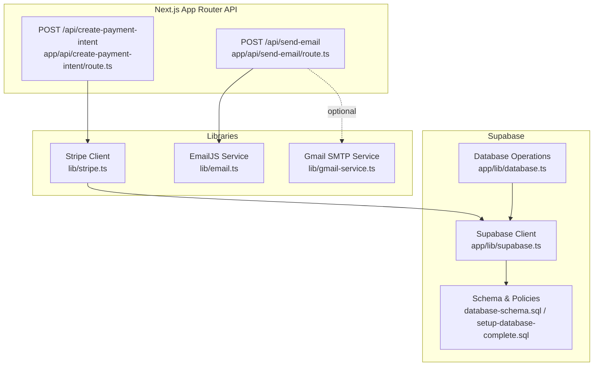
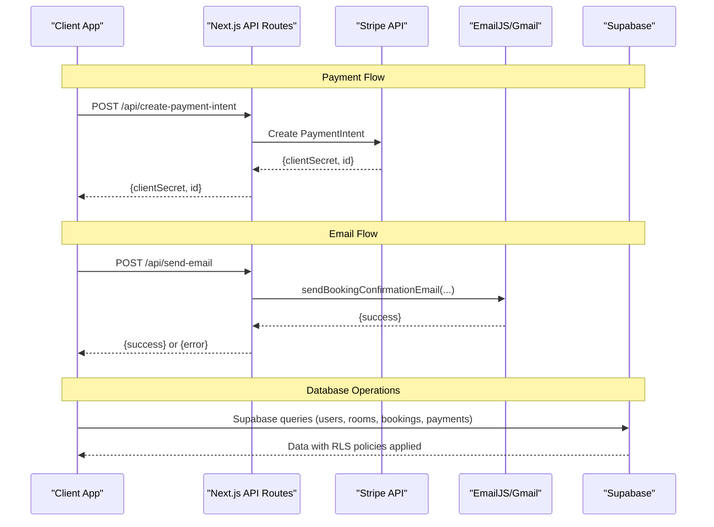
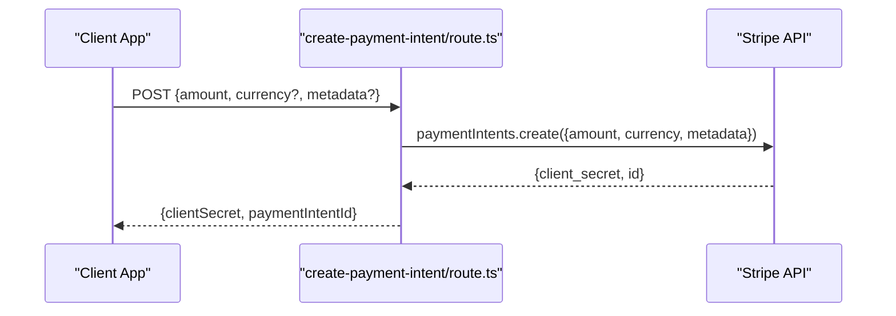
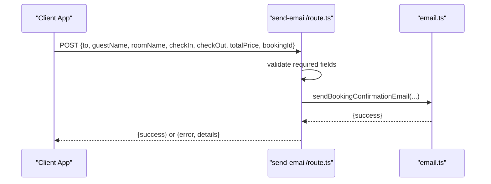
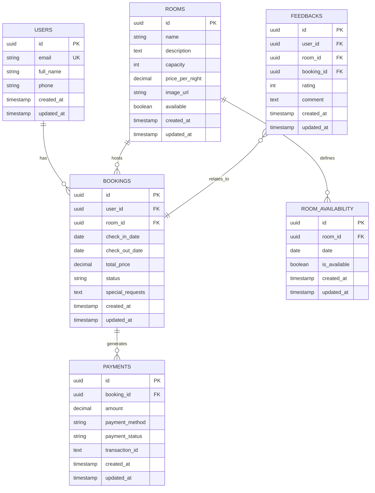
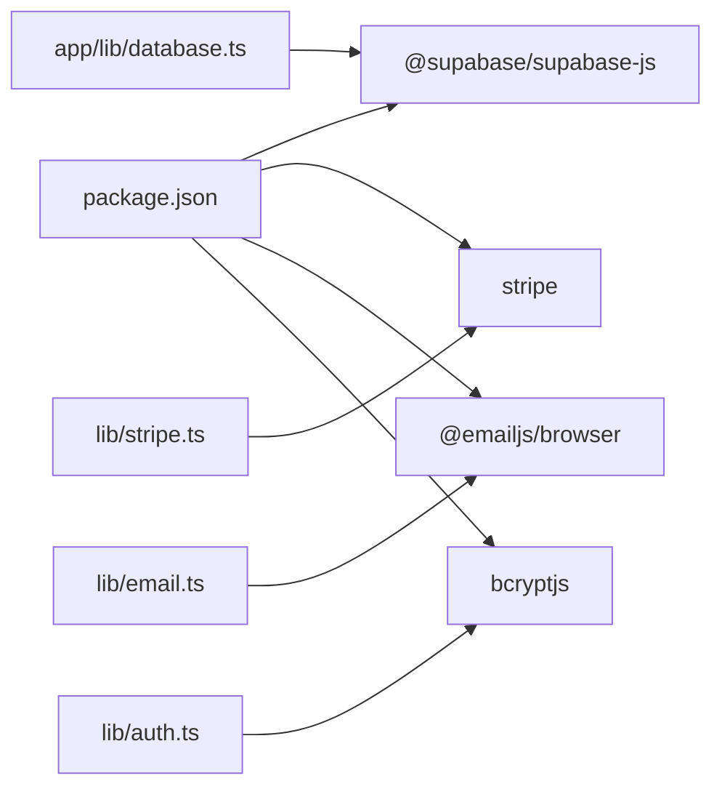

# API Reference

<cite>
**Referenced Files in This Document**
- [create-payment-intent/route.ts](file://app/api/create-payment-intent/route.ts)
- [send-email/route.ts](file://app/api/send-email/route.ts)
- [stripe.ts](file://lib/stripe.ts)
- [email.ts](file://lib/email.ts)
- [gmail-service.ts](file://lib/gmail-service.ts)
- [supabase.ts](file://app/lib/supabase.ts)
- [database.ts](file://app/lib/database.ts)
- [database.ts (schema)](file://database-schema.sql)
- [setup-database-complete.sql](file://setup-database-complete.sql)
- [auth.ts](file://lib/auth.ts)
- [package.json](file://package.json)
- [ANALYSE_PROJET_COMPLET.md](file://ANALYSE_PROJET_COMPLET.md)
</cite>

## Table of Contents
1. [Introduction](#introduction)
2. [Project Structure](#project-structure)
3. [Core Components](#core-components)
4. [Architecture Overview](#architecture-overview)
5. [Detailed Component Analysis](#detailed-component-analysis)
6. [Dependency Analysis](#dependency-analysis)
7. [Performance Considerations](#performance-considerations)
8. [Troubleshooting Guide](#troubleshooting-guide)
9. [Conclusion](#conclusion)
10. [Appendices](#appendices)

## Introduction
This document provides a comprehensive API reference for the Pythonhostel backend. It covers:
- HTTP endpoints for payment processing and email services
- Request/response schemas
- Authentication and security considerations
- Supabase integration patterns and database operations
- Practical usage examples and client implementation guidelines
- Rate limiting, error handling, and debugging techniques

## Project Structure
The backend APIs are implemented as Next.js App Router API routes under app/api. Supporting libraries handle Stripe integration, email services, and Supabase database operations.

**Diagram sources**
- [create-payment-intent/route.ts:1-33](file://app/api/create-payment-intent/route.ts#L1-L33)
- [send-email/route.ts:1-42](file://app/api/send-email/route.ts#L1-L42)
- [stripe.ts:1-112](file://lib/stripe.ts#L1-L112)
- [email.ts:1-75](file://lib/email.ts#L1-L75)
- [gmail-service.ts:1-117](file://lib/gmail-service.ts#L1-L117)
- [supabase.ts:1-6](file://app/lib/supabase.ts#L1-L6)
- [database.ts:1-433](file://app/lib/database.ts#L1-L433)
- [database.ts (schema):1-119](file://database-schema.sql#L1-L119)
- [setup-database-complete.sql:1-269](file://setup-database-complete.sql#L1-L269)

**Section sources**
- [create-payment-intent/route.ts:1-33](file://app/api/create-payment-intent/route.ts#L1-L33)
- [send-email/route.ts:1-42](file://app/api/send-email/route.ts#L1-L42)
- [stripe.ts:1-112](file://lib/stripe.ts#L1-L112)
- [email.ts:1-75](file://lib/email.ts#L1-L75)
- [gmail-service.ts:1-117](file://lib/gmail-service.ts#L1-L117)
- [supabase.ts:1-6](file://app/lib/supabase.ts#L1-L6)
- [database.ts:1-433](file://app/lib/database.ts#L1-L433)
- [database.ts (schema):1-119](file://database-schema.sql#L1-L119)
- [setup-database-complete.sql:1-269](file://setup-database-complete.sql#L1-L269)

## Core Components
- Payment Processing Endpoint
  - URL: POST /api/create-payment-intent
  - Purpose: Creates a Stripe PaymentIntent and returns clientSecret and paymentIntentId
  - Authentication: None (public endpoint)
  - Request Body: amount (integer), currency (string, default EUR), metadata (object)
  - Response: clientSecret (string), paymentIntentId (string)
  - Error Responses: 500 on internal failure

- Email Service Endpoint
  - URL: POST /api/send-email
  - Purpose: Sends a booking confirmation email using EmailJS
  - Authentication: None (public endpoint)
  - Request Body: to (string), guestName (string), roomName (string), checkIn (string), checkOut (string), totalPrice (number), bookingId (string)
  - Response: success (boolean) or error (string) with details
  - Error Responses: 400 for missing fields, 500 on internal failure

- Stripe Client Utilities
  - Client-side helpers for creating PaymentIntents, confirming payments, redirecting to Stripe Checkout, and formatting amounts
  - Uses Next.js fetch to call backend endpoints

- Email Services
  - EmailJS-based service for password reset and welcome emails
  - Gmail SMTP service for sending real emails via SMTP (simulation in frontend; backend implementation pending)

- Supabase Integration
  - Supabase client initialization
  - Database operations for users, rooms, bookings, payments, room availability, and feedbacks
  - Row Level Security (RLS) policies and utility functions

**Section sources**
- [create-payment-intent/route.ts:1-33](file://app/api/create-payment-intent/route.ts#L1-L33)
- [send-email/route.ts:1-42](file://app/api/send-email/route.ts#L1-L42)
- [stripe.ts:1-112](file://lib/stripe.ts#L1-L112)
- [email.ts:1-75](file://lib/email.ts#L1-L75)
- [gmail-service.ts:1-117](file://lib/gmail-service.ts#L1-L117)
- [supabase.ts:1-6](file://app/lib/supabase.ts#L1-L6)
- [database.ts:1-433](file://app/lib/database.ts#L1-L433)

## Architecture Overview
The system integrates Stripe for payments and EmailJS/Gmail SMTP for email delivery. Supabase serves as the backend datastore with RLS policies for row-level access control.

**Diagram sources**
- [create-payment-intent/route.ts:1-33](file://app/api/create-payment-intent/route.ts#L1-L33)
- [send-email/route.ts:1-42](file://app/api/send-email/route.ts#L1-L42)
- [stripe.ts:1-112](file://lib/stripe.ts#L1-L112)
- [email.ts:1-75](file://lib/email.ts#L1-L75)
- [gmail-service.ts:1-117](file://lib/gmail-service.ts#L1-L117)
- [supabase.ts:1-6](file://app/lib/supabase.ts#L1-L6)
- [database.ts:1-433](file://app/lib/database.ts#L1-L433)

## Detailed Component Analysis

### Payment Processing API: create-payment-intent
- Endpoint: POST /api/create-payment-intent
- Request Schema
  - amount: integer (cents)
  - currency: string (default EUR)
  - metadata: object (optional)
- Response Schema
  - clientSecret: string
  - paymentIntentId: string
- Error Handling
  - Returns 500 with error message on failure
- Stripe Integration
  - Initializes Stripe SDK with secret key
  - Creates PaymentIntent with automatic_payment_methods enabled
- Amount Validation
  - Client-side utilities convert dollars to cents and vice versa
  - Backend expects amount in smallest currency unit (cents)

**Diagram sources**
- [create-payment-intent/route.ts:1-33](file://app/api/create-payment-intent/route.ts#L1-L33)
- [stripe.ts:1-112](file://lib/stripe.ts#L1-L112)

**Section sources**
- [create-payment-intent/route.ts:1-33](file://app/api/create-payment-intent/route.ts#L1-L33)
- [stripe.ts:1-112](file://lib/stripe.ts#L1-L112)

### Email Service API: send-email
- Endpoint: POST /api/send-email
- Request Schema
  - to: string (recipient email)
  - guestName: string
  - roomName: string
  - checkIn: string (ISO date)
  - checkOut: string (ISO date)
  - totalPrice: number
  - bookingId: string
- Response Schema
  - success: boolean
  - error: string (when present)
  - message: string (when successful)
- Error Handling
  - Returns 400 if required fields are missing
  - Returns 500 with details on failure
- Template Processing
  - Uses sendBookingConfirmationEmail from email library
  - EmailJS integration configured but requires credentials
- Delivery Status Tracking
  - Returns success/failure; detailed error included on failure

**Diagram sources**
- [send-email/route.ts:1-42](file://app/api/send-email/route.ts#L1-L42)
- [email.ts:1-75](file://lib/email.ts#L1-L75)

**Section sources**
- [send-email/route.ts:1-42](file://app/api/send-email/route.ts#L1-L42)
- [email.ts:1-75](file://lib/email.ts#L1-L75)

### Supabase REST API Integration Patterns
- Supabase Client Initialization
  - Uses @supabase/supabase-js
  - Provides centralized client instance for database operations
- Database Operation Endpoints
  - Users: create, get by email
  - Rooms: list available, get by id, CRUD operations
  - Bookings: create, get user bookings, get all bookings, update status
  - Payments: create, get by booking, update status, get user payments, get all payments
  - Room Availability: create, get, update, bulk upsert, availability for dates
  - Feedbacks: create, get, update, delete, average rating
- Row Level Security (RLS)
  - Policies allow selective access based on user identity and roles
  - Admin functions and policies support administrative operations
- Utility Functions
  - check_room_availability RPC function validates availability
  - Timestamp triggers update updated_at automatically

**Diagram sources**
- [database.ts (schema):1-119](file://database-schema.sql#L1-L119)
- [setup-database-complete.sql:1-269](file://setup-database-complete.sql#L1-L269)
- [database.ts:1-433](file://app/lib/database.ts#L1-L433)

**Section sources**
- [supabase.ts:1-6](file://app/lib/supabase.ts#L1-L6)
- [database.ts:1-433](file://app/lib/database.ts#L1-L433)
- [database.ts (schema):1-119](file://database-schema.sql#L1-L119)
- [setup-database-complete.sql:1-269](file://setup-database-complete.sql#L1-L269)

### Authentication and Security Considerations
- Current State
  - LocalStorage-based authentication simulation
  - Password hashing utilities available (bcrypt)
  - No JWT/session implementation
  - CSRF protection not implemented
  - Input validation and sanitization not enforced
  - Rate limiting not implemented
- Recommended Improvements
  - Implement JWT-based authentication
  - Add input validation and sanitization
  - Configure rate limiting
  - Enforce HTTPS
  - Centralized error handling and logging

**Section sources**
- [auth.ts:1-57](file://lib/auth.ts#L1-L57)
- [ANALYSE_PROJET_COMPLET.md:10-33](file://ANALYSE_PROJET_COMPLET.md#L10-L33)

## Dependency Analysis
External dependencies relevant to APIs:
- @supabase/supabase-js: Supabase client for database operations
- stripe: Stripe SDK for payment intents
- @emailjs/browser: EmailJS client for browser-based email sending
- bcryptjs: Password hashing utilities

**Diagram sources**
- [package.json:1-33](file://package.json#L1-L33)
- [stripe.ts:1-112](file://lib/stripe.ts#L1-L112)
- [email.ts:1-75](file://lib/email.ts#L1-L75)
- [auth.ts:1-57](file://lib/auth.ts#L1-L57)
- [database.ts:1-433](file://app/lib/database.ts#L1-L433)

**Section sources**
- [package.json:1-33](file://package.json#L1-L33)
- [stripe.ts:1-112](file://lib/stripe.ts#L1-L112)
- [email.ts:1-75](file://lib/email.ts#L1-L75)
- [auth.ts:1-57](file://lib/auth.ts#L1-L57)
- [database.ts:1-433](file://app/lib/database.ts#L1-L433)

## Performance Considerations
- Database Indexes
  - Indexes on bookings (user_id, room_id, check_in_date, check_out_date)
  - Indexes on room_availability (room_id, date)
  - Indexes on rooms (available)
- Utility Functions
  - check_room_availability RPC function optimizes availability checks
- Recommendations
  - Implement caching for frequently accessed data
  - Optimize queries with appropriate indexing
  - Monitor query performance and adjust indexes as needed

[No sources needed since this section provides general guidance]

## Troubleshooting Guide
- Payment Intent Creation
  - Verify Stripe secret key configuration
  - Ensure amount is provided in smallest currency unit (cents)
  - Check for Stripe API errors and log messages
- Email Delivery
  - Confirm EmailJS credentials are configured
  - Validate recipient email format
  - Review error details returned by the API
- Database Operations
  - Check RLS policies for proper access
  - Verify foreign key constraints and data types
  - Use Supabase logs for query insights
- Authentication
  - Implement proper JWT handling
  - Add input validation and sanitization
  - Configure rate limiting to prevent abuse

**Section sources**
- [create-payment-intent/route.ts:1-33](file://app/api/create-payment-intent/route.ts#L1-L33)
- [send-email/route.ts:1-42](file://app/api/send-email/route.ts#L1-L42)
- [email.ts:1-75](file://lib/email.ts#L1-L75)
- [database.ts:1-433](file://app/lib/database.ts#L1-L433)
- [ANALYSE_PROJET_COMPLET.md:10-33](file://ANALYSE_PROJET_COMPLET.md#L10-L33)

## Conclusion
The Pythonhostel backend provides essential APIs for payment processing and email services, integrated with Supabase for data persistence. While functional, the system requires enhancements in authentication, security, and operational robustness before production deployment. The provided reference outlines current capabilities and recommended improvements.

[No sources needed since this section summarizes without analyzing specific files]

## Appendices

### API Usage Examples
- Payment Processing
  - Client creates a PaymentIntent by calling POST /api/create-payment-intent with amount and currency
  - Use clientSecret to confirm payment on the frontend
- Email Service
  - Client calls POST /api/send-email with booking details
  - Handle success or error responses accordingly

### Client Implementation Guidelines
- Use lib/stripe.ts helpers for consistent payment flows
- Implement proper error handling for network failures
- Validate inputs before sending requests
- Store and refresh tokens securely

### Integration Patterns
- Stripe
  - Use PaymentIntent creation for card payments
  - Redirect to Stripe-hosted checkout when needed
- EmailJS
  - Configure service, template, and public key
  - Handle asynchronous send operations
- Supabase
  - Apply RLS policies consistently
  - Use typed database operations for safety

[No sources needed since this section provides general guidance]