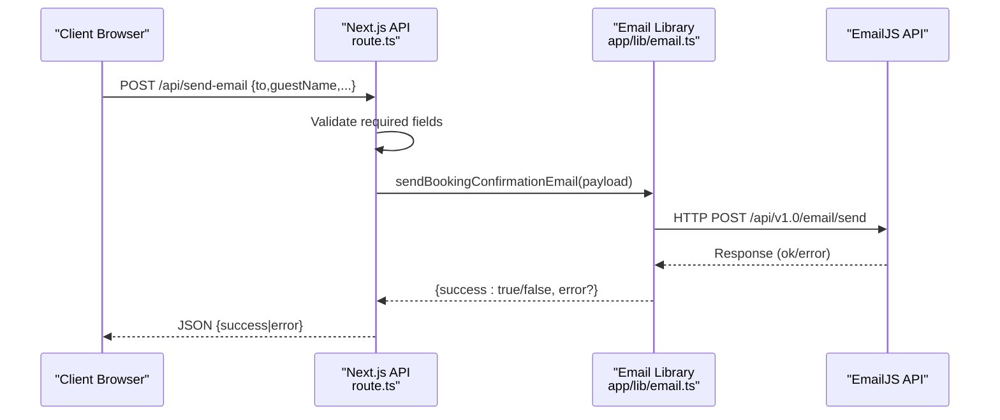
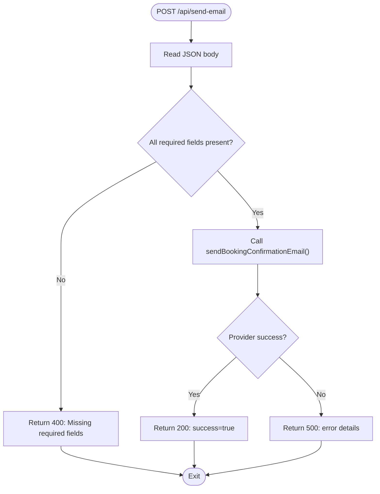
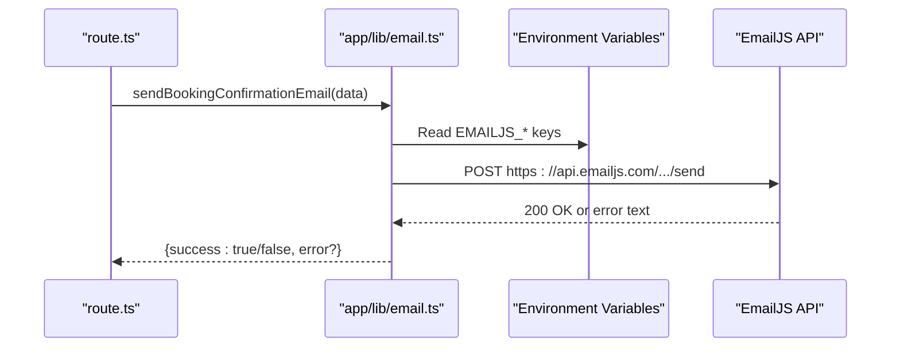
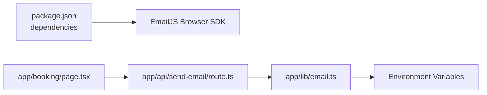

# Email API

<cite>
**Referenced Files in This Document**
- [route.ts](file://app/api/send-email/route.ts)
- [email.ts](file://app/lib/email.ts)
- [email.ts](file://lib/email.ts)
- [gmail-service.ts](file://lib/gmail-service.ts)
- [email-simple.ts](file://lib/email-simple.ts)
- [page.tsx](file://app/booking/page.tsx)
- [package.json](file://package.json)
- [notifications.py](file://notifications.py)
</cite>

## Table of Contents
1. [Introduction](#introduction)
2. [Project Structure](#project-structure)
3. [Core Components](#core-components)
4. [Architecture Overview](#architecture-overview)
5. [Detailed Component Analysis](#detailed-component-analysis)
6. [Dependency Analysis](#dependency-analysis)
7. [Performance Considerations](#performance-considerations)
8. [Troubleshooting Guide](#troubleshooting-guide)
9. [Conclusion](#conclusion)

## Introduction
This document provides comprehensive API documentation for the email notification system. It focuses on the POST /api/send-email endpoint used to send booking confirmation emails, the underlying email service integrations, and operational guidance for templates, recipients, delivery tracking, authentication, rate limiting, error handling, and security.

## Project Structure
The email system spans a Next.js API route, a reusable email library, and several email service helpers. The frontend triggers email sending during the booking flow.

```mermaid
graph TB
subgraph "Frontend"
FE["Booking Page<br/>page.tsx"]
end
subgraph "Next.js API"
API["POST /api/send-email<br/>route.ts"]
LIB["Email Library<br/>app/lib/email.ts"]
end
subgraph "Email Services"
EMAILJS["EmailJS Provider"]
GMAIL["Gmail SMTP Helper<br/>lib/gmail-service.ts"]
SIMPLE["Web API Mailto<br/>lib/email-simple.ts"]
end
FE --> |"fetch('/api/send-email')"| API
API --> |"sendBookingConfirmationEmail()"| LIB
LIB --> |"HTTP POST"| EMAILJS
GMAIL -. "alternative/local dev" .->|"mailto: opens"| FE
SIMPLE -. "alternative/local dev" .->|"mailto: opens"| FE
```

**Diagram sources**
- [route.ts:1-42](file://app/api/send-email/route.ts#L1-L42)
- [email.ts:1-49](file://app/lib/email.ts#L1-L49)
- [gmail-service.ts:1-117](file://lib/gmail-service.ts#L1-L117)
- [email-simple.ts:1-59](file://lib/email-simple.ts#L1-L59)
- [page.tsx:131-148](file://app/booking/page.tsx#L131-L148)

**Section sources**
- [route.ts:1-42](file://app/api/send-email/route.ts#L1-L42)
- [email.ts:1-49](file://app/lib/email.ts#L1-L49)
- [page.tsx:131-148](file://app/booking/page.tsx#L131-L148)

## Core Components
- POST /api/send-email
  - Purpose: Send a booking confirmation email via EmailJS.
  - Request body fields:
    - to: Recipient email address
    - guestName: Recipient name
    - roomName: Room name
    - checkIn: Check-in date
    - checkOut: Check-out date
    - totalPrice: Total booking price
    - bookingId: Unique booking identifier
  - Response:
    - On success: { success: true, message: "Email sent successfully" }
    - On failure: { error: "Failed to send email", details: "<provider error>" } with HTTP 500
  - Validation: Returns HTTP 400 if any required field is missing.

- EmailJS integration
  - Uses environment variables for EmailJS configuration and sends a templated email payload.
  - Returns a structured result indicating success or failure.

- Frontend integration
  - The booking page calls the API endpoint immediately after saving a booking, logging failures but continuing the flow.

**Section sources**
- [route.ts:4-41](file://app/api/send-email/route.ts#L4-L41)
- [email.ts:1-49](file://app/lib/email.ts#L1-L49)
- [page.tsx:131-148](file://app/booking/page.tsx#L131-L148)

## Architecture Overview
The email flow integrates the frontend, Next.js API route, and EmailJS provider. The API route validates inputs, constructs a payload, and invokes the email library which performs the HTTP request to EmailJS.



**Diagram sources**
- [route.ts:4-41](file://app/api/send-email/route.ts#L4-L41)
- [email.ts:1-49](file://app/lib/email.ts#L1-L49)

## Detailed Component Analysis

### POST /api/send-email Endpoint
- Responsibilities:
  - Parse and validate incoming JSON payload.
  - Call the email library to send a booking confirmation.
  - Return standardized success/failure responses.
- Input validation:
  - Rejects requests missing any of: to, guestName, roomName, checkIn, checkOut, totalPrice, bookingId.
- Error handling:
  - Catches runtime errors and logs them.
  - Returns HTTP 400 for validation failures and HTTP 500 for provider errors.



**Diagram sources**
- [route.ts:4-41](file://app/api/send-email/route.ts#L4-L41)

**Section sources**
- [route.ts:4-41](file://app/api/send-email/route.ts#L4-L41)

### EmailJS Integration (app/lib/email.ts)
- Functionality:
  - Sends a booking confirmation email using EmailJS.
  - Reads configuration from environment variables.
  - Constructs a template payload with recipient, guest, room, dates, price, and booking ID.
- Authentication:
  - Uses Authorization header with a private key.
  - Requires service_id, template_id, user_id, and accessToken.
- Delivery status:
  - Treats non-OK HTTP responses as errors and surfaces provider messages.



**Diagram sources**
- [email.ts:1-49](file://app/lib/email.ts#L1-L49)

**Section sources**
- [email.ts:1-49](file://app/lib/email.ts#L1-L49)

### Frontend Integration (app/booking/page.tsx)
- Behavior:
  - After collecting booking details, saves locally and attempts to send a confirmation email.
  - Calls the API endpoint with the required payload.
  - Logs email errors but proceeds to payment redirection.

**Section sources**
- [page.tsx:131-148](file://app/booking/page.tsx#L131-L148)

### Alternative Email Providers and Helpers
- Gmail SMTP helper (lib/gmail-service.ts):
  - Provides functions to construct email content and open a mailto link for Gmail.
  - Useful for local development or manual dispatch scenarios.
- Ultra-simple mailto helper (lib/email-simple.ts):
  - Opens the default mail client with a prepared reset email.
- EmailJS helper (lib/email.ts):
  - Legacy-style EmailJS helper with commented-out integration code and console simulations.

Note: These helpers are not invoked by the current API route but represent available integration patterns.

**Section sources**
- [gmail-service.ts:1-117](file://lib/gmail-service.ts#L1-L117)
- [email-simple.ts:1-59](file://lib/email-simple.ts#L1-L59)
- [email.ts:1-75](file://lib/email.ts#L1-L75)

### Python-based Notification (notifications.py)
- A separate Python script demonstrates sending HTML booking confirmations via a transactional email API.
- Not integrated with the Next.js frontend but illustrates an alternative provider approach.

**Section sources**
- [notifications.py:1-53](file://notifications.py#L1-L53)

## Dependency Analysis
- Runtime dependencies:
  - @emailjs/browser is included in the project dependencies.
- API route depends on:
  - The email library for provider communication.
  - Environment variables for EmailJS configuration.
- Frontend depends on:
  - The API route for email dispatch.



**Diagram sources**
- [package.json:11-21](file://package.json#L11-L21)
- [route.ts:1-42](file://app/api/send-email/route.ts#L1-L42)
- [email.ts:1-49](file://app/lib/email.ts#L1-L49)
- [page.tsx:131-148](file://app/booking/page.tsx#L131-L148)

**Section sources**
- [package.json:11-21](file://package.json#L11-L21)
- [route.ts:1-42](file://app/api/send-email/route.ts#L1-L42)
- [email.ts:1-49](file://app/lib/email.ts#L1-L49)
- [page.tsx:131-148](file://app/booking/page.tsx#L131-L148)

## Performance Considerations
- Asynchronous processing: Email sending occurs outside the critical path; the frontend continues even if email fails.
- Network latency: EmailJS HTTP calls add external latency; consider timeouts and retries at the provider level.
- Payload size: Keep template parameters minimal to reduce request sizes.
- Rate limiting: Apply client-side throttling if multiple emails are triggered rapidly.

## Troubleshooting Guide
- Missing required fields:
  - Symptom: HTTP 400 response.
  - Action: Ensure to, guestName, roomName, checkIn, checkOut, totalPrice, bookingId are provided.
- EmailJS provider errors:
  - Symptom: HTTP 500 with error details.
  - Action: Check environment variable configuration and provider quota/status.
- Frontend email failures:
  - Symptom: Console logs indicate email sending failed, but booking continues.
  - Action: Inspect network tab for API errors and verify EmailJS configuration.

**Section sources**
- [route.ts:9-14](file://app/api/send-email/route.ts#L9-L14)
- [email.ts:37-41](file://app/lib/email.ts#L37-L41)
- [page.tsx:146-148](file://app/booking/page.tsx#L146-L148)

## Security Considerations
- Credentials:
  - Store EmailJS keys in environment variables; never expose private keys in client-side code.
- Headers:
  - The current implementation sets Authorization via a bearer token; ensure tokens are rotated and scoped appropriately.
- Content:
  - Sanitize dynamic template parameters to prevent injection.
- Transport:
  - Prefer server-side transport for production to avoid exposing credentials in the browser.

**Section sources**
- [email.ts:14-16](file://app/lib/email.ts#L14-L16)
- [email.ts:18-34](file://app/lib/email.ts#L18-L34)

## API Definition

### Endpoint
- Method: POST
- Path: /api/send-email
- Content-Type: application/json

### Request Body
- to: string (required)
- guestName: string (required)
- roomName: string (required)
- checkIn: string (ISO date) (required)
- checkOut: string (ISO date) (required)
- totalPrice: number (required)
- bookingId: string (required)

### Responses
- 200 OK
  - Body: { success: true, message: "Email sent successfully" }
- 400 Bad Request
  - Body: { error: "Missing required fields" }
- 500 Internal Server Error
  - Body: { error: "Failed to send email", details: "<provider error>" }

### Example Usage
- Frontend example path: [Booking page email call:133-144](file://app/booking/page.tsx#L133-L144)

**Section sources**
- [route.ts:4-41](file://app/api/send-email/route.ts#L4-L41)
- [page.tsx:133-144](file://app/booking/page.tsx#L133-L144)

## Template Processing and Delivery Tracking
- Templates:
  - EmailJS uses a predefined template configured via environment variables.
  - Dynamic parameters are passed under template_params.
- Delivery tracking:
  - The current implementation returns a generic success/failure result.
  - To track delivery status, integrate provider webhooks or use a dedicated email delivery platform with event callbacks.

**Section sources**
- [email.ts:18-34](file://app/lib/email.ts#L18-L34)

## Bulk Email Sending
- Current implementation:
  - Designed for single booking confirmation emails triggered by the frontend.
- Recommendations:
  - For bulk sending, implement a batch endpoint that iterates recipients and calls the email library with appropriate delays to respect provider limits.

## Integration with Booking Confirmation Workflows
- The booking page triggers email sending immediately after saving a booking, ensuring guests receive confirmation promptly while maintaining a smooth user experience.

**Section sources**
- [page.tsx:131-148](file://app/booking/page.tsx#L131-L148)

## Conclusion
The email notification system centers around a straightforward API endpoint that sends booking confirmation emails via EmailJS. The design separates concerns between the frontend, API route, and email library, enabling extensibility for additional providers and improved delivery tracking. For production, secure credential handling, robust error handling, and provider-specific rate-limiting strategies should be prioritized.