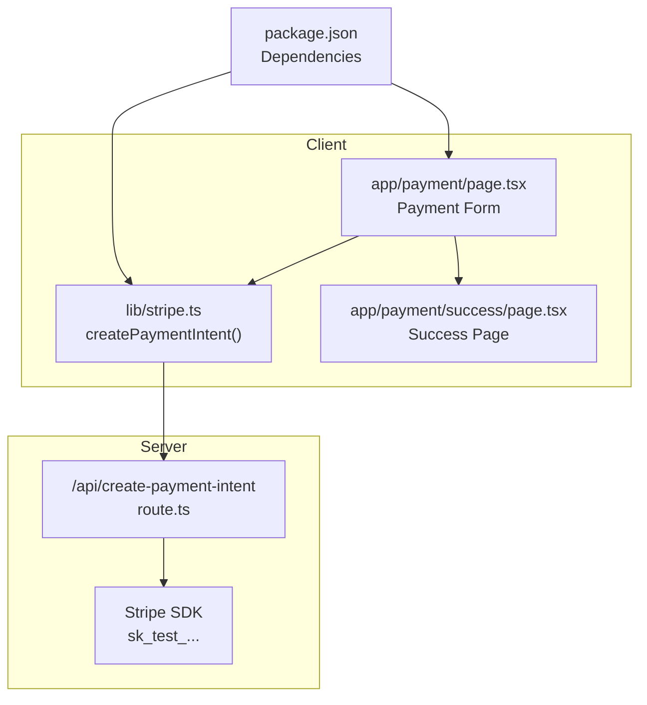
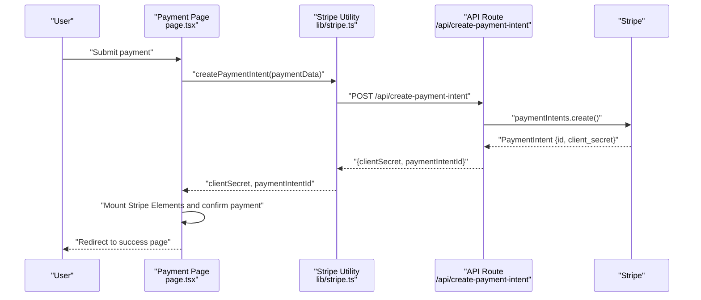
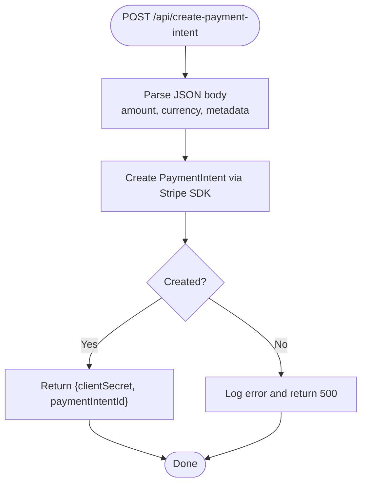
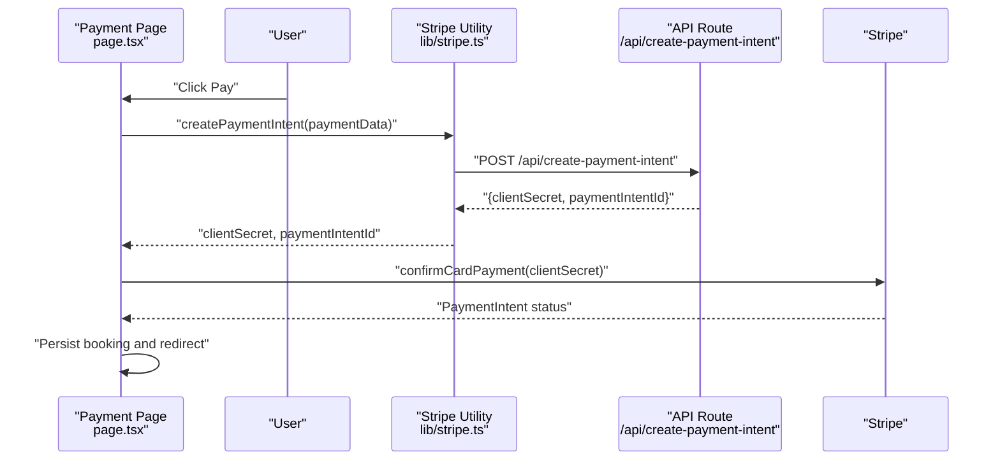
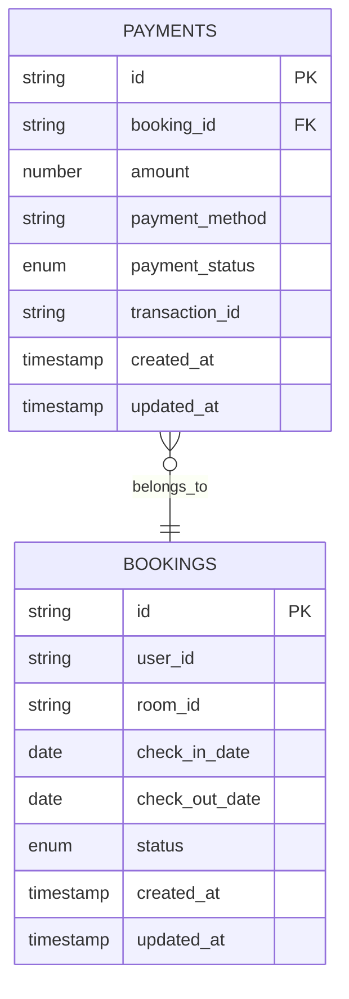
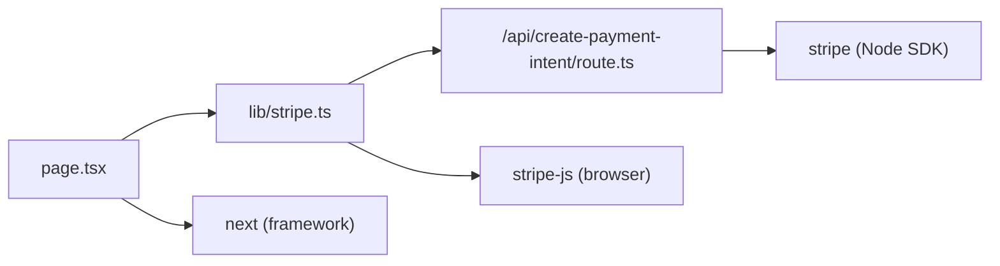

# Payment API

<cite>
**Referenced Files in This Document**
- [route.ts](file://app/api/create-payment-intent/route.ts)
- [stripe.ts](file://lib/stripe.ts)
- [page.tsx](file://app/payment/page.tsx)
- [success/page.tsx](file://app/payment/success/page.tsx)
- [package.json](file://package.json)
- [database.ts](file://app/lib/database.ts)
- [database.ts (types)](file://app/types/database.ts)
- [admin-payments/page.tsx](file://app/admin/payments/page.tsx)
</cite>

## Table of Contents
1. [Introduction](#introduction)
2. [Project Structure](#project-structure)
3. [Core Components](#core-components)
4. [Architecture Overview](#architecture-overview)
5. [Detailed Component Analysis](#detailed-component-analysis)
6. [Dependency Analysis](#dependency-analysis)
7. [Performance Considerations](#performance-considerations)
8. [Troubleshooting Guide](#troubleshooting-guide)
9. [Conclusion](#conclusion)

## Introduction
This document provides comprehensive API documentation for the payment processing endpoints, focusing on the POST /api/create-payment-intent endpoint. It explains the request payload structure, response schema, Stripe SDK integration, payment intent creation workflow, automatic payment methods configuration, error handling patterns, validation requirements, and security considerations. Practical examples demonstrate client-side integration with Stripe.js, payment confirmation handling, and webhook processing. The guide also covers common payment scenarios, amount formatting, currency support, and debugging techniques for payment failures.

## Project Structure
The payment system spans three primary areas:
- Serverless API route for payment intent creation
- Client-side utility library for Stripe integration
- Frontend pages for payment processing and success confirmation

**Diagram sources**
- [route.ts:1-33](file://app/api/create-payment-intent/route.ts#L1-L33)
- [stripe.ts:1-112](file://lib/stripe.ts#L1-L112)
- [page.tsx:1-352](file://app/payment/page.tsx#L1-L352)
- [success/page.tsx:1-74](file://app/payment/success/page.tsx#L1-L74)
- [package.json:1-33](file://package.json#L1-L33)

**Section sources**
- [route.ts:1-33](file://app/api/create-payment-intent/route.ts#L1-L33)
- [stripe.ts:1-112](file://lib/stripe.ts#L1-L112)
- [page.tsx:1-352](file://app/payment/page.tsx#L1-L352)
- [success/page.tsx:1-74](file://app/payment/success/page.tsx#L1-L74)
- [package.json:1-33](file://package.json#L1-L33)

## Core Components
- POST /api/create-payment-intent
  - Purpose: Creates a Stripe PaymentIntent and returns clientSecret and paymentIntentId
  - Request payload: amount, currency, metadata
  - Response schema: clientSecret, paymentIntentId
  - Stripe SDK integration: Uses Stripe Node SDK to create PaymentIntent with automatic_payment_methods enabled
  - Error handling: Returns structured error on failure

- Client-side Stripe integration
  - Utility functions: createPaymentIntent(), confirmPayment(), redirectToCheckout(), createCheckoutSession(), amount formatters
  - Frontend page: Handles payment form, mounts Stripe Elements, confirms payment, and redirects to success page

- Database integration
  - Payment persistence: createPayment(), updatePaymentStatus(), getPaymentsByBookingId(), getUserPayments(), getAllPayments()
  - Payment types: Payment, CreatePaymentData

**Section sources**
- [route.ts:7-32](file://app/api/create-payment-intent/route.ts#L7-L32)
- [stripe.ts:17-37](file://lib/stripe.ts#L17-L37)
- [page.tsx:34-176](file://app/payment/page.tsx#L34-L176)
- [database.ts:214-247](file://app/lib/database.ts#L214-L247)
- [database.ts (types):46-96](file://app/types/database.ts#L46-L96)

## Architecture Overview
The payment flow consists of:
- Client initiates payment via frontend
- Client requests a PaymentIntent from the serverless route
- Server creates PaymentIntent via Stripe SDK and returns clientSecret and paymentIntentId
- Client confirms payment using Stripe.js and displays success page

**Diagram sources**
- [page.tsx:34-176](file://app/payment/page.tsx#L34-L176)
- [stripe.ts:17-37](file://lib/stripe.ts#L17-L37)
- [route.ts:7-32](file://app/api/create-payment-intent/route.ts#L7-L32)

## Detailed Component Analysis

### POST /api/create-payment-intent Endpoint
- Purpose: Create a Stripe PaymentIntent with automatic payment methods enabled
- Request payload
  - amount: integer representing value in cents
  - currency: string (defaults to eur if omitted)
  - metadata: object (optional)
- Response schema
  - clientSecret: string (Stripe client secret)
  - paymentIntentId: string (Stripe PaymentIntent identifier)
- Stripe SDK integration
  - Initializes Stripe with secret key
  - Creates PaymentIntent with automatic_payment_methods.enabled = true
- Error handling
  - Catches exceptions and returns structured error with 500 status

**Diagram sources**
- [route.ts:7-32](file://app/api/create-payment-intent/route.ts#L7-L32)

**Section sources**
- [route.ts:7-32](file://app/api/create-payment-intent/route.ts#L7-L32)

### Client-Side Integration with Stripe.js
- Utility functions
  - createPaymentIntent(): Calls backend API and returns clientSecret and paymentIntentId
  - confirmPayment(): Confirms payment using paymentIntentId
  - redirectToCheckout(): Redirects to Stripe Checkout using sessionId
  - createCheckoutSession(): Creates a Stripe Checkout session
  - formatAmountForStripe(): Converts dollars to cents
  - formatAmountFromStripe(): Converts cents to dollars
- Frontend payment page
  - Builds paymentData with amount in cents, currency, and metadata
  - Loads Stripe.js and mounts card Element
  - Confirms payment with clientSecret and handles success/failure
  - Persists booking data locally upon success

**Diagram sources**
- [page.tsx:34-176](file://app/payment/page.tsx#L34-L176)
- [stripe.ts:17-37](file://lib/stripe.ts#L17-L37)
- [route.ts:7-32](file://app/api/create-payment-intent/route.ts#L7-L32)

**Section sources**
- [stripe.ts:17-37](file://lib/stripe.ts#L17-L37)
- [page.tsx:34-176](file://app/payment/page.tsx#L34-L176)

### Database Integration for Payments
- Payment persistence
  - createPayment(): Inserts payment record linked to booking
  - updatePaymentStatus(): Updates payment status (pending/completed/failed)
  - getPaymentsByBookingId(): Retrieves payments for a booking
  - getUserPayments(): Retrieves payments for a user
  - getAllPayments(): Retrieves all payments
- Payment types
  - Payment: id, booking_id, amount, payment_method, payment_status, transaction_id, created_at, updated_at
  - CreatePaymentData: booking_id, amount, payment_method, payment_status, transaction_id

**Diagram sources**
- [database.ts (types):46-96](file://app/types/database.ts#L46-L96)
- [database.ts:214-247](file://app/lib/database.ts#L214-L247)

**Section sources**
- [database.ts:214-247](file://app/lib/database.ts#L214-L247)
- [database.ts (types):46-96](file://app/types/database.ts#L46-L96)

### Admin Payments Management
- Admin page displays payments with filtering and status updates
- Mock data and localStorage-backed bookings are combined for demonstration
- Supports status transitions: pending → completed/failed, failed → pending

**Section sources**
- [admin-payments/page.tsx:50-287](file://app/admin/payments/page.tsx#L50-L287)

## Dependency Analysis
- Runtime dependencies
  - @stripe/stripe-js: Client-side Stripe SDK
  - stripe: Server-side Stripe SDK
  - next: Web framework hosting the API route
- Internal dependencies
  - Frontend page depends on Stripe utility functions
  - Stripe utility functions depend on the API route
  - Backend route depends on Stripe SDK

**Diagram sources**
- [page.tsx:1-352](file://app/payment/page.tsx#L1-L352)
- [stripe.ts:1-112](file://lib/stripe.ts#L1-L112)
- [route.ts:1-33](file://app/api/create-payment-intent/route.ts#L1-L33)
- [package.json:11-21](file://package.json#L11-L21)

**Section sources**
- [package.json:11-21](file://package.json#L11-L21)
- [page.tsx:1-352](file://app/payment/page.tsx#L1-L352)
- [stripe.ts:1-112](file://lib/stripe.ts#L1-L112)
- [route.ts:1-33](file://app/api/create-payment-intent/route.ts#L1-L33)

## Performance Considerations
- Amount formatting: Convert dollars to cents before sending to Stripe to avoid precision errors
- Currency defaults: Set explicit currency to prevent ambiguity
- Automatic payment methods: Enabling automatic_payment_methods reduces friction and improves conversion
- Error logging: Centralized error handling ensures consistent diagnostics
- Client caching: Reuse PaymentIntent where appropriate to minimize API calls

## Troubleshooting Guide
- Common errors and resolutions
  - Missing amount or invalid amount: Ensure amount is a positive integer in cents
  - Unsupported currency: Verify currency code is supported by Stripe
  - Metadata validation: Ensure metadata keys match expected schema
  - Network failures: Implement retry logic and user-friendly error messages
  - Stripe SDK initialization: Confirm secret/public keys are configured correctly
- Debugging techniques
  - Inspect clientSecret and paymentIntentId in browser console
  - Log Stripe error codes and messages
  - Verify webhook endpoints are reachable and secure
  - Test with Stripe test cards and amounts
- Security considerations
  - Never expose secret keys on the client
  - Sanitize and validate all inputs
  - Use HTTPS and secure cookies
  - Implement rate limiting and fraud detection

## Conclusion
The payment system integrates a serverless API route with Stripe SDK for PaymentIntent creation, a client-side utility library for Stripe.js integration, and frontend pages for payment processing and success confirmation. The design emphasizes automatic payment methods, robust error handling, and clear separation of concerns. By following the documented patterns and troubleshooting techniques, developers can implement reliable payment flows with Stripe while maintaining security and performance.