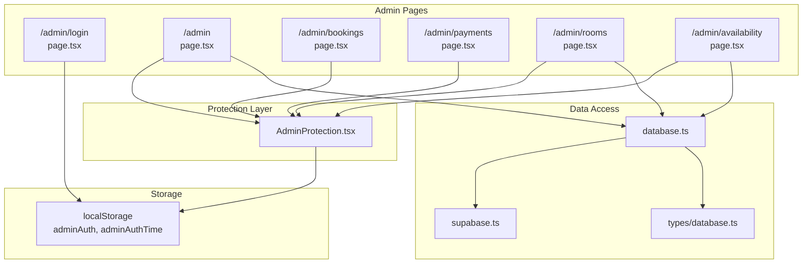
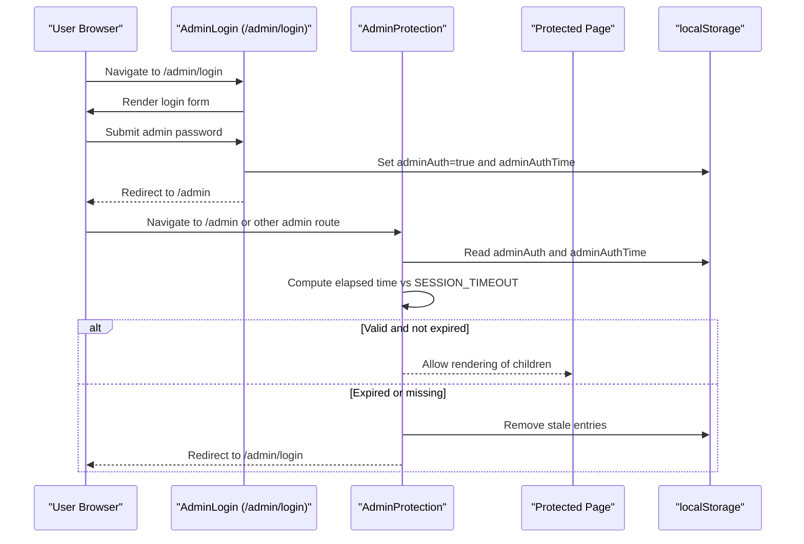
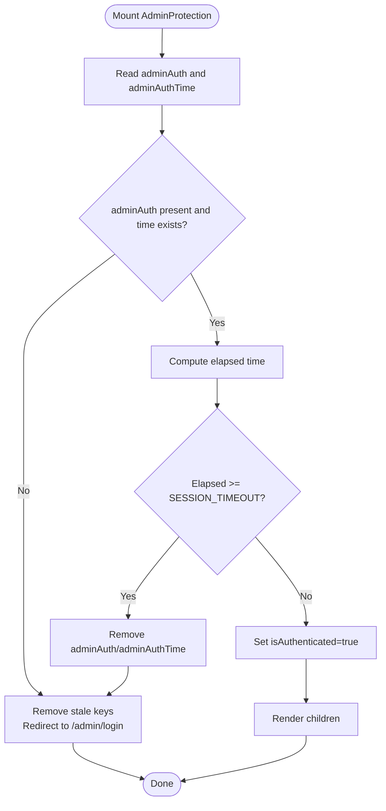
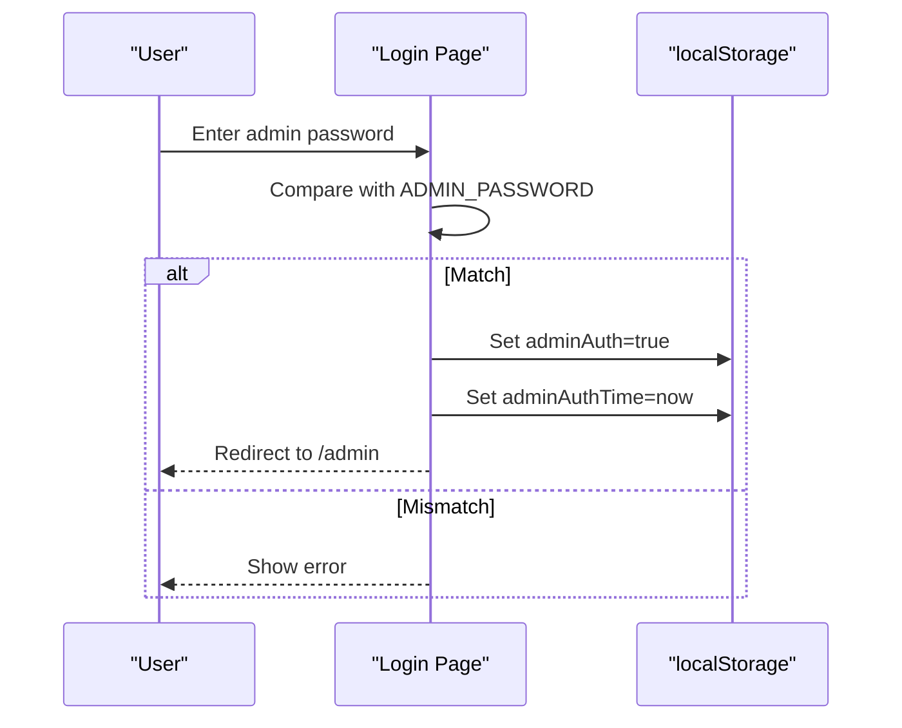
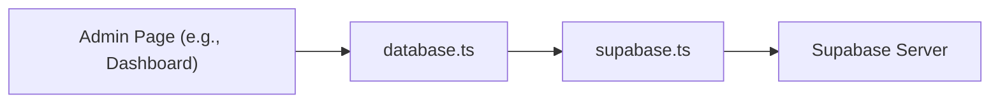
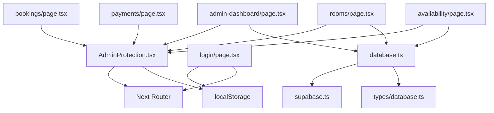

# Admin Authentication and Protection

<cite>
**Referenced Files in This Document**
- [AdminProtection.tsx](file://app/admin/components/AdminProtection.tsx)
- [login/page.tsx](file://app/admin/login/page.tsx)
- [admin-dashboard/page.tsx](file://app/admin/dashboard/page.tsx)
- [bookings/page.tsx](file://app/admin/bookings/page.tsx)
- [payments/page.tsx](file://app/admin/payments/page.tsx)
- [rooms/page.tsx](file://app/admin/rooms/page.tsx)
- [availability/page.tsx](file://app/admin/availability/page.tsx)
- [database.ts](file://app/lib/database.ts)
- [supabase.ts](file://app/lib/supabase.ts)
- [types/database.ts](file://app/types/database.ts)
- [auth.ts](file://lib/auth.ts)
</cite>

## Table of Contents
1. [Introduction](#introduction)
2. [Project Structure](#project-structure)
3. [Core Components](#core-components)
4. [Architecture Overview](#architecture-overview)
5. [Detailed Component Analysis](#detailed-component-analysis)
6. [Dependency Analysis](#dependency-analysis)
7. [Performance Considerations](#performance-considerations)
8. [Troubleshooting Guide](#troubleshooting-guide)
9. [Conclusion](#conclusion)

## Introduction
This document explains the admin authentication and protection system implemented in the Next.js application. It covers the AdminProtection component, the admin login workflow, session management, and how protected routes are enforced. It also documents the current authentication model (client-side localStorage-based), outlines security considerations, and provides guidance for extending the system with stronger authentication and role-based access control.

## Project Structure
The admin system is organized under the app/admin directory with dedicated pages for dashboard, bookings, payments, rooms, and availability. A shared AdminProtection component wraps admin pages to enforce access control. The login page handles admin credential validation and establishes a client-side session using localStorage. Database interactions are handled via Supabase client functions.

**Diagram sources**
- [AdminProtection.tsx:1-68](file://app/admin/components/AdminProtection.tsx#L1-L68)
- [login/page.tsx:1-98](file://app/admin/login/page.tsx#L1-L98)
- [admin-dashboard/page.tsx:1-205](file://app/admin/dashboard/page.tsx#L1-L205)
- [bookings/page.tsx:1-459](file://app/admin/bookings/page.tsx#L1-L459)
- [payments/page.tsx:1-288](file://app/admin/payments/page.tsx#L1-L288)
- [rooms/page.tsx:1-280](file://app/admin/rooms/page.tsx#L1-L280)
- [availability/page.tsx:1-281](file://app/admin/availability/page.tsx#L1-L281)
- [database.ts:1-433](file://app/lib/database.ts#L1-L433)
- [supabase.ts:1-6](file://app/lib/supabase.ts#L1-L6)
- [types/database.ts:1-146](file://app/types/database.ts#L1-L146)

**Section sources**
- [AdminProtection.tsx:1-68](file://app/admin/components/AdminProtection.tsx#L1-L68)
- [login/page.tsx:1-98](file://app/admin/login/page.tsx#L1-L98)
- [admin-dashboard/page.tsx:1-205](file://app/admin/dashboard/page.tsx#L1-L205)
- [bookings/page.tsx:1-459](file://app/admin/bookings/page.tsx#L1-L459)
- [payments/page.tsx:1-288](file://app/admin/payments/page.tsx#L1-L288)
- [rooms/page.tsx:1-280](file://app/admin/rooms/page.tsx#L1-L280)
- [availability/page.tsx:1-281](file://app/admin/availability/page.tsx#L1-L281)
- [database.ts:1-433](file://app/lib/database.ts#L1-L433)
- [supabase.ts:1-6](file://app/lib/supabase.ts#L1-L6)
- [types/database.ts:1-146](file://app/types/database.ts#L1-L146)

## Core Components
- AdminProtection: A client-side route guard that checks for a valid admin session in localStorage and enforces a short session timeout. It redirects unauthenticated users to the login page and clears expired sessions.
- Admin Login Page: Validates the admin password against a hardcoded constant and writes session markers to localStorage upon successful authentication.
- Protected Admin Pages: Dashboard, Bookings, Payments, Rooms, and Availability pages wrap their content with AdminProtection to ensure access control.

Key behaviors:
- Session markers: adminAuth (boolean) and adminAuthTime (timestamp) in localStorage.
- Session timeout: 10 seconds; on expiry, localStorage entries are removed and the user is redirected to /admin/login.
- Redirects: Unauthorized access or session expiry triggers navigation to the login page.

**Section sources**
- [AdminProtection.tsx:9-68](file://app/admin/components/AdminProtection.tsx#L9-L68)
- [login/page.tsx:5-37](file://app/admin/login/page.tsx#L5-L37)

## Architecture Overview
The admin authentication flow is client-side and uses localStorage for session persistence. The AdminProtection component performs runtime checks, while the login page sets session markers. Protected pages rely on AdminProtection to render content only when a valid session exists.

**Diagram sources**
- [AdminProtection.tsx:17-49](file://app/admin/components/AdminProtection.tsx#L17-L49)
- [login/page.tsx:15-37](file://app/admin/login/page.tsx#L15-L37)

**Section sources**
- [AdminProtection.tsx:14-49](file://app/admin/components/AdminProtection.tsx#L14-L49)
- [login/page.tsx:15-37](file://app/admin/login/page.tsx#L15-L37)

## Detailed Component Analysis

### AdminProtection Component
Purpose:
- Guard admin routes by checking localStorage for a valid admin session.
- Enforce a strict session timeout (10 seconds).
- Redirect to the login page if authentication is invalid or expired.

Implementation highlights:
- Uses useEffect to run the check on mount.
- Reads adminAuth and adminAuthTime from localStorage.
- Calculates elapsed time and compares against SESSION_TIMEOUT.
- Clears localStorage on expiration and navigates to /admin/login.
- Renders children only when authenticated.

**Diagram sources**
- [AdminProtection.tsx:17-49](file://app/admin/components/AdminProtection.tsx#L17-L49)

**Section sources**
- [AdminProtection.tsx:9-68](file://app/admin/components/AdminProtection.tsx#L9-L68)

### Admin Login Workflow
Behavior:
- Accepts admin password input.
- Compares against a hardcoded constant.
- On success, stores adminAuth=true and adminAuthTime in localStorage.
- Redirects to the admin dashboard.

Security note:
- The password is currently hardcoded in the client. This is suitable for development/demo but requires server-side authentication for production.

**Diagram sources**
- [login/page.tsx:15-37](file://app/admin/login/page.tsx#L15-L37)

**Section sources**
- [login/page.tsx:5-37](file://app/admin/login/page.tsx#L5-L37)

### Protected Admin Pages
All admin pages (dashboard, bookings, payments, rooms, availability) wrap their content with AdminProtection. This ensures that:
- Users must be authenticated.
- Sessions are validated with the 10-second timeout.
- Unauthorized access is prevented.

Examples of protected pages:
- Admin Dashboard: Wraps main content with AdminProtection.
- Bookings: Wraps the bookings table and controls with AdminProtection.
- Payments: Wraps the payments table and summary with AdminProtection.
- Rooms: Wraps the rooms grid and form with AdminProtection.
- Availability: Wraps the availability controls with AdminProtection.

**Section sources**
- [admin-dashboard/page.tsx:51-178](file://app/admin/dashboard/page.tsx#L51-L178)
- [bookings/page.tsx:275-456](file://app/admin/bookings/page.tsx#L275-L456)
- [payments/page.tsx:118-285](file://app/admin/payments/page.tsx#L118-L285)
- [rooms/page.tsx:103-277](file://app/admin/rooms/page.tsx#L103-L277)
- [availability/page.tsx:134-278](file://app/admin/availability/page.tsx#L134-L278)

### Database Access and Supabase Integration
Protected pages often fetch data from the backend via Supabase. The database module encapsulates CRUD operations and RPC calls for rooms, bookings, payments, and availability.

Key points:
- Supabase client is initialized with a public URL and key.
- Functions expose typed operations for rooms, bookings, payments, and availability.
- Dashboard statistics are computed client-side using returned data.

**Diagram sources**
- [database.ts:1-433](file://app/lib/database.ts#L1-L433)
- [supabase.ts:1-6](file://app/lib/supabase.ts#L1-L6)

**Section sources**
- [database.ts:1-433](file://app/lib/database.ts#L1-L433)
- [supabase.ts:1-6](file://app/lib/supabase.ts#L1-L6)
- [types/database.ts:1-146](file://app/types/database.ts#L1-L146)

### Security Utilities (lib/auth.ts)
The lib/auth.ts module provides utilities for password hashing, verification, token generation/verification, email/password validation, and input sanitization. These utilities are designed for robust server-side authentication and can be integrated into a production admin system.

Highlights:
- Password hashing and verification using bcrypt.
- JWT-like token generation and verification with expiration.
- Email and password format validation.
- Basic input sanitization.

Note: The current admin login does not use these utilities; they are intended for server-side authentication flows.

**Section sources**
- [auth.ts:1-57](file://lib/auth.ts#L1-L57)

## Dependency Analysis
- AdminProtection depends on:
  - Next.js router for navigation.
  - localStorage for session state.
- Admin Login depends on:
  - Hardcoded admin password constant.
  - Next.js router for redirection.
- Protected pages depend on:
  - AdminProtection for access control.
  - database.ts for data operations.
  - supabase.ts for backend connectivity.
- database.ts depends on:
  - supabase.ts for client initialization.
  - types/database.ts for type safety.

**Diagram sources**
- [AdminProtection.tsx:1-68](file://app/admin/components/AdminProtection.tsx#L1-L68)
- [login/page.tsx:1-98](file://app/admin/login/page.tsx#L1-L98)
- [admin-dashboard/page.tsx:1-205](file://app/admin/dashboard/page.tsx#L1-L205)
- [bookings/page.tsx:1-459](file://app/admin/bookings/page.tsx#L1-L459)
- [payments/page.tsx:1-288](file://app/admin/payments/page.tsx#L1-L288)
- [rooms/page.tsx:1-280](file://app/admin/rooms/page.tsx#L1-L280)
- [availability/page.tsx:1-281](file://app/admin/availability/page.tsx#L1-L281)
- [database.ts:1-433](file://app/lib/database.ts#L1-L433)
- [supabase.ts:1-6](file://app/lib/supabase.ts#L1-L6)
- [types/database.ts:1-146](file://app/types/database.ts#L1-L146)

**Section sources**
- [AdminProtection.tsx:1-68](file://app/admin/components/AdminProtection.tsx#L1-L68)
- [login/page.tsx:1-98](file://app/admin/login/page.tsx#L1-L98)
- [database.ts:1-433](file://app/lib/database.ts#L1-L433)
- [supabase.ts:1-6](file://app/lib/supabase.ts#L1-L6)
- [types/database.ts:1-146](file://app/types/database.ts#L1-L146)

## Performance Considerations
- Client-side session checks are lightweight and occur on route transitions.
- AdminProtection runs a single localStorage read and a timestamp comparison; negligible overhead.
- Protected pages may perform network requests to Supabase; ensure efficient queries and caching where appropriate.
- Consider debouncing or lazy-loading heavy data operations on admin pages to improve responsiveness.

## Troubleshooting Guide
Common issues and resolutions:
- Stuck on redirect loop:
  - Cause: adminAuth present but expired.
  - Resolution: Clear localStorage keys (adminAuth, adminAuthTime) and retry login.
- Incorrect password errors:
  - Cause: Password mismatch.
  - Resolution: Verify the entered password matches the hardcoded constant.
- Unexpected logout after short time:
  - Cause: SESSION_TIMEOUT is very short (10 seconds).
  - Resolution: Adjust SESSION_TIMEOUT in AdminProtection if needed (not recommended for production).
- Protected page not rendering:
  - Cause: Missing or expired session markers.
  - Resolution: Log in again to establish a new session.

Operational steps:
- Clear browser localStorage keys: adminAuth and adminAuthTime.
- Reopen the admin login page and log in again.
- Verify that the dashboard renders after login.

**Section sources**
- [AdminProtection.tsx:14-49](file://app/admin/components/AdminProtection.tsx#L14-L49)
- [login/page.tsx:15-37](file://app/admin/login/page.tsx#L15-L37)

## Conclusion
The admin authentication and protection system uses a straightforward client-side approach with AdminProtection and localStorage-based sessions. While functional for development and demonstration, production systems should adopt server-side authentication, secure credential storage, and stronger session management. The provided architecture supports easy migration to server-backed authentication and can be extended with role-based access control and JWT-based tokens.