# Administrative Dashboard

<cite>
**Referenced Files in This Document**
- [app/admin/page.tsx](file://app/admin/page.tsx)
- [app/admin/components/AdminProtection.tsx](file://app/admin/components/AdminProtection.tsx)
- [app/admin/login/page.tsx](file://app/admin/login/page.tsx)
- [app/admin/dashboard/page.tsx](file://app/admin/dashboard/page.tsx)
- [app/admin/dashboard/real-bookings.tsx](file://app/admin/dashboard/real-bookings.tsx)
- [app/admin/dashboard/real-data.tsx](file://app/admin/dashboard/real-data.tsx)
- [app/admin/bookings/page.tsx](file://app/admin/bookings/page.tsx)
- [app/admin/rooms/page.tsx](file://app/admin/rooms/page.tsx)
- [app/admin/availability/page.tsx](file://app/admin/availability/page.tsx)
- [app/admin/payments/page.tsx](file://app/admin/payments/page.tsx)
- [app/lib/database.ts](file://app/lib/database.ts)
- [lib/bookings-storage.ts](file://lib/bookings-storage.ts)
- [app/types/database.ts](file://app/types/database.ts)
- [database-schema.sql](file://database-schema.sql)
- [lib/auth.ts](file://lib/auth.ts)
</cite>

## Table of Contents
1. [Introduction](#introduction)
2. [Project Structure](#project-structure)
3. [Core Components](#core-components)
4. [Architecture Overview](#architecture-overview)
5. [Detailed Component Analysis](#detailed-component-analysis)
6. [Dependency Analysis](#dependency-analysis)
7. [Performance Considerations](#performance-considerations)
8. [Troubleshooting Guide](#troubleshooting-guide)
9. [Conclusion](#conclusion)
10. [Appendices](#appendices)

## Introduction
This document describes the administrative dashboard system for managing a hostel booking platform. It covers admin login and protection mechanisms, dashboard analytics and reporting features, booking management interfaces, room availability control, and payment monitoring capabilities. It also documents admin-only routes, role-based permissions, and security measures protecting administrative functions. The dashboard components include real-time booking displays, occupancy analytics, revenue tracking, and user management interfaces. Practical examples of admin workflows, data visualization components, and batch operations for room availability updates are included, along with admin user management, audit logging considerations, and administrative reporting requirements.

## Project Structure
The administrative area is organized under app/admin with dedicated pages for dashboard, bookings, rooms, availability, payments, and login. Shared protection logic is encapsulated in a reusable component. Data access is centralized via a Supabase wrapper, with additional mock/local storage utilities for development and offline scenarios.

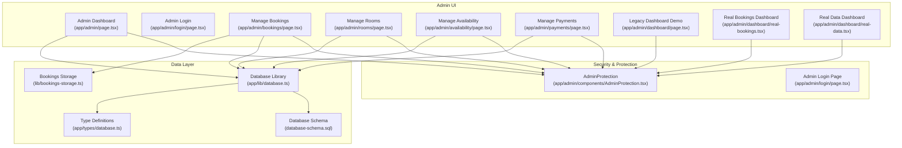

**Diagram sources**
- [app/admin/page.tsx:1-181](file://app/admin/page.tsx#L1-L181)
- [app/admin/components/AdminProtection.tsx:1-69](file://app/admin/components/AdminProtection.tsx#L1-L69)
- [app/admin/login/page.tsx:1-98](file://app/admin/login/page.tsx#L1-L98)
- [app/admin/bookings/page.tsx:1-459](file://app/admin/bookings/page.tsx#L1-L459)
- [app/admin/rooms/page.tsx:1-280](file://app/admin/rooms/page.tsx#L1-L280)
- [app/admin/availability/page.tsx:1-281](file://app/admin/availability/page.tsx#L1-L281)
- [app/admin/payments/page.tsx:1-288](file://app/admin/payments/page.tsx#L1-L288)
- [app/admin/dashboard/page.tsx:1-205](file://app/admin/dashboard/page.tsx#L1-L205)
- [app/admin/dashboard/real-bookings.tsx:1-347](file://app/admin/dashboard/real-bookings.tsx#L1-L347)
- [app/admin/dashboard/real-data.tsx:1-291](file://app/admin/dashboard/real-data.tsx#L1-L291)
- [app/lib/database.ts:1-433](file://app/lib/database.ts#L1-L433)
- [lib/bookings-storage.ts:1-191](file://lib/bookings-storage.ts#L1-L191)
- [app/types/database.ts:1-146](file://app/types/database.ts#L1-L146)
- [database-schema.sql:1-119](file://database-schema.sql#L1-L119)

**Section sources**
- [app/admin/page.tsx:1-181](file://app/admin/page.tsx#L1-L181)
- [app/admin/components/AdminProtection.tsx:1-69](file://app/admin/components/AdminProtection.tsx#L1-L69)
- [app/admin/login/page.tsx:1-98](file://app/admin/login/page.tsx#L1-L98)
- [app/admin/bookings/page.tsx:1-459](file://app/admin/bookings/page.tsx#L1-L459)
- [app/admin/rooms/page.tsx:1-280](file://app/admin/rooms/page.tsx#L1-L280)
- [app/admin/availability/page.tsx:1-281](file://app/admin/availability/page.tsx#L1-L281)
- [app/admin/payments/page.tsx:1-288](file://app/admin/payments/page.tsx#L1-L288)
- [app/admin/dashboard/page.tsx:1-205](file://app/admin/dashboard/page.tsx#L1-L205)
- [app/admin/dashboard/real-bookings.tsx:1-347](file://app/admin/dashboard/real-bookings.tsx#L1-L347)
- [app/admin/dashboard/real-data.tsx:1-291](file://app/admin/dashboard/real-data.tsx#L1-L291)
- [app/lib/database.ts:1-433](file://app/lib/database.ts#L1-L433)
- [lib/bookings-storage.ts:1-191](file://lib/bookings-storage.ts#L1-L191)
- [app/types/database.ts:1-146](file://app/types/database.ts#L1-L146)
- [database-schema.sql:1-119](file://database-schema.sql#L1-L119)

## Core Components
- Admin dashboard entry and navigation: Provides quick actions to manage bookings, payments, rooms, and availability, plus live stats rendering.
- Admin protection mechanism: Enforces admin-only access using client-side session storage with a short timeout.
- Admin login: Simple password-based login that sets authentication flags in local storage.
- Booking management: Lists, filters, and updates booking statuses; supports deletion and refresh from local storage.
- Room management: CRUD operations for rooms with form validation and availability indicators.
- Availability management: Filters and toggles room availability for specific dates with fallback to local storage.
- Payment management: Lists payments, filters by status, and updates payment status.
- Data access layer: Centralized Supabase wrappers for bookings, rooms, availability, payments, and dashboard stats.
- Type definitions: Strongly typed models for database entities and API responses.
- Database schema: Defines tables, constraints, indexes, and helper functions for availability checks.

**Section sources**
- [app/admin/page.tsx:1-181](file://app/admin/page.tsx#L1-L181)
- [app/admin/components/AdminProtection.tsx:1-69](file://app/admin/components/AdminProtection.tsx#L1-L69)
- [app/admin/login/page.tsx:1-98](file://app/admin/login/page.tsx#L1-L98)
- [app/admin/bookings/page.tsx:1-459](file://app/admin/bookings/page.tsx#L1-L459)
- [app/admin/rooms/page.tsx:1-280](file://app/admin/rooms/page.tsx#L1-L280)
- [app/admin/availability/page.tsx:1-281](file://app/admin/availability/page.tsx#L1-L281)
- [app/admin/payments/page.tsx:1-288](file://app/admin/payments/page.tsx#L1-L288)
- [app/lib/database.ts:1-433](file://app/lib/database.ts#L1-L433)
- [app/types/database.ts:1-146](file://app/types/database.ts#L1-L146)
- [database-schema.sql:1-119](file://database-schema.sql#L1-L119)

## Architecture Overview
The admin system follows a layered architecture:
- Presentation layer: Next.js client components under app/admin with shared AdminProtection.
- Business logic: Local utilities for mock data and local storage operations.
- Data access: Supabase-based functions for persistent data operations.
- Security: Client-side admin session guard with local storage and a simple password check.

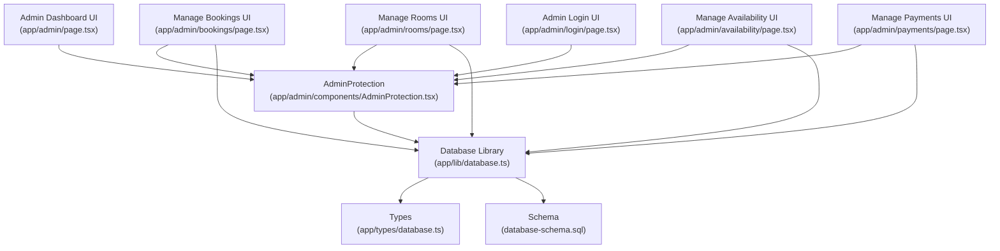

**Diagram sources**
- [app/admin/page.tsx:1-181](file://app/admin/page.tsx#L1-L181)
- [app/admin/bookings/page.tsx:1-459](file://app/admin/bookings/page.tsx#L1-L459)
- [app/admin/rooms/page.tsx:1-280](file://app/admin/rooms/page.tsx#L1-L280)
- [app/admin/availability/page.tsx:1-281](file://app/admin/availability/page.tsx#L1-L281)
- [app/admin/payments/page.tsx:1-288](file://app/admin/payments/page.tsx#L1-L288)
- [app/admin/login/page.tsx:1-98](file://app/admin/login/page.tsx#L1-L98)
- [app/admin/components/AdminProtection.tsx:1-69](file://app/admin/components/AdminProtection.tsx#L1-L69)
- [app/lib/database.ts:1-433](file://app/lib/database.ts#L1-L433)
- [app/types/database.ts:1-146](file://app/types/database.ts#L1-L146)
- [database-schema.sql:1-119](file://database-schema.sql#L1-L119)

## Detailed Component Analysis

### Admin Login and Protection Mechanisms
- Login page accepts a hardcoded password and writes adminAuth flags to local storage with a timestamp.
- AdminProtection reads these flags, enforces a short session timeout, and redirects unauthorized users to the login page.
- On timeout or missing flags, the component clears stale entries and navigates to /admin/login.

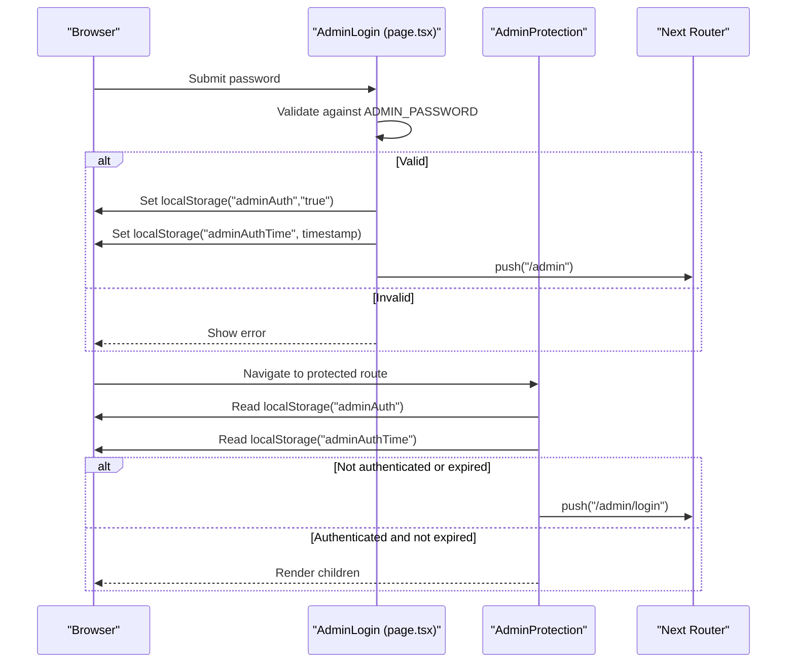

**Diagram sources**
- [app/admin/login/page.tsx:1-98](file://app/admin/login/page.tsx#L1-L98)
- [app/admin/components/AdminProtection.tsx:1-69](file://app/admin/components/AdminProtection.tsx#L1-L69)

**Section sources**
- [app/admin/login/page.tsx:1-98](file://app/admin/login/page.tsx#L1-L98)
- [app/admin/components/AdminProtection.tsx:1-69](file://app/admin/components/AdminProtection.tsx#L1-L69)

### Admin Dashboard Analytics and Reporting
- Loads dashboard statistics (total bookings, total revenue, occupied rooms, pending bookings) from the database.
- Renders summary cards and quick action buttons to navigate to other admin sections.
- Includes a refresh button to reload stats and a back-to-site button.

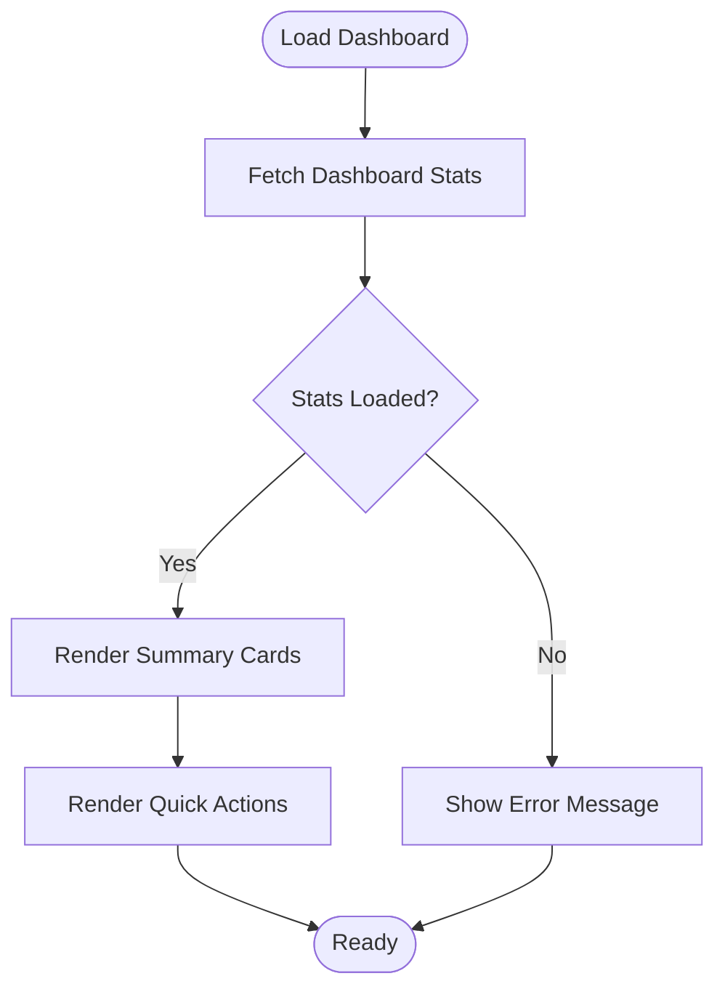

**Diagram sources**
- [app/admin/page.tsx:15-32](file://app/admin/page.tsx#L15-L32)
- [app/lib/database.ts:184-212](file://app/lib/database.ts#L184-L212)

**Section sources**
- [app/admin/page.tsx:1-181](file://app/admin/page.tsx#L1-L181)
- [app/lib/database.ts:184-212](file://app/lib/database.ts#L184-L212)

### Booking Management Interfaces
- Loads mock bookings plus persisted bookings from local storage, sorts by creation date, and renders a table.
- Supports filtering by status, search by guest/email/room, and date range.
- Provides actions to confirm/cancel bookings or delete them, with immediate updates to state and local storage.
- Includes refresh functionality to reload persisted bookings.

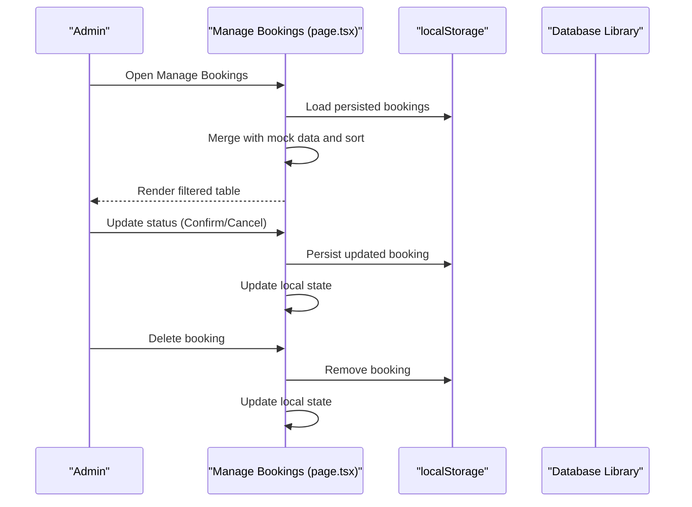

**Diagram sources**
- [app/admin/bookings/page.tsx:149-238](file://app/admin/bookings/page.tsx#L149-L238)
- [lib/bookings-storage.ts:137-173](file://lib/bookings-storage.ts#L137-L173)

**Section sources**
- [app/admin/bookings/page.tsx:1-459](file://app/admin/bookings/page.tsx#L1-L459)
- [lib/bookings-storage.ts:1-191](file://lib/bookings-storage.ts#L1-L191)

### Room Management and Availability Control
- Room management supports creating, updating, and deleting rooms with form validation.
- Displays room cards with availability status and edit/delete actions.
- Availability management allows filtering by room and date, toggling availability, and falls back to local storage if database operations fail.

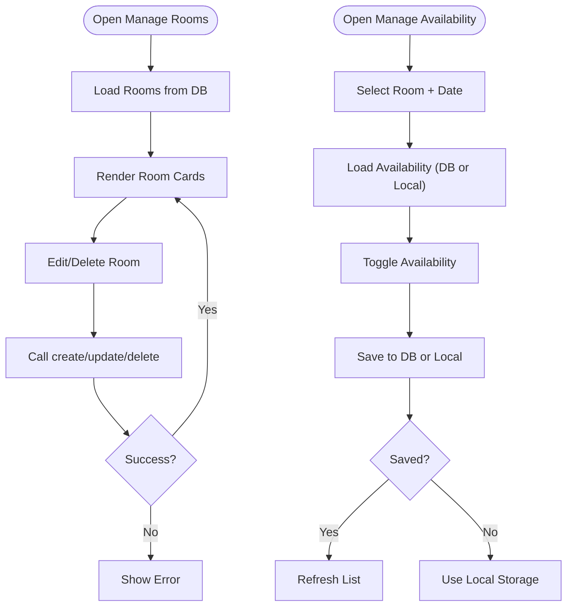

**Diagram sources**
- [app/admin/rooms/page.tsx:17-87](file://app/admin/rooms/page.tsx#L17-L87)
- [app/admin/availability/page.tsx:27-119](file://app/admin/availability/page.tsx#L27-L119)
- [app/lib/database.ts:26-74](file://app/lib/database.ts#L26-L74)
- [app/lib/database.ts:288-312](file://app/lib/database.ts#L288-L312)

**Section sources**
- [app/admin/rooms/page.tsx:1-280](file://app/admin/rooms/page.tsx#L1-L280)
- [app/admin/availability/page.tsx:1-281](file://app/admin/availability/page.tsx#L1-L281)
- [app/lib/database.ts:26-74](file://app/lib/database.ts#L26-L74)
- [app/lib/database.ts:288-312](file://app/lib/database.ts#L288-L312)

### Payment Monitoring Capabilities
- Loads mock payments and any confirmed bookings from local storage to simulate payment records.
- Filters payments by status and allows updating payment status (pending/completed/failed).
- Displays summary cards for total revenue, pending payments, and failed payments.

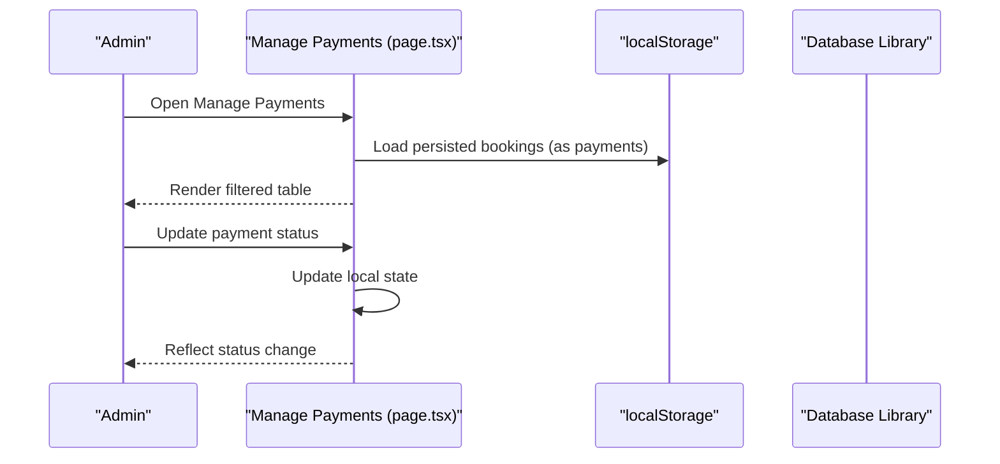

**Diagram sources**
- [app/admin/payments/page.tsx:58-94](file://app/admin/payments/page.tsx#L58-L94)
- [app/admin/payments/page.tsx:96-107](file://app/admin/payments/page.tsx#L96-L107)
- [lib/bookings-storage.ts:137-173](file://lib/bookings-storage.ts#L137-L173)

**Section sources**
- [app/admin/payments/page.tsx:1-288](file://app/admin/payments/page.tsx#L1-L288)
- [lib/bookings-storage.ts:1-191](file://lib/bookings-storage.ts#L1-L191)

### Admin-Only Routes and Role-Based Permissions
- All admin pages are wrapped with AdminProtection, ensuring only authenticated sessions can access them.
- Authentication relies on client-side flags in local storage; there is no server-side role enforcement in the current implementation.
- The login page uses a simple password check and stores a timestamp to enforce a short session lifetime.

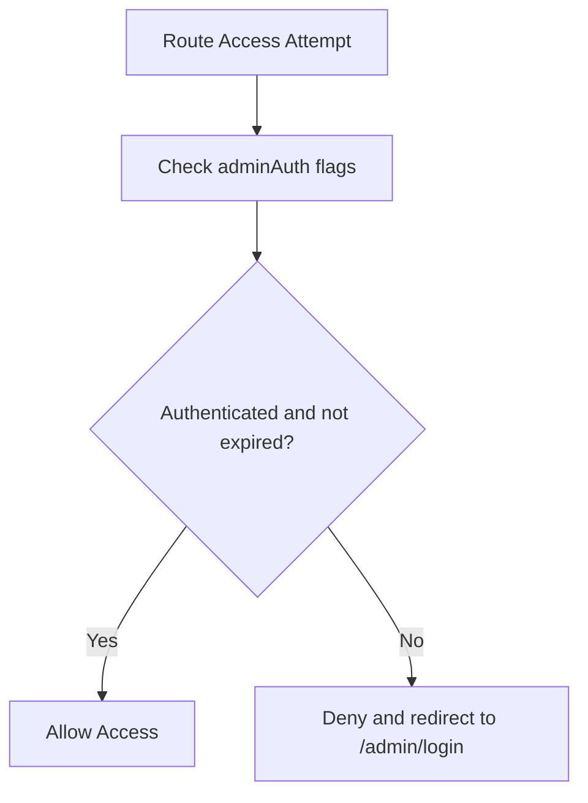

**Diagram sources**
- [app/admin/components/AdminProtection.tsx:17-49](file://app/admin/components/AdminProtection.tsx#L17-L49)
- [app/admin/login/page.tsx:25-34](file://app/admin/login/page.tsx#L25-L34)

**Section sources**
- [app/admin/components/AdminProtection.tsx:1-69](file://app/admin/components/AdminProtection.tsx#L1-L69)
- [app/admin/login/page.tsx:1-98](file://app/admin/login/page.tsx#L1-L98)

### Security Measures Protecting Administrative Functions
- Client-side session guard with a short timeout to minimize exposure windows.
- Local storage-based authentication tokens with automatic cleanup on expiration.
- No server-side role or permission enforcement; rely on client-side checks and route protection.
- Password is embedded in the login component; consider moving to environment variables and server-side validation for production.

**Section sources**
- [app/admin/components/AdminProtection.tsx:14-45](file://app/admin/components/AdminProtection.tsx#L14-L45)
- [app/admin/login/page.tsx:12-34](file://app/admin/login/page.tsx#L12-L34)

### Dashboard Components and Data Visualization
- Real-time booking displays: Filterable tables with status badges and action buttons.
- Occupancy analytics: Dashboard stats include occupied rooms and pending bookings.
- Revenue tracking: Dashboard stats and payment summaries compute total revenue.
- User management interfaces: Room management screens allow CRUD operations on room listings.

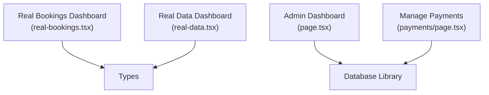

**Diagram sources**
- [app/admin/dashboard/real-bookings.tsx:1-347](file://app/admin/dashboard/real-bookings.tsx#L1-L347)
- [app/admin/dashboard/real-data.tsx:1-291](file://app/admin/dashboard/real-data.tsx#L1-L291)
- [app/admin/page.tsx:15-32](file://app/admin/page.tsx#L15-L32)
- [app/admin/payments/page.tsx:58-94](file://app/admin/payments/page.tsx#L58-L94)
- [app/types/database.ts:1-146](file://app/types/database.ts#L1-L146)

**Section sources**
- [app/admin/dashboard/real-bookings.tsx:1-347](file://app/admin/dashboard/real-bookings.tsx#L1-L347)
- [app/admin/dashboard/real-data.tsx:1-291](file://app/admin/dashboard/real-data.tsx#L1-L291)
- [app/admin/page.tsx:1-181](file://app/admin/page.tsx#L1-L181)
- [app/admin/payments/page.tsx:1-288](file://app/admin/payments/page.tsx#L1-L288)

### Practical Examples of Admin Workflows
- Updating booking status: From the bookings page, select Confirm or Cancel to update the booking status; the change propagates to local storage and UI immediately.
- Deleting a booking: Confirm the action; the booking is removed from local storage and the UI updates accordingly.
- Managing room availability: Filter by room and date, then click Make Available/Unavailable to toggle status; the system attempts database updates first, falling back to local storage if needed.
- Managing payments: Filter by status and mark as Completed or Failed; the UI reflects the updated totals.

**Section sources**
- [app/admin/bookings/page.tsx:171-219](file://app/admin/bookings/page.tsx#L171-L219)
- [app/admin/availability/page.tsx:58-119](file://app/admin/availability/page.tsx#L58-L119)
- [app/admin/payments/page.tsx:85-94](file://app/admin/payments/page.tsx#L85-L94)

### Batch Operations for Room Availability Updates
- The availability management component supports toggling multiple dates for a single room by filtering and updating entries.
- When database operations fail, the system falls back to local storage, enabling offline-like batch updates.

**Section sources**
- [app/admin/availability/page.tsx:27-119](file://app/admin/availability/page.tsx#L27-L119)

### Admin User Management, Audit Logging, and Reporting
- Current implementation does not include dedicated admin user management or audit logging.
- Audit logging can be introduced by adding a logs table and capturing events (e.g., booking status changes, room updates, availability toggles) with timestamps and actor metadata.
- Reporting requirements can be satisfied by extending the dashboard with exportable summaries and charts using the existing stats and payment data.

**Section sources**
- [database-schema.sql:1-119](file://database-schema.sql#L1-L119)
- [app/lib/database.ts:184-212](file://app/lib/database.ts#L184-L212)

## Dependency Analysis
The admin components depend on:
- AdminProtection for route guards.
- Database library for persistent data operations.
- Types for strong typing across components and libraries.
- Local storage utilities for mock data and offline scenarios.

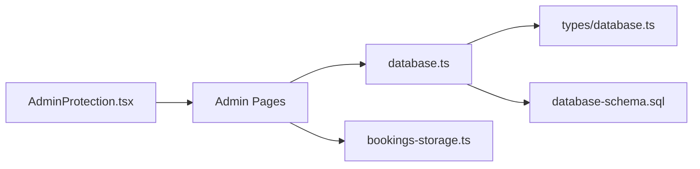

**Diagram sources**
- [app/admin/components/AdminProtection.tsx:1-69](file://app/admin/components/AdminProtection.tsx#L1-L69)
- [app/admin/page.tsx:1-181](file://app/admin/page.tsx#L1-L181)
- [app/lib/database.ts:1-433](file://app/lib/database.ts#L1-L433)
- [app/types/database.ts:1-146](file://app/types/database.ts#L1-L146)
- [database-schema.sql:1-119](file://database-schema.sql#L1-L119)
- [lib/bookings-storage.ts:1-191](file://lib/bookings-storage.ts#L1-L191)

**Section sources**
- [app/admin/components/AdminProtection.tsx:1-69](file://app/admin/components/AdminProtection.tsx#L1-L69)
- [app/admin/page.tsx:1-181](file://app/admin/page.tsx#L1-L181)
- [app/lib/database.ts:1-433](file://app/lib/database.ts#L1-L433)
- [app/types/database.ts:1-146](file://app/types/database.ts#L1-L146)
- [database-schema.sql:1-119](file://database-schema.sql#L1-L119)
- [lib/bookings-storage.ts:1-191](file://lib/bookings-storage.ts#L1-L191)

## Performance Considerations
- Client-side filtering and sorting are efficient for small datasets but may degrade with large volumes; consider server-side pagination and filtering.
- Local storage operations are synchronous and can block the UI; defer heavy computations to background tasks or virtualize long lists.
- Database queries aggregate counts and sums; ensure appropriate indexing exists for bookings, rooms, and availability tables.

[No sources needed since this section provides general guidance]

## Troubleshooting Guide
- Admin session expires: If redirected to the login page, re-authenticate. The session timeout is enforced client-side.
- Database errors during availability updates: The system falls back to local storage; verify local data integrity and retry database operations.
- Payments not reflecting: Ensure persisted bookings are present in local storage; the payments page derives records from confirmed bookings stored locally.
- Booking status not updating: Confirm the change is saved in local storage and the UI is refreshed.

**Section sources**
- [app/admin/components/AdminProtection.tsx:14-45](file://app/admin/components/AdminProtection.tsx#L14-L45)
- [app/admin/availability/page.tsx:34-56](file://app/admin/availability/page.tsx#L34-L56)
- [app/admin/payments/page.tsx:58-83](file://app/admin/payments/page.tsx#L58-L83)
- [lib/bookings-storage.ts:137-173](file://lib/bookings-storage.ts#L137-L173)

## Conclusion
The administrative dashboard provides a comprehensive set of tools for managing bookings, rooms, availability, and payments with a simple, client-side protection model. While the current implementation focuses on client-side session management and local storage fallbacks, it offers a solid foundation for further enhancements such as server-side authentication, audit logging, and advanced reporting.

[No sources needed since this section summarizes without analyzing specific files]

## Appendices

### Data Model Overview
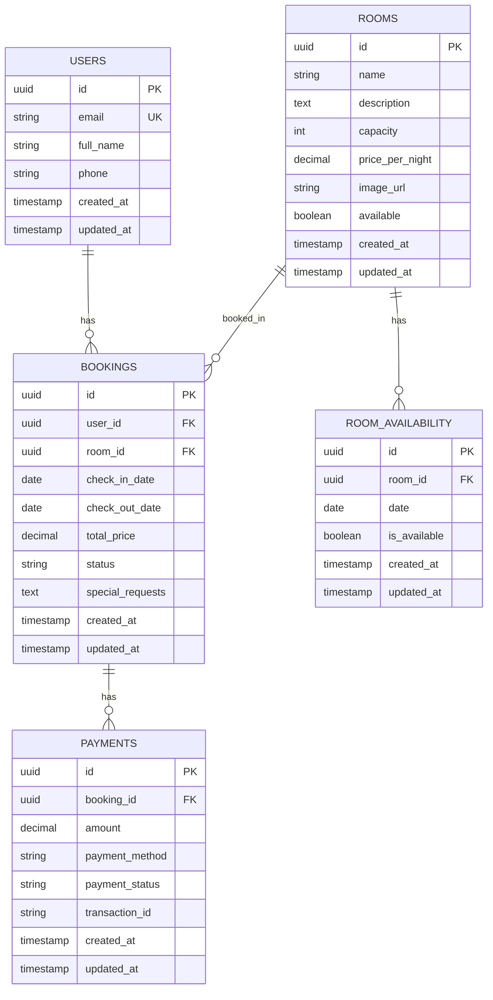

**Diagram sources**
- [database-schema.sql:3-119](file://database-schema.sql#L3-L119)