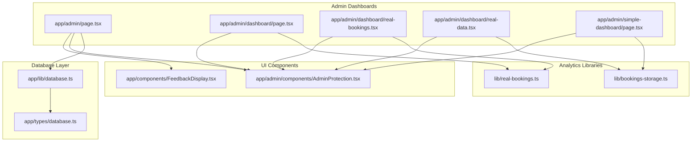
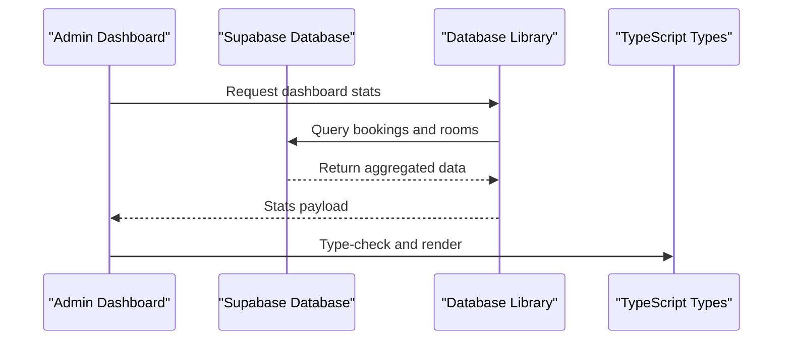
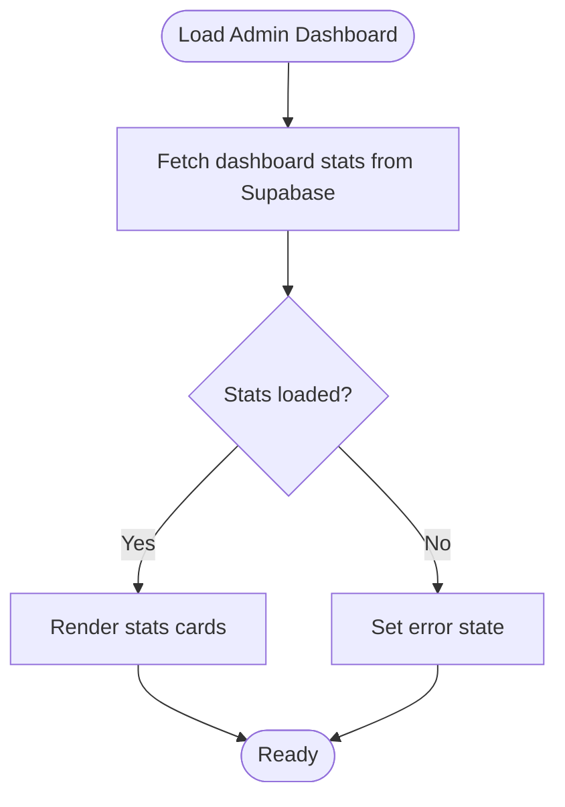
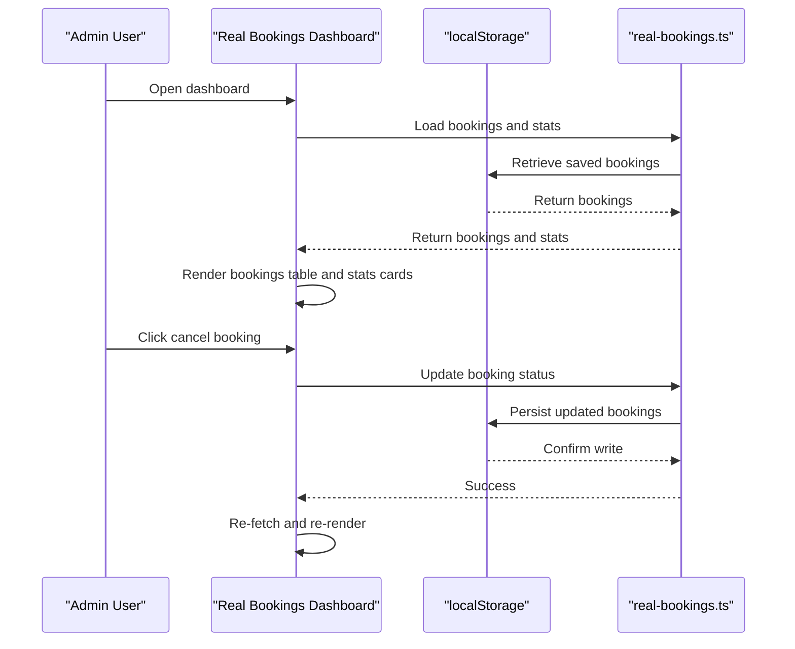
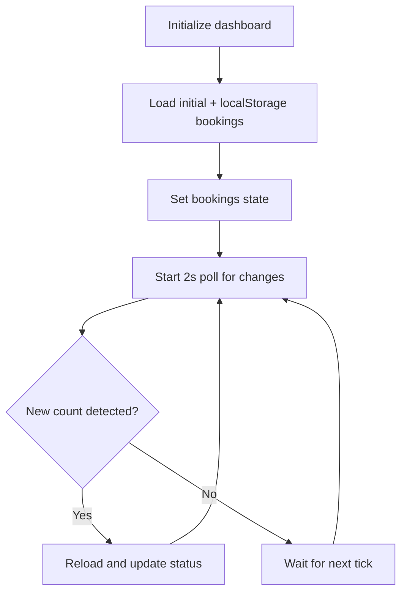
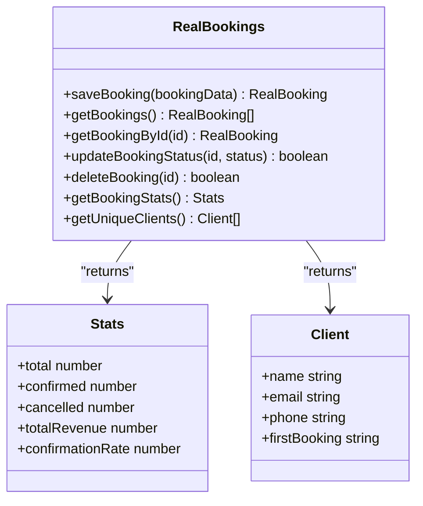
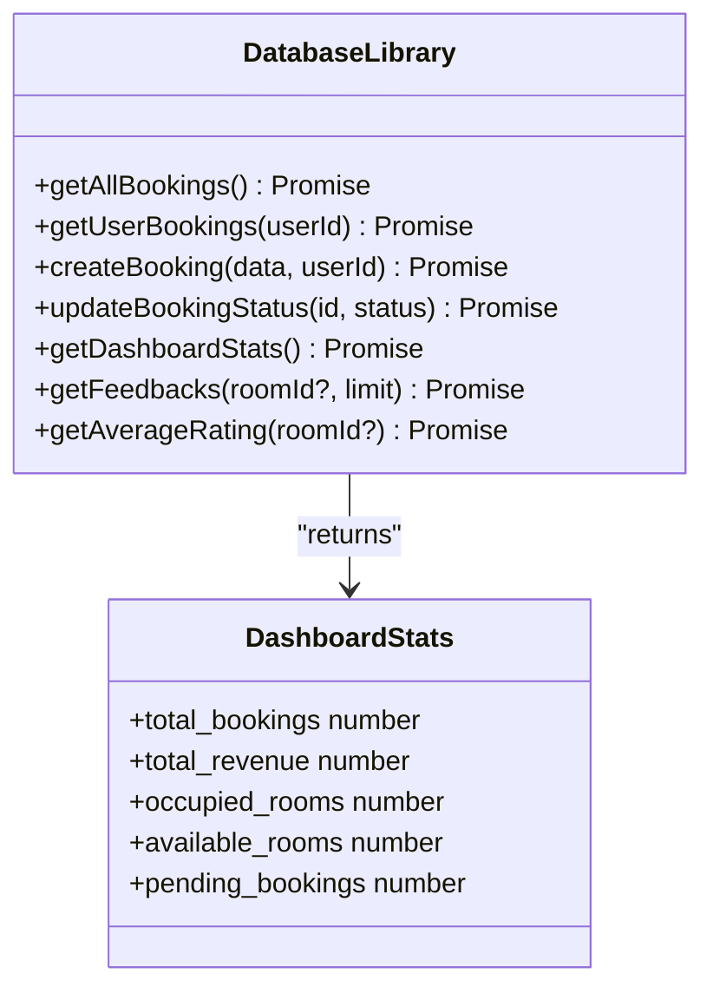
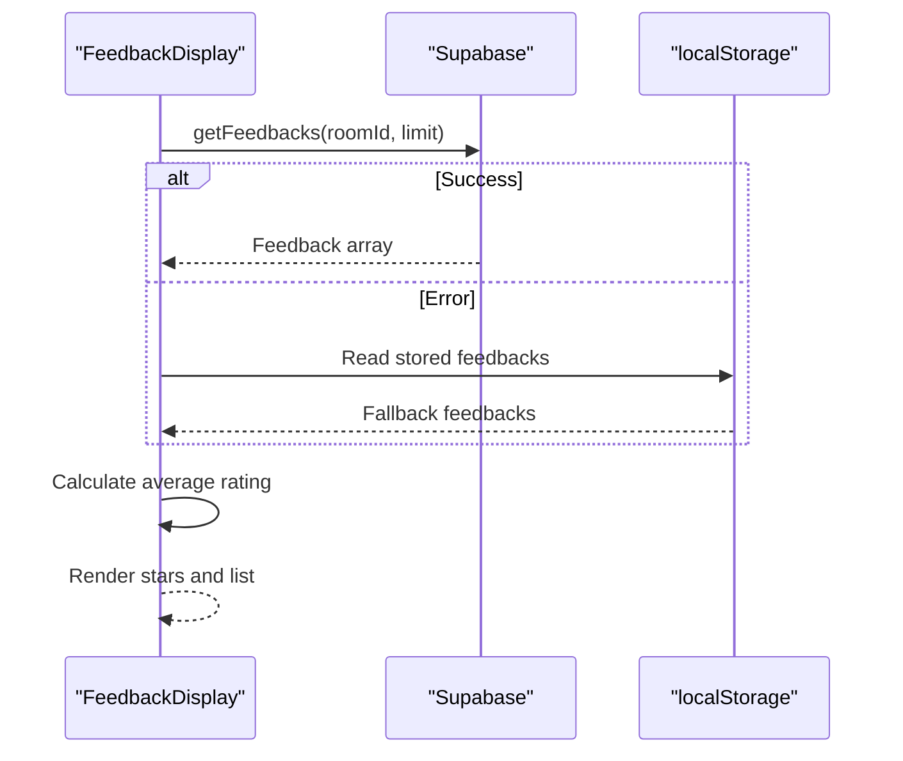
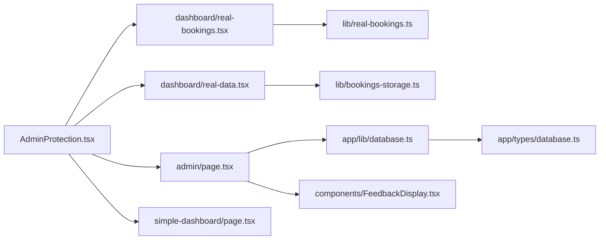

# Dashboard Analytics and Reporting

<cite>
**Referenced Files in This Document**
- [app/admin/page.tsx](file://app/admin/page.tsx)
- [app/admin/dashboard/page.tsx](file://app/admin/dashboard/page.tsx)
- [app/admin/dashboard/real-bookings.tsx](file://app/admin/dashboard/real-bookings.tsx)
- [app/admin/dashboard/real-data.tsx](file://app/admin/dashboard/real-data.tsx)
- [app/admin/simple-dashboard/page.tsx](file://app/admin/simple-dashboard/page.tsx)
- [lib/real-bookings.ts](file://lib/real-bookings.ts)
- [lib/bookings-storage.ts](file://lib/bookings-storage.ts)
- [app/lib/database.ts](file://app/lib/database.ts)
- [app/types/database.ts](file://app/types/database.ts)
- [app/components/FeedbackDisplay.tsx](file://app/components/FeedbackDisplay.tsx)
- [app/admin/components/AdminProtection.tsx](file://app/admin/components/AdminProtection.tsx)
</cite>

## Table of Contents
1. [Introduction](#introduction)
2. [Project Structure](#project-structure)
3. [Core Components](#core-components)
4. [Architecture Overview](#architecture-overview)
5. [Detailed Component Analysis](#detailed-component-analysis)
6. [Dependency Analysis](#dependency-analysis)
7. [Performance Considerations](#performance-considerations)
8. [Troubleshooting Guide](#troubleshooting-guide)
9. [Conclusion](#conclusion)

## Introduction
This document describes the dashboard analytics and reporting system for the hostel booking platform. It covers real-time booking statistics display, revenue tracking calculations, occupancy analytics, and interactive visualization components. It also documents data aggregation logic, statistical computations, real-time updates, customization examples, filtering approaches, export capabilities, and performance considerations for large datasets with caching strategies.

## Project Structure
The dashboard system is implemented as a Next.js client-side application with multiple dashboard variants and supporting libraries:
- Admin dashboard with live stats and navigation
- Real-time booking dashboards using local storage and Supabase
- Simple dashboard with auto-refresh and localStorage synchronization
- Analytics libraries for booking data and statistics
- Database abstraction layer for Supabase integration
- Types for strong typing across the system

**Diagram sources**
- [app/admin/page.tsx:1-181](file://app/admin/page.tsx#L1-L181)
- [app/admin/dashboard/page.tsx:1-205](file://app/admin/dashboard/page.tsx#L1-L205)
- [app/admin/dashboard/real-bookings.tsx:1-347](file://app/admin/dashboard/real-bookings.tsx#L1-L347)
- [app/admin/dashboard/real-data.tsx:1-291](file://app/admin/dashboard/real-data.tsx#L1-L291)
- [app/admin/simple-dashboard/page.tsx:1-257](file://app/admin/simple-dashboard/page.tsx#L1-L257)
- [lib/real-bookings.ts:1-120](file://lib/real-bookings.ts#L1-L120)
- [lib/bookings-storage.ts:1-191](file://lib/bookings-storage.ts#L1-L191)
- [app/lib/database.ts:1-433](file://app/lib/database.ts#L1-L433)
- [app/types/database.ts:1-146](file://app/types/database.ts#L1-L146)
- [app/components/FeedbackDisplay.tsx:1-155](file://app/components/FeedbackDisplay.tsx#L1-L155)
- [app/admin/components/AdminProtection.tsx:1-69](file://app/admin/components/AdminProtection.tsx#L1-L69)

**Section sources**
- [app/admin/page.tsx:1-181](file://app/admin/page.tsx#L1-L181)
- [app/admin/dashboard/page.tsx:1-205](file://app/admin/dashboard/page.tsx#L1-L205)
- [app/admin/dashboard/real-bookings.tsx:1-347](file://app/admin/dashboard/real-bookings.tsx#L1-L347)
- [app/admin/dashboard/real-data.tsx:1-291](file://app/admin/dashboard/real-data.tsx#L1-L291)
- [app/admin/simple-dashboard/page.tsx:1-257](file://app/admin/simple-dashboard/page.tsx#L1-L257)
- [lib/real-bookings.ts:1-120](file://lib/real-bookings.ts#L1-L120)
- [lib/bookings-storage.ts:1-191](file://lib/bookings-storage.ts#L1-L191)
- [app/lib/database.ts:1-433](file://app/lib/database.ts#L1-L433)
- [app/types/database.ts:1-146](file://app/types/database.ts#L1-L146)
- [app/components/FeedbackDisplay.tsx:1-155](file://app/components/FeedbackDisplay.tsx#L1-L155)
- [app/admin/components/AdminProtection.tsx:1-69](file://app/admin/components/AdminProtection.tsx#L1-L69)

## Core Components
- Admin dashboard with live stats cards for total bookings, total revenue, occupied rooms, and pending bookings.
- Real-time booking dashboard with tabbed views for bookings and statistics, including confirmation rate and unique clients.
- Simple dashboard with auto-refresh via localStorage events and periodic polling.
- Analytics library for real bookings using localStorage with save, load, update, and statistics computation.
- Database abstraction layer for Supabase integration with booking retrieval, status updates, and dashboard statistics.
- Types for strong typing across the system including dashboard stats and feedback entities.
- Feedback display component with dynamic star rendering and average rating calculation.

**Section sources**
- [app/admin/page.tsx:75-120](file://app/admin/page.tsx#L75-L120)
- [app/admin/dashboard/real-bookings.tsx:228-339](file://app/admin/dashboard/real-bookings.tsx#L228-L339)
- [app/admin/simple-dashboard/page.tsx:20-97](file://app/admin/simple-dashboard/page.tsx#L20-L97)
- [lib/real-bookings.ts:21-119](file://lib/real-bookings.ts#L21-L119)
- [app/lib/database.ts:184-212](file://app/lib/database.ts#L184-L212)
- [app/types/database.ts:118-146](file://app/types/database.ts#L118-L146)
- [app/components/FeedbackDisplay.tsx:12-70](file://app/components/FeedbackDisplay.tsx#L12-L70)

## Architecture Overview
The system integrates three primary data sources:
- Supabase-backed analytics for production-grade metrics
- Local storage for offline-first and rapid prototyping
- Static mock data for development and testing

**Diagram sources**
- [app/admin/page.tsx:15-32](file://app/admin/page.tsx#L15-L32)
- [app/lib/database.ts:184-212](file://app/lib/database.ts#L184-L212)
- [app/types/database.ts:118-125](file://app/types/database.ts#L118-L125)

## Detailed Component Analysis

### Admin Dashboard (Live Stats)
The main admin dashboard fetches and displays key metrics:
- Total bookings
- Total revenue
- Occupied rooms
- Pending bookings

**Diagram sources**
- [app/admin/page.tsx:15-32](file://app/admin/page.tsx#L15-L32)
- [app/lib/database.ts:184-212](file://app/lib/database.ts#L184-L212)

**Section sources**
- [app/admin/page.tsx:75-120](file://app/admin/page.tsx#L75-L120)
- [app/lib/database.ts:184-212](file://app/lib/database.ts#L184-L212)

### Real-Time Booking Dashboard
This dashboard supports:
- Tabbed interface for bookings and statistics
- Unique client counts
- Confirmation rate calculation
- Manual refresh and cancellation actions

**Diagram sources**
- [app/admin/dashboard/real-bookings.tsx:13-33](file://app/admin/dashboard/real-bookings.tsx#L13-L33)
- [lib/real-bookings.ts:40-68](file://lib/real-bookings.ts#L40-L68)
- [lib/real-bookings.ts:84-100](file://lib/real-bookings.ts#L84-L100)

**Section sources**
- [app/admin/dashboard/real-bookings.tsx:75-101](file://app/admin/dashboard/real-bookings.tsx#L75-L101)
- [app/admin/dashboard/real-bookings.tsx:228-339](file://app/admin/dashboard/real-bookings.tsx#L228-L339)
- [lib/real-bookings.ts:40-119](file://lib/real-bookings.ts#L40-L119)

### Simple Dashboard with Auto-Refresh
The simple dashboard:
- Loads initial data plus new customer bookings from localStorage
- Auto-refreshes every 2 seconds
- Responds to storage events and visibility changes
- Calculates totals, confirmed, cancelled, and revenue in real-time

**Diagram sources**
- [app/admin/simple-dashboard/page.tsx:20-97](file://app/admin/simple-dashboard/page.tsx#L20-L97)

**Section sources**
- [app/admin/simple-dashboard/page.tsx:20-97](file://app/admin/simple-dashboard/page.tsx#L20-L97)

### Analytics Library (Local Storage)
The analytics library provides:
- Save new bookings
- Load all bookings
- Update booking status
- Compute statistics (totals, confirmed, cancelled, revenue, confirmation rate)
- Extract unique clients

**Diagram sources**
- [lib/real-bookings.ts:21-119](file://lib/real-bookings.ts#L21-L119)

**Section sources**
- [lib/real-bookings.ts:21-119](file://lib/real-bookings.ts#L21-L119)

### Database Abstraction Layer
The database layer:
- Provides typed queries for bookings, rooms, and availability
- Computes dashboard statistics from Supabase data
- Exposes CRUD operations for bookings and payments

**Diagram sources**
- [app/lib/database.ts:134-212](file://app/lib/database.ts#L134-L212)
- [app/types/database.ts:118-125](file://app/types/database.ts#L118-L125)

**Section sources**
- [app/lib/database.ts:134-212](file://app/lib/database.ts#L134-L212)
- [app/types/database.ts:118-125](file://app/types/database.ts#L118-L125)

### Feedback Display Component
The feedback display:
- Loads feedbacks from Supabase with fallback to localStorage
- Renders star ratings and average rating
- Supports optional inline feedback form

**Diagram sources**
- [app/components/FeedbackDisplay.tsx:21-52](file://app/components/FeedbackDisplay.tsx#L21-L52)

**Section sources**
- [app/components/FeedbackDisplay.tsx:21-70](file://app/components/FeedbackDisplay.tsx#L21-L70)

## Dependency Analysis
Key dependencies and relationships:
- Admin dashboards depend on AdminProtection for authentication gating
- Real-time dashboards depend on analytics libraries for data operations
- Database layer depends on Supabase client and TypeScript types
- Feedback display depends on database library and localStorage fallback

**Diagram sources**
- [app/admin/components/AdminProtection.tsx:9-68](file://app/admin/components/AdminProtection.tsx#L9-L68)
- [app/admin/page.tsx:1-181](file://app/admin/page.tsx#L1-L181)
- [app/admin/dashboard/real-bookings.tsx:1-347](file://app/admin/dashboard/real-bookings.tsx#L1-L347)
- [app/admin/dashboard/real-data.tsx:1-291](file://app/admin/dashboard/real-data.tsx#L1-L291)
- [app/admin/simple-dashboard/page.tsx:1-257](file://app/admin/simple-dashboard/page.tsx#L1-L257)
- [lib/real-bookings.ts:1-120](file://lib/real-bookings.ts#L1-L120)
- [lib/bookings-storage.ts:1-191](file://lib/bookings-storage.ts#L1-L191)
- [app/lib/database.ts:1-433](file://app/lib/database.ts#L1-L433)
- [app/types/database.ts:1-146](file://app/types/database.ts#L1-L146)
- [app/components/FeedbackDisplay.tsx:1-155](file://app/components/FeedbackDisplay.tsx#L1-L155)

**Section sources**
- [app/admin/components/AdminProtection.tsx:9-68](file://app/admin/components/AdminProtection.tsx#L9-L68)
- [app/admin/page.tsx:1-181](file://app/admin/page.tsx#L1-L181)
- [app/admin/dashboard/real-bookings.tsx:1-347](file://app/admin/dashboard/real-bookings.tsx#L1-L347)
- [app/admin/dashboard/real-data.tsx:1-291](file://app/admin/dashboard/real-data.tsx#L1-L291)
- [app/admin/simple-dashboard/page.tsx:1-257](file://app/admin/simple-dashboard/page.tsx#L1-L257)
- [lib/real-bookings.ts:1-120](file://lib/real-bookings.ts#L1-L120)
- [lib/bookings-storage.ts:1-191](file://lib/bookings-storage.ts#L1-L191)
- [app/lib/database.ts:1-433](file://app/lib/database.ts#L1-L433)
- [app/types/database.ts:1-146](file://app/types/database.ts#L1-L146)
- [app/components/FeedbackDisplay.tsx:1-155](file://app/components/FeedbackDisplay.tsx#L1-L155)

## Performance Considerations
- Data locality: Use localStorage for fast, offline-first experiences during development and prototyping.
- Supabase queries: Optimize dashboard stats by selecting only necessary fields and applying server-side limits.
- Client-side filtering: Keep filtering logic minimal and memoize computed values to reduce re-renders.
- Auto-refresh cadence: Tune polling intervals to balance responsiveness and resource usage.
- Caching strategies:
  - Short-term cache for dashboard stats with refresh on demand
  - Local storage for persistent client-side state
  - Server-side caching for frequently accessed reports
- Large dataset handling:
  - Paginate booking lists
  - Apply date-range and status filters
  - Use indexedDB for extended offline storage needs
- Export capabilities:
  - CSV export for booking lists and feedback
  - PDF generation for revenue and occupancy reports
  - Filtering by date range, room type, and status

## Troubleshooting Guide
Common issues and resolutions:
- Authentication timeouts: The AdminProtection component enforces short session timeouts and redirects to login when expired.
- Data loading errors: The feedback display component falls back to localStorage when Supabase queries fail.
- Dashboard not updating: Verify localStorage events are firing and polling intervals are active in the simple dashboard.
- Stats discrepancies: Ensure consistent status values ("confirmed", "cancelled") across data sources.

**Section sources**
- [app/admin/components/AdminProtection.tsx:14-48](file://app/admin/components/AdminProtection.tsx#L14-L48)
- [app/components/FeedbackDisplay.tsx:21-52](file://app/components/FeedbackDisplay.tsx#L21-L52)
- [app/admin/simple-dashboard/page.tsx:62-96](file://app/admin/simple-dashboard/page.tsx#L62-L96)

## Conclusion
The dashboard analytics and reporting system combines Supabase-backed production metrics with local storage for rapid iteration and offline support. It provides real-time booking statistics, revenue tracking, occupancy analytics, and interactive visualization components. By leveraging typed APIs, modular analytics libraries, and robust fallback mechanisms, the system delivers reliable insights while remaining extensible for future enhancements such as advanced filtering, export features, and enhanced caching strategies.