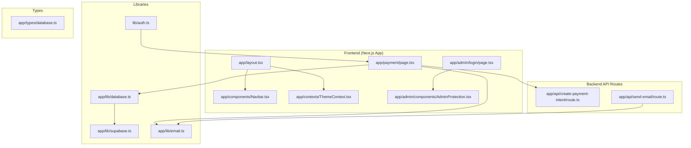
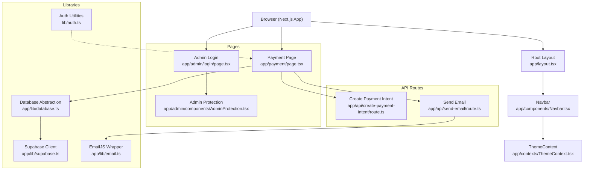
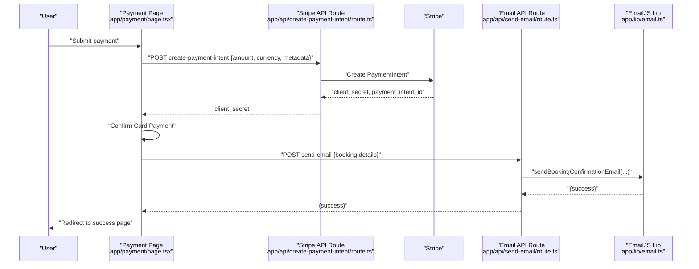
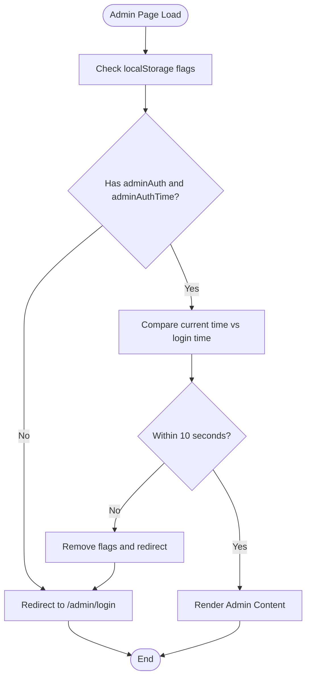
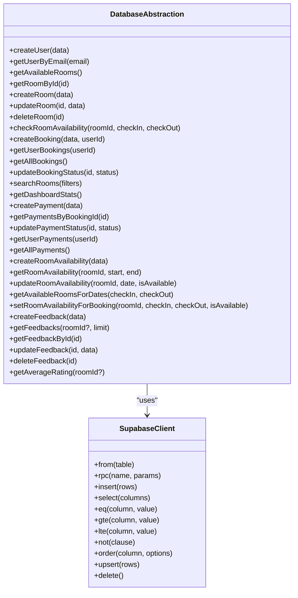
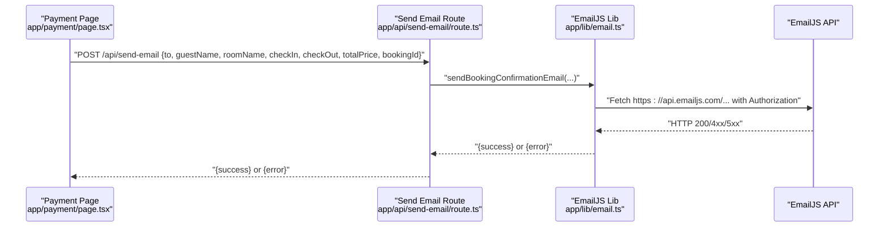
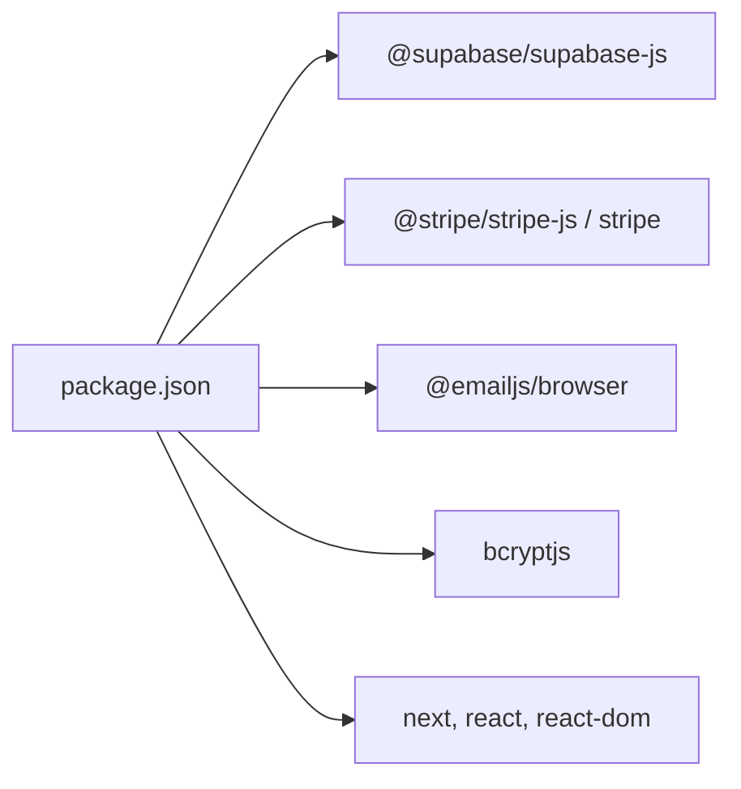

# Architecture Overview

<cite>
**Referenced Files in This Document**
- [README.md](file://README.md)
- [package.json](file://package.json)
- [next.config.ts](file://next.config.ts)
- [app/layout.tsx](file://app/layout.tsx)
- [app/components/Navbar.tsx](file://app/components/Navbar.tsx)
- [app/contexts/ThemeContext.tsx](file://app/contexts/ThemeContext.tsx)
- [app/lib/database.ts](file://app/lib/database.ts)
- [app/lib/supabase.ts](file://app/lib/supabase.ts)
- [app/lib/email.ts](file://app/lib/email.ts)
- [app/types/database.ts](file://app/types/database.ts)
- [app/admin/components/AdminProtection.tsx](file://app/admin/components/AdminProtection.tsx)
- [app/admin/login/page.tsx](file://app/admin/login/page.tsx)
- [app/api/create-payment-intent/route.ts](file://app/api/create-payment-intent/route.ts)
- [app/api/send-email/route.ts](file://app/api/send-email/route.ts)
- [app/payment/page.tsx](file://app/payment/page.tsx)
- [lib/auth.ts](file://lib/auth.ts)
</cite>

## Table of Contents
1. [Introduction](#introduction)
2. [Project Structure](#project-structure)
3. [Core Components](#core-components)
4. [Architecture Overview](#architecture-overview)
5. [Detailed Component Analysis](#detailed-component-analysis)
6. [Dependency Analysis](#dependency-analysis)
7. [Performance Considerations](#performance-considerations)
8. [Security and Scalability](#security-and-scalability)
9. [Troubleshooting Guide](#troubleshooting-guide)
10. [Conclusion](#conclusion)

## Introduction
This document describes the architecture of the Pythonhostel system built with Next.js App Router. It explains the separation of concerns across frontend components, backend API routes, and the database layer. It also documents the authentication model, payment processing pipeline with Stripe, email notifications via EmailJS, and real-time capabilities through Supabase. Finally, it outlines system boundaries, external dependencies, and practical guidance for scalability, security, and performance.

## Project Structure
The application follows Next.js App Router conventions with a clear separation between:
- Frontend pages and components under app/
- Backend API routes under app/api/
- Shared libraries for database, email, and Supabase client under app/lib/
- Type definitions under app/types/
- Admin protection and login under app/admin/

**Diagram sources**
- [app/layout.tsx:11-27](file://app/layout.tsx#L11-L27)
- [app/components/Navbar.tsx:1-35](file://app/components/Navbar.tsx#L1-L35)
- [app/contexts/ThemeContext.tsx](file://app/contexts/ThemeContext.tsx)
- [app/payment/page.tsx:1-352](file://app/payment/page.tsx#L1-L352)
- [app/admin/login/page.tsx:1-98](file://app/admin/login/page.tsx#L1-L98)
- [app/admin/components/AdminProtection.tsx:1-69](file://app/admin/components/AdminProtection.tsx#L1-L69)
- [app/api/create-payment-intent/route.ts:1-33](file://app/api/create-payment-intent/route.ts#L1-L33)
- [app/api/send-email/route.ts:1-42](file://app/api/send-email/route.ts#L1-L42)
- [app/lib/database.ts:1-433](file://app/lib/database.ts#L1-L433)
- [app/lib/supabase.ts:1-6](file://app/lib/supabase.ts#L1-L6)
- [app/lib/email.ts:1-49](file://app/lib/email.ts#L1-L49)
- [lib/auth.ts:1-57](file://lib/auth.ts#L1-L57)
- [app/types/database.ts:1-146](file://app/types/database.ts#L1-L146)

**Section sources**
- [README.md:1-37](file://README.md#L1-L37)
- [package.json:11-21](file://package.json#L11-L21)
- [next.config.ts:1-8](file://next.config.ts#L1-L8)
- [app/layout.tsx:11-27](file://app/layout.tsx#L11-L27)

## Core Components
- Supabase client and database abstraction: Provides CRUD operations, RPC calls, and typed queries for users, rooms, bookings, payments, availability, and feedback.
- Stripe integration: Creates and confirms payment intents for secure card payments.
- EmailJS integration: Sends booking confirmation emails after successful payments.
- Admin protection: Client-side session guard using localStorage for admin access.
- Authentication utilities: Password hashing/verification, token generation/verification, input sanitization, and email/password validation helpers.

Key responsibilities:
- Frontend pages orchestrate user flows (booking, payment, admin).
- API routes encapsulate sensitive operations (Stripe, EmailJS).
- Libraries encapsulate data access and third-party integrations.
- Types define the contract between frontend and backend.

**Section sources**
- [app/lib/database.ts:1-433](file://app/lib/database.ts#L1-L433)
- [app/lib/supabase.ts:1-6](file://app/lib/supabase.ts#L1-L6)
- [app/api/create-payment-intent/route.ts:1-33](file://app/api/create-payment-intent/route.ts#L1-L33)
- [app/api/send-email/route.ts:1-42](file://app/api/send-email/route.ts#L1-L42)
- [app/admin/components/AdminProtection.tsx:1-69](file://app/admin/components/AdminProtection.tsx#L1-L69)
- [lib/auth.ts:1-57](file://lib/auth.ts#L1-L57)

## Architecture Overview
The system is a client-driven SPA with serverless-like API routes. The frontend handles UI and routing, while API routes provide backend services for payment and email. Supabase powers the database and real-time features. Authentication is lightweight for admin access, while Stripe and EmailJS are used for payments and notifications.

**Diagram sources**
- [app/layout.tsx:11-27](file://app/layout.tsx#L11-L27)
- [app/components/Navbar.tsx:1-35](file://app/components/Navbar.tsx#L1-L35)
- [app/contexts/ThemeContext.tsx](file://app/contexts/ThemeContext.tsx)
- [app/payment/page.tsx:1-352](file://app/payment/page.tsx#L1-L352)
- [app/admin/login/page.tsx:1-98](file://app/admin/login/page.tsx#L1-L98)
- [app/admin/components/AdminProtection.tsx:1-69](file://app/admin/components/AdminProtection.tsx#L1-L69)
- [app/api/create-payment-intent/route.ts:1-33](file://app/api/create-payment-intent/route.ts#L1-L33)
- [app/api/send-email/route.ts:1-42](file://app/api/send-email/route.ts#L1-L42)
- [app/lib/database.ts:1-433](file://app/lib/database.ts#L1-L433)
- [app/lib/supabase.ts:1-6](file://app/lib/supabase.ts#L1-L6)
- [app/lib/email.ts:1-49](file://app/lib/email.ts#L1-L49)
- [lib/auth.ts:1-57](file://lib/auth.ts#L1-L57)

## Detailed Component Analysis

### Payment Processing Pipeline (Stripe)
The payment flow is initiated on the payment page, which gathers booking parameters and delegates to the Stripe API route to create a PaymentIntent. After successful confirmation, the page persists a local booking record and navigates to the success page.

**Diagram sources**
- [app/payment/page.tsx:34-176](file://app/payment/page.tsx#L34-L176)
- [app/api/create-payment-intent/route.ts:7-32](file://app/api/create-payment-intent/route.ts#L7-L32)
- [app/api/send-email/route.ts:4-41](file://app/api/send-email/route.ts#L4-L41)
- [app/lib/email.ts:1-49](file://app/lib/email.ts#L1-L49)

**Section sources**
- [app/payment/page.tsx:34-176](file://app/payment/page.tsx#L34-L176)
- [app/api/create-payment-intent/route.ts:7-32](file://app/api/create-payment-intent/route.ts#L7-L32)
- [app/api/send-email/route.ts:4-41](file://app/api/send-email/route.ts#L4-L41)
- [app/lib/email.ts:1-49](file://app/lib/email.ts#L1-L49)

### Authentication and Admin Access Control
Admin access is protected by a client-side guard that checks a short-lived session stored in localStorage. On successful login, the system sets flags and timestamps to enforce a strict session timeout.

**Diagram sources**
- [app/admin/components/AdminProtection.tsx:17-49](file://app/admin/components/AdminProtection.tsx#L17-L49)
- [app/admin/login/page.tsx:25-34](file://app/admin/login/page.tsx#L25-L34)

**Section sources**
- [app/admin/components/AdminProtection.tsx:1-69](file://app/admin/components/AdminProtection.tsx#L1-L69)
- [app/admin/login/page.tsx:1-98](file://app/admin/login/page.tsx#L1-L98)

### Database Layer and Supabase Integration
The database library centralizes all data operations against Supabase, including:
- Users, Rooms, Bookings, Payments, Room Availability, and Feedback
- Aggregations and statistics for dashboards
- RPC-based availability checks
- Upserts and bulk updates for availability

**Diagram sources**
- [app/lib/database.ts:1-433](file://app/lib/database.ts#L1-L433)
- [app/lib/supabase.ts:1-6](file://app/lib/supabase.ts#L1-L6)

**Section sources**
- [app/lib/database.ts:1-433](file://app/lib/database.ts#L1-L433)
- [app/lib/supabase.ts:1-6](file://app/lib/supabase.ts#L1-L6)
- [app/types/database.ts:1-146](file://app/types/database.ts#L1-L146)

### Email Notification Workflow (EmailJS)
After a successful payment, the system invokes an API route that calls a wrapper around the EmailJS SDK to send a confirmation email. The wrapper logs environment variables and handles errors.

**Diagram sources**
- [app/api/send-email/route.ts:4-41](file://app/api/send-email/route.ts#L4-L41)
- [app/lib/email.ts:1-49](file://app/lib/email.ts#L1-L49)

**Section sources**
- [app/api/send-email/route.ts:4-41](file://app/api/send-email/route.ts#L4-L41)
- [app/lib/email.ts:1-49](file://app/lib/email.ts#L1-L49)

## Dependency Analysis
External dependencies and their roles:
- @supabase/supabase-js: Realtime database and auth client
- @stripe/stripe-js, stripe: Payment processing
- @emailjs/browser: Email delivery
- bcryptjs: Password hashing utilities
- next, react, react-dom: Framework and runtime

**Diagram sources**
- [package.json:11-21](file://package.json#L11-L21)

**Section sources**
- [package.json:11-21](file://package.json#L11-L21)

## Performance Considerations
- Client-side caching: Persist booking records in localStorage during payment to reduce server round trips.
- Lazy loading: Stripe.js is dynamically imported only when needed.
- Minimal re-renders: Use Next.js App Router’s built-in caching and streaming.
- Database queries: Prefer selective column selection and ordering to minimize payload sizes.
- Environment configuration: Keep Stripe keys and EmailJS credentials in environment variables to avoid unnecessary bundling.

[No sources needed since this section provides general guidance]

## Security and Scalability
Security measures:
- Admin session timeout enforced client-side with localStorage flags.
- Input sanitization and validation helpers for email/password.
- Payment intents created server-side to avoid exposing secret keys in the client.
- Email sending via API route to centralize credential handling.

Scalability considerations:
- Supabase horizontal scaling and read replicas for increased concurrency.
- Stripe webhooks for asynchronous payment events and reconciliation.
- EmailJS rate limits and queueing strategies for high-volume notifications.
- Consider moving sensitive secrets to platform-managed secret stores and enabling CDN caching for static assets.

**Section sources**
- [app/admin/components/AdminProtection.tsx:14-49](file://app/admin/components/AdminProtection.tsx#L14-L49)
- [lib/auth.ts:37-57](file://lib/auth.ts#L37-L57)
- [app/api/create-payment-intent/route.ts:5](file://app/api/create-payment-intent/route.ts#L5)
- [app/api/send-email/route.ts:16-24](file://app/api/send-email/route.ts#L16-L24)

## Troubleshooting Guide
Common issues and resolutions:
- Payment intent creation fails: Verify Stripe secret key and network connectivity; inspect API route error responses.
- Email delivery failures: Check EmailJS service_id, template_id, and public/private keys; review API route error logs.
- Admin access denied: Confirm localStorage flags and session timeout; ensure correct password and redirect flow.
- Database query errors: Validate table names, column names, and RPC function signatures; check Supabase connection string.

**Section sources**
- [app/api/create-payment-intent/route.ts:25-31](file://app/api/create-payment-intent/route.ts#L25-L31)
- [app/api/send-email/route.ts:34-40](file://app/api/send-email/route.ts#L34-L40)
- [app/admin/components/AdminProtection.tsx:30-43](file://app/admin/components/AdminProtection.tsx#L30-L43)
- [app/lib/database.ts:80-88](file://app/lib/database.ts#L80-L88)

## Conclusion
The Pythonhostel system leverages Next.js App Router for a modern, component-based frontend, with backend API routes handling sensitive operations. Supabase provides a robust database and real-time foundation, while Stripe and EmailJS integrate seamlessly for payments and notifications. The architecture balances simplicity with scalability, security, and maintainability, offering clear separation of concerns and extensibility for future enhancements.