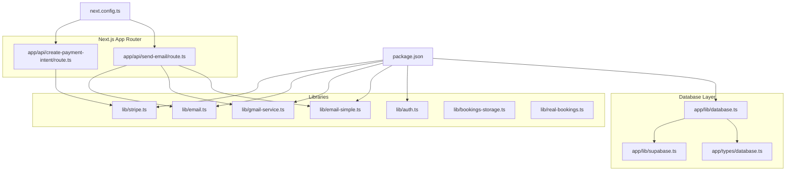
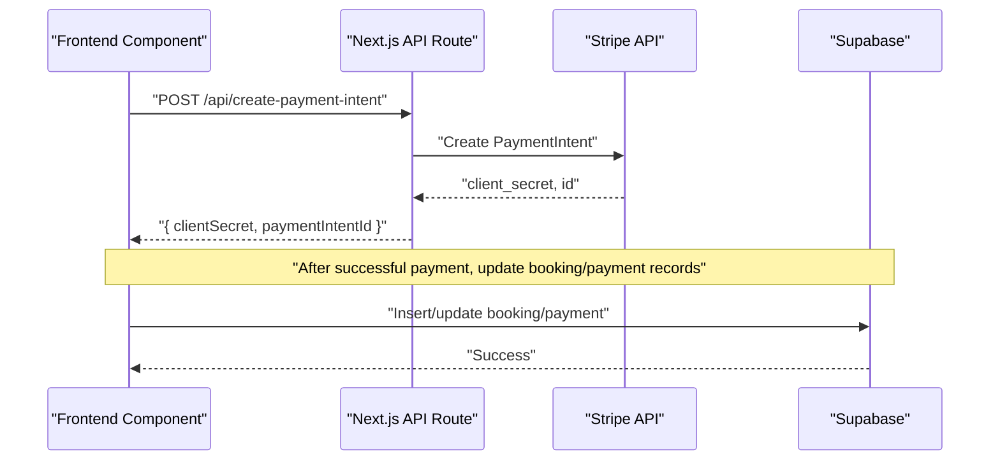
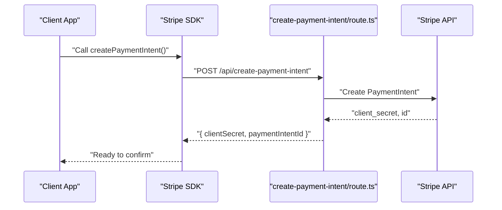
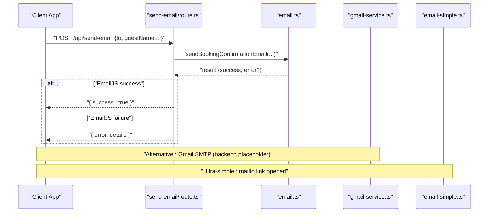
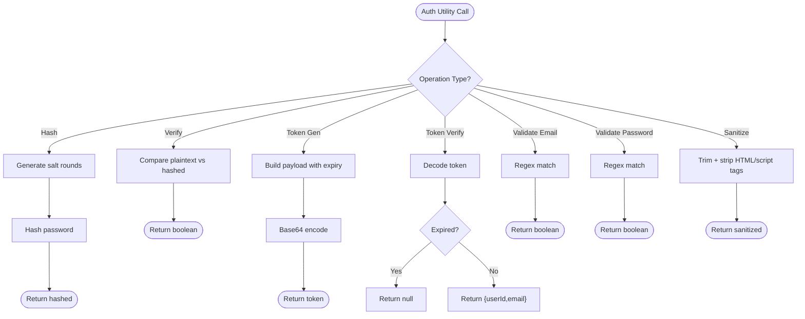
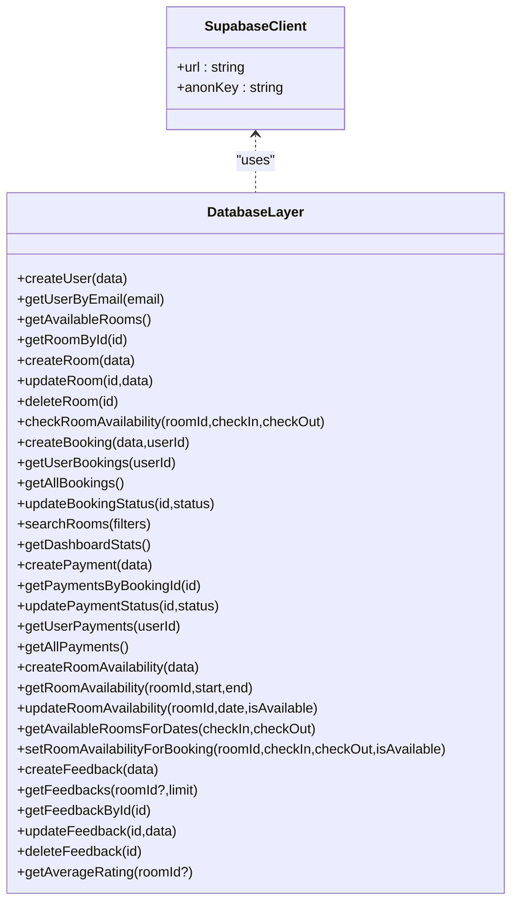
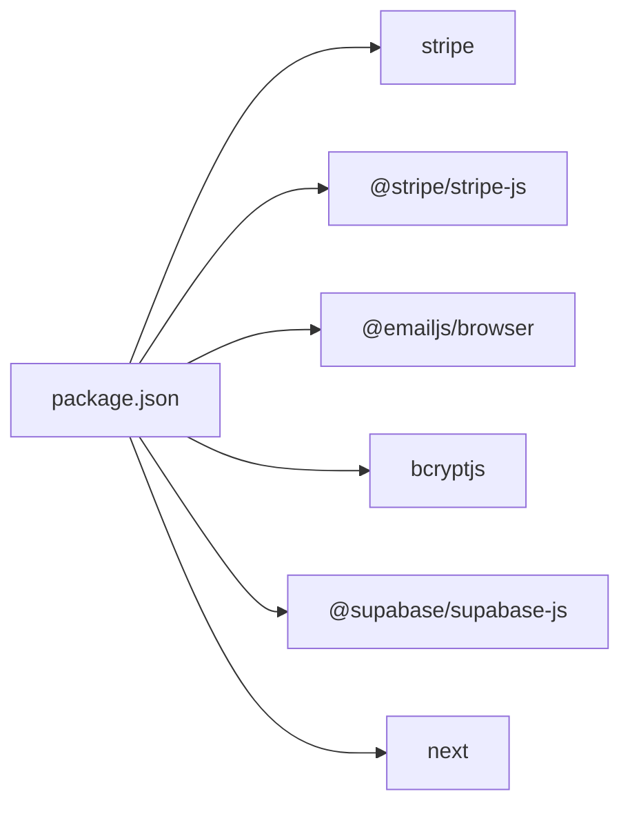

# Backend Services

<cite>
**Referenced Files in This Document**
- [app/api/create-payment-intent/route.ts](file://app/api/create-payment-intent/route.ts)
- [app/api/send-email/route.ts](file://app/api/send-email/route.ts)
- [lib/stripe.ts](file://lib/stripe.ts)
- [lib/email.ts](file://lib/email.ts)
- [lib/gmail-service.ts](file://lib/gmail-service.ts)
- [lib/email-simple.ts](file://lib/email-simple.ts)
- [lib/auth.ts](file://lib/auth.ts)
- [app/lib/database.ts](file://app/lib/database.ts)
- [app/lib/supabase.ts](file://app/lib/supabase.ts)
- [app/types/database.ts](file://app/types/database.ts)
- [lib/bookings-storage.ts](file://lib/bookings-storage.ts)
- [lib/real-bookings.ts](file://lib/real-bookings.ts)
- [package.json](file://package.json)
- [next.config.ts](file://next.config.ts)
- [app/layout.tsx](file://app/layout.tsx)
- [README.md](file://README.md)
</cite>

## Table of Contents
1. [Introduction](#introduction)
2. [Project Structure](#project-structure)
3. [Core Components](#core-components)
4. [Architecture Overview](#architecture-overview)
5. [Detailed Component Analysis](#detailed-component-analysis)
6. [Dependency Analysis](#dependency-analysis)
7. [Performance Considerations](#performance-considerations)
8. [Security Measures and Rate Limiting](#security-measures-and-rate-limiting)
9. [Troubleshooting Guide](#troubleshooting-guide)
10. [Conclusion](#conclusion)
11. [Appendices](#appendices)

## Introduction
This document describes the backend services powering the Pythonhostel application. It focuses on the Next.js App Router API routes, server-side request handling, response formatting, payment processing via Stripe, email notification architecture integrating EmailJS and Gmail SMTP, authentication and session utilities, and operational best practices such as security and rate limiting. The goal is to provide a clear understanding of how the backend components work together, with practical examples and integration patterns for frontend components.

## Project Structure
The backend is organized around Next.js App Router API routes under app/api, with shared libraries under lib and database access under app/lib. The Supabase client is configured centrally, and TypeScript types define the domain models.

**Diagram sources**
- [app/api/create-payment-intent/route.ts:1-33](file://app/api/create-payment-intent/route.ts#L1-L33)
- [app/api/send-email/route.ts:1-42](file://app/api/send-email/route.ts#L1-L42)
- [lib/stripe.ts:1-112](file://lib/stripe.ts#L1-L112)
- [lib/email.ts:1-75](file://lib/email.ts#L1-L75)
- [lib/gmail-service.ts:1-117](file://lib/gmail-service.ts#L1-L117)
- [lib/email-simple.ts:1-59](file://lib/email-simple.ts#L1-L59)
- [lib/auth.ts:1-57](file://lib/auth.ts#L1-L57)
- [app/lib/database.ts:1-433](file://app/lib/database.ts#L1-L433)
- [app/lib/supabase.ts:1-6](file://app/lib/supabase.ts#L1-L6)
- [app/types/database.ts:1-146](file://app/types/database.ts#L1-L146)
- [package.json:1-33](file://package.json#L1-L33)
- [next.config.ts:1-8](file://next.config.ts#L1-L8)

**Section sources**
- [README.md:1-37](file://README.md#L1-L37)
- [next.config.ts:1-8](file://next.config.ts#L1-L8)
- [app/layout.tsx:1-28](file://app/layout.tsx#L1-L28)

## Core Components
- Payment Processing Service (Stripe)
  - API route to create a payment intent and return client secret and payment intent identifier.
  - Frontend helpers to create intents, confirm payments, and redirect to Stripe Checkout.
- Email Notification Service
  - API route to send booking confirmation emails.
  - EmailJS integration for password reset and welcome emails.
  - Gmail SMTP service for sending real emails via backend (placeholder implementation).
  - Ultra-simple email sender using the Web mailto API.
- Authentication Utilities
  - Password hashing and verification, token generation/verification, input sanitization, and validation helpers.
- Database Access Layer
  - Supabase client initialization and typed CRUD operations for users, rooms, bookings, payments, availability, and feedback.
- Booking Storage Utilities
  - In-memory and localStorage-based booking storage for demos and testing.

**Section sources**
- [app/api/create-payment-intent/route.ts:1-33](file://app/api/create-payment-intent/route.ts#L1-L33)
- [lib/stripe.ts:1-112](file://lib/stripe.ts#L1-L112)
- [app/api/send-email/route.ts:1-42](file://app/api/send-email/route.ts#L1-L42)
- [lib/email.ts:1-75](file://lib/email.ts#L1-L75)
- [lib/gmail-service.ts:1-117](file://lib/gmail-service.ts#L1-L117)
- [lib/email-simple.ts:1-59](file://lib/email-simple.ts#L1-L59)
- [lib/auth.ts:1-57](file://lib/auth.ts#L1-L57)
- [app/lib/database.ts:1-433](file://app/lib/database.ts#L1-L433)
- [app/lib/supabase.ts:1-6](file://app/lib/supabase.ts#L1-L6)
- [lib/bookings-storage.ts:1-191](file://lib/bookings-storage.ts#L1-L191)
- [lib/real-bookings.ts:1-120](file://lib/real-bookings.ts#L1-L120)

## Architecture Overview
The backend follows a layered architecture:
- API routes handle HTTP requests and orchestrate service calls.
- Libraries encapsulate cross-cutting concerns (payments, emails, auth).
- Database layer abstracts Supabase operations with strong typing.
- Frontend integrates with API routes and Stripe SDK to process payments.

**Diagram sources**
- [app/api/create-payment-intent/route.ts:7-31](file://app/api/create-payment-intent/route.ts#L7-L31)
- [lib/stripe.ts:17-37](file://lib/stripe.ts#L17-L37)
- [app/lib/database.ts:92-118](file://app/lib/database.ts#L92-L118)

## Detailed Component Analysis

### Payment Processing Service (Stripe)
- API route: Creates a PaymentIntent using Stripe SDK with amount, currency, and metadata. Returns clientSecret and paymentIntentId.
- Frontend helpers:
  - createPaymentIntent: Sends amount/currency/metadata to the API route and parses the response.
  - formatAmountForStripe/formatAmountFromStripe: Convert between dollars and cents.
  - confirmPayment and createCheckoutSession: Additional helpers for advanced flows (currently commented placeholders in the library).
- Error handling:
  - API route catches errors and responds with structured JSON and HTTP 500.
  - Frontend helpers propagate errors and log them.

**Diagram sources**
- [lib/stripe.ts:17-37](file://lib/stripe.ts#L17-L37)
- [app/api/create-payment-intent/route.ts:7-24](file://app/api/create-payment-intent/route.ts#L7-L24)

**Section sources**
- [app/api/create-payment-intent/route.ts:1-33](file://app/api/create-payment-intent/route.ts#L1-L33)
- [lib/stripe.ts:1-112](file://lib/stripe.ts#L1-L112)

### Email Notification Service
- API route: Validates required fields and delegates to email service to send a booking confirmation email. Returns success or error with HTTP status.
- EmailJS integration:
  - sendPasswordResetEmail and sendWelcomeEmail: Prepare and send templated emails (placeholder for EmailJS SDK).
- Gmail SMTP service:
  - sendGmailEmail: Placeholder for backend nodemailer integration; currently opens a mailto link in the browser for demo.
- Ultra-simple email:
  - sendPasswordResetEmail: Opens the default mail client with pre-filled subject/body.
- Error handling:
  - API route returns structured error messages and HTTP 400/500 as appropriate.
  - Email functions return booleans indicating success/failure.

**Diagram sources**
- [app/api/send-email/route.ts:4-33](file://app/api/send-email/route.ts#L4-L33)
- [lib/email.ts:11-53](file://lib/email.ts#L11-L53)
- [lib/gmail-service.ts:9-68](file://lib/gmail-service.ts#L9-L68)
- [lib/email-simple.ts:4-41](file://lib/email-simple.ts#L4-L41)

**Section sources**
- [app/api/send-email/route.ts:1-42](file://app/api/send-email/route.ts#L1-L42)
- [lib/email.ts:1-75](file://lib/email.ts#L1-L75)
- [lib/gmail-service.ts:1-117](file://lib/gmail-service.ts#L1-L117)
- [lib/email-simple.ts:1-59](file://lib/email-simple.ts#L1-L59)

### Authentication Services and Session Management
- Password hashing and verification using bcrypt.
- Token generation and verification utilities (base64-encoded payload with expiration).
- Input validation for email and password strength.
- Input sanitization to remove script tags and HTML.
- Note: JWT library is not imported; token handling uses a custom scheme. For production, replace with a robust JWT library.

**Diagram sources**
- [lib/auth.ts:4-56](file://lib/auth.ts#L4-L56)

**Section sources**
- [lib/auth.ts:1-57](file://lib/auth.ts#L1-L57)

### Database Access Layer (Supabase)
- Supabase client initialized with project URL and anon key.
- Typed CRUD operations for:
  - Users: create, get by email
  - Rooms: list, get by id, create, update, delete
  - Bookings: create with computed total price, list user/all, update status
  - Payments: create, list by booking/user/all, update status
  - Availability: create, get range, update per date, bulk update for booking dates
  - Feedback: create, list, update, delete, average rating
- Search and dashboard statistics helpers.

**Diagram sources**
- [app/lib/supabase.ts:1-6](file://app/lib/supabase.ts#L1-L6)
- [app/lib/database.ts:1-433](file://app/lib/database.ts#L1-L433)

**Section sources**
- [app/lib/supabase.ts:1-6](file://app/lib/supabase.ts#L1-L6)
- [app/lib/database.ts:1-433](file://app/lib/database.ts#L1-L433)
- [app/types/database.ts:1-146](file://app/types/database.ts#L1-L146)

### Booking Storage Utilities
- In-memory bookings for demos (bookings-storage.ts).
- Persistent localStorage-based bookings (real-bookings.ts) for browser sessions.
- Stats and helpers for totals, revenue, and unique clients.

**Section sources**
- [lib/bookings-storage.ts:1-191](file://lib/bookings-storage.ts#L1-L191)
- [lib/real-bookings.ts:1-120](file://lib/real-bookings.ts#L1-L120)

## Dependency Analysis
External dependencies include Stripe SDK, @stripe/stripe-js, @emailjs/browser, bcryptjs, and @supabase/supabase-js. These are declared in package.json and enable payment processing, email services, authentication, and database connectivity.

**Diagram sources**
- [package.json:11-21](file://package.json#L11-L21)

**Section sources**
- [package.json:1-33](file://package.json#L1-L33)

## Performance Considerations
- Payment Intent Creation: Keep API route minimal; avoid heavy synchronous operations. Offload long-running tasks to background jobs if needed.
- Email Delivery: EmailJS and Gmail SMTP calls should be asynchronous. Consider retry policies and circuit breakers for external services.
- Database Queries: Use Supabase RPCs and joins judiciously. Add indexes on frequently queried columns (e.g., user_id, room_id, dates).
- Frontend Fetch Helpers: Implement caching for static data and debounced requests for search filters.

## Security Measures and Rate Limiting
- Input Validation and Sanitization: Use the provided validators and sanitizers for all user inputs.
- Token Handling: Replace the current token scheme with a robust JWT library and secure cookie/session storage for production.
- Secret Management: Never expose Stripe secret keys or Supabase keys in client-side code. Use environment variables and server-side routes.
- CORS and Headers: Configure appropriate CORS and Content-Security-Policy headers in Next.js.
- Rate Limiting: Implement rate limiting at the API gateway or middleware level to prevent abuse of payment and email endpoints.
- HTTPS and Secure Cookies: Enforce HTTPS and secure cookie attributes for session tokens.

[No sources needed since this section provides general guidance]

## Troubleshooting Guide
- Payment Intent Creation Failures
  - Verify Stripe secret key and network connectivity.
  - Inspect API route error logs for detailed failures.
  - Confirm amount formatting and currency support.
- Email Sending Issues
  - For EmailJS: Ensure serviceId, templateId, and public key are configured.
  - For Gmail SMTP: Implement backend nodemailer transport and handle credentials securely.
  - For mailto links: Confirm browser supports mailto protocol.
- Authentication Errors
  - Validate email/password regex and ensure bcrypt is installed.
  - Check token expiration and encoding/decoding logic.
- Database Errors
  - Review Supabase error responses and query constraints.
  - Ensure foreign keys and row-level security policies are aligned with application logic.

**Section sources**
- [app/api/create-payment-intent/route.ts:25-31](file://app/api/create-payment-intent/route.ts#L25-L31)
- [app/api/send-email/route.ts:34-40](file://app/api/send-email/route.ts#L34-L40)
- [lib/email.ts:34-44](file://lib/email.ts#L34-L44)
- [lib/gmail-service.ts:35-56](file://lib/gmail-service.ts#L35-L56)
- [lib/auth.ts:25-35](file://lib/auth.ts#L25-L35)
- [app/lib/database.ts:92-118](file://app/lib/database.ts#L92-L118)

## Conclusion
The Pythonhostel backend combines Next.js API routes with Stripe for payments, EmailJS/Gmail SMTP for notifications, and Supabase for data persistence. The provided libraries and utilities offer a solid foundation, but production deployments should incorporate robust JWT handling, secret management, rate limiting, and comprehensive error handling.

## Appendices

### API Endpoint Definitions
- POST /api/create-payment-intent
  - Request body: { amount: number, currency?: string, metadata?: Record<string, any> }
  - Response: { clientSecret: string, paymentIntentId: string }
  - Errors: 400 (invalid input), 500 (internal error)
- POST /api/send-email
  - Request body: { to: string, guestName: string, roomName: string, checkIn: string, checkOut: string, totalPrice: number, bookingId: string }
  - Response: { success: true } or { error: string, details?: string }
  - Errors: 400 (missing fields), 500 (internal error)

**Section sources**
- [app/api/create-payment-intent/route.ts:7-31](file://app/api/create-payment-intent/route.ts#L7-L31)
- [app/api/send-email/route.ts:4-40](file://app/api/send-email/route.ts#L4-L40)

### Frontend Integration Patterns
- Payment Flow
  - Use createPaymentIntent from lib/stripe.ts to obtain clientSecret and paymentIntentId.
  - Confirm payment on the client using Stripe SDK.
  - Update booking/payment records via Supabase after confirmation.
- Email Flow
  - Call /api/send-email with booking details.
  - Optionally integrate EmailJS or Gmail SMTP for automated delivery.
- Authentication Flow
  - Hash passwords before storing.
  - Generate secure tokens and manage sessions with secure cookies.

**Section sources**
- [lib/stripe.ts:17-37](file://lib/stripe.ts#L17-L37)
- [app/lib/database.ts:92-118](file://app/lib/database.ts#L92-L118)
- [lib/email.ts:11-53](file://lib/email.ts#L11-L53)
- [lib/gmail-service.ts:9-68](file://lib/gmail-service.ts#L9-L68)
- [lib/auth.ts:4-12](file://lib/auth.ts#L4-L12)