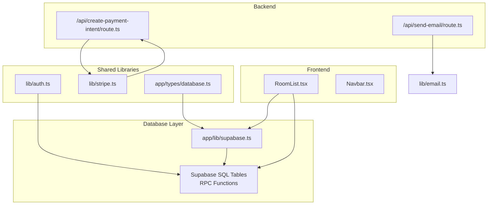
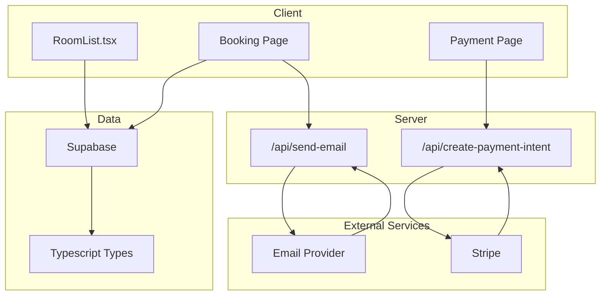
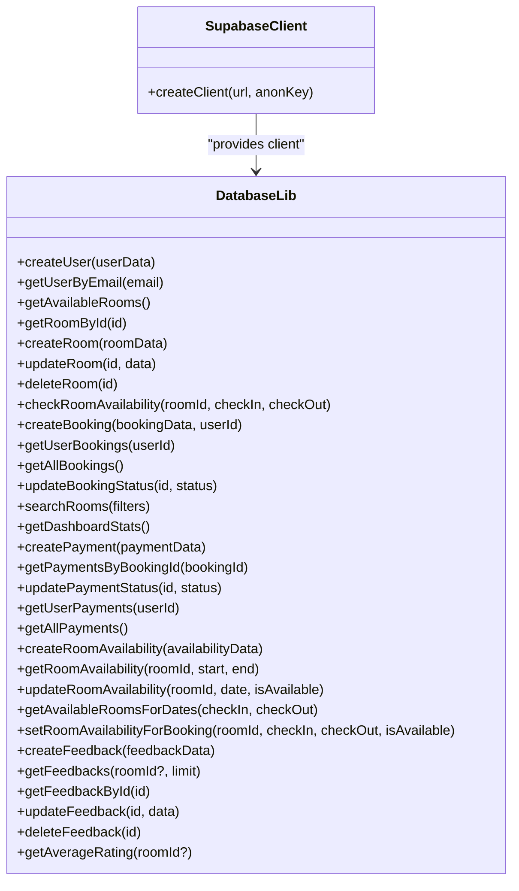
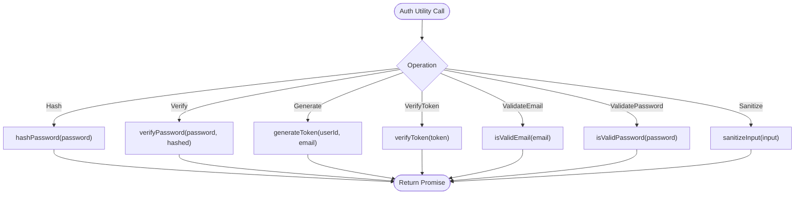
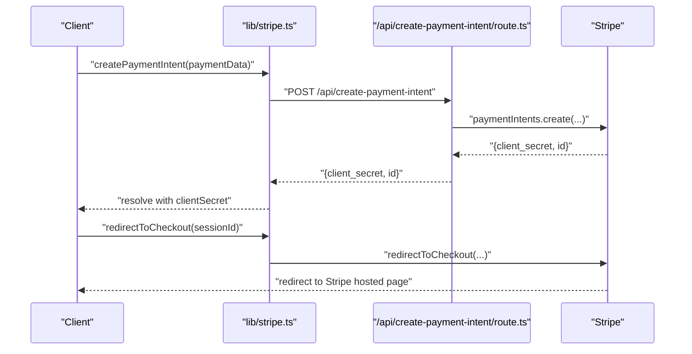
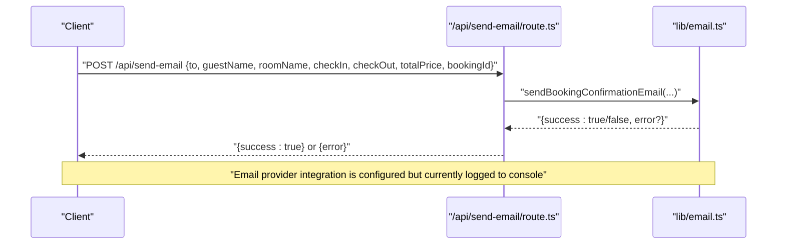
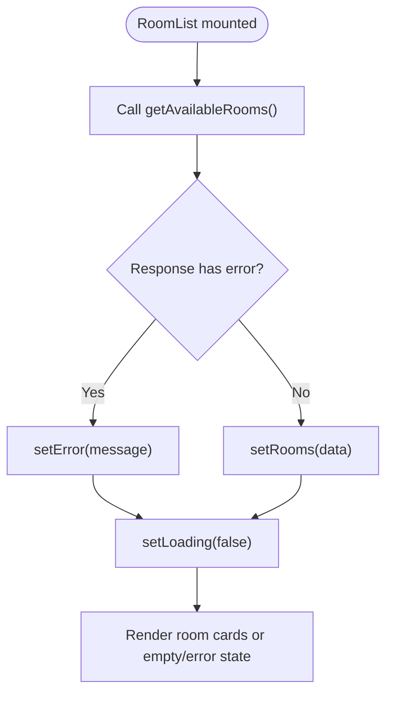
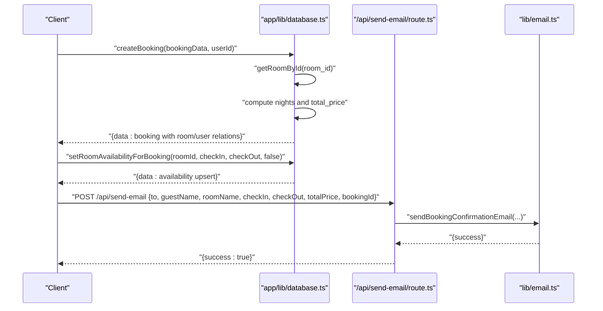
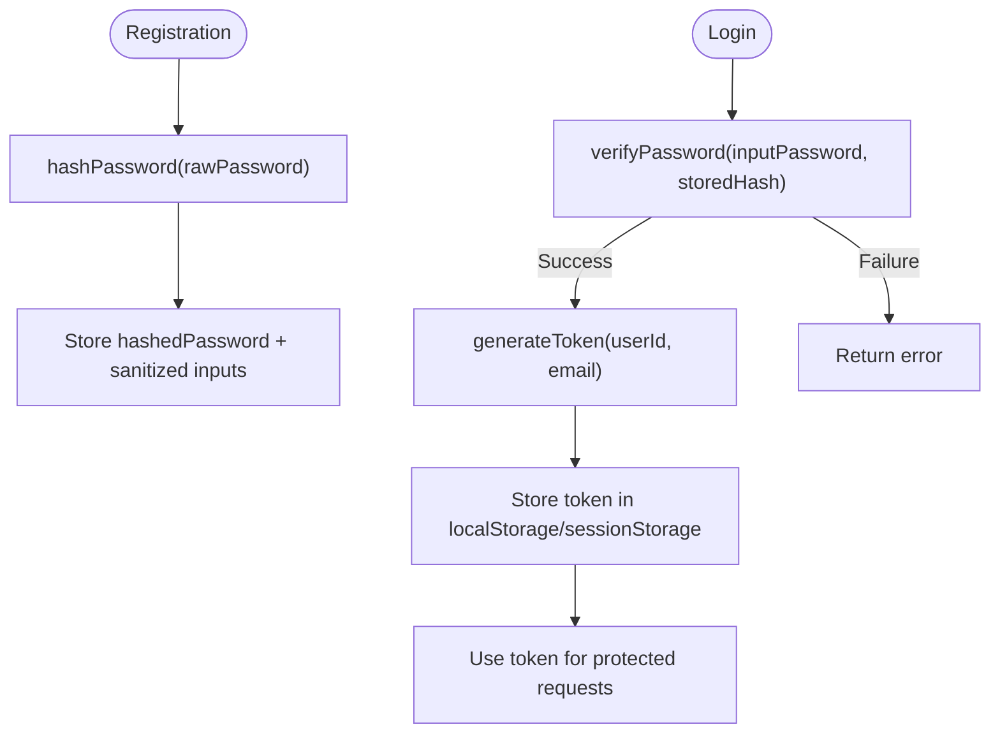
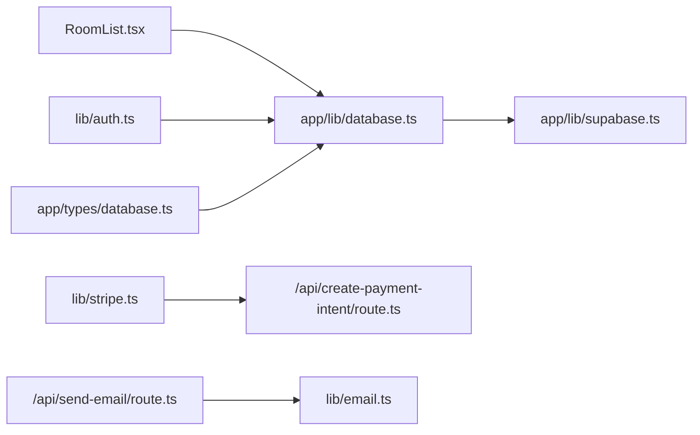

# Data Flow Patterns

<cite>
**Referenced Files in This Document**
- [supabase.ts](file://app/lib/supabase.ts)
- [database.ts](file://app/lib/database.ts)
- [auth.ts](file://lib/auth.ts)
- [stripe.ts](file://lib/stripe.ts)
- [create-payment-intent route.ts](file://app/api/create-payment-intent/route.ts)
- [send-email route.ts](file://app/api/send-email/route.ts)
- [email.ts](file://lib/email.ts)
- [RoomList.tsx](file://app/components/RoomList.tsx)
- [database types.ts](file://app/types/database.ts)
- [bookings-storage.ts](file://lib/bookings-storage.ts)
</cite>

## Table of Contents
1. [Introduction](#introduction)
2. [Project Structure](#project-structure)
3. [Core Components](#core-components)
4. [Architecture Overview](#architecture-overview)
5. [Detailed Component Analysis](#detailed-component-analysis)
6. [Dependency Analysis](#dependency-analysis)
7. [Performance Considerations](#performance-considerations)
8. [Troubleshooting Guide](#troubleshooting-guide)
9. [Conclusion](#conclusion)

## Introduction
This document describes the data flow architecture of the Pythonhostel application across frontend components, backend services, and the database layer. It explains real-time-like data synchronization via Supabase, state management patterns in React, and data persistence strategies. It documents the booking data flow from room selection through payment processing to confirmation, and the authentication data flow including user registration, login, session management, and JWT token handling. It also covers error propagation, data validation, and transaction management.

## Project Structure
The application follows a layered architecture:
- Frontend (Next.js App Router pages and client components)
- Backend (Next.js API routes)
- Shared libraries (authentication utilities, Stripe integration, Supabase client)
- Database (Supabase SQL tables and RPC functions)

**Diagram sources**
- [RoomList.tsx:1-113](file://app/components/RoomList.tsx#L1-L113)
- [create-payment-intent route.ts:1-33](file://app/api/create-payment-intent/route.ts#L1-L33)
- [send-email route.ts:1-42](file://app/api/send-email/route.ts#L1-L42)
- [auth.ts:1-57](file://lib/auth.ts#L1-L57)
- [stripe.ts:1-112](file://lib/stripe.ts#L1-L112)
- [database.ts:1-433](file://app/lib/database.ts#L1-L433)
- [supabase.ts:1-6](file://app/lib/supabase.ts#L1-L6)
- [database types.ts:1-146](file://app/types/database.ts#L1-L146)

**Section sources**
- [RoomList.tsx:1-113](file://app/components/RoomList.tsx#L1-L113)
- [create-payment-intent route.ts:1-33](file://app/api/create-payment-intent/route.ts#L1-L33)
- [send-email route.ts:1-42](file://app/api/send-email/route.ts#L1-L42)
- [auth.ts:1-57](file://lib/auth.ts#L1-L57)
- [stripe.ts:1-112](file://lib/stripe.ts#L1-L112)
- [database.ts:1-433](file://app/lib/database.ts#L1-L433)
- [supabase.ts:1-6](file://app/lib/supabase.ts#L1-L6)
- [database types.ts:1-146](file://app/types/database.ts#L1-L146)

## Core Components
- Supabase client initialization and database abstraction
- Authentication utilities (password hashing, token generation/verification, input sanitization)
- Stripe integration for payment intents and checkout sessions
- API routes for payment intent creation and email dispatch
- Frontend components for room listing and state management
- Types for database entities and API responses

Key responsibilities:
- Supabase client: central connection to Supabase for all reads/writes
- Database library: encapsulates CRUD and queries, including computed totals and availability checks
- Stripe library: client-side payment orchestration and server-backed intent creation
- API routes: secure server endpoints for sensitive operations (Stripe secret key, email sending)
- Frontend components: fetch data, manage loading/error states, and trigger actions

**Section sources**
- [supabase.ts:1-6](file://app/lib/supabase.ts#L1-L6)
- [database.ts:1-433](file://app/lib/database.ts#L1-L433)
- [auth.ts:1-57](file://lib/auth.ts#L1-L57)
- [stripe.ts:1-112](file://lib/stripe.ts#L1-L112)
- [create-payment-intent route.ts:1-33](file://app/api/create-payment-intent/route.ts#L1-L33)
- [send-email route.ts:1-42](file://app/api/send-email/route.ts#L1-L42)
- [RoomList.tsx:1-113](file://app/components/RoomList.tsx#L1-L113)
- [database types.ts:1-146](file://app/types/database.ts#L1-L146)

## Architecture Overview
The system integrates React components with Supabase for data persistence and Stripe for payments. Authentication is handled with local utilities and tokens, while email notifications are triggered via API routes.

**Diagram sources**
- [RoomList.tsx:1-113](file://app/components/RoomList.tsx#L1-L113)
- [create-payment-intent route.ts:1-33](file://app/api/create-payment-intent/route.ts#L1-L33)
- [send-email route.ts:1-42](file://app/api/send-email/route.ts#L1-L42)
- [stripe.ts:1-112](file://lib/stripe.ts#L1-L112)
- [email.ts:1-75](file://lib/email.ts#L1-L75)
- [database.ts:1-433](file://app/lib/database.ts#L1-L433)
- [database types.ts:1-146](file://app/types/database.ts#L1-L146)

## Detailed Component Analysis

### Data Access Layer (Supabase)
The database abstraction layer centralizes all database operations and relationships. It handles:
- Users, Rooms, Bookings, Payments, Room Availability, and Feedback
- Computed fields (e.g., total price derived from nights and room price)
- Complex queries (e.g., availability checks via RPC, availability upsert for booking periods)
- Aggregations (e.g., dashboard statistics)

**Diagram sources**
- [supabase.ts:1-6](file://app/lib/supabase.ts#L1-L6)
- [database.ts:1-433](file://app/lib/database.ts#L1-L433)

**Section sources**
- [supabase.ts:1-6](file://app/lib/supabase.ts#L1-L6)
- [database.ts:1-433](file://app/lib/database.ts#L1-L433)

### Authentication Utilities
Authentication utilities provide:
- Password hashing and verification
- Token generation and verification (simple base64-encoded payload with expiration)
- Input validation (email/password format)
- Input sanitization

**Diagram sources**
- [auth.ts:1-57](file://lib/auth.ts#L1-L57)

**Section sources**
- [auth.ts:1-57](file://lib/auth.ts#L1-L57)

### Payment Flow (Stripe)
The payment flow uses a client-side library to communicate with a server-side API route that creates Stripe PaymentIntents. The client confirms and redirects to Stripe Checkout.

**Diagram sources**
- [stripe.ts:1-112](file://lib/stripe.ts#L1-L112)
- [create-payment-intent route.ts:1-33](file://app/api/create-payment-intent/route.ts#L1-L33)

**Section sources**
- [stripe.ts:1-112](file://lib/stripe.ts#L1-L112)
- [create-payment-intent route.ts:1-33](file://app/api/create-payment-intent/route.ts#L1-L33)

### Email Notification Flow
The email notification flow is triggered from the frontend booking process and handled by a server route that invokes an email service.

**Diagram sources**
- [send-email route.ts:1-42](file://app/api/send-email/route.ts#L1-L42)
- [email.ts:1-75](file://lib/email.ts#L1-L75)

**Section sources**
- [send-email route.ts:1-42](file://app/api/send-email/route.ts#L1-L42)
- [email.ts:1-75](file://lib/email.ts#L1-L75)

### Frontend Data Fetching and State Management
The RoomList component demonstrates fetching available rooms, managing loading and error states, and rendering room cards with links to the booking page.

**Diagram sources**
- [RoomList.tsx:1-113](file://app/components/RoomList.tsx#L1-L113)
- [database.ts:26-34](file://app/lib/database.ts#L26-L34)

**Section sources**
- [RoomList.tsx:1-113](file://app/components/RoomList.tsx#L1-L113)
- [database.ts:26-34](file://app/lib/database.ts#L26-L34)

### Booking Data Flow
The booking flow computes total price based on room price and nights, persists the booking with related user and room data, updates room availability for the stay period, and triggers email confirmation.

**Diagram sources**
- [database.ts:92-119](file://app/lib/database.ts#L92-L119)
- [database.ts:333-354](file://app/lib/database.ts#L333-L354)
- [send-email route.ts:1-42](file://app/api/send-email/route.ts#L1-L42)
- [email.ts:1-75](file://lib/email.ts#L1-L75)

**Section sources**
- [database.ts:92-119](file://app/lib/database.ts#L92-L119)
- [database.ts:333-354](file://app/lib/database.ts#L333-L354)
- [send-email route.ts:1-42](file://app/api/send-email/route.ts#L1-L42)
- [email.ts:1-75](file://lib/email.ts#L1-L75)

### Authentication Data Flow
Authentication utilities support password hashing, token generation/verification, and input validation. These utilities can be integrated with session storage or cookies for client-side session management.

**Diagram sources**
- [auth.ts:1-57](file://lib/auth.ts#L1-L57)

**Section sources**
- [auth.ts:1-57](file://lib/auth.ts#L1-L57)

### Data Persistence Strategies
- Supabase ORM-style methods return structured responses with data and error fields, enabling centralized error handling.
- Computed fields (e.g., total price) are calculated in the database layer before insertion.
- Upsert operations maintain consistency for room availability during booking periods.
- Aggregation functions compute dashboard metrics client-side after fetching raw data.

**Section sources**
- [database.ts:92-119](file://app/lib/database.ts#L92-L119)
- [database.ts:333-354](file://app/lib/database.ts#L333-L354)
- [database.ts:184-212](file://app/lib/database.ts#L184-L212)

### Transaction Management
- Supabase operations return single-row results for insert/update/select, simplifying transaction semantics.
- For multi-row updates (e.g., availability upsert), the library performs batch upserts to maintain atomicity per operation.
- Payment processing is coordinated server-side to avoid exposing secret keys in the client.

**Section sources**
- [database.ts:333-354](file://app/lib/database.ts#L333-L354)
- [create-payment-intent route.ts:1-33](file://app/api/create-payment-intent/route.ts#L1-L33)

## Dependency Analysis
The following diagram shows key dependencies among components and libraries.

**Diagram sources**
- [RoomList.tsx:1-113](file://app/components/RoomList.tsx#L1-L113)
- [database.ts:1-433](file://app/lib/database.ts#L1-L433)
- [supabase.ts:1-6](file://app/lib/supabase.ts#L1-L6)
- [stripe.ts:1-112](file://lib/stripe.ts#L1-L112)
- [create-payment-intent route.ts:1-33](file://app/api/create-payment-intent/route.ts#L1-L33)
- [send-email route.ts:1-42](file://app/api/send-email/route.ts#L1-L42)
- [email.ts:1-75](file://lib/email.ts#L1-L75)
- [auth.ts:1-57](file://lib/auth.ts#L1-L57)
- [database types.ts:1-146](file://app/types/database.ts#L1-L146)

**Section sources**
- [RoomList.tsx:1-113](file://app/components/RoomList.tsx#L1-L113)
- [database.ts:1-433](file://app/lib/database.ts#L1-L433)
- [supabase.ts:1-6](file://app/lib/supabase.ts#L1-L6)
- [stripe.ts:1-112](file://lib/stripe.ts#L1-L112)
- [create-payment-intent route.ts:1-33](file://app/api/create-payment-intent/route.ts#L1-L33)
- [send-email route.ts:1-42](file://app/api/send-email/route.ts#L1-L42)
- [email.ts:1-75](file://lib/email.ts#L1-L75)
- [auth.ts:1-57](file://lib/auth.ts#L1-L57)
- [database types.ts:1-146](file://app/types/database.ts#L1-L146)

## Performance Considerations
- Minimize redundant queries by batching and caching where appropriate in the frontend.
- Use Supabase select with relations judiciously to avoid heavy joins; prefer denormalized selects for read-heavy UIs.
- Compute derived fields server-side (e.g., total price) to reduce client computation overhead.
- Limit result sets with ordering and pagination for large datasets (already used for bookings and rooms).
- Offload heavy computations to database functions (e.g., availability checks via RPC).

## Troubleshooting Guide
Common issues and resolutions:
- Database errors: Inspect returned error objects from database functions and surface user-friendly messages in components.
- Payment intent creation failures: Validate amount/currency/metadata and check server logs for Stripe API errors.
- Email delivery failures: Confirm API route receives required fields and review email service logs.
- Authentication token expiry: Implement token refresh or re-login flow when verifyToken returns null.

**Section sources**
- [database.ts:1-433](file://app/lib/database.ts#L1-L433)
- [create-payment-intent route.ts:1-33](file://app/api/create-payment-intent/route.ts#L1-L33)
- [send-email route.ts:1-42](file://app/api/send-email/route.ts#L1-L42)
- [auth.ts:24-35](file://lib/auth.ts#L24-L35)

## Conclusion
The Pythonhostel application employs a clean separation of concerns across frontend, backend, and database layers. Supabase provides robust data access with typed relations, while Stripe enables secure payment processing through server-backed intents. Authentication utilities offer strong validation and token handling. The documented flows illustrate how data moves from UI interactions through backend services to persistent storage, ensuring predictable behavior and maintainable code.