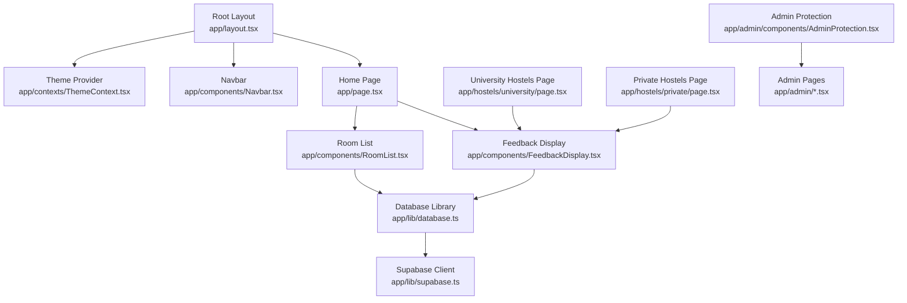
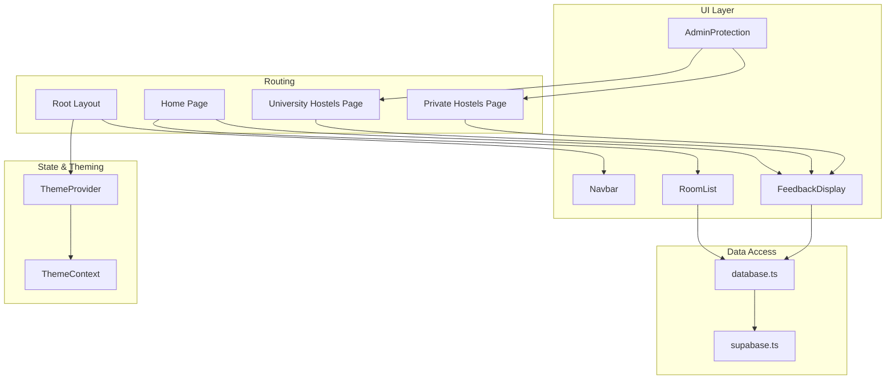
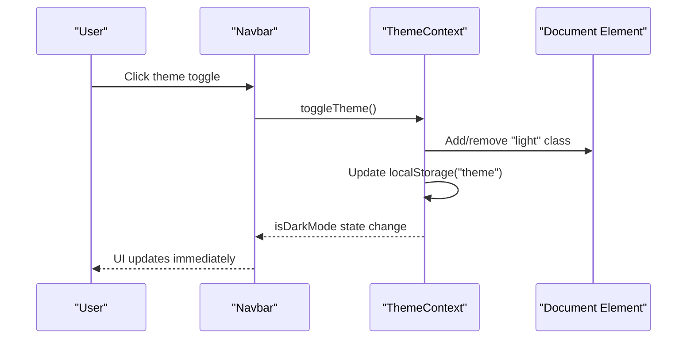
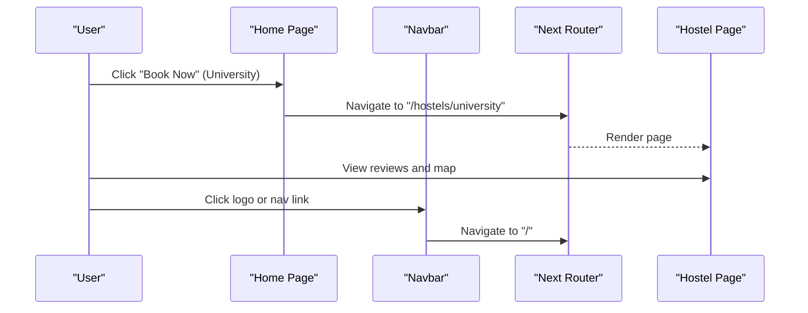
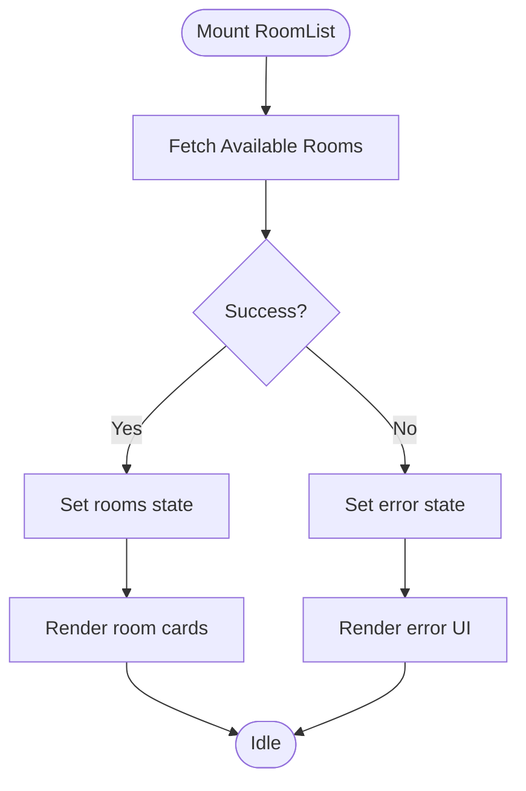
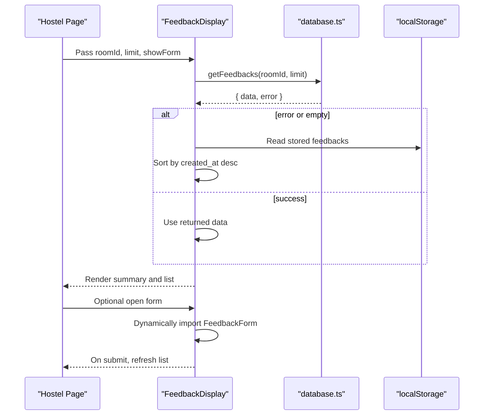
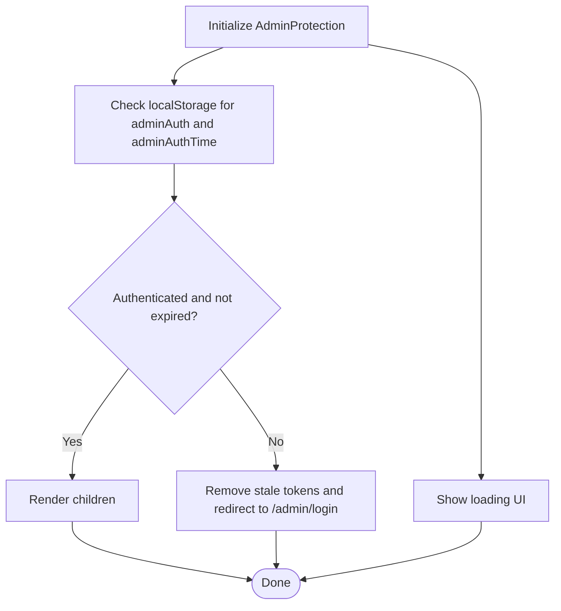
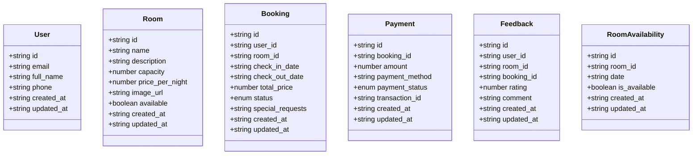
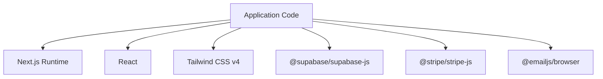

# Frontend Architecture

<cite>
**Referenced Files in This Document**
- [layout.tsx](file://app/layout.tsx)
- [page.tsx](file://app/page.tsx)
- [ThemeContext.tsx](file://app/contexts/ThemeContext.tsx)
- [Navbar.tsx](file://app/components/Navbar.tsx)
- [RoomList.tsx](file://app/components/RoomList.tsx)
- [FeedbackDisplay.tsx](file://app/components/FeedbackDisplay.tsx)
- [AdminProtection.tsx](file://app/admin/components/AdminProtection.tsx)
- [university/page.tsx](file://app/hostels/university/page.tsx)
- [private/page.tsx](file://app/hostels/private/page.tsx)
- [database.ts](file://app/lib/database.ts)
- [supabase.ts](file://app/lib/supabase.ts)
- [database.ts](file://app/types/database.ts)
- [globals.css](file://app/globals.css)
- [package.json](file://package.json)
- [next.config.ts](file://next.config.ts)
</cite>

## Table of Contents
1. [Introduction](#introduction)
2. [Project Structure](#project-structure)
3. [Core Components](#core-components)
4. [Architecture Overview](#architecture-overview)
5. [Detailed Component Analysis](#detailed-component-analysis)
6. [Dependency Analysis](#dependency-analysis)
7. [Performance Considerations](#performance-considerations)
8. [Troubleshooting Guide](#troubleshooting-guide)
9. [Conclusion](#conclusion)

## Introduction
This document describes the frontend architecture of the Pythonhostel application built with Next.js App Router. It covers the file-based routing model, component hierarchy, React patterns with TypeScript, state management via ThemeContext, theme system, responsive design, navigation flow, client-side state management, component lifecycle, and integration with backend services through Supabase. It also outlines performance strategies and provides usage patterns for key components.

## Project Structure
The application follows Next.js App Router conventions with a strict file-based routing model. Pages are defined under the app directory, and nested routes are created by adding page.tsx files in subfolders. Shared UI and state are centralized in components and contexts, while global styles and theme tokens live in globals.css.

Key structural highlights:
- Root layout wraps all pages with ThemeProvider and Navbar, establishing global theme and navigation.
- Feature-specific pages (e.g., hostels, admin) are organized under dedicated folders.
- Reusable components are placed under app/components and shared types under app/types.
- Data access is encapsulated in app/lib/database.ts, which uses Supabase client configured in app/lib/supabase.ts.

**Diagram sources**
- [layout.tsx:11-28](file://app/layout.tsx#L11-L28)
- [ThemeContext.tsx:11-49](file://app/contexts/ThemeContext.tsx#L11-L49)
- [Navbar.tsx:5-35](file://app/components/Navbar.tsx#L5-L35)
- [page.tsx:7-149](file://app/page.tsx#L7-L149)
- [RoomList.tsx:7-113](file://app/components/RoomList.tsx#L7-L113)
- [FeedbackDisplay.tsx:12-155](file://app/components/FeedbackDisplay.tsx#L12-L155)
- [university/page.tsx:5-71](file://app/hostels/university/page.tsx#L5-L71)
- [private/page.tsx:5-71](file://app/hostels/private/page.tsx#L5-L71)
- [AdminProtection.tsx:9-69](file://app/admin/components/AdminProtection.tsx#L9-L69)
- [database.ts:1-433](file://app/lib/database.ts#L1-L433)
- [supabase.ts:1-6](file://app/lib/supabase.ts#L1-L6)

**Section sources**
- [layout.tsx:11-28](file://app/layout.tsx#L11-L28)
- [page.tsx:7-149](file://app/page.tsx#L7-L149)
- [university/page.tsx:5-71](file://app/hostels/university/page.tsx#L5-L71)
- [private/page.tsx:5-71](file://app/hostels/private/page.tsx#L5-L71)
- [AdminProtection.tsx:9-69](file://app/admin/components/AdminProtection.tsx#L9-L69)
- [database.ts:1-433](file://app/lib/database.ts#L1-L433)
- [supabase.ts:1-6](file://app/lib/supabase.ts#L1-L6)

## Core Components
- Root Layout: Provides global HTML wrapper, metadata, and composes ThemeProvider and Navbar around page content.
- ThemeContext: Centralized theme state with persistence in localStorage and DOM class toggling for light/dark modes.
- Navbar: Fixed header with navigation links and theme toggle button.
- RoomList: Fetches and renders available rooms, handles loading and error states.
- FeedbackDisplay: Loads feedbacks from Supabase with localStorage fallback, supports dynamic form loading, and shows ratings.
- AdminProtection: Guards admin routes with session checks and redirects.
- Hostel Pages: Render hostel listings and integrate FeedbackDisplay with room-specific filtering.

**Section sources**
- [layout.tsx:11-28](file://app/layout.tsx#L11-L28)
- [ThemeContext.tsx:11-59](file://app/contexts/ThemeContext.tsx#L11-L59)
- [Navbar.tsx:5-35](file://app/components/Navbar.tsx#L5-L35)
- [RoomList.tsx:7-113](file://app/components/RoomList.tsx#L7-L113)
- [FeedbackDisplay.tsx:12-155](file://app/components/FeedbackDisplay.tsx#L12-L155)
- [AdminProtection.tsx:9-69](file://app/admin/components/AdminProtection.tsx#L9-L69)
- [university/page.tsx:5-71](file://app/hostels/university/page.tsx#L5-L71)
- [private/page.tsx:5-71](file://app/hostels/private/page.tsx#L5-L71)

## Architecture Overview
The frontend architecture centers on:
- Next.js App Router for file-based routing and page composition.
- React Server Components at the root level with client components for interactivity.
- ThemeContext for global theme state and persistence.
- Tailwind CSS with CSS variables for responsive design and theme tokens.
- Supabase client for backend integration via typed database functions.

**Diagram sources**
- [layout.tsx:11-28](file://app/layout.tsx#L11-L28)
- [ThemeContext.tsx:11-49](file://app/contexts/ThemeContext.tsx#L11-L49)
- [Navbar.tsx:5-35](file://app/components/Navbar.tsx#L5-L35)
- [RoomList.tsx:7-113](file://app/components/RoomList.tsx#L7-L113)
- [FeedbackDisplay.tsx:12-155](file://app/components/FeedbackDisplay.tsx#L12-L155)
- [university/page.tsx:5-71](file://app/hostels/university/page.tsx#L5-L71)
- [private/page.tsx:5-71](file://app/hostels/private/page.tsx#L5-L71)
- [AdminProtection.tsx:9-69](file://app/admin/components/AdminProtection.tsx#L9-L69)
- [database.ts:1-433](file://app/lib/database.ts#L1-L433)
- [supabase.ts:1-6](file://app/lib/supabase.ts#L1-L6)

## Detailed Component Analysis

### Theme System and Global Styles
The theme system uses a React context provider to manage dark/light mode, persist preferences in localStorage, and toggle a CSS class on the document element. Global CSS defines CSS variables for colors, typography, shadows, and utility classes. The Navbar reads theme state to render appropriate icons and actions.

**Diagram sources**
- [Navbar.tsx:23-29](file://app/components/Navbar.tsx#L23-L29)
- [ThemeContext.tsx:27-38](file://app/contexts/ThemeContext.tsx#L27-L38)

**Section sources**
- [ThemeContext.tsx:11-59](file://app/contexts/ThemeContext.tsx#L11-L59)
- [Navbar.tsx:5-35](file://app/components/Navbar.tsx#L5-L35)
- [globals.css:32-99](file://app/globals.css#L32-L99)

### Navigation Flow and Page Transitions
Navigation relies on Next.js Link components for client-side navigation. The Root Layout ensures Navbar is present on all pages. The Home page composes multiple sections and uses Links to navigate to hostel pages and booking flows. There is no explicit page transition animation in the current code; transitions would require additional libraries or custom implementations.

**Diagram sources**
- [page.tsx:65-71](file://app/page.tsx#L65-L71)
- [university/page.tsx:39-41](file://app/hostels/university/page.tsx#L39-L41)
- [layout.tsx:11-28](file://app/layout.tsx#L11-L28)

**Section sources**
- [page.tsx:7-149](file://app/page.tsx#L7-L149)
- [university/page.tsx:5-71](file://app/hostels/university/page.tsx#L5-L71)
- [private/page.tsx:5-71](file://app/hostels/private/page.tsx#L5-L71)
- [layout.tsx:11-28](file://app/layout.tsx#L11-L28)

### Room Listing and Client-Side State Management
RoomList fetches available rooms on mount, manages loading and error states, and renders cards with availability and booking actions. It uses the database library to query Supabase and displays a fallback UI when loading or encountering errors.

**Diagram sources**
- [RoomList.tsx:12-26](file://app/components/RoomList.tsx#L12-L26)
- [RoomList.tsx:54-112](file://app/components/RoomList.tsx#L54-L112)

**Section sources**
- [RoomList.tsx:7-113](file://app/components/RoomList.tsx#L7-L113)
- [database.ts:25-34](file://app/lib/database.ts#L25-L34)

### Feedback System with Fallback and Dynamic Loading
FeedbackDisplay loads feedbacks from Supabase with optional room filtering and limit. On database error, it falls back to localStorage, sorts by recency, and renders stars and summaries. It conditionally renders a write review button and dynamically imports the form component to avoid circular dependencies.

**Diagram sources**
- [FeedbackDisplay.tsx:21-52](file://app/components/FeedbackDisplay.tsx#L21-L52)
- [FeedbackDisplay.tsx:142-154](file://app/components/FeedbackDisplay.tsx#L142-L154)
- [database.ts:367-381](file://app/lib/database.ts#L367-L381)

**Section sources**
- [FeedbackDisplay.tsx:12-155](file://app/components/FeedbackDisplay.tsx#L12-L155)
- [university/page.tsx:66](file://app/hostels/university/page.tsx#L66)
- [private/page.tsx:66](file://app/hostels/private/page.tsx#L66)
- [database.ts:367-381](file://app/lib/database.ts#L367-L381)

### Admin Route Protection
AdminProtection performs client-side authentication checks using localStorage timestamps and redirects unauthenticated or expired sessions to the login page. It renders a loading state during initialization.

**Diagram sources**
- [AdminProtection.tsx:17-49](file://app/admin/components/AdminProtection.tsx#L17-L49)

**Section sources**
- [AdminProtection.tsx:9-69](file://app/admin/components/AdminProtection.tsx#L9-L69)

### TypeScript Interfaces and Data Contracts
The application defines robust TypeScript interfaces for database entities and API responses. These types are consumed by components and database functions to ensure type-safe data handling.

**Diagram sources**
- [database.ts:3-146](file://app/types/database.ts#L3-L146)

**Section sources**
- [database.ts:3-146](file://app/types/database.ts#L3-L146)

## Dependency Analysis
External dependencies include Next.js, React, Tailwind CSS v4, Supabase client, Stripe, and EmailJS. The project uses TypeScript and ESLint. The Supabase client is initialized once and reused across database functions.

**Diagram sources**
- [package.json:11-21](file://package.json#L11-L21)

**Section sources**
- [package.json:11-33](file://package.json#L11-L33)
- [supabase.ts:1-6](file://app/lib/supabase.ts#L1-L6)

## Performance Considerations
- Client components are marked appropriately to minimize server rendering overhead.
- Dynamic imports are used for heavy components (e.g., FeedbackForm) to reduce initial bundle size.
- Lazy loading is applied to images in hostel pages.
- CSS variables and Tailwind utilities enable efficient styling with minimal runtime cost.
- LocalStorage fallback reduces reliance on network latency for feedback retrieval.
- Consider adding caching strategies for repeated queries and implementing pagination for large datasets.

[No sources needed since this section provides general guidance]

## Troubleshooting Guide
Common issues and resolutions:
- Theme not persisting: Verify localStorage keys and document class toggling in ThemeContext.
- Navigation flicker: Ensure client directives are present on interactive components.
- Supabase errors: Confirm credentials and network connectivity; fallback logic in FeedbackDisplay mitigates partial failures.
- Admin redirect loops: Check localStorage timestamps and SESSION_TIMEOUT logic in AdminProtection.

**Section sources**
- [ThemeContext.tsx:15-38](file://app/contexts/ThemeContext.tsx#L15-L38)
- [AdminProtection.tsx:14-49](file://app/admin/components/AdminProtection.tsx#L14-L49)
- [FeedbackDisplay.tsx:26-50](file://app/components/FeedbackDisplay.tsx#L26-L50)

## Conclusion
The Pythonhostel frontend leverages Next.js App Router for structured routing, React with TypeScript for type-safe components, and a centralized ThemeContext for theme management. Supabase integration is encapsulated in a dedicated library, and Tailwind CSS provides a responsive, theme-driven design system. The architecture balances modularity, reusability, and maintainability, with clear patterns for data fetching, error handling, and client-side state management.