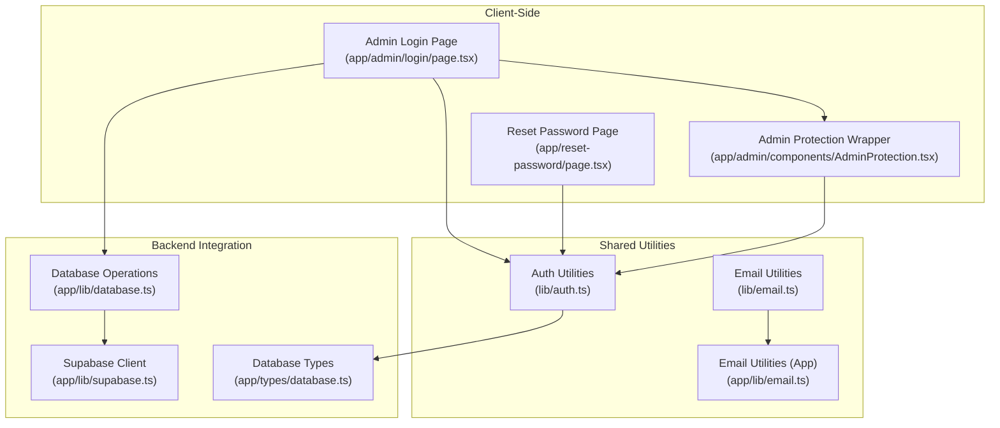
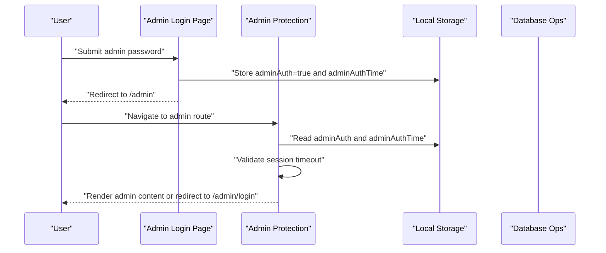
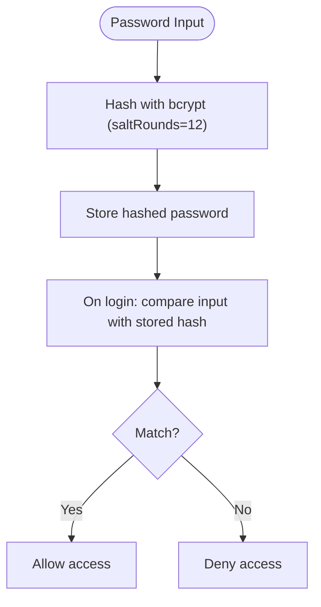
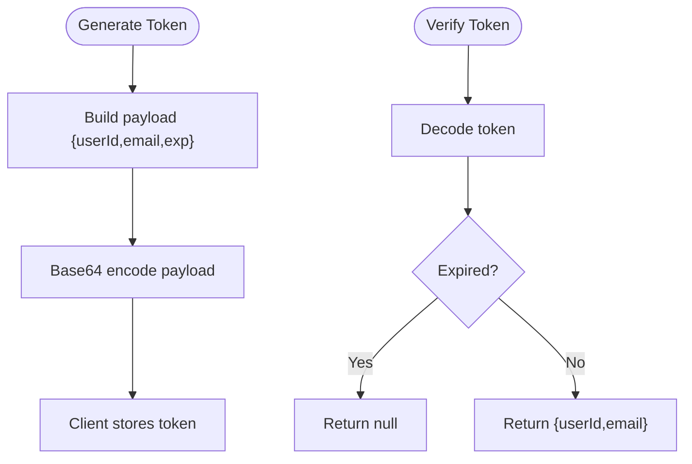
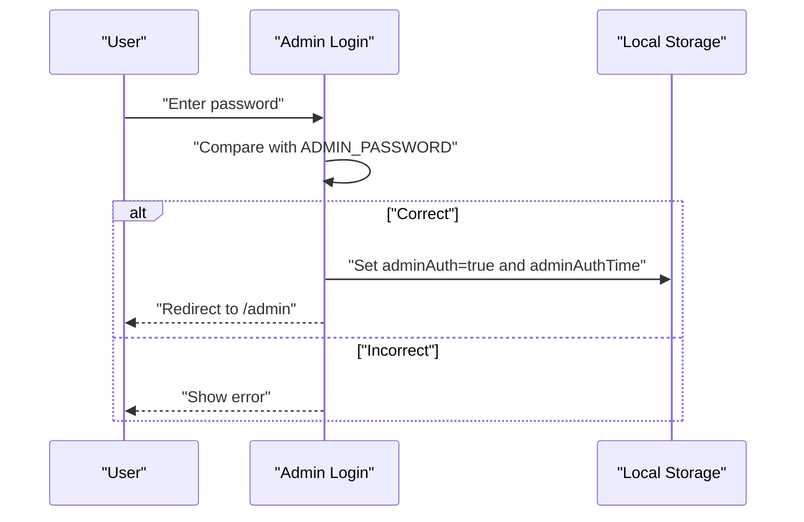
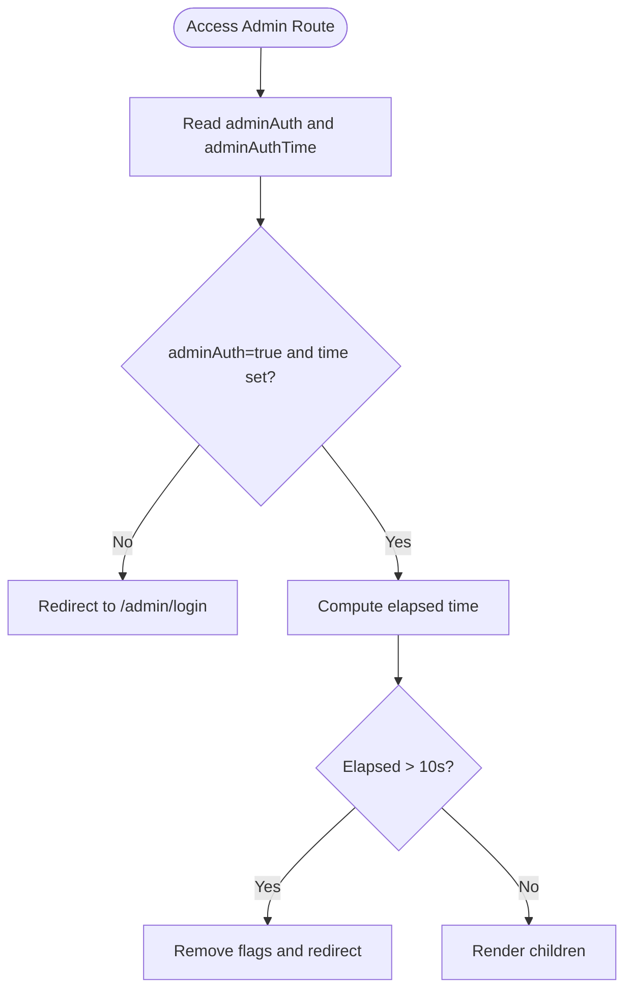
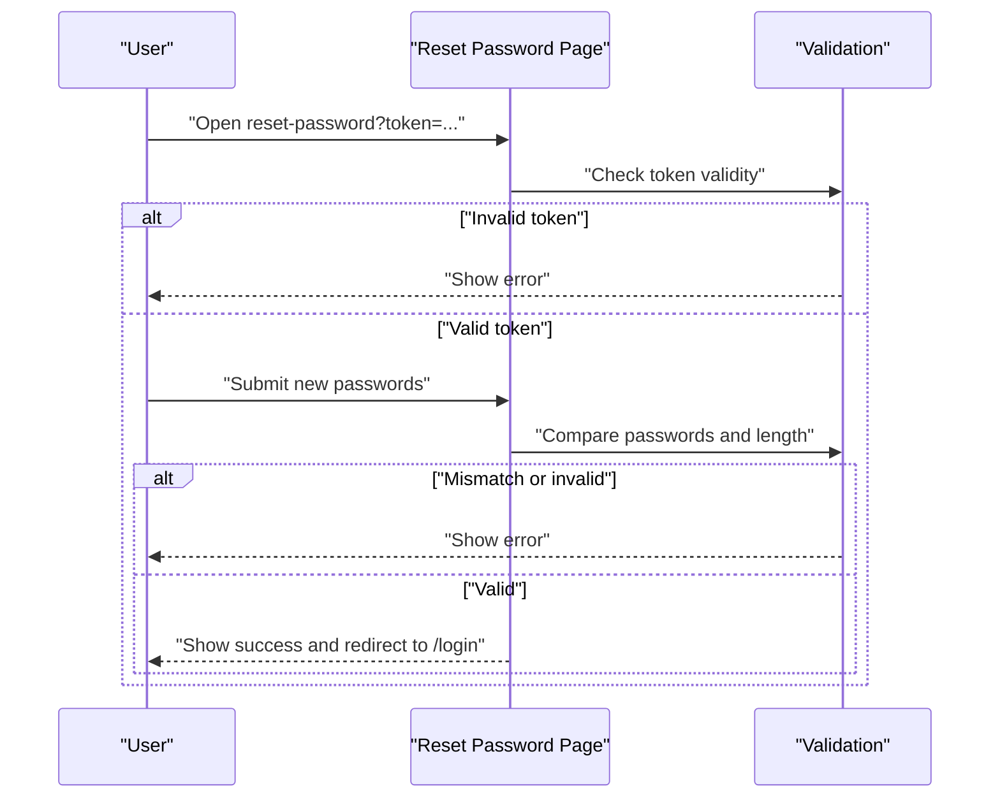
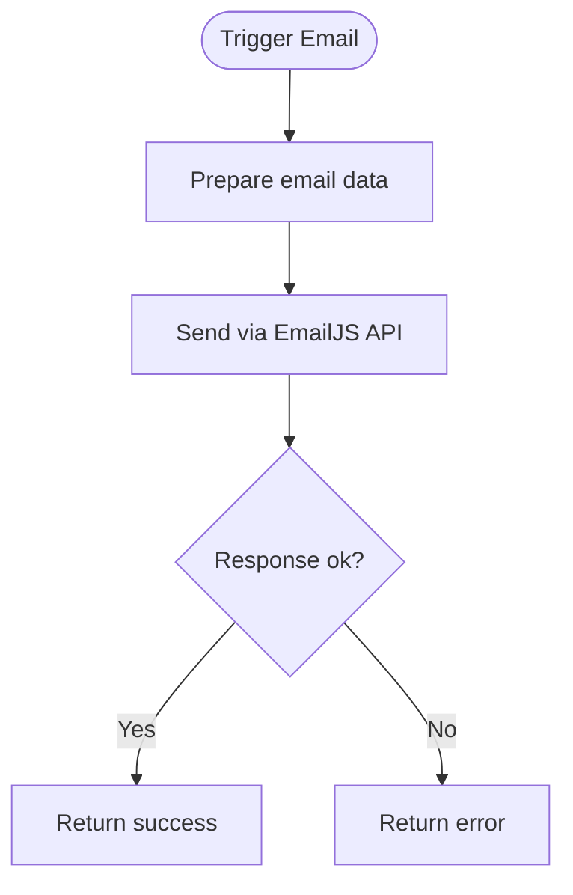
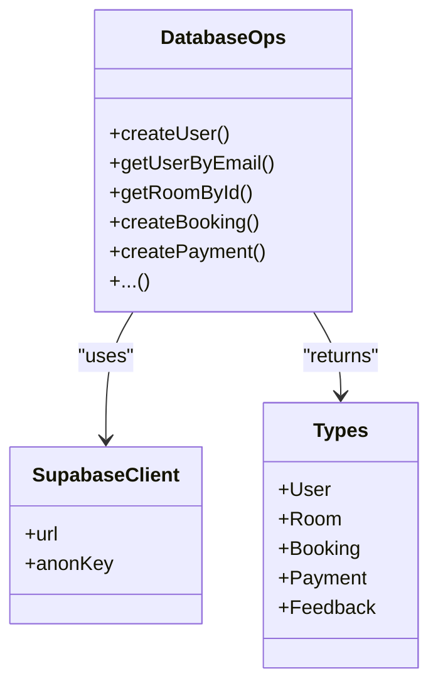
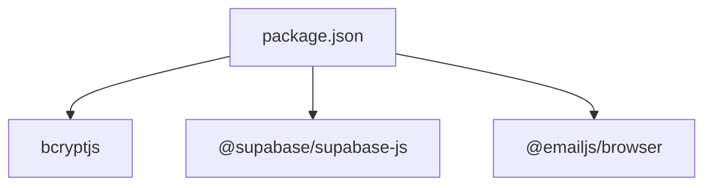

# Authentication System

<cite>
**Referenced Files in This Document**
- [lib/auth.ts](file://lib/auth.ts)
- [app/lib/supabase.ts](file://app/lib/supabase.ts)
- [app/lib/database.ts](file://app/lib/database.ts)
- [app/admin/components/AdminProtection.tsx](file://app/admin/components/AdminProtection.tsx)
- [app/admin/login/page.tsx](file://app/admin/login/page.tsx)
- [app/reset-password/page.tsx](file://app/reset-password/page.tsx)
- [app/lib/email.ts](file://app/lib/email.ts)
- [lib/email.ts](file://lib/email.ts)
- [app/types/database.ts](file://app/types/database.ts)
- [package.json](file://package.json)
</cite>

## Table of Contents
1. [Introduction](#introduction)
2. [Project Structure](#project-structure)
3. [Core Components](#core-components)
4. [Architecture Overview](#architecture-overview)
5. [Detailed Component Analysis](#detailed-component-analysis)
6. [Dependency Analysis](#dependency-analysis)
7. [Performance Considerations](#performance-considerations)
8. [Troubleshooting Guide](#troubleshooting-guide)
9. [Conclusion](#conclusion)
10. [Appendices](#appendices)

## Introduction
This document explains the Pythonhostel authentication system with a focus on:
- User registration and login flows
- Password hashing with bcryptjs
- JWT token generation and validation (custom base64-encoded tokens)
- Session management using browser local storage
- Role-based access control (guest/admin)
- Protected route implementation
- Password reset functionality
- Email verification and notification flows
- Security measures including CSRF protection and secure token storage
- Integration patterns with Supabase Auth
- Practical authentication flows, error handling, and mitigation strategies for common vulnerabilities

## Project Structure
The authentication system spans client-side React components, shared utilities, and backend integrations via Supabase:
- Client-side admin authentication: local storage-based session and admin-only login
- Shared authentication utilities: bcrypt-based hashing/validation, token generation/verification, input sanitization
- Supabase integration: client initialization and database operations
- Email utilities: welcome and password reset notifications
- Types: database entity definitions used across the system

**Diagram sources**
- [app/admin/login/page.tsx:1-98](file://app/admin/login/page.tsx#L1-L98)
- [app/admin/components/AdminProtection.tsx:1-69](file://app/admin/components/AdminProtection.tsx#L1-L69)
- [app/reset-password/page.tsx:1-181](file://app/reset-password/page.tsx#L1-L181)
- [lib/auth.ts:1-57](file://lib/auth.ts#L1-L57)
- [lib/email.ts:1-75](file://lib/email.ts#L1-L75)
- [app/lib/email.ts:1-49](file://app/lib/email.ts#L1-L49)
- [app/lib/supabase.ts:1-6](file://app/lib/supabase.ts#L1-L6)
- [app/lib/database.ts:1-433](file://app/lib/database.ts#L1-L433)
- [app/types/database.ts:1-146](file://app/types/database.ts#L1-L146)

**Section sources**
- [app/admin/login/page.tsx:1-98](file://app/admin/login/page.tsx#L1-L98)
- [app/admin/components/AdminProtection.tsx:1-69](file://app/admin/components/AdminProtection.tsx#L1-L69)
- [app/reset-password/page.tsx:1-181](file://app/reset-password/page.tsx#L1-L181)
- [lib/auth.ts:1-57](file://lib/auth.ts#L1-L57)
- [lib/email.ts:1-75](file://lib/email.ts#L1-L75)
- [app/lib/email.ts:1-49](file://app/lib/email.ts#L1-L49)
- [app/lib/supabase.ts:1-6](file://app/lib/supabase.ts#L1-L6)
- [app/lib/database.ts:1-433](file://app/lib/database.ts#L1-L433)
- [app/types/database.ts:1-146](file://app/types/database.ts#L1-L146)

## Core Components
- Password hashing and verification: bcryptjs-based hashing and comparison
- Token generation and verification: custom base64-encoded token with expiration
- Input validation and sanitization: email format, password strength, HTML/script removal
- Admin login and session management: password check and local storage-based session with short timeout
- Protected routes: client-side wrapper enforcing admin session validity
- Password reset flow: token validation and form submission handling
- Email utilities: welcome and password reset notifications (EmailJS integration)
- Supabase integration: client initialization and database operations

Key implementation references:
- [Hashing and verification:4-12](file://lib/auth.ts#L4-L12)
- [Token generation and verification:15-35](file://lib/auth.ts#L15-L35)
- [Validation helpers:38-48](file://lib/auth.ts#L38-L48)
- [Admin login:15-37](file://app/admin/login/page.tsx#L15-L37)
- [Admin protection:17-49](file://app/admin/components/AdminProtection.tsx#L17-L49)
- [Password reset page:19-62](file://app/reset-password/page.tsx#L19-L62)
- [Email utilities:11-53](file://lib/email.ts#L11-L53)
- [Supabase client:3-6](file://app/lib/supabase.ts#L3-L6)
- [Database operations:5-23](file://app/lib/database.ts#L5-L23)

**Section sources**
- [lib/auth.ts:1-57](file://lib/auth.ts#L1-L57)
- [app/admin/login/page.tsx:1-98](file://app/admin/login/page.tsx#L1-L98)
- [app/admin/components/AdminProtection.tsx:1-69](file://app/admin/components/AdminProtection.tsx#L1-L69)
- [app/reset-password/page.tsx:1-181](file://app/reset-password/page.tsx#L1-L181)
- [lib/email.ts:1-75](file://lib/email.ts#L1-L75)
- [app/lib/supabase.ts:1-6](file://app/lib/supabase.ts#L1-L6)
- [app/lib/database.ts:1-433](file://app/lib/database.ts#L1-L433)

## Architecture Overview
The authentication system combines:
- Client-side admin authentication with local storage sessions
- Shared utilities for hashing, token handling, and input validation
- Supabase client for database operations
- Email utilities for notifications

**Diagram sources**
- [app/admin/login/page.tsx:25-37](file://app/admin/login/page.tsx#L25-L37)
- [app/admin/components/AdminProtection.tsx:17-49](file://app/admin/components/AdminProtection.tsx#L17-L49)

## Detailed Component Analysis

### Password Hashing and Validation
- Uses bcryptjs for hashing and verifying passwords
- Provides validation helpers for email and password strength
- Includes input sanitization to remove script tags and HTML

**Diagram sources**
- [lib/auth.ts:4-12](file://lib/auth.ts#L4-L12)

**Section sources**
- [lib/auth.ts:1-57](file://lib/auth.ts#L1-L57)

### JWT Token Generation and Validation
- Generates a base64-encoded token containing user ID, email, and expiration
- Validates token by decoding and checking expiration
- Not a standard JWT library; uses a simplified custom token scheme

**Diagram sources**
- [lib/auth.ts:15-35](file://lib/auth.ts#L15-L35)

**Section sources**
- [lib/auth.ts:14-35](file://lib/auth.ts#L14-L35)

### Admin Login and Session Management
- Admin login compares entered password against a hardcoded value
- On success, sets local storage flags and timestamps
- Session timeout enforced client-side with a very short duration

**Diagram sources**
- [app/admin/login/page.tsx:15-37](file://app/admin/login/page.tsx#L15-L37)

**Section sources**
- [app/admin/login/page.tsx:1-98](file://app/admin/login/page.tsx#L1-L98)

### Protected Routes and Role-Based Access Control
- Admin protection wrapper checks local storage flags and session age
- Redirects to login if not authenticated or session expired
- Implements a short session timeout for stricter access control

**Diagram sources**
- [app/admin/components/AdminProtection.tsx:17-49](file://app/admin/components/AdminProtection.tsx#L17-L49)

**Section sources**
- [app/admin/components/AdminProtection.tsx:1-69](file://app/admin/components/AdminProtection.tsx#L1-L69)

### Password Reset Flow
- Validates token presence and format
- Compares new and confirm passwords
- Enforces minimum length
- Simulates successful reset and navigates to login

**Diagram sources**
- [app/reset-password/page.tsx:19-62](file://app/reset-password/page.tsx#L19-L62)

**Section sources**
- [app/reset-password/page.tsx:1-181](file://app/reset-password/page.tsx#L1-L181)

### Email Utilities and Notifications
- Welcome email and password reset email utilities
- EmailJS integration for sending templated emails
- Environment variables used for credentials and templates

**Diagram sources**
- [lib/email.ts:11-53](file://lib/email.ts#L11-L53)
- [app/lib/email.ts:1-49](file://app/lib/email.ts#L1-L49)

**Section sources**
- [lib/email.ts:1-75](file://lib/email.ts#L1-L75)
- [app/lib/email.ts:1-49](file://app/lib/email.ts#L1-L49)

### Supabase Integration
- Initializes Supabase client with project URL and anonymous key
- Provides database operations for users, rooms, bookings, payments, availability, and feedback
- Uses typed interfaces from database types

**Diagram sources**
- [app/lib/supabase.ts:3-6](file://app/lib/supabase.ts#L3-L6)
- [app/lib/database.ts:1-433](file://app/lib/database.ts#L1-L433)
- [app/types/database.ts:3-146](file://app/types/database.ts#L3-L146)

**Section sources**
- [app/lib/supabase.ts:1-6](file://app/lib/supabase.ts#L1-L6)
- [app/lib/database.ts:1-433](file://app/lib/database.ts#L1-L433)
- [app/types/database.ts:1-146](file://app/types/database.ts#L1-L146)

## Dependency Analysis
External dependencies relevant to authentication:
- bcryptjs: password hashing and verification
- @supabase/supabase-js: database client
- @emailjs/browser: email delivery

**Diagram sources**
- [package.json:11-21](file://package.json#L11-L21)

**Section sources**
- [package.json:1-33](file://package.json#L1-L33)

## Performance Considerations
- bcrypt cost: salt rounds set to 12; adjust based on server capabilities and latency targets
- Token size: base64-encoded tokens are small but still transmitted on every request; consider server-side session storage for production
- Local storage: client-side session management is fast but not resilient to concurrent tabs; enforce single tab behavior if needed
- Email delivery: external API calls introduce network latency; cache templates and handle retries gracefully

## Troubleshooting Guide
Common issues and resolutions:
- Admin login fails silently: verify local storage flags and console logs during submit
  - Reference: [Admin login handler:15-37](file://app/admin/login/page.tsx#L15-L37)
- Session redirects to login unexpectedly: short timeout may expire quickly; increase timeout cautiously
  - Reference: [Admin protection timeout:14-28](file://app/admin/components/AdminProtection.tsx#L14-L28)
- Password reset errors: ensure token presence and format; validate password length and match
  - Reference: [Reset password validation:30-45](file://app/reset-password/page.tsx#L30-L45)
- Email failures: check environment variables and EmailJS credentials; inspect API responses
  - Reference: [Email utilities:11-53](file://lib/email.ts#L11-L53), [app email utilities:1-49](file://app/lib/email.ts#L1-L49)
- Supabase connectivity: verify client initialization and network access
  - Reference: [Supabase client:3-6](file://app/lib/supabase.ts#L3-L6)

**Section sources**
- [app/admin/login/page.tsx:15-37](file://app/admin/login/page.tsx#L15-L37)
- [app/admin/components/AdminProtection.tsx:14-28](file://app/admin/components/AdminProtection.tsx#L14-L28)
- [app/reset-password/page.tsx:30-45](file://app/reset-password/page.tsx#L30-L45)
- [lib/email.ts:11-53](file://lib/email.ts#L11-L53)
- [app/lib/email.ts:1-49](file://app/lib/email.ts#L1-L49)
- [app/lib/supabase.ts:3-6](file://app/lib/supabase.ts#L3-L6)

## Conclusion
The Pythonhostel authentication system implements a pragmatic client-side admin authentication flow with local storage sessions, basic password hashing/validation, and token handling. It integrates with Supabase for persistence and EmailJS for notifications. While functional for development and demos, production deployments should adopt server-side sessions, robust token management, and stronger protections against CSRF and credential theft.

## Appendices

### Practical Authentication Flows

- Admin Login Flow
  - User submits admin password on the login page
  - On success, flags and timestamp are stored in local storage
  - Navigation to admin routes triggers protection wrapper checks
  - References:
    - [Admin login handler:15-37](file://app/admin/login/page.tsx#L15-L37)
    - [Admin protection wrapper:17-49](file://app/admin/components/AdminProtection.tsx#L17-L49)

- Password Reset Flow
  - User opens reset-password with a token query parameter
  - Token is validated; form validates passwords and length
  - Successful reset simulates completion and navigates to login
  - References:
    - [Reset password page:19-62](file://app/reset-password/page.tsx#L19-L62)

- Email Notification Flow
  - Welcome and reset emails prepared and sent via EmailJS
  - Environment variables required for credentials and templates
  - References:
    - [Email utilities:11-53](file://lib/email.ts#L11-L53)
    - [App email utilities:1-49](file://app/lib/email.ts#L1-L49)

### Security Measures and Mitigations
- CSRF protection: implement anti-CSRF tokens for state-changing requests; avoid relying solely on cookies/session
- Secure token storage: replace base64-encoded tokens with signed JWTs and secure, httpOnly cookies
- Credential theft: enforce HTTPS, Content Security Policy, and strict SameSite policies
- Input sanitization: continue removing script tags and validating inputs; consider server-side validation
- Session management: move to server-managed sessions with rotation and idle timeouts
- Integration with Supabase Auth: leverage Supabase’s built-in auth for production-grade flows