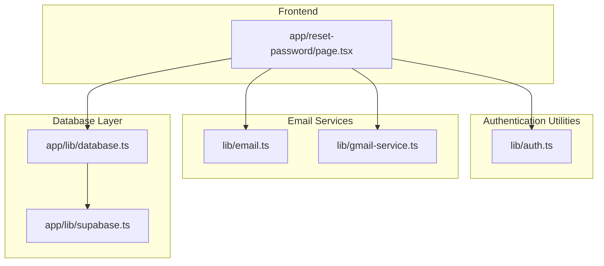
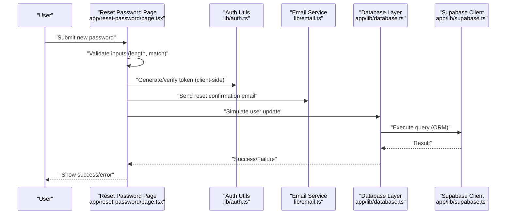
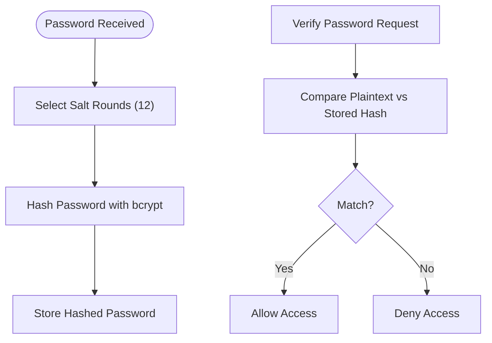
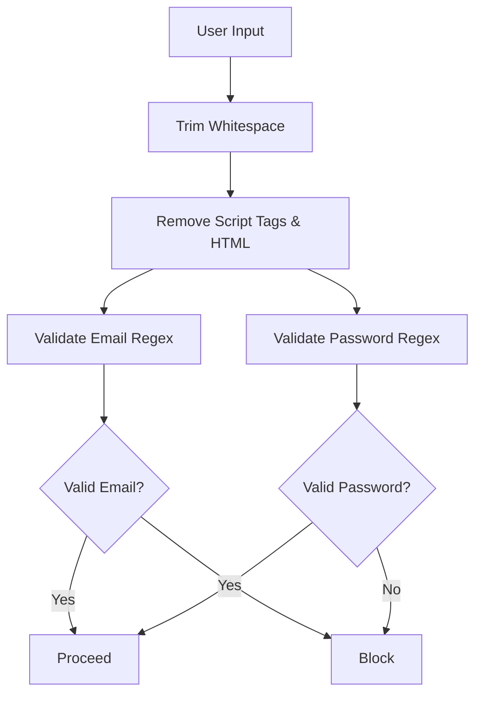
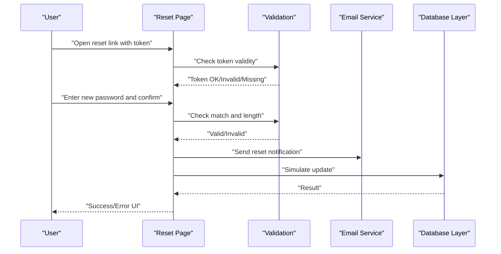
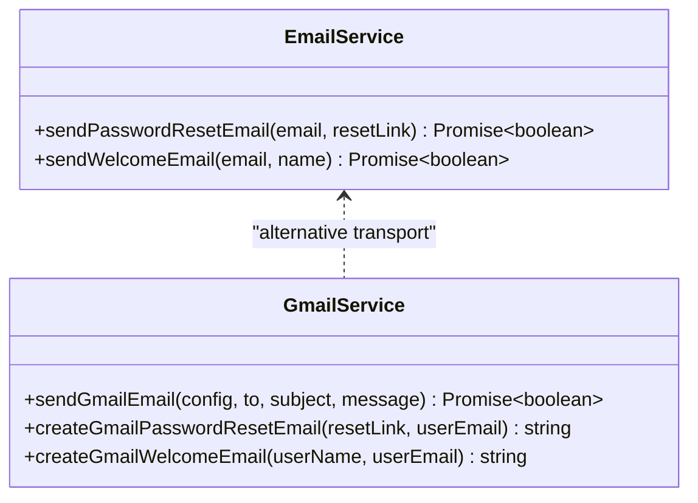
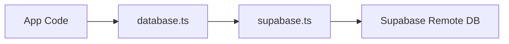
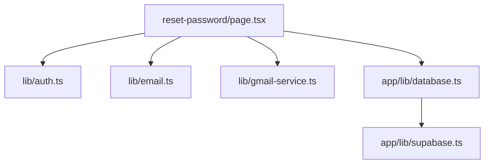

# Password Management

<cite>
**Referenced Files in This Document**
- [auth.ts](file://lib/auth.ts)
- [email.ts](file://lib/email.ts)
- [gmail-service.ts](file://lib/gmail-service.ts)
- [reset-password/page.tsx](file://app/reset-password/page.tsx)
- [database.ts](file://app/lib/database.ts)
- [supabase.ts](file://app/lib/supabase.ts)
</cite>

## Table of Contents
1. [Introduction](#introduction)
2. [Project Structure](#project-structure)
3. [Core Components](#core-components)
4. [Architecture Overview](#architecture-overview)
5. [Detailed Component Analysis](#detailed-component-analysis)
6. [Dependency Analysis](#dependency-analysis)
7. [Performance Considerations](#performance-considerations)
8. [Troubleshooting Guide](#troubleshooting-guide)
9. [Conclusion](#conclusion)

## Introduction
This document explains the password management features implemented in the project. It covers password hashing with bcryptjs, password verification, validation rules, and the password reset workflow including token handling and email notification. It also documents security best practices such as input sanitization, SQL injection prevention via Supabase ORM, and secure token handling.

## Project Structure
Password management spans several modules:
- Authentication utilities for hashing, verification, token generation/verification, email/password validation, and input sanitization
- Email services for sending password reset emails via EmailJS and Gmail SMTP
- Frontend reset password page handling user input and token validation
- Database access via Supabase client for user queries and updates

**Diagram sources**
- [auth.ts:1-57](file://lib/auth.ts#L1-L57)
- [email.ts:1-75](file://lib/email.ts#L1-L75)
- [gmail-service.ts:1-117](file://lib/gmail-service.ts#L1-L117)
- [reset-password/page.tsx:1-181](file://app/reset-password/page.tsx#L1-L181)
- [database.ts:1-433](file://app/lib/database.ts#L1-L433)
- [supabase.ts:1-6](file://app/lib/supabase.ts#L1-L6)

**Section sources**
- [auth.ts:1-57](file://lib/auth.ts#L1-L57)
- [email.ts:1-75](file://lib/email.ts#L1-L75)
- [gmail-service.ts:1-117](file://lib/gmail-service.ts#L1-L117)
- [reset-password/page.tsx:1-181](file://app/reset-password/page.tsx#L1-L181)
- [database.ts:1-433](file://app/lib/database.ts#L1-L433)
- [supabase.ts:1-6](file://app/lib/supabase.ts#L1-L6)

## Core Components
- Password hashing and verification using bcryptjs with configurable salt rounds
- Token generation and verification for password reset sessions
- Email-based password reset notification via EmailJS and Gmail SMTP
- Frontend password reset form with validation and user feedback
- Database access via Supabase client for user operations

Key capabilities:
- Hashing passwords with 12 salt rounds
- Comparing plaintext passwords against stored hashes
- Validating email and password formats with regex
- Sanitizing user inputs to remove potentially malicious content
- Sending password reset emails with templated messages
- Retrieving and updating user records through Supabase

**Section sources**
- [auth.ts:1-57](file://lib/auth.ts#L1-L57)
- [email.ts:1-75](file://lib/email.ts#L1-L75)
- [gmail-service.ts:1-117](file://lib/gmail-service.ts#L1-L117)
- [reset-password/page.tsx:1-181](file://app/reset-password/page.tsx#L1-L181)
- [database.ts:1-433](file://app/lib/database.ts#L1-L433)
- [supabase.ts:1-6](file://app/lib/supabase.ts#L1-L6)

## Architecture Overview
The password reset flow integrates frontend validation, backend-safe hashing, and secure email delivery. Tokens are validated on the client side, while the actual reset is simulated in the current implementation. Production-ready enhancements would include server-side token verification and secure database updates.

**Diagram sources**
- [reset-password/page.tsx:1-181](file://app/reset-password/page.tsx#L1-L181)
- [auth.ts:14-35](file://lib/auth.ts#L14-L35)
- [email.ts:11-53](file://lib/email.ts#L11-L53)
- [database.ts:15-23](file://app/lib/database.ts#L15-L23)
- [supabase.ts:1-6](file://app/lib/supabase.ts#L1-L6)

## Detailed Component Analysis

### Password Hashing and Verification
- Hashing uses bcryptjs with 12 salt rounds for strong security
- Verification compares plaintext against stored hash
- Token handling uses a simple base64-encoded payload with expiration

**Diagram sources**
- [auth.ts:4-12](file://lib/auth.ts#L4-L12)
- [auth.ts:15-35](file://lib/auth.ts#L15-L35)

**Section sources**
- [auth.ts:4-12](file://lib/auth.ts#L4-L12)
- [auth.ts:15-35](file://lib/auth.ts#L15-L35)

### Password Validation Rules
- Email validation uses a strict regex pattern
- Password validation requires minimum length and presence of uppercase, lowercase, and digit
- Input sanitization trims whitespace and removes script tags and HTML

**Diagram sources**
- [auth.ts:38-56](file://lib/auth.ts#L38-L56)

**Section sources**
- [auth.ts:38-56](file://lib/auth.ts#L38-L56)

### Password Reset Workflow
- The reset page validates token presence and format
- Enforces password confirmation and minimum length
- Simulates reset process and shows success/error states
- Integrates with email services for notifications

**Diagram sources**
- [reset-password/page.tsx:19-62](file://app/reset-password/page.tsx#L19-L62)
- [email.ts:11-53](file://lib/email.ts#L11-L53)

**Section sources**
- [reset-password/page.tsx:1-181](file://app/reset-password/page.tsx#L1-L181)
- [email.ts:11-53](file://lib/email.ts#L11-L53)

### Email Notification System
- EmailJS integration supports sending templated reset emails
- Gmail SMTP service provides an alternative with prepared message composition
- Both services log and simulate sending for demonstration

**Diagram sources**
- [email.ts:11-74](file://lib/email.ts#L11-L74)
- [gmail-service.ts:9-116](file://lib/gmail-service.ts#L9-L116)

**Section sources**
- [email.ts:11-74](file://lib/email.ts#L11-L74)
- [gmail-service.ts:9-116](file://lib/gmail-service.ts#L9-L116)

### Database Access and Security
- Supabase client configured for secure remote access
- Database utility functions encapsulate CRUD operations
- Queries leverage ORM and RPC functions to prevent raw SQL injection

**Diagram sources**
- [database.ts:15-23](file://app/lib/database.ts#L15-L23)
- [supabase.ts:1-6](file://app/lib/supabase.ts#L1-L6)

**Section sources**
- [database.ts:1-433](file://app/lib/database.ts#L1-L433)
- [supabase.ts:1-6](file://app/lib/supabase.ts#L1-L6)

## Dependency Analysis
- Frontend reset page depends on auth utilities for token handling and on email services for notifications
- Database layer depends on Supabase client for all persistence operations
- Email services are independent and can be swapped or extended

**Diagram sources**
- [reset-password/page.tsx:1-181](file://app/reset-password/page.tsx#L1-L181)
- [auth.ts:1-57](file://lib/auth.ts#L1-L57)
- [email.ts:1-75](file://lib/email.ts#L1-L75)
- [gmail-service.ts:1-117](file://lib/gmail-service.ts#L1-L117)
- [database.ts:1-433](file://app/lib/database.ts#L1-L433)
- [supabase.ts:1-6](file://app/lib/supabase.ts#L1-L6)

**Section sources**
- [reset-password/page.tsx:1-181](file://app/reset-password/page.tsx#L1-L181)
- [auth.ts:1-57](file://lib/auth.ts#L1-L57)
- [email.ts:1-75](file://lib/email.ts#L1-L75)
- [gmail-service.ts:1-117](file://lib/gmail-service.ts#L1-L117)
- [database.ts:1-433](file://app/lib/database.ts#L1-L433)
- [supabase.ts:1-6](file://app/lib/supabase.ts#L1-L6)

## Performance Considerations
- bcrypt hashing cost (salt rounds) impacts CPU usage during registration/login; 12 rounds offer strong security with reasonable performance
- Email sending is asynchronous and offloads work from the main thread
- Database queries use efficient ORM patterns; avoid N+1 queries by reusing shared database functions

## Troubleshooting Guide
Common issues and resolutions:
- Invalid token errors: Ensure the token parameter exists and matches expected format before proceeding
- Password mismatch: Confirm new password and confirmation fields are identical
- Minimum length violations: Enforce minimum length checks before attempting reset
- Email delivery failures: Verify service credentials and network connectivity; use logging to diagnose failures
- Database errors: Check Supabase connection and query permissions; validate input sanitation to prevent malformed requests

**Section sources**
- [reset-password/page.tsx:20-28](file://app/reset-password/page.tsx#L20-L28)
- [reset-password/page.tsx:35-45](file://app/reset-password/page.tsx#L35-L45)
- [email.ts:11-53](file://lib/email.ts#L11-L53)
- [database.ts:15-23](file://app/lib/database.ts#L15-L23)

## Conclusion
The project implements robust password management fundamentals: secure hashing, strong validation, and a clear reset workflow. Enhancements for production include server-side token verification, secure database updates, and reliable email delivery with proper error handling and monitoring.