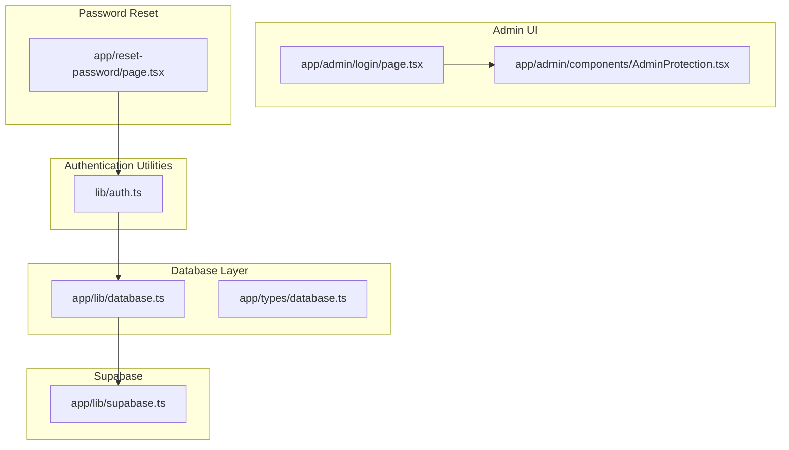
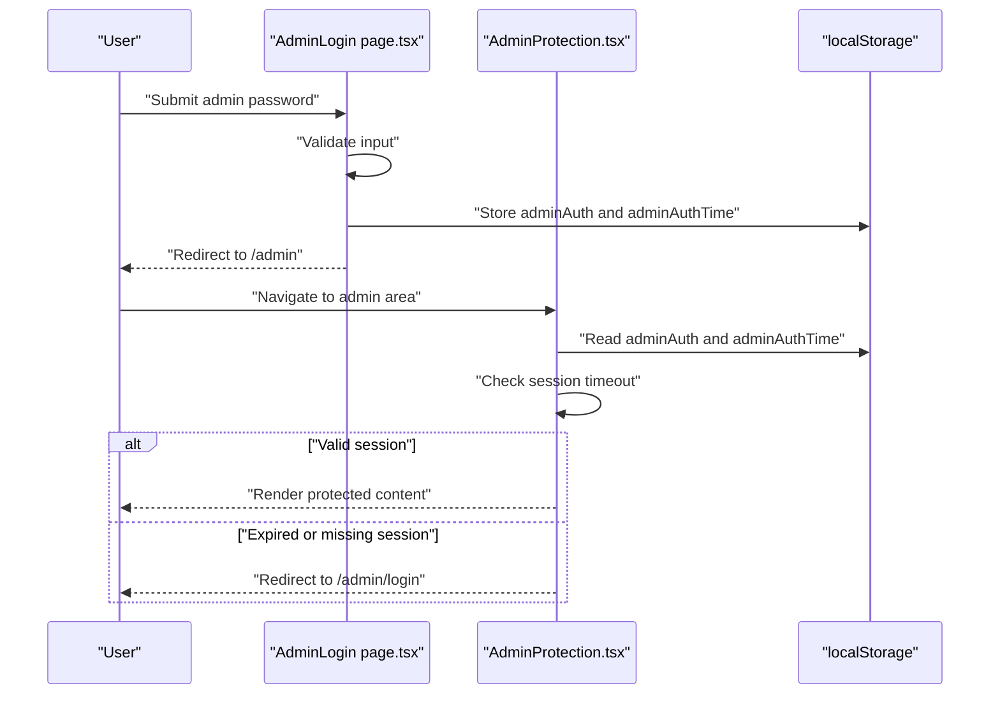
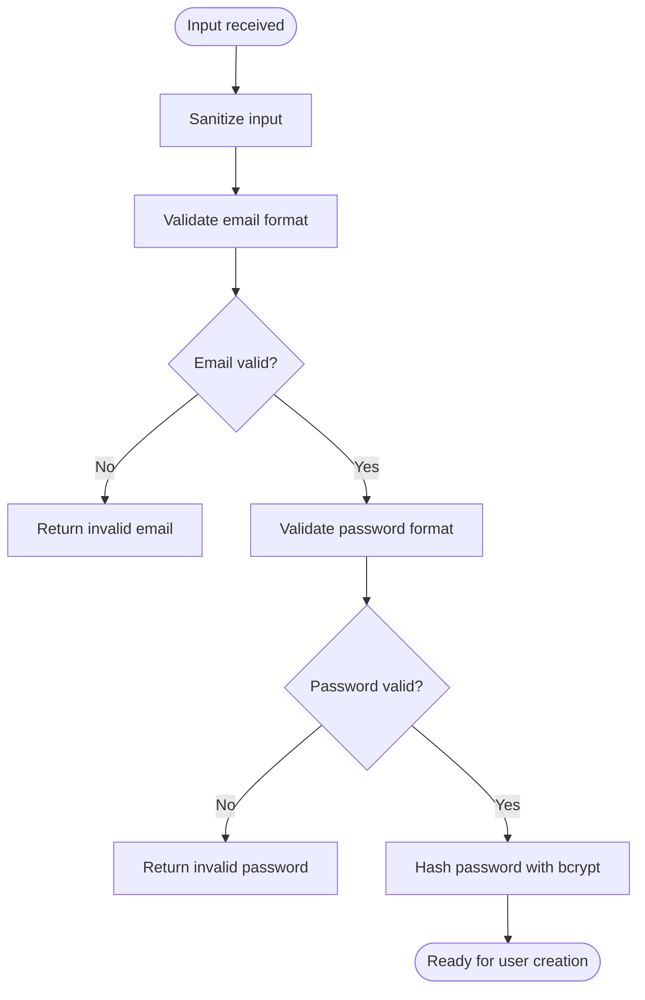
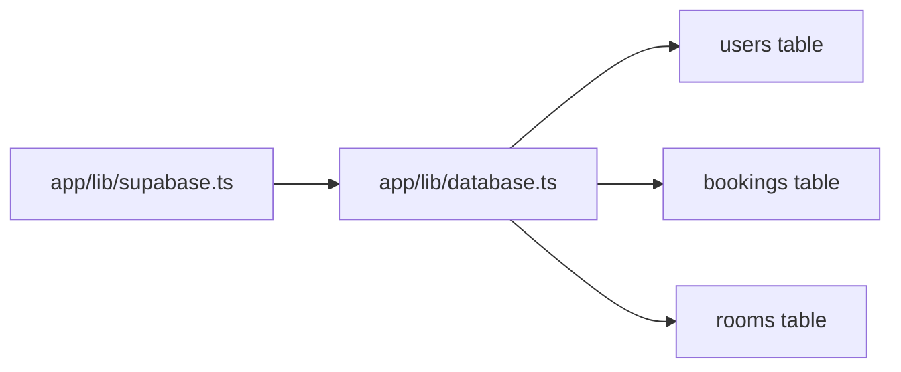
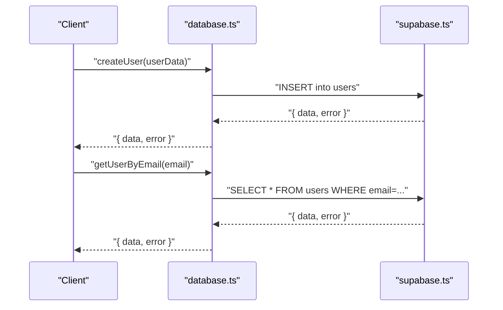
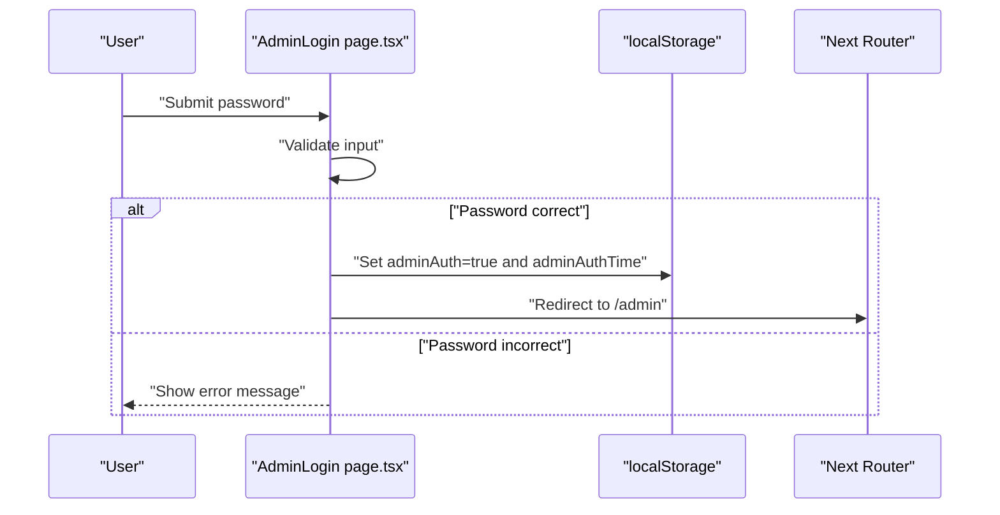
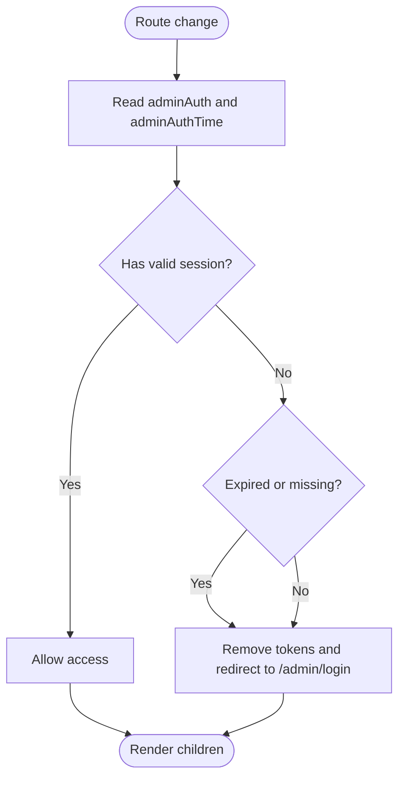
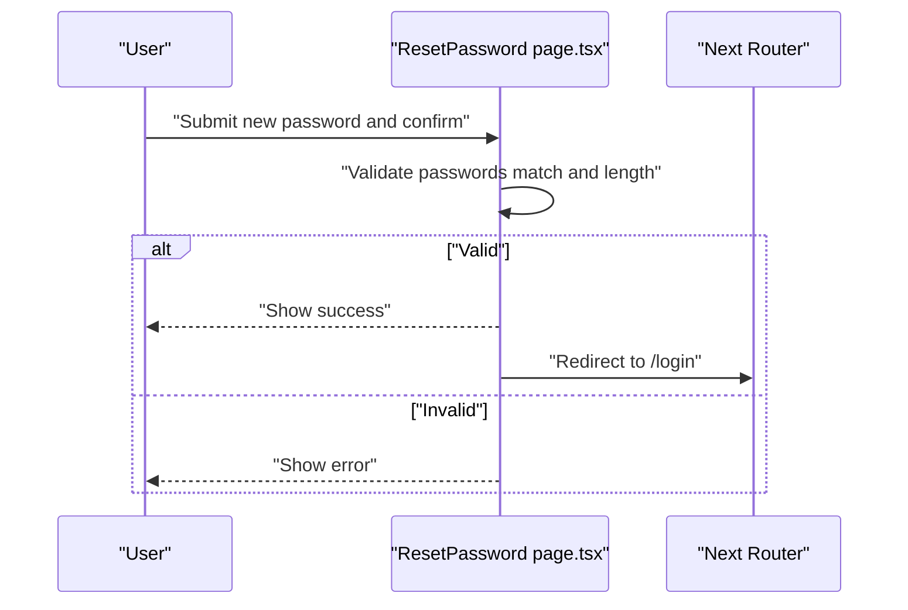
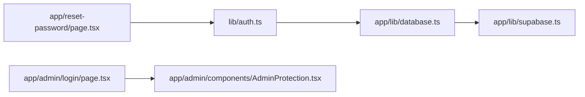

# User Registration and Login

<cite>
**Referenced Files in This Document**
- [auth.ts](file://lib/auth.ts)
- [database.ts](file://app/lib/database.ts)
- [supabase.ts](file://app/lib/supabase.ts)
- [database.ts](file://app/types/database.ts)
- [AdminLogin page.tsx](file://app/admin/login/page.tsx)
- [AdminProtection.tsx](file://app/admin/components/AdminProtection.tsx)
- [ResetPassword page.tsx](file://app/reset-password/page.tsx)
</cite>

## Table of Contents
1. [Introduction](#introduction)
2. [Project Structure](#project-structure)
3. [Core Components](#core-components)
4. [Architecture Overview](#architecture-overview)
5. [Detailed Component Analysis](#detailed-component-analysis)
6. [Dependency Analysis](#dependency-analysis)
7. [Performance Considerations](#performance-considerations)
8. [Troubleshooting Guide](#troubleshooting-guide)
9. [Conclusion](#conclusion)
10. [Appendices](#appendices)

## Introduction
This document explains the user registration and login functionality implemented in the project. It covers:
- Backend password hashing and validation utilities
- Frontend form handling and validation for admin login
- Supabase integration for user data operations
- Security considerations including input sanitization and token handling
- Practical examples of registration and login flows, validation rules, and integration points

Note: The current repository implements an admin login flow with local storage-based session management and password validation. A full end-to-end user registration/login flow with bcrypt-backed credentials and persistent sessions is not present in the provided files. The document therefore focuses on the existing implementation and outlines how to extend it to support standard user registration and login.

## Project Structure
Key areas related to authentication and user management:
- Authentication utilities: password hashing, verification, token generation/verification, email/password validation, input sanitization
- Supabase client initialization for database operations
- Database service layer for user creation and retrieval
- Admin login page and admin protection guard
- Reset password page (placeholder for password reset flow)

**Diagram sources**
- [auth.ts:1-57](file://lib/auth.ts#L1-L57)
- [database.ts:1-433](file://app/lib/database.ts#L1-L433)
- [supabase.ts:1-6](file://app/lib/supabase.ts#L1-L6)
- [database.ts:1-146](file://app/types/database.ts#L1-L146)
- [AdminLogin page.tsx:1-98](file://app/admin/login/page.tsx#L1-L98)
- [AdminProtection.tsx:1-68](file://app/admin/components/AdminProtection.tsx#L1-L68)
- [ResetPassword page.tsx:1-163](file://app/reset-password/page.tsx#L1-L163)

**Section sources**
- [auth.ts:1-57](file://lib/auth.ts#L1-L57)
- [database.ts:1-433](file://app/lib/database.ts#L1-L433)
- [supabase.ts:1-6](file://app/lib/supabase.ts#L1-L6)
- [database.ts:1-146](file://app/types/database.ts#L1-L146)
- [AdminLogin page.tsx:1-98](file://app/admin/login/page.tsx#L1-L98)
- [AdminProtection.tsx:1-68](file://app/admin/components/AdminProtection.tsx#L1-L68)
- [ResetPassword page.tsx:1-163](file://app/reset-password/page.tsx#L1-L163)

## Core Components
- Password hashing and verification utilities
- Email and password validation helpers
- Input sanitization
- Supabase client initialization
- Database service functions for user creation and lookup
- Admin login page with form handling and error feedback
- Admin protection guard for session management and redirection
- Reset password page (placeholder for password reset flow)

**Section sources**
- [auth.ts:1-57](file://lib/auth.ts#L1-L57)
- [database.ts:1-433](file://app/lib/database.ts#L1-L433)
- [supabase.ts:1-6](file://app/lib/supabase.ts#L1-L6)
- [AdminLogin page.tsx:1-98](file://app/admin/login/page.tsx#L1-L98)
- [AdminProtection.tsx:1-68](file://app/admin/components/AdminProtection.tsx#L1-L68)
- [ResetPassword page.tsx:1-163](file://app/reset-password/page.tsx#L1-L163)

## Architecture Overview
The authentication architecture combines:
- Frontend React components for admin login and protection
- Backend-like utilities for password hashing, validation, and token handling
- Supabase client for database operations
- Local storage for session persistence

**Diagram sources**
- [AdminLogin page.tsx:15-37](file://app/admin/login/page.tsx#L15-L37)
- [AdminProtection.tsx:17-49](file://app/admin/components/AdminProtection.tsx#L17-L49)

## Detailed Component Analysis

### Authentication Utilities
The authentication utilities module provides:
- Password hashing with bcryptjs
- Password verification against stored hashes
- Token generation and verification (base64-encoded payload with expiration)
- Email and password format validation
- Input sanitization to remove script tags and HTML

**Diagram sources**
- [auth.ts:50-57](file://lib/auth.ts#L50-L57)
- [auth.ts:37-48](file://lib/auth.ts#L37-L48)
- [auth.ts:4-12](file://lib/auth.ts#L4-L12)

**Section sources**
- [auth.ts:1-57](file://lib/auth.ts#L1-L57)

### Supabase Client Initialization
The Supabase client is initialized with project URL and anonymous API key. This client is used by the database service layer to interact with the remote database.

**Diagram sources**
- [supabase.ts:1-6](file://app/lib/supabase.ts#L1-L6)
- [database.ts:1-433](file://app/lib/database.ts#L1-L433)

**Section sources**
- [supabase.ts:1-6](file://app/lib/supabase.ts#L1-L6)
- [database.ts:1-433](file://app/lib/database.ts#L1-L433)

### Database Service Layer
The database service layer encapsulates CRUD operations for users and other entities. For user registration, the service inserts a new user record into the users table. For login, it retrieves a user by email to verify existence and then compares passwords using the authentication utilities.

**Diagram sources**
- [database.ts:5-23](file://app/lib/database.ts#L5-L23)
- [supabase.ts:1-6](file://app/lib/supabase.ts#L1-L6)

**Section sources**
- [database.ts:1-433](file://app/lib/database.ts#L1-L433)
- [database.ts:1-146](file://app/types/database.ts#L1-L146)

### Admin Login Page
The admin login page handles form submission, validates input, and manages session state via localStorage. On successful authentication, it redirects to the admin dashboard.

**Diagram sources**
- [AdminLogin page.tsx:15-37](file://app/admin/login/page.tsx#L15-L37)

**Section sources**
- [AdminLogin page.tsx:1-98](file://app/admin/login/page.tsx#L1-L98)

### Admin Protection Guard
The admin protection guard checks for a valid session in localStorage and enforces a short session timeout. If the session is expired or missing, it redirects to the admin login page.

**Diagram sources**
- [AdminProtection.tsx:17-49](file://app/admin/components/AdminProtection.tsx#L17-L49)

**Section sources**
- [AdminProtection.tsx:1-68](file://app/admin/components/AdminProtection.tsx#L1-L68)

### Reset Password Page
The reset password page demonstrates form handling, validation, and feedback mechanisms. It simulates token validation and password reset flow.

**Diagram sources**
- [ResetPassword page.tsx:30-62](file://app/reset-password/page.tsx#L30-L62)

**Section sources**
- [ResetPassword page.tsx:1-163](file://app/reset-password/page.tsx#L1-L163)

## Dependency Analysis
- The database service depends on the Supabase client for database operations.
- The authentication utilities are reusable across components for hashing, verification, and validation.
- The admin login page depends on the admin protection guard for routing and session enforcement.
- The reset password page integrates with authentication utilities for validation.

**Diagram sources**
- [auth.ts:1-57](file://lib/auth.ts#L1-L57)
- [database.ts:1-433](file://app/lib/database.ts#L1-L433)
- [supabase.ts:1-6](file://app/lib/supabase.ts#L1-L6)
- [AdminLogin page.tsx:1-98](file://app/admin/login/page.tsx#L1-L98)
- [AdminProtection.tsx:1-68](file://app/admin/components/AdminProtection.tsx#L1-L68)
- [ResetPassword page.tsx:1-163](file://app/reset-password/page.tsx#L1-L163)

**Section sources**
- [auth.ts:1-57](file://lib/auth.ts#L1-L57)
- [database.ts:1-433](file://app/lib/database.ts#L1-L433)
- [supabase.ts:1-6](file://app/lib/supabase.ts#L1-L6)
- [AdminLogin page.tsx:1-98](file://app/admin/login/page.tsx#L1-L98)
- [AdminProtection.tsx:1-68](file://app/admin/components/AdminProtection.tsx#L1-L68)
- [ResetPassword page.tsx:1-163](file://app/reset-password/page.tsx#L1-L163)

## Performance Considerations
- Password hashing uses a configurable number of rounds; higher rounds increase security but also CPU cost. Adjust salt rounds based on server capabilities.
- Input sanitization removes script tags and HTML to mitigate XSS risks.
- Token verification uses base64 decoding and expiration checks; ensure token lifetime aligns with security policies.
- Database queries should leverage indexes on frequently queried columns (e.g., email) to reduce lookup latency.

## Troubleshooting Guide
Common issues and resolutions:
- Admin login fails silently: verify localStorage keys and session timeout logic in the admin protection guard.
- Incorrect password errors: ensure the admin password constant matches the submitted value.
- Token validation failures: check token expiration and encoding/decoding logic.
- Database insert/update errors: inspect Supabase client configuration and table permissions.

**Section sources**
- [AdminLogin page.tsx:25-34](file://app/admin/login/page.tsx#L25-L34)
- [AdminProtection.tsx:17-49](file://app/admin/components/AdminProtection.tsx#L17-L49)
- [auth.ts:24-35](file://lib/auth.ts#L24-L35)
- [supabase.ts:1-6](file://app/lib/supabase.ts#L1-L6)

## Conclusion
The project currently implements an admin login flow with local storage-based session management and basic input validation. To support standard user registration and login:
- Implement a user registration endpoint that uses the authentication utilities for password hashing and sanitization, then calls the database service to create a user.
- Add a login endpoint that retrieves the user by email, verifies the password, and establishes a session (e.g., JWT or encrypted cookie).
- Integrate CSRF protection and secure cookie settings for production.
- Extend the admin protection guard to handle user sessions and roles.

## Appendices

### Practical Examples and Integration Notes
- Registration form validation rules:
  - Email format validated via regex
  - Password must meet minimum length and character requirements
  - Input sanitized to prevent XSS
- Login form validation rules:
  - Email and password required
  - Password compared against stored hash using bcrypt
- Integration steps:
  - Use the authentication utilities for hashing and verification
  - Use the database service for user creation and lookup
  - Use the Supabase client for remote database operations
  - Protect routes using a similar pattern to the admin protection guard

**Section sources**
- [auth.ts:37-57](file://lib/auth.ts#L37-L57)
- [database.ts:5-23](file://app/lib/database.ts#L5-L23)
- [supabase.ts:1-6](file://app/lib/supabase.ts#L1-L6)
- [AdminProtection.tsx:17-49](file://app/admin/components/AdminProtection.tsx#L17-L49)