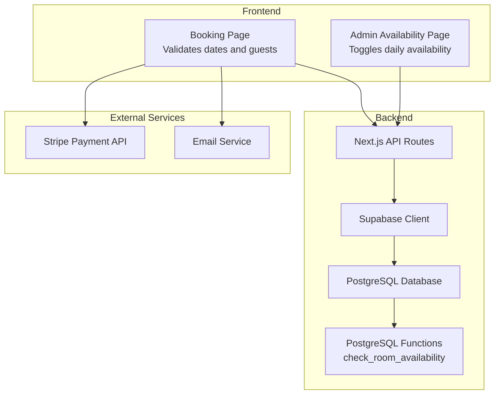
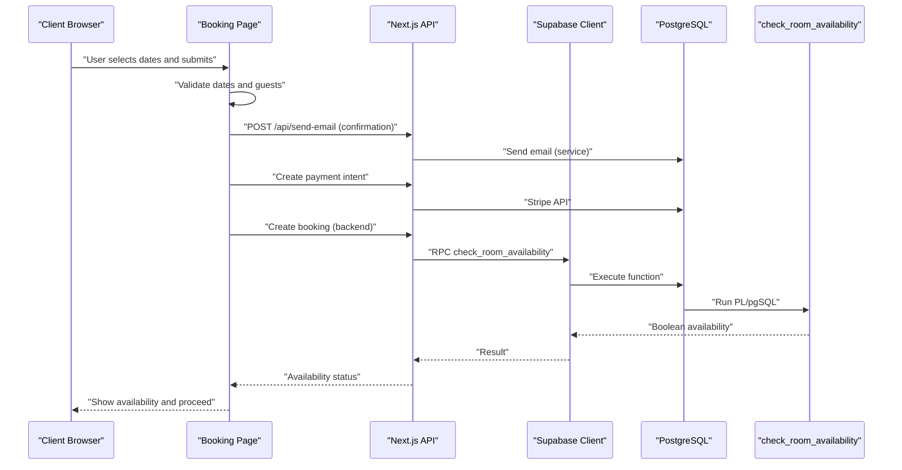
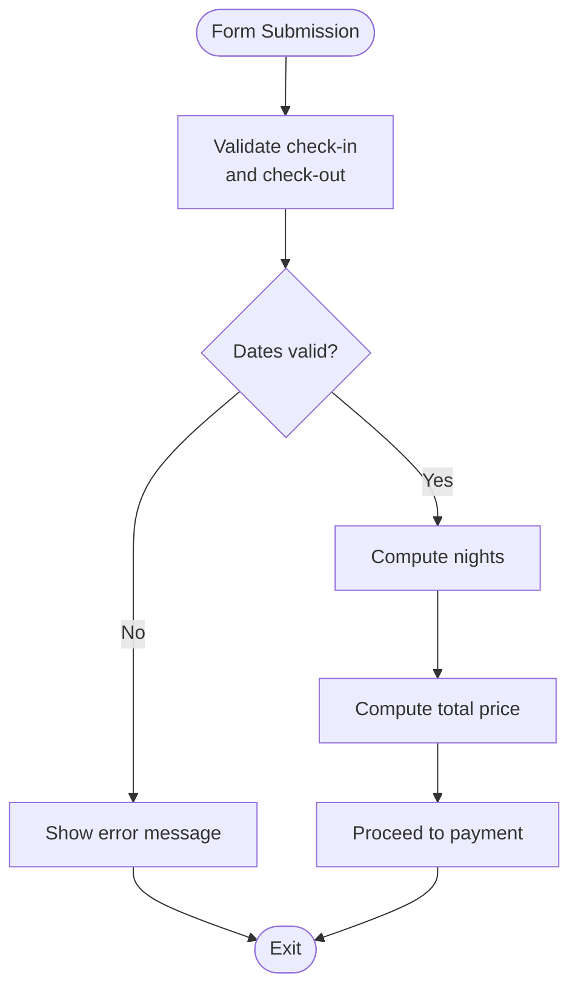
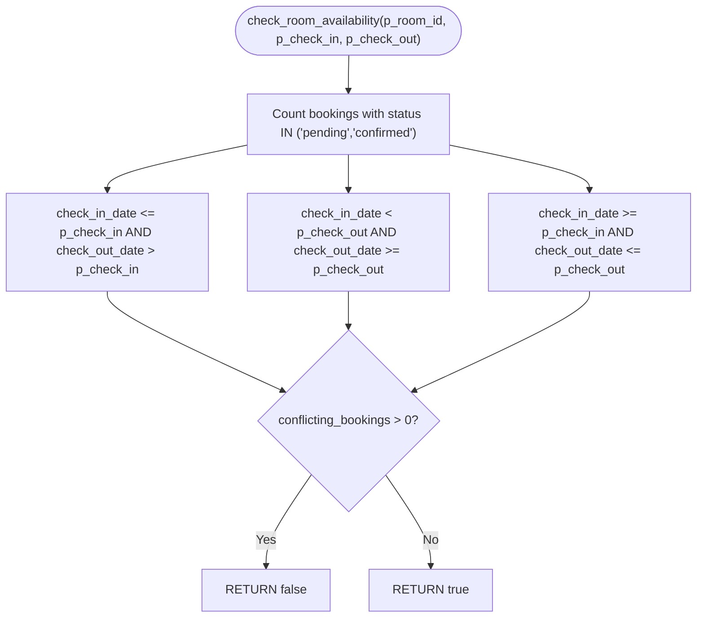
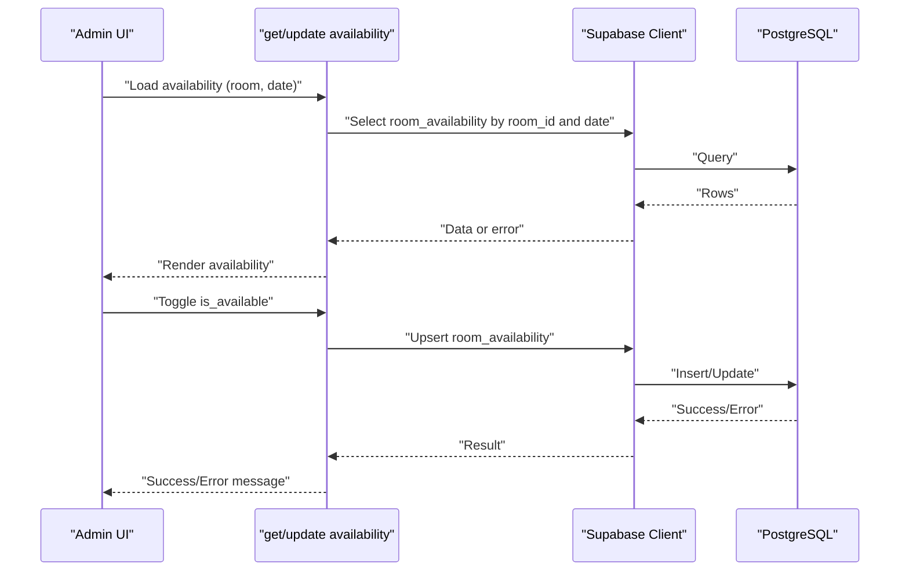
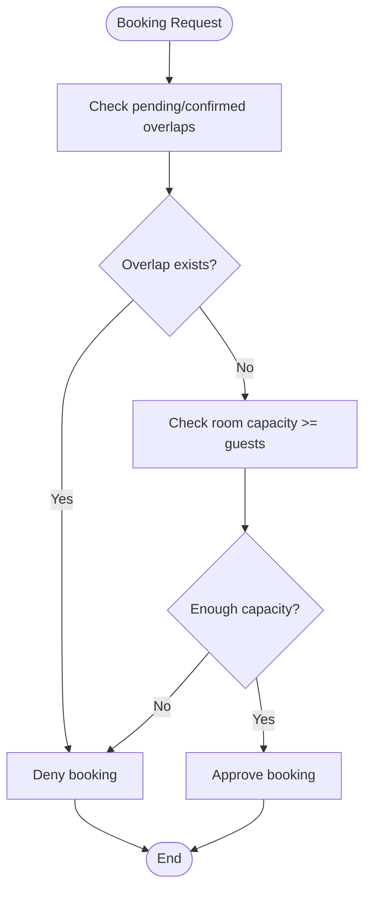
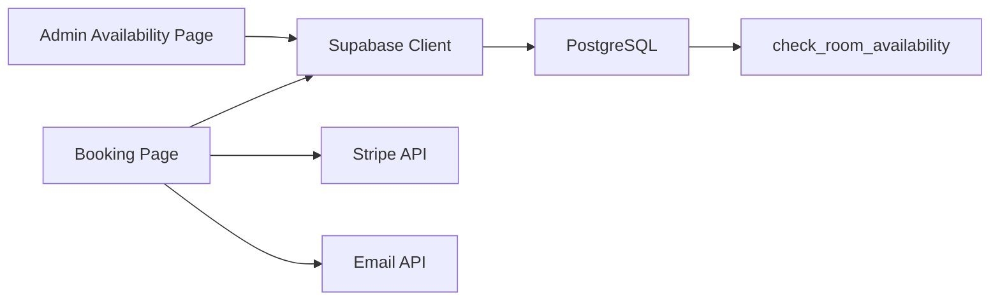

# Availability Validation

<cite>
**Referenced Files in This Document**
- [database.ts](file://app/lib/database.ts)
- [supabase.ts](file://app/lib/supabase.ts)
- [database-schema.sql](file://database-schema.sql)
- [setup-database-complete.sql](file://setup-database-complete.sql)
- [page.tsx](file://app/admin/availability/page.tsx)
- [page.tsx](file://app/booking/page.tsx)
- [page.tsx](file://app/payment/page.tsx)
- [route.ts](file://app/api/create-payment-intent/route.ts)
- [route.ts](file://app/api/send-email/route.ts)
- [stripe.ts](file://lib/stripe.ts)
- [real-bookings.ts](file://lib/real-bookings.ts)
- [bookings-storage.ts](file://lib/bookings-storage.ts)
- [types/database.ts](file://app/types/database.ts)
</cite>

## Table of Contents
1. [Introduction](#introduction)
2. [Project Structure](#project-structure)
3. [Core Components](#core-components)
4. [Architecture Overview](#architecture-overview)
5. [Detailed Component Analysis](#detailed-component-analysis)
6. [Dependency Analysis](#dependency-analysis)
7. [Performance Considerations](#performance-considerations)
8. [Troubleshooting Guide](#troubleshooting-guide)
9. [Conclusion](#conclusion)

## Introduction
This document explains the room availability validation system implemented in the hostel booking application. It covers date range validation, overlapping booking detection, real-time availability checks, date comparison functions, minimum stay requirements, maximum booking limits, conflict resolution strategies, capacity management for multi-guest rooms, and availability update processes. It also documents the integration between frontend validation and backend database queries for accurate availability tracking, along with examples of validation rules, date formatting requirements, and error messaging for unavailable dates.

## Project Structure
The availability validation spans frontend React components, backend Supabase database functions, and API routes. Key areas:
- Frontend booking form validates basic date and guest constraints.
- Admin availability page toggles daily room availability and falls back to local storage when the database is unavailable.
- Backend Supabase functions implement availability checks and updates.
- Database schema defines constraints and indexes for robust validation and performance.
- Payment and email flows integrate with the booking pipeline.

**Diagram sources**
- [page.tsx:76-170](file://app/booking/page.tsx#L76-L170)
- [page.tsx:27-119](file://app/admin/availability/page.tsx#L27-L119)
- [database.ts:76-89](file://app/lib/database.ts#L76-L89)
- [database.ts:288-312](file://app/lib/database.ts#L288-L312)
- [database.ts:314-331](file://app/lib/database.ts#L314-L331)
- [database.ts:333-354](file://app/lib/database.ts#L333-L354)
- [supabase.ts:1-6](file://app/lib/supabase.ts#L1-L6)
- [database-schema.sql:71-93](file://database-schema.sql#L71-L93)
- [route.ts:7-32](file://app/api/create-payment-intent/route.ts#L7-L32)
- [route.ts:4-41](file://app/api/send-email/route.ts#L4-L41)

**Section sources**
- [page.tsx:1-434](file://app/booking/page.tsx#L1-L434)
- [page.tsx:1-281](file://app/admin/availability/page.tsx#L1-L281)
- [database.ts:1-433](file://app/lib/database.ts#L1-L433)
- [supabase.ts:1-6](file://app/lib/supabase.ts#L1-L6)
- [database-schema.sql:1-119](file://database-schema.sql#L1-L119)
- [setup-database-complete.sql:1-269](file://setup-database-complete.sql#L1-L269)

## Core Components
- Date range validation and formatting:
  - Frontend enforces check-in before check-out and minimum date constraints.
  - Backend calculates nights and total price based on ISO date strings.
- Overlapping booking detection:
  - PostgreSQL function checks for conflicting bookings across pending and confirmed statuses.
- Real-time availability:
  - Daily room_availability table stores per-room per-date availability flags.
  - Admin UI toggles availability and persists to database or local storage.
- Capacity management:
  - Rooms define capacity; search filters support capacity selection.
- Payment and email integration:
  - Payment confirmation saves booking to local storage; email confirmation is sent via API.

**Section sources**
- [page.tsx:76-170](file://app/booking/page.tsx#L76-L170)
- [database.ts:76-89](file://app/lib/database.ts#L76-L89)
- [database.ts:288-312](file://app/lib/database.ts#L288-L312)
- [database.ts:314-331](file://app/lib/database.ts#L314-L331)
- [database.ts:333-354](file://app/lib/database.ts#L333-L354)
- [database-schema.sql:13-24](file://database-schema.sql#L13-L24)
- [database-schema.sql:41-50](file://database-schema.sql#L41-L50)
- [page.tsx:34-176](file://app/payment/page.tsx#L34-L176)
- [route.ts:4-41](file://app/api/send-email/route.ts#L4-L41)

## Architecture Overview
The availability validation system integrates frontend UI, backend database functions, and external services:

**Diagram sources**
- [page.tsx:76-170](file://app/booking/page.tsx#L76-L170)
- [route.ts:4-41](file://app/api/send-email/route.ts#L4-L41)
- [route.ts:7-32](file://app/api/create-payment-intent/route.ts#L7-L32)
- [database.ts:92-119](file://app/lib/database.ts#L92-L119)
- [database.ts:76-89](file://app/lib/database.ts#L76-L89)
- [database-schema.sql:71-93](file://database-schema.sql#L71-L93)

## Detailed Component Analysis

### Date Range Validation Logic
- Frontend validation ensures:
  - Check-out date is after check-in date.
  - Minimum date is today or later for check-in.
  - Optional minimum stay constraints can be enforced by disabling earlier dates on the calendar.
- Backend calculation:
  - Nights computed as the difference between check-out and check-in dates in full days.
  - Total price derived from nightly rate multiplied by nights.

**Diagram sources**
- [page.tsx:76-105](file://app/booking/page.tsx#L76-L105)

**Section sources**
- [page.tsx:76-105](file://app/booking/page.tsx#L76-L105)

### Overlapping Booking Detection Algorithms
- PostgreSQL function evaluates conflicts across pending and confirmed bookings using three overlap conditions:
  - Left overlap: incoming check-in falls within an existing booking.
  - Right overlap: incoming check-out falls within an existing booking.
  - Containment: incoming range fully contains an existing booking.
- The function returns a boolean indicating whether the room is available for the requested range.

**Diagram sources**
- [database-schema.sql:71-93](file://database-schema.sql#L71-L93)
- [database.ts:76-89](file://app/lib/database.ts#L76-L89)

**Section sources**
- [database-schema.sql:71-93](file://database-schema.sql#L71-L93)
- [database.ts:76-89](file://app/lib/database.ts#L76-L89)

### Real-Time Availability Checking Mechanisms
- Admin availability page:
  - Loads daily availability for a selected room and date.
  - Falls back to local storage if database errors occur.
  - Updates availability flags and persists to database or local storage.
- Daily availability table:
  - Unique constraint on (room_id, date) ensures one record per room per day.
  - Admin toggles is_available per date.

**Diagram sources**
- [page.tsx:27-119](file://app/admin/availability/page.tsx#L27-L119)
- [database.ts:288-312](file://app/lib/database.ts#L288-L312)
- [database-schema.sql:41-50](file://database-schema.sql#L41-L50)

**Section sources**
- [page.tsx:27-119](file://app/admin/availability/page.tsx#L27-L119)
- [database.ts:288-312](file://app/lib/database.ts#L288-L312)
- [database-schema.sql:41-50](file://database-schema.sql#L41-L50)

### Date Comparison Functions and Minimum Stay Requirements
- Date comparison:
  - Frontend compares check-in and check-out using JavaScript Date objects.
  - Backend uses ISO date strings for RPC calls and calculations.
- Minimum stay:
  - Not enforced in the provided code; can be added by disabling earlier check-out dates relative to check-in.
- Maximum booking limits:
  - No explicit maximum nights limit in the provided code; can be enforced by limiting check-out date range.

**Section sources**
- [page.tsx:76-105](file://app/booking/page.tsx#L76-L105)
- [database.ts:92-119](file://app/lib/database.ts#L92-L119)

### Conflict Resolution Strategies
- Pending vs confirmed:
  - The availability check considers both pending and confirmed bookings to prevent double-booking.
- Overlap resolution:
  - Any overlap condition triggers unavailability; the system does not split reservations or partial availability.
- Capacity management:
  - Capacity is defined per room; search filters support capacity selection. Multi-guest rooms require capacity >= required guests.

**Diagram sources**
- [database-schema.sql:71-93](file://database-schema.sql#L71-L93)
- [database.ts:159-181](file://app/lib/database.ts#L159-L181)
- [database-schema.sql:13-24](file://database-schema.sql#L13-L24)

**Section sources**
- [database-schema.sql:71-93](file://database-schema.sql#L71-L93)
- [database.ts:159-181](file://app/lib/database.ts#L159-L181)
- [database-schema.sql:13-24](file://database-schema.sql#L13-L24)

### Availability Update Processes
- Admin toggles:
  - Attempts database upsert; on failure, writes to local storage and sets a flag to indicate offline mode.
- Batch updates:
  - Backend supports setting availability for a date range by generating daily entries and upserting them.

**Section sources**
- [page.tsx:58-119](file://app/admin/availability/page.tsx#L58-L119)
- [database.ts:333-354](file://app/lib/database.ts#L333-L354)

### Integration Between Frontend Validation and Backend Queries
- Frontend:
  - Validates required fields, dates, and guest information before proceeding.
  - Sends confirmation emails via API and creates payment intents.
- Backend:
  - Uses Supabase client to call PostgreSQL functions and manage data.
  - Enforces database constraints and indexes for performance and correctness.

**Section sources**
- [page.tsx:76-170](file://app/booking/page.tsx#L76-L170)
- [route.ts:4-41](file://app/api/send-email/route.ts#L4-L41)
- [route.ts:7-32](file://app/api/create-payment-intent/route.ts#L7-L32)
- [database.ts:1-13](file://app/lib/database.ts#L1-L13)
- [supabase.ts:1-6](file://app/lib/supabase.ts#L1-L6)

## Dependency Analysis
- Supabase client encapsulates database access and is reused across availability, booking, and search functions.
- PostgreSQL functions centralize availability logic and are called from the backend.
- Frontend components depend on backend APIs and local storage for offline resilience.

**Diagram sources**
- [supabase.ts:1-6](file://app/lib/supabase.ts#L1-L6)
- [database.ts:1-13](file://app/lib/database.ts#L1-L13)
- [database-schema.sql:71-93](file://database-schema.sql#L71-L93)
- [page.tsx:76-170](file://app/booking/page.tsx#L76-L170)
- [route.ts:7-32](file://app/api/create-payment-intent/route.ts#L7-L32)
- [route.ts:4-41](file://app/api/send-email/route.ts#L4-L41)

**Section sources**
- [supabase.ts:1-6](file://app/lib/supabase.ts#L1-L6)
- [database.ts:1-13](file://app/lib/database.ts#L1-L13)
- [database-schema.sql:71-93](file://database-schema.sql#L71-L93)
- [page.tsx:76-170](file://app/booking/page.tsx#L76-L170)

## Performance Considerations
- Indexes:
  - bookings(check_in_date, check_out_date) and room_availability(room_id, date) improve query performance.
- Function efficiency:
  - The availability function scans only relevant bookings with status IN ('pending','confirmed').
- Frontend caching:
  - Local storage fallback reduces reliance on network latency and improves UX during outages.

**Section sources**
- [database-schema.sql:64-78](file://database-schema.sql#L64-L78)
- [database-schema.sql:71-93](file://database-schema.sql#L71-L93)
- [page.tsx:19-25](file://app/admin/availability/page.tsx#L19-L25)

## Troubleshooting Guide
- Unavailable dates:
  - If the availability function returns false, display a message indicating the room is not available for the selected dates.
  - Example messages: "Room is already booked for the selected dates", "Check dates for availability".
- Date formatting:
  - Ensure ISO date strings (YYYY-MM-DD) are used for all backend comparisons.
- Database errors:
  - Admin UI displays a message and switches to local storage mode when database operations fail.
- Payment failures:
  - Payment page handles Stripe errors and displays user-friendly messages.

**Section sources**
- [database-schema.sql:71-93](file://database-schema.sql#L71-L93)
- [page.tsx:34-55](file://app/admin/availability/page.tsx#L34-L55)
- [page.tsx:171-176](file://app/payment/page.tsx#L171-L176)

## Conclusion
The availability validation system combines frontend date validation, backend PostgreSQL functions, and resilient persistence to ensure accurate room availability. Overlapping booking detection prevents double-booking by considering pending and confirmed reservations, while daily availability records enable administrative control. The system leverages Supabase for scalable data operations and includes fallback mechanisms for offline scenarios. Extending the system with minimum stay and maximum booking limits, as well as capacity-aware search, would further strengthen the validation pipeline.