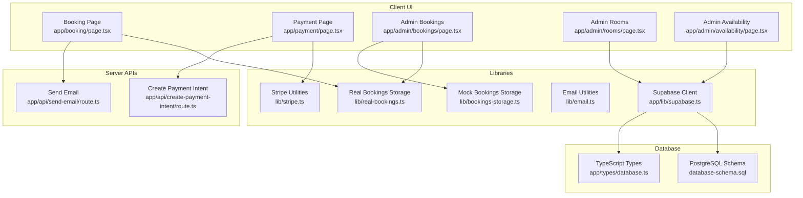
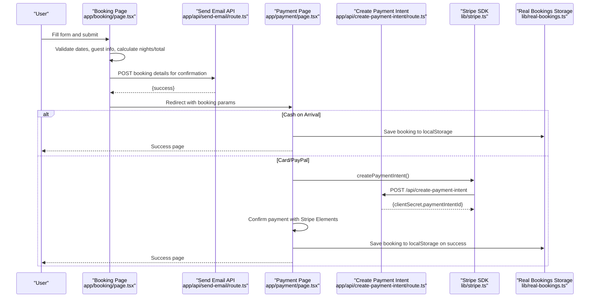
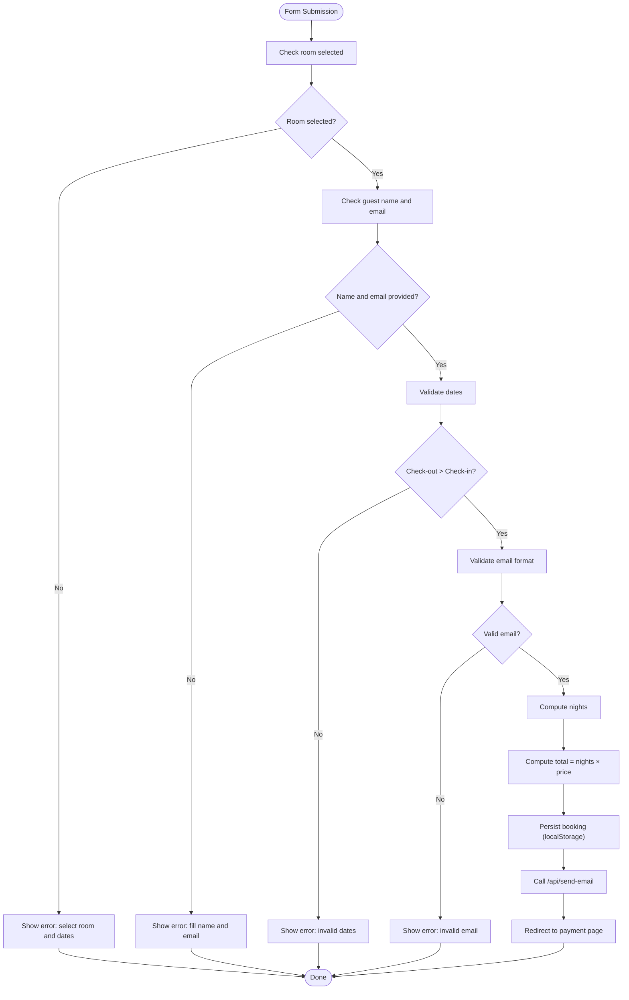
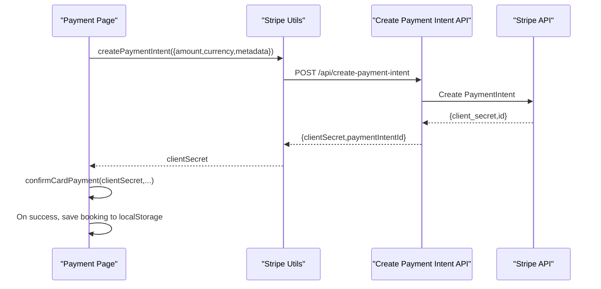
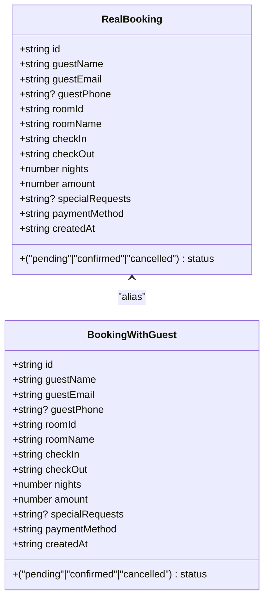
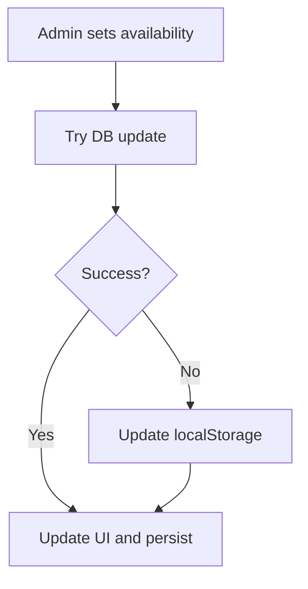
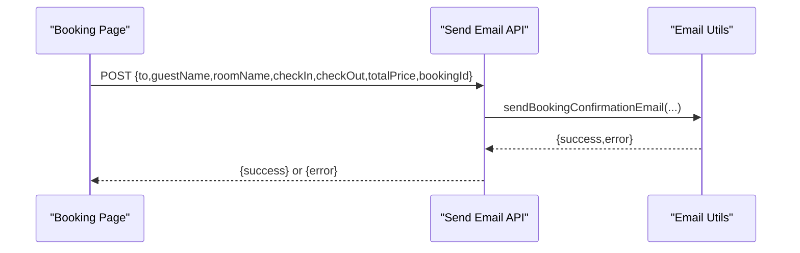
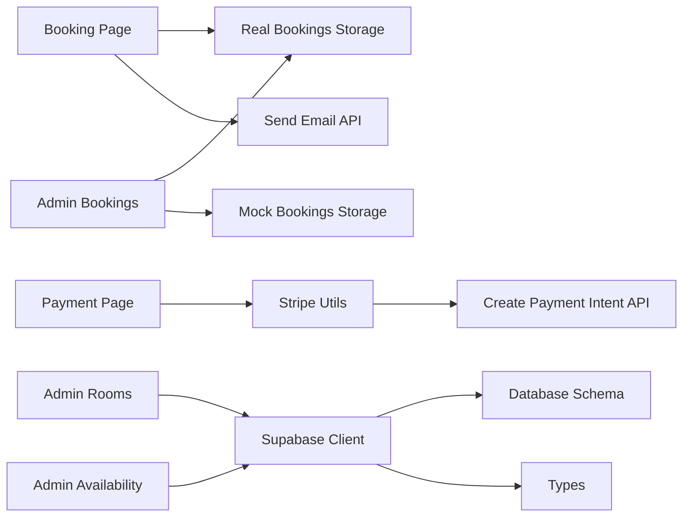

# Booking System

<cite>
**Referenced Files in This Document**
- [app/booking/page.tsx](file://app/booking/page.tsx)
- [lib/real-bookings.ts](file://lib/real-bookings.ts)
- [lib/bookings-storage.ts](file://lib/bookings-storage.ts)
- [app/admin/bookings/page.tsx](file://app/admin/bookings/page.tsx)
- [app/tabs/database.ts](file://app/tabs/database.ts)
- [app/lib/supabase.ts](file://app/lib/supabase.ts)
- [app/payment/page.tsx](file://app/payment/page.tsx)
- [lib/stripe.ts](file://lib/stripe.ts)
- [app/api/create-payment-intent/route.ts](file://app/api/create-payment-intent/route.ts)
- [app/api/send-email/route.ts](file://app/api/send-email/route.ts)
- [lib/email.ts](file://lib/email.ts)
- [app/admin/rooms/page.tsx](file://app/admin/rooms/page.tsx)
- [app/admin/availability/page.tsx](file://app/admin/availability/page.tsx)
- [app/types/database.ts](file://app/types/database.ts)
- [database-schema.sql](file://database-schema.sql)
</cite>

## Table of Contents
1. [Introduction](#introduction)
2. [Project Structure](#project-structure)
3. [Core Components](#core-components)
4. [Architecture Overview](#architecture-overview)
5. [Detailed Component Analysis](#detailed-component-analysis)
6. [Dependency Analysis](#dependency-analysis)
7. [Performance Considerations](#performance-considerations)
8. [Troubleshooting Guide](#troubleshooting-guide)
9. [Conclusion](#conclusion)
10. [Appendices](#appendices)

## Introduction
This document explains the booking management system end-to-end: from room selection and availability checks, through validation and pricing, to booking creation, status management, storage, real-time updates, and integration with payment processing. It also covers special requests handling, cancellation/refund procedures, and booking history tracking.

## Project Structure
The system is a Next.js application with:
- Client-side booking form and payment pages
- Admin dashboards for managing rooms, availability, and bookings
- Local storage-backed persistence for demo/admin scenarios
- Supabase client initialization for backend connectivity
- Stripe integration for payment intents and secure checkout
- Email APIs for confirmation messages

**Diagram sources**
- [app/booking/page.tsx:1-434](file://app/booking/page.tsx#L1-L434)
- [app/payment/page.tsx:1-352](file://app/payment/page.tsx#L1-L352)
- [app/admin/bookings/page.tsx:1-459](file://app/admin/bookings/page.tsx#L1-L459)
- [app/admin/rooms/page.tsx:1-280](file://app/admin/rooms/page.tsx#L1-L280)
- [app/admin/availability/page.tsx:1-281](file://app/admin/availability/page.tsx#L1-L281)
- [lib/real-bookings.ts:1-120](file://lib/real-bookings.ts#L1-L120)
- [lib/bookings-storage.ts:1-191](file://lib/bookings-storage.ts#L1-L191)
- [lib/stripe.ts:1-112](file://lib/stripe.ts#L1-L112)
- [lib/email.ts:1-75](file://lib/email.ts#L1-L75)
- [app/api/create-payment-intent/route.ts:1-33](file://app/api/create-payment-intent/route.ts#L1-L33)
- [app/api/send-email/route.ts:1-42](file://app/api/send-email/route.ts#L1-L42)
- [app/lib/supabase.ts:1-6](file://app/lib/supabase.ts#L1-L6)
- [database-schema.sql:1-119](file://database-schema.sql#L1-L119)
- [app/types/database.ts:1-146](file://app/types/database.ts#L1-L146)

**Section sources**
- [app/booking/page.tsx:1-434](file://app/booking/page.tsx#L1-L434)
- [app/payment/page.tsx:1-352](file://app/payment/page.tsx#L1-L352)
- [app/admin/bookings/page.tsx:1-459](file://app/admin/bookings/page.tsx#L1-L459)
- [app/admin/rooms/page.tsx:1-280](file://app/admin/rooms/page.tsx#L1-L280)
- [app/admin/availability/page.tsx:1-281](file://app/admin/availability/page.tsx#L1-L281)
- [lib/real-bookings.ts:1-120](file://lib/real-bookings.ts#L1-L120)
- [lib/bookings-storage.ts:1-191](file://lib/bookings-storage.ts#L1-L191)
- [lib/stripe.ts:1-112](file://lib/stripe.ts#L1-L112)
- [lib/email.ts:1-75](file://lib/email.ts#L1-L75)
- [app/api/create-payment-intent/route.ts:1-33](file://app/api/create-payment-intent/route.ts#L1-L33)
- [app/api/send-email/route.ts:1-42](file://app/api/send-email/route.ts#L1-L42)
- [app/lib/supabase.ts:1-6](file://app/lib/supabase.ts#L1-L6)
- [database-schema.sql:1-119](file://database-schema.sql#L1-L119)
- [app/types/database.ts:1-146](file://app/types/database.ts#L1-L146)

## Core Components
- Booking form and validation: room selection, guest info, stay dates, special requests, payment method, and total calculation.
- Payment processing: Stripe payment intent creation and confirmation, plus cash-on-arrival flow.
- Booking storage: local storage for admin/demo, plus mock storage module; admin dashboard syncs with localStorage.
- Availability management: admin toggles availability and falls back to localStorage when database is unavailable.
- Email notifications: API endpoint to send booking confirmation emails.
- Database schema and types: PostgreSQL schema with constraints and indexes; TypeScript types for entities and API responses.

**Section sources**
- [app/booking/page.tsx:44-178](file://app/booking/page.tsx#L44-L178)
- [app/payment/page.tsx:34-176](file://app/payment/page.tsx#L34-L176)
- [lib/real-bookings.ts:21-37](file://lib/real-bookings.ts#L21-L37)
- [lib/bookings-storage.ts:145-155](file://lib/bookings-storage.ts#L145-L155)
- [app/admin/availability/page.tsx:58-119](file://app/admin/availability/page.tsx#L58-L119)
- [app/api/send-email/route.ts:4-41](file://app/api/send-email/route.ts#L4-L41)
- [database-schema.sql:26-62](file://database-schema.sql#L26-L62)
- [app/types/database.ts:24-55](file://app/types/database.ts#L24-L55)

## Architecture Overview
The booking workflow spans client UI, server APIs, and storage layers. Payments integrate via Stripe’s Payment Intents API, while availability and room management are handled through Supabase and local fallbacks.

**Diagram sources**
- [app/booking/page.tsx:76-170](file://app/booking/page.tsx#L76-L170)
- [app/api/send-email/route.ts:4-41](file://app/api/send-email/route.ts#L4-L41)
- [app/payment/page.tsx:34-176](file://app/payment/page.tsx#L34-L176)
- [lib/stripe.ts:17-37](file://lib/stripe.ts#L17-L37)
- [app/api/create-payment-intent/route.ts:7-24](file://app/api/create-payment-intent/route.ts#L7-L24)
- [lib/real-bookings.ts:21-37](file://lib/real-bookings.ts#L21-L37)

## Detailed Component Analysis

### Booking Workflow and Validation
- Room selection and summary: users pick a room and see nightly rate and total cost computed from check-in/out dates.
- Validation rules:
  - Required fields: room, check-in/out dates, guest name, and email.
  - Date validation: check-out must be after check-in.
  - Email validation: basic regex pattern.
- Pricing calculation: nights = ceil(out.getTime - in.getTime)/ms-per-day; total = nights × price_per_night.
- Special requests: optional field captured in booking payload.
- Payment method: credit card, PayPal, or cash on arrival.

**Diagram sources**
- [app/booking/page.tsx:76-178](file://app/booking/page.tsx#L76-L178)
- [app/api/send-email/route.ts:4-41](file://app/api/send-email/route.ts#L4-L41)

**Section sources**
- [app/booking/page.tsx:44-178](file://app/booking/page.tsx#L44-L178)

### Payment Processing and Integration
- Stripe integration:
  - Frontend: createPaymentIntent via lib/stripe.ts calls /api/create-payment-intent.
  - Backend: app/api/create-payment-intent/route.ts creates PaymentIntent with amount and metadata.
  - Frontend confirms payment using Stripe Elements and saves booking on success.
- Cash on arrival:
  - Immediate booking creation and redirect to success page without Stripe.

**Diagram sources**
- [lib/stripe.ts:17-37](file://lib/stripe.ts#L17-L37)
- [app/api/create-payment-intent/route.ts:7-24](file://app/api/create-payment-intent/route.ts#L7-L24)
- [app/payment/page.tsx:72-176](file://app/payment/page.tsx#L72-L176)

**Section sources**
- [lib/stripe.ts:1-112](file://lib/stripe.ts#L1-L112)
- [app/api/create-payment-intent/route.ts:1-33](file://app/api/create-payment-intent/route.ts#L1-L33)
- [app/payment/page.tsx:34-176](file://app/payment/page.tsx#L34-L176)

### Booking Data Models and Persistence
- Real bookings model: includes guest info, room identifiers, dates, nights, amount, payment method, status, and timestamps.
- Storage:
  - Real bookings: persisted in browser localStorage under a dedicated key; supports CRUD and statistics.
  - Admin mock bookings: in-memory array and localStorage sync for admin UI.
- Admin dashboard:
  - Loads mock bookings and merges with localStorage entries.
  - Supports filtering by status, search term, and date range.
  - Updates status and deletes bookings with localStorage fallback.

**Diagram sources**
- [lib/real-bookings.ts:3-18](file://lib/real-bookings.ts#L3-L18)
- [lib/bookings-storage.ts:3-18](file://lib/bookings-storage.ts#L3-L18)

**Section sources**
- [lib/real-bookings.ts:1-120](file://lib/real-bookings.ts#L1-L120)
- [lib/bookings-storage.ts:1-191](file://lib/bookings-storage.ts#L1-L191)
- [app/admin/bookings/page.tsx:139-238](file://app/admin/bookings/page.tsx#L139-L238)

### Availability Management and Conflict Resolution
- Availability retrieval and updates:
  - Attempts database queries first; falls back to localStorage when database is unavailable.
  - Admin availability page loads from localStorage initially and persists updates locally if DB fails.
- Conflict resolution:
  - Database schema enforces check-in < check-out and uses a function to detect overlapping bookings for a room within a date range.
  - Room availability table ensures uniqueness per room/date and supports efficient lookups.

**Diagram sources**
- [app/admin/availability/page.tsx:58-119](file://app/admin/availability/page.tsx#L58-L119)

**Section sources**
- [app/admin/availability/page.tsx:19-119](file://app/admin/availability/page.tsx#L19-L119)
- [database-schema.sql:71-93](file://database-schema.sql#L71-L93)

### Email Confirmation Workflow
- The booking page triggers an API call to send a confirmation email with booking details.
- The email API validates required fields and delegates to email utilities.
- Email utilities currently log to console; production would integrate with EmailJS.

**Diagram sources**
- [app/booking/page.tsx:132-148](file://app/booking/page.tsx#L132-L148)
- [app/api/send-email/route.ts:4-41](file://app/api/send-email/route.ts#L4-L41)
- [lib/email.ts:1-75](file://lib/email.ts#L1-L75)

**Section sources**
- [app/booking/page.tsx:132-148](file://app/booking/page.tsx#L132-L148)
- [app/api/send-email/route.ts:1-42](file://app/api/send-email/route.ts#L1-L42)
- [lib/email.ts:1-75](file://lib/email.ts#L1-L75)

### Room Management and Availability UI
- Admin rooms page lists rooms, allows adding/updating/deleting rooms, and reflects availability status.
- Admin availability page filters and toggles availability per room/date, with localStorage fallback.

**Section sources**
- [app/admin/rooms/page.tsx:1-280](file://app/admin/rooms/page.tsx#L1-L280)
- [app/admin/availability/page.tsx:1-281](file://app/admin/availability/page.tsx#L1-L281)

## Dependency Analysis
- Client-side dependencies:
  - Booking and payment pages depend on localStorage for persistence and on Stripe utilities for payment intents.
  - Admin pages depend on localStorage and Supabase client for room/availability operations.
- Server-side dependencies:
  - Payment intent API depends on Stripe SDK.
  - Email API depends on email utilities.
- Database dependencies:
  - Supabase client initialized for backend connectivity.
  - Database schema defines entities, constraints, indexes, and a function to check room availability.

**Diagram sources**
- [app/booking/page.tsx:1-434](file://app/booking/page.tsx#L1-L434)
- [app/payment/page.tsx:1-352](file://app/payment/page.tsx#L1-L352)
- [lib/real-bookings.ts:1-120](file://lib/real-bookings.ts#L1-L120)
- [lib/bookings-storage.ts:1-191](file://lib/bookings-storage.ts#L1-L191)
- [lib/stripe.ts:1-112](file://lib/stripe.ts#L1-L112)
- [app/api/create-payment-intent/route.ts:1-33](file://app/api/create-payment-intent/route.ts#L1-L33)
- [app/admin/bookings/page.tsx:1-459](file://app/admin/bookings/page.tsx#L1-L459)
- [app/admin/rooms/page.tsx:1-280](file://app/admin/rooms/page.tsx#L1-L280)
- [app/admin/availability/page.tsx:1-281](file://app/admin/availability/page.tsx#L1-L281)
- [app/lib/supabase.ts:1-6](file://app/lib/supabase.ts#L1-L6)
- [database-schema.sql:1-119](file://database-schema.sql#L1-L119)
- [app/types/database.ts:1-146](file://app/types/database.ts#L1-L146)

**Section sources**
- [app/lib/supabase.ts:1-6](file://app/lib/supabase.ts#L1-L6)
- [database-schema.sql:1-119](file://database-schema.sql#L1-L119)
- [app/types/database.ts:1-146](file://app/types/database.ts#L1-L146)

## Performance Considerations
- Local storage usage: admin and demo flows rely on localStorage; consider pagination or virtualization for large datasets.
- Stripe amount formatting: ensure amounts are rounded to the smallest currency unit to avoid precision errors.
- Database constraints and indexes: the schema includes indexes on booking dates and room availability to optimize lookups.
- Availability checks: the PostgreSQL function efficiently detects conflicts for pending/confirmed bookings.

[No sources needed since this section provides general guidance]

## Troubleshooting Guide
- Payment failures:
  - Verify Stripe keys and network connectivity.
  - Check server logs for Payment Intent creation errors.
- Email delivery:
  - Confirm the email API receives required fields and review console logs.
  - Replace placeholder keys in email utilities for production.
- Availability updates:
  - If database operations fail, confirm localStorage fallback is functioning and persisted data is readable.
- Booking persistence:
  - Ensure localStorage is enabled and not blocked by browser settings.
  - Validate that booking IDs are unique and timestamps are properly formatted.

**Section sources**
- [lib/stripe.ts:17-37](file://lib/stripe.ts#L17-L37)
- [app/api/create-payment-intent/route.ts:25-31](file://app/api/create-payment-intent/route.ts#L25-L31)
- [lib/email.ts:11-53](file://lib/email.ts#L11-L53)
- [app/admin/availability/page.tsx:63-115](file://app/admin/availability/page.tsx#L63-L115)
- [lib/real-bookings.ts:40-49](file://lib/real-bookings.ts#L40-L49)

## Conclusion
The booking system integrates a user-friendly booking form, robust validation, flexible payment options (Stripe and cash), and admin tools for managing rooms, availability, and bookings. While the current implementation uses localStorage for persistence and admin/demo scenarios, the architecture supports seamless integration with Supabase for scalable data management and advanced availability checks.

[No sources needed since this section summarizes without analyzing specific files]

## Appendices

### Booking Data Model Reference
- Real booking fields: guest identity, room identifiers, stay dates, nights, amount, payment method, status, and timestamps.
- Admin mock booking fields: same as real booking with additional fields for UI presentation.

**Section sources**
- [lib/real-bookings.ts:3-18](file://lib/real-bookings.ts#L3-L18)
- [lib/bookings-storage.ts:3-18](file://lib/bookings-storage.ts#L3-L18)

### Database Schema Highlights
- Entities: users, rooms, bookings, room_availability, payments.
- Constraints: date validity, status enums, unique room-date availability.
- Functions and triggers: availability check function and updated_at triggers.

**Section sources**
- [database-schema.sql:26-62](file://database-schema.sql#L26-L62)
- [database-schema.sql:71-93](file://database-schema.sql#L71-L93)
- [database-schema.sql:95-118](file://database-schema.sql#L95-L118)

### TypeScript Types for Entities
- User, Room, Booking, RoomAvailability, Payment, and extended relations.
- API response wrapper and search filters.

**Section sources**
- [app/types/database.ts:3-146](file://app/types/database.ts#L3-L146)