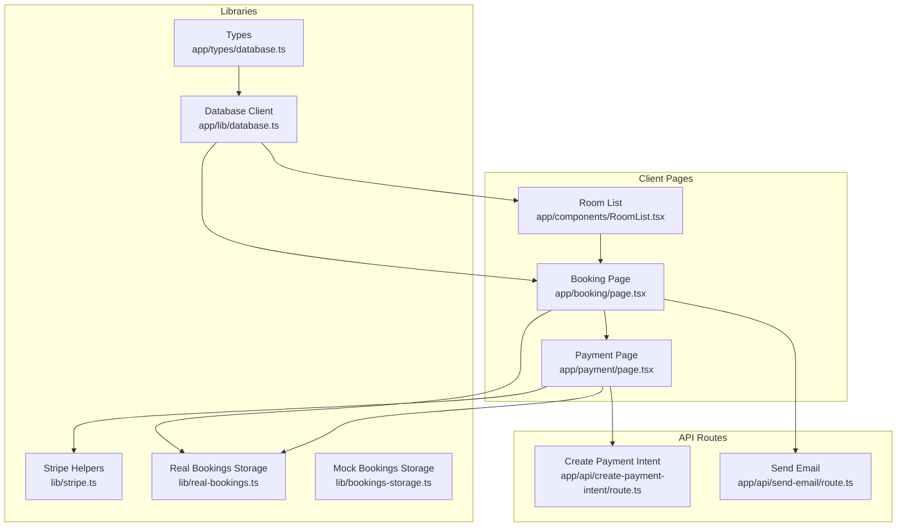
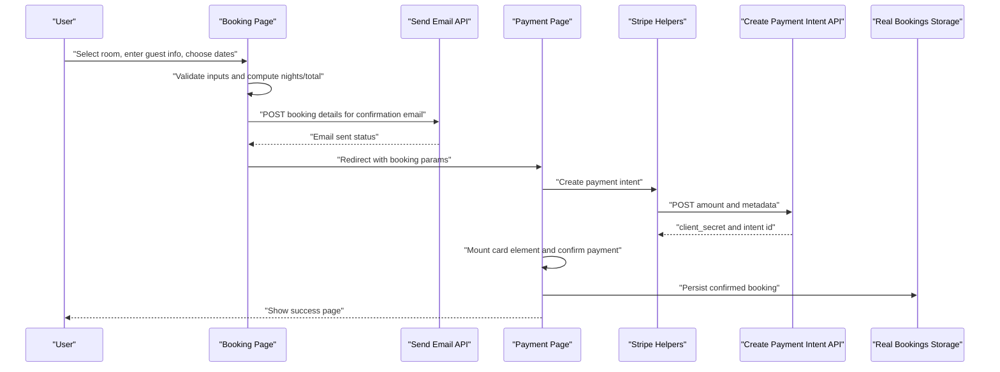
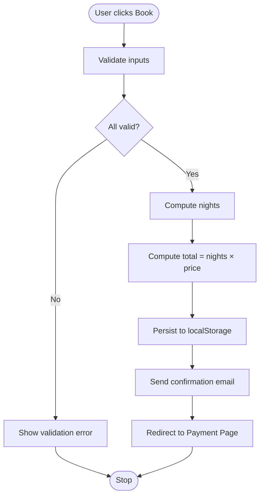
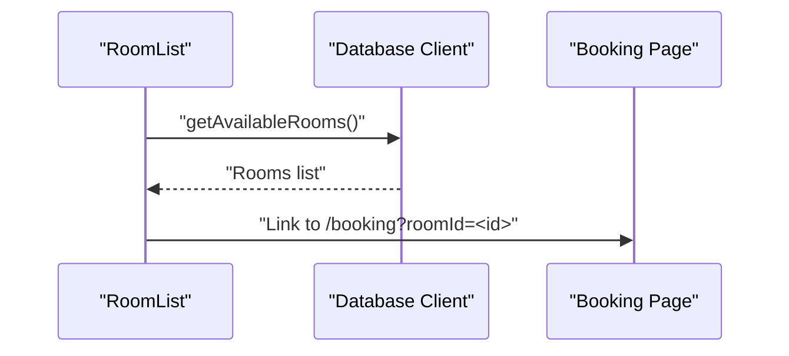
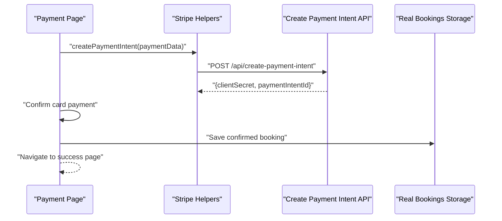
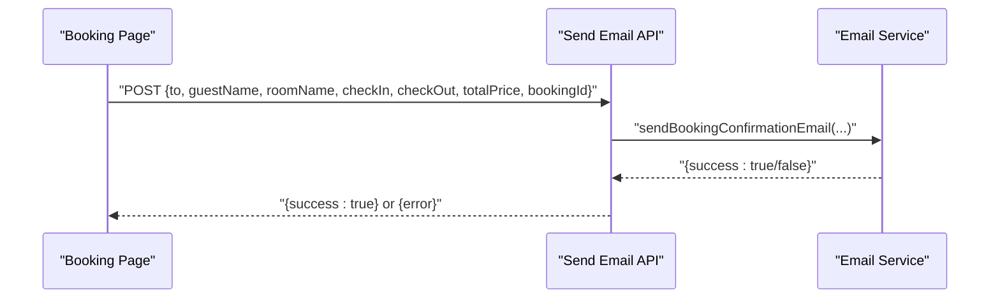
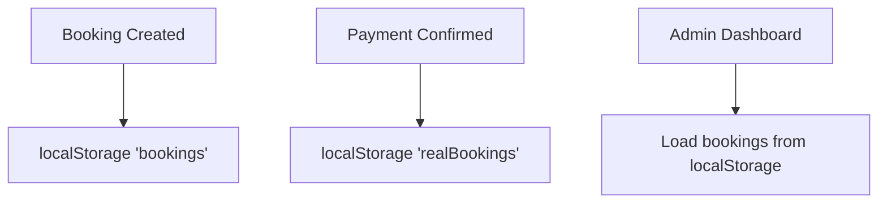
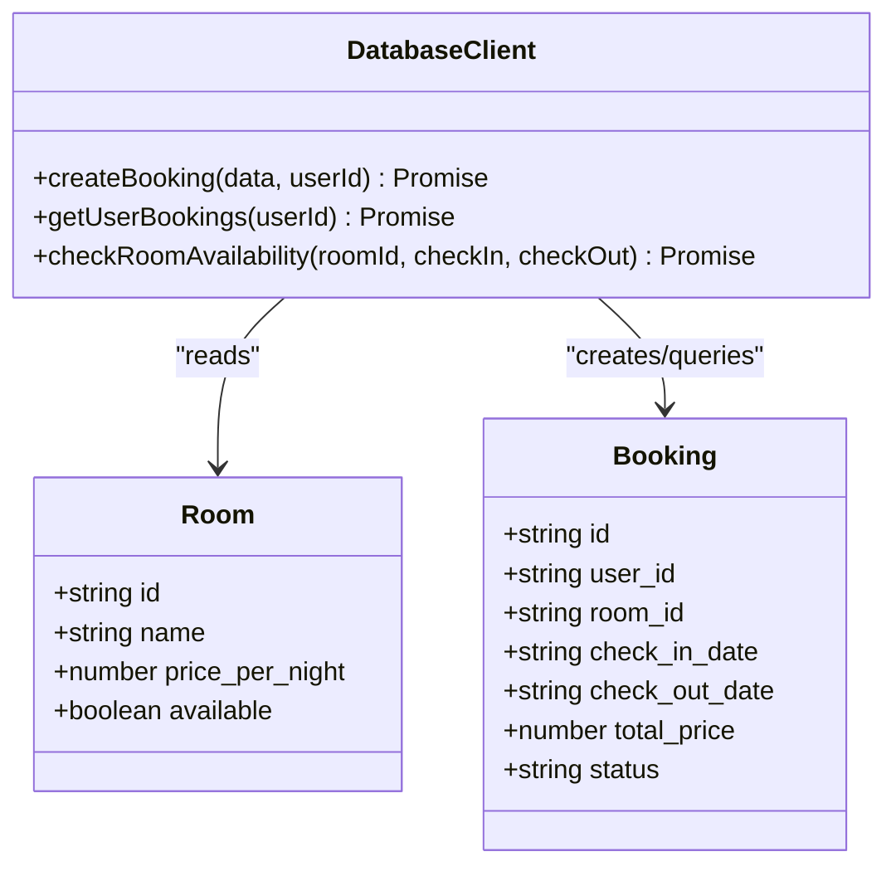
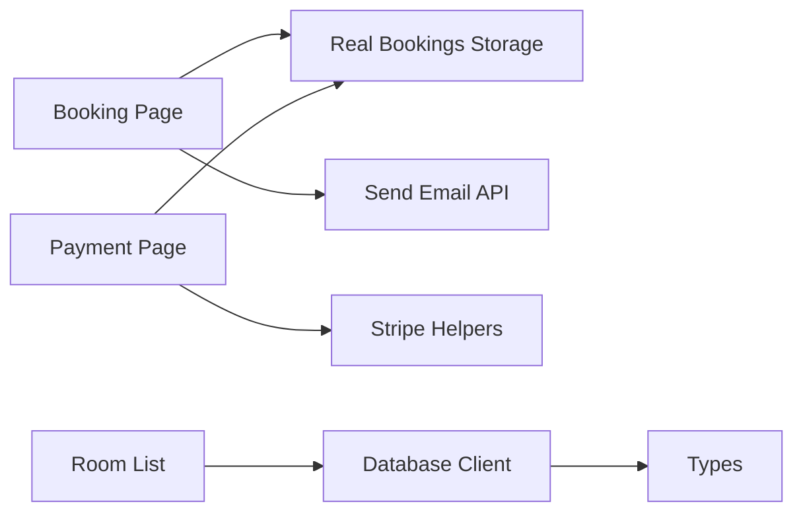

# Booking Workflow

<cite>
**Referenced Files in This Document**
- [app/booking/page.tsx](file://app/booking/page.tsx)
- [app/components/RoomList.tsx](file://app/components/RoomList.tsx)
- [app/payment/page.tsx](file://app/payment/page.tsx)
- [app/api/create-payment-intent/route.ts](file://app/api/create-payment-intent/route.ts)
- [app/api/send-email/route.ts](file://app/api/send-email/route.ts)
- [lib/stripe.ts](file://lib/stripe.ts)
- [lib/real-bookings.ts](file://lib/real-bookings.ts)
- [lib/bookings-storage.ts](file://lib/bookings-storage.ts)
- [app/lib/database.ts](file://app/lib/database.ts)
- [app/types/database.ts](file://app/types/database.ts)
</cite>

## Table of Contents
1. [Introduction](#introduction)
2. [Project Structure](#project-structure)
3. [Core Components](#core-components)
4. [Architecture Overview](#architecture-overview)
5. [Detailed Component Analysis](#detailed-component-analysis)
6. [Dependency Analysis](#dependency-analysis)
7. [Performance Considerations](#performance-considerations)
8. [Troubleshooting Guide](#troubleshooting-guide)
9. [Conclusion](#conclusion)

## Introduction
This document explains the complete booking workflow for the hostel application, from room selection through confirmation. It covers the step-by-step journey, form validation, data collection, user interactions, error handling, loading states, success confirmation, integration with local storage, and the transition to payment processing. Practical examples include validation rules, date validation algorithms, email validation patterns, and real-time total cost calculations.

## Project Structure
The booking workflow spans client-side pages, shared libraries, and API routes:
- Booking form and summary live in the booking page
- Room selection integrates with a room list component and database queries
- Payment processing uses Stripe intents and a dedicated payment page
- Email confirmation is handled via a Next.js API route and EmailJS integration
- Local storage persists temporary booking records for admin dashboards

**Diagram sources**
- [app/booking/page.tsx:1-434](file://app/booking/page.tsx#L1-L434)
- [app/components/RoomList.tsx:1-113](file://app/components/RoomList.tsx#L1-L113)
- [app/payment/page.tsx:1-352](file://app/payment/page.tsx#L1-L352)
- [lib/stripe.ts:1-112](file://lib/stripe.ts#L1-L112)
- [lib/real-bookings.ts:1-120](file://lib/real-bookings.ts#L1-L120)
- [lib/bookings-storage.ts:1-191](file://lib/bookings-storage.ts#L1-L191)
- [app/lib/database.ts:1-433](file://app/lib/database.ts#L1-L433)
- [app/types/database.ts:1-146](file://app/types/database.ts#L1-L146)
- [app/api/create-payment-intent/route.ts:1-33](file://app/api/create-payment-intent/route.ts#L1-L33)
- [app/api/send-email/route.ts:1-42](file://app/api/send-email/route.ts#L1-L42)

**Section sources**
- [app/booking/page.tsx:1-434](file://app/booking/page.tsx#L1-L434)
- [app/components/RoomList.tsx:1-113](file://app/components/RoomList.tsx#L1-L113)
- [app/payment/page.tsx:1-352](file://app/payment/page.tsx#L1-L352)
- [lib/stripe.ts:1-112](file://lib/stripe.ts#L1-L112)
- [lib/real-bookings.ts:1-120](file://lib/real-bookings.ts#L1-L120)
- [lib/bookings-storage.ts:1-191](file://lib/bookings-storage.ts#L1-L191)
- [app/lib/database.ts:1-433](file://app/lib/database.ts#L1-L433)
- [app/types/database.ts:1-146](file://app/types/database.ts#L1-L146)
- [app/api/create-payment-intent/route.ts:1-33](file://app/api/create-payment-intent/route.ts#L1-L33)
- [app/api/send-email/route.ts:1-42](file://app/api/send-email/route.ts#L1-L42)

## Core Components
- Booking Page: Collects guest info, handles room selection, validates inputs, calculates totals, sends confirmation email, and redirects to payment.
- Room List: Loads available rooms from the database and links to the booking page with prefilled room IDs.
- Payment Page: Handles payment methods, creates Stripe payment intents, mounts card elements, confirms payments, and persists confirmed bookings.
- Stripe Helpers: Encapsulates payment intent creation and amount formatting.
- Real Bookings Storage: Manages persisted booking records in localStorage for admin dashboards.
- Database Client: Provides room availability checks and booking creation for authenticated users.
- Types: Defines Room, Booking, and related interfaces used across components and APIs.

**Section sources**
- [app/booking/page.tsx:44-178](file://app/booking/page.tsx#L44-L178)
- [app/components/RoomList.tsx:7-26](file://app/components/RoomList.tsx#L7-L26)
- [app/payment/page.tsx:8-176](file://app/payment/page.tsx#L8-L176)
- [lib/stripe.ts:17-37](file://lib/stripe.ts#L17-L37)
- [lib/real-bookings.ts:21-37](file://lib/real-bookings.ts#L21-L37)
- [app/lib/database.ts:25-119](file://app/lib/database.ts#L25-L119)
- [app/types/database.ts:12-35](file://app/types/database.ts#L12-L35)

## Architecture Overview
The booking workflow follows a client-driven flow with serverless-like API routes for payment and email:

**Diagram sources**
- [app/booking/page.tsx:76-170](file://app/booking/page.tsx#L76-L170)
- [app/api/send-email/route.ts:4-28](file://app/api/send-email/route.ts#L4-L28)
- [app/payment/page.tsx:34-176](file://app/payment/page.tsx#L34-L176)
- [lib/stripe.ts:17-37](file://lib/stripe.ts#L17-L37)
- [app/api/create-payment-intent/route.ts:7-24](file://app/api/create-payment-intent/route.ts#L7-L24)
- [lib/real-bookings.ts:21-37](file://lib/real-bookings.ts#L21-L37)

## Detailed Component Analysis

### Booking Page: Room Selection, Validation, and Submission
- Room selection: Displays a list of rooms; clicking a room selects it for booking. The page can preselect a room via URL parameter.
- Guest information: Full name and email are required; phone is optional.
- Date picker: Check-in and check-out dates are required; minimum dates are enforced.
- Special requests: Optional textarea for guest notes.
- Payment method: Radio-style selection among credit card, PayPal, and cash on arrival.
- Validation:
  - Required fields: room, check-in, check-out, guest name, guest email.
  - Date validation: Check-out must be after check-in.
  - Email validation: Basic regex pattern.
- Real-time calculation: Nights computed as ceil(check-out - check-in), total equals nights × price_per_night.
- Submission:
  - Calculates nights and total.
  - Constructs a booking object with guest info, room details, dates, nights, amount, and payment method.
  - Persists to localStorage under a dedicated key for admin dashboards.
  - Attempts to send a confirmation email via the email API.
  - Redirects to the payment page with booking parameters.

**Diagram sources**
- [app/booking/page.tsx:76-170](file://app/booking/page.tsx#L76-L170)
- [app/booking/page.tsx:172-178](file://app/booking/page.tsx#L172-L178)

**Section sources**
- [app/booking/page.tsx:44-178](file://app/booking/page.tsx#L44-L178)

### Room List: Available Rooms and Prefilled Booking
- Fetches available rooms from the database and renders cards with name, description, capacity, price, availability, and a link to the booking page.
- The link passes the room ID as a URL parameter so the booking page can preselect the room.

**Diagram sources**
- [app/components/RoomList.tsx:12-26](file://app/components/RoomList.tsx#L12-L26)
- [app/lib/database.ts:25-34](file://app/lib/database.ts#L25-L34)

**Section sources**
- [app/components/RoomList.tsx:7-26](file://app/components/RoomList.tsx#L7-L26)
- [app/lib/database.ts:25-34](file://app/lib/database.ts#L25-L34)

### Payment Page: Methods, Stripe Intents, and Success
- Receives booking parameters from the URL.
- Supports multiple payment methods:
  - Cash on arrival: Immediately confirms and persists the booking.
  - Credit card/PayPal: Creates a Stripe payment intent, mounts a card element, and confirms the payment.
- On success, persists the booking to localStorage and navigates to the success page with booking details.

**Diagram sources**
- [app/payment/page.tsx:34-176](file://app/payment/page.tsx#L34-L176)
- [lib/stripe.ts:17-37](file://lib/stripe.ts#L17-L37)
- [app/api/create-payment-intent/route.ts:7-24](file://app/api/create-payment-intent/route.ts#L7-L24)
- [lib/real-bookings.ts:21-37](file://lib/real-bookings.ts#L21-L37)

**Section sources**
- [app/payment/page.tsx:8-176](file://app/payment/page.tsx#L8-L176)
- [lib/stripe.ts:17-37](file://lib/stripe.ts#L17-L37)
- [app/api/create-payment-intent/route.ts:7-24](file://app/api/create-payment-intent/route.ts#L7-L24)

### Email Confirmation Flow
- The booking page attempts to send a confirmation email by calling the email API route with guest and booking details.
- The API route validates required fields and invokes the email service, returning success or error.

**Diagram sources**
- [app/booking/page.tsx:132-148](file://app/booking/page.tsx#L132-L148)
- [app/api/send-email/route.ts:4-28](file://app/api/send-email/route.ts#L4-L28)

**Section sources**
- [app/booking/page.tsx:132-148](file://app/booking/page.tsx#L132-L148)
- [app/api/send-email/route.ts:4-28](file://app/api/send-email/route.ts#L4-L28)

### Local Storage Persistence and Admin Dashboards
- The booking page persists a temporary booking record to localStorage for admin dashboards.
- The payment page also persists confirmed bookings to localStorage for admin visibility.
- A separate mock storage module defines the shape and provides CRUD helpers for bookings.

**Diagram sources**
- [app/booking/page.tsx:125-129](file://app/booking/page.tsx#L125-L129)
- [app/payment/page.tsx:59-63](file://app/payment/page.tsx#L59-L63)
- [lib/bookings-storage.ts:3-18](file://lib/bookings-storage.ts#L3-L18)

**Section sources**
- [app/booking/page.tsx:125-129](file://app/booking/page.tsx#L125-L129)
- [app/payment/page.tsx:59-63](file://app/payment/page.tsx#L59-L63)
- [lib/bookings-storage.ts:3-18](file://lib/bookings-storage.ts#L3-L18)

### Database Integration (Authenticated Bookings)
- The database client supports creating bookings for authenticated users, calculating nights and total price, and retrieving user bookings.
- Room availability checks and search filters are available for advanced scenarios.

**Diagram sources**
- [app/types/database.ts:12-35](file://app/types/database.ts#L12-L35)
- [app/lib/database.ts:92-119](file://app/lib/database.ts#L92-L119)

**Section sources**
- [app/lib/database.ts:25-119](file://app/lib/database.ts#L25-L119)
- [app/types/database.ts:12-35](file://app/types/database.ts#L12-L35)

## Dependency Analysis
- The booking page depends on:
  - Room types and constants
  - Real bookings storage for persistence
  - Email API for confirmation
  - Router for navigation
- The payment page depends on:
  - Stripe helpers for payment intents
  - Real bookings storage for persistence
  - Router for navigation
- The email API depends on the email service implementation.
- The room list depends on the database client for fetching available rooms.

**Diagram sources**
- [app/booking/page.tsx:41-42](file://app/booking/page.tsx#L41-L42)
- [lib/real-bookings.ts:21-37](file://lib/real-bookings.ts#L21-L37)
- [app/api/send-email/route.ts:2](file://app/api/send-email/route.ts#L2)
- [app/payment/page.tsx:5](file://app/payment/page.tsx#L5)
- [lib/stripe.ts:1](file://lib/stripe.ts#L1)
- [app/components/RoomList.tsx:4](file://app/components/RoomList.tsx#L4)
- [app/lib/database.ts:1](file://app/lib/database.ts#L1)
- [app/types/database.ts:1-146](file://app/types/database.ts#L1-L146)

**Section sources**
- [app/booking/page.tsx:41-42](file://app/booking/page.tsx#L41-L42)
- [lib/real-bookings.ts:21-37](file://lib/real-bookings.ts#L21-L37)
- [app/api/send-email/route.ts:2](file://app/api/send-email/route.ts#L2)
- [app/payment/page.tsx:5](file://app/payment/page.tsx#L5)
- [lib/stripe.ts:1](file://lib/stripe.ts#L1)
- [app/components/RoomList.tsx:4](file://app/components/RoomList.tsx#L4)
- [app/lib/database.ts:1](file://app/lib/database.ts#L1)
- [app/types/database.ts:1-146](file://app/types/database.ts#L1-L146)

## Performance Considerations
- Real-time cost calculation occurs on the client; keep computations lightweight and avoid unnecessary re-renders by memoizing derived values.
- Email sending is asynchronous; show loading indicators and handle failures gracefully without blocking the user.
- Stripe payment intent creation should be retried with backoff on transient network errors.
- Local storage writes should be batched to reduce write frequency.

## Troubleshooting Guide
- Validation errors:
  - Ensure required fields are present before enabling the submit button.
  - Verify date comparisons and minimum date constraints.
- Email delivery:
  - Confirm the email API route receives all required fields.
  - Check browser console for network errors and API responses.
- Payment failures:
  - Inspect Stripe API responses and client secret retrieval.
  - Validate amount formatting and currency.
- Local storage persistence:
  - Confirm keys exist and are readable.
  - Handle parse errors when retrieving stored data.

**Section sources**
- [app/booking/page.tsx:76-97](file://app/booking/page.tsx#L76-L97)
- [app/api/send-email/route.ts:9-14](file://app/api/send-email/route.ts#L9-L14)
- [app/payment/page.tsx:171-175](file://app/payment/page.tsx#L171-L175)
- [lib/real-bookings.ts:40-49](file://lib/real-bookings.ts#L40-L49)

## Conclusion
The booking workflow integrates a straightforward client-side form with robust validation, real-time cost computation, email confirmation, and flexible payment options. Local storage ensures admin visibility, while Stripe enables secure card payments. The modular design allows easy extension for authenticated bookings, advanced availability checks, and richer payment methods.