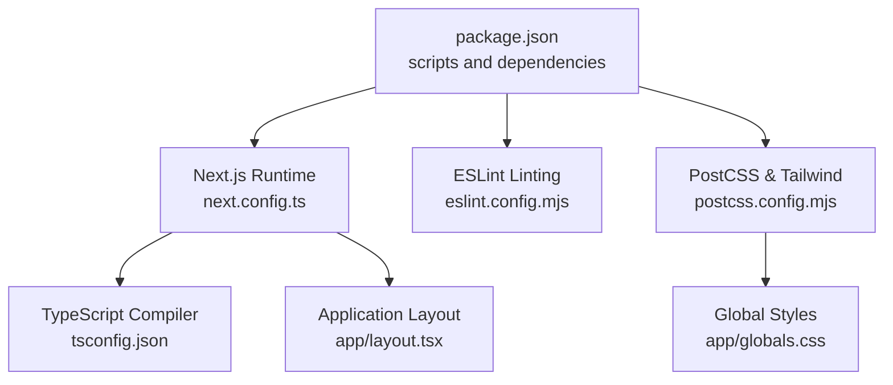
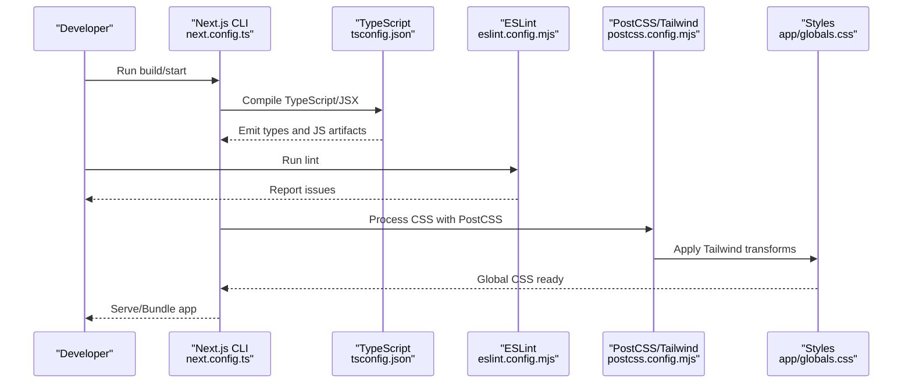
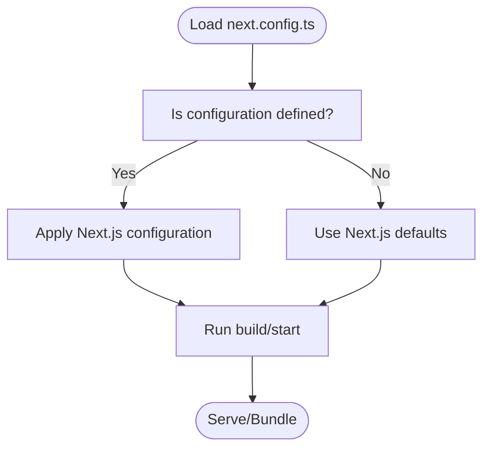
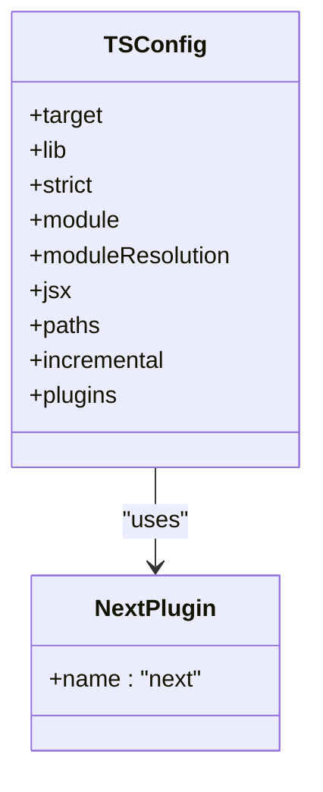
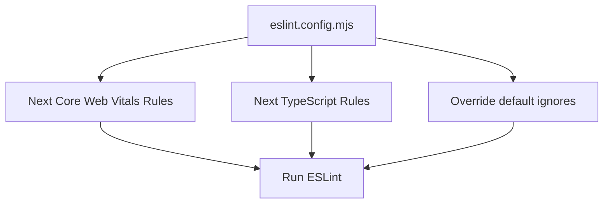
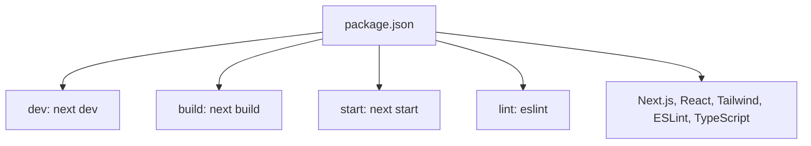
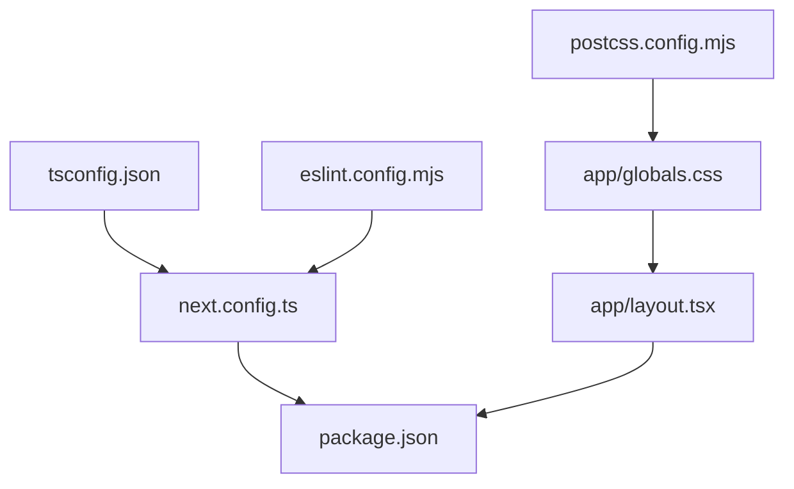

# Build Configuration and Optimization

<cite>
**Referenced Files in This Document**
- [next.config.ts](file://next.config.ts)
- [tsconfig.json](file://tsconfig.json)
- [eslint.config.mjs](file://eslint.config.mjs)
- [postcss.config.mjs](file://postcss.config.mjs)
- [package.json](file://package.json)
- [app/layout.tsx](file://app/layout.tsx)
- [app/globals.css](file://app/globals.css)
</cite>

## Table of Contents
1. [Introduction](#introduction)
2. [Project Structure](#project-structure)
3. [Core Components](#core-components)
4. [Architecture Overview](#architecture-overview)
5. [Detailed Component Analysis](#detailed-component-analysis)
6. [Dependency Analysis](#dependency-analysis)
7. [Performance Considerations](#performance-considerations)
8. [Troubleshooting Guide](#troubleshooting-guide)
9. [Conclusion](#conclusion)

## Introduction
This document explains the build configuration and optimization settings for the project. It covers Next.js configuration, TypeScript compiler options, ESLint setup, PostCSS and Tailwind CSS integration, and practical techniques for build performance and production customization. The goal is to help developers understand current settings, extend them safely, and optimize builds for speed and reliability.

## Project Structure
The build configuration is distributed across several files:
- Next.js runtime and bundling behavior is controlled via the Next.js configuration file.
- TypeScript compilation is governed by the TypeScript configuration file.
- Code quality and linting are enforced via the ESLint configuration file.
- CSS processing and Tailwind integration are handled by the PostCSS configuration file.
- Dependencies and scripts are defined in the package manifest.

**Diagram sources**
- [package.json:1-33](file://package.json#L1-L33)
- [next.config.ts:1-8](file://next.config.ts#L1-L8)
- [tsconfig.json:1-35](file://tsconfig.json#L1-L35)
- [eslint.config.mjs:1-19](file://eslint.config.mjs#L1-L19)
- [postcss.config.mjs:1-8](file://postcss.config.mjs#L1-L8)
- [app/layout.tsx:1-28](file://app/layout.tsx#L1-L28)
- [app/globals.css:1-239](file://app/globals.css#L1-L239)

**Section sources**
- [package.json:1-33](file://package.json#L1-L33)
- [next.config.ts:1-8](file://next.config.ts#L1-L8)
- [tsconfig.json:1-35](file://tsconfig.json#L1-L35)
- [eslint.config.mjs:1-19](file://eslint.config.mjs#L1-L19)
- [postcss.config.mjs:1-8](file://postcss.config.mjs#L1-L8)
- [app/layout.tsx:1-28](file://app/layout.tsx#L1-L28)
- [app/globals.css:1-239](file://app/globals.css#L1-L239)

## Core Components
- Next.js configuration: Defines runtime and build-time behavior. The current configuration file is present but currently empty, indicating default behavior is used.
- TypeScript configuration: Strict type checking, module resolution, JSX handling, and path aliases are configured.
- ESLint configuration: Extends Next.js recommended rules for web vitals and TypeScript, with explicit overrides for ignored paths.
- PostCSS and Tailwind: Tailwind is integrated via a PostCSS plugin, and global styles include Tailwind directives and theme tokens.

Key configuration highlights:
- Next.js: Empty configuration file indicates defaults are in effect.
- TypeScript: Strict mode enabled, incremental compilation, bundler module resolution, and path alias support.
- ESLint: Uses Next.js core-web-vitals and TypeScript presets with custom ignore list.
- PostCSS/Tailwind: Tailwind plugin configured; global CSS imports Tailwind and defines theme tokens and utilities.

**Section sources**
- [next.config.ts:1-8](file://next.config.ts#L1-L8)
- [tsconfig.json:1-35](file://tsconfig.json#L1-L35)
- [eslint.config.mjs:1-19](file://eslint.config.mjs#L1-L19)
- [postcss.config.mjs:1-8](file://postcss.config.mjs#L1-L8)
- [app/globals.css:1-239](file://app/globals.css#L1-L239)

## Architecture Overview
The build pipeline integrates TypeScript compilation, ESLint checks, PostCSS processing, and Next.js bundling. The application layout imports global styles, ensuring Tailwind utilities and theme tokens are available globally.

**Diagram sources**
- [next.config.ts:1-8](file://next.config.ts#L1-L8)
- [tsconfig.json:1-35](file://tsconfig.json#L1-L35)
- [eslint.config.mjs:1-19](file://eslint.config.mjs#L1-L19)
- [postcss.config.mjs:1-8](file://postcss.config.mjs#L1-L8)
- [app/globals.css:1-239](file://app/globals.css#L1-L239)

## Detailed Component Analysis

### Next.js Configuration
- Purpose: Centralized configuration for Next.js behavior (routing, static generation, experimental features, performance, and output targets).
- Current state: The configuration file exists but is empty, meaning defaults apply.
- Recommendations:
  - Add performance-focused options such as output tracing, appDir optimizations, and static export preferences if applicable.
  - Enable experimental features cautiously and document their impact.
  - Configure output targets (server, serverless, experimental edge runtime) based on deployment needs.

**Diagram sources**
- [next.config.ts:1-8](file://next.config.ts#L1-L8)

**Section sources**
- [next.config.ts:1-8](file://next.config.ts#L1-L8)

### TypeScript Configuration
- Strictness: Enabled strict type checking for safer code.
- Module Resolution: Uses bundler module resolution for compatibility with Next.js and modern tooling.
- JSX: Uses React JSX transform for optimal output.
- Path Aliases: Supports @/* path mapping for cleaner imports.
- Incremental Compilation: Enabled to improve rebuild times during development.
- Plugins: Includes the Next TypeScript plugin for framework-specific integrations.

**Diagram sources**
- [tsconfig.json:1-35](file://tsconfig.json#L1-L35)

**Section sources**
- [tsconfig.json:1-35](file://tsconfig.json#L1-L35)

### ESLint Configuration
- Presets: Extends Next.js recommended rules for core web vitals and TypeScript.
- Ignores: Overrides default ignores to include necessary paths for linting.
- Integration: Provides a single configuration file for linting across the project.

**Diagram sources**
- [eslint.config.mjs:1-19](file://eslint.config.mjs#L1-L19)

**Section sources**
- [eslint.config.mjs:1-19](file://eslint.config.mjs#L1-L19)

### PostCSS and Tailwind CSS Integration
- PostCSS Plugin: Tailwind plugin is configured in PostCSS.
- Global Styles: Tailwind is imported and theme tokens are defined; utilities and responsive helpers are included.
- Layout Integration: The root layout imports global styles, ensuring Tailwind utilities are available application-wide.

**Diagram sources**
- [postcss.config.mjs:1-8](file://postcss.config.mjs#L1-L8)
- [app/globals.css:1-239](file://app/globals.css#L1-L239)
- [app/layout.tsx:1-28](file://app/layout.tsx#L1-L28)

**Section sources**
- [postcss.config.mjs:1-8](file://postcss.config.mjs#L1-L8)
- [app/globals.css:1-239](file://app/globals.css#L1-L239)
- [app/layout.tsx:1-28](file://app/layout.tsx#L1-L28)

### Build Scripts and Dependencies
- Scripts: Standard Next.js scripts for development, building, and production serving.
- Dependencies: Next.js, React, Tailwind CSS v4, ESLint, TypeScript, and related packages.

**Diagram sources**
- [package.json:1-33](file://package.json#L1-L33)

**Section sources**
- [package.json:1-33](file://package.json#L1-L33)

## Dependency Analysis
- Next.js runtime depends on TypeScript configuration for type-safe compilation and bundling.
- ESLint relies on Next.js presets and project ignores to enforce code quality.
- PostCSS and Tailwind process global styles and integrate with the application layout.
- Package scripts orchestrate the build, lint, and serve workflows.

**Diagram sources**
- [tsconfig.json:1-35](file://tsconfig.json#L1-L35)
- [eslint.config.mjs:1-19](file://eslint.config.mjs#L1-L19)
- [postcss.config.mjs:1-8](file://postcss.config.mjs#L1-L8)
- [app/globals.css:1-239](file://app/globals.css#L1-L239)
- [app/layout.tsx:1-28](file://app/layout.tsx#L1-L28)
- [next.config.ts:1-8](file://next.config.ts#L1-L8)
- [package.json:1-33](file://package.json#L1-L33)

**Section sources**
- [tsconfig.json:1-35](file://tsconfig.json#L1-L35)
- [eslint.config.mjs:1-19](file://eslint.config.mjs#L1-L19)
- [postcss.config.mjs:1-8](file://postcss.config.mjs#L1-L8)
- [app/globals.css:1-239](file://app/globals.css#L1-L239)
- [app/layout.tsx:1-28](file://app/layout.tsx#L1-L28)
- [next.config.ts:1-8](file://next.config.ts#L1-L8)
- [package.json:1-33](file://package.json#L1-L33)

## Performance Considerations
- TypeScript incremental compilation: Enabled to reduce rebuild times during development.
- Strict mode: Helps catch errors early, potentially reducing runtime issues.
- Bundler module resolution: Aligns with Next.js expectations for efficient bundling.
- PostCSS/Tailwind: Tailwind’s purge and minification are handled by the framework; ensure production builds are used for optimized CSS.
- Next.js output tracing and static exports: Consider enabling for smaller bundles and faster cold starts when appropriate.
- Experimental features: Use sparingly and measure impact on build times and stability.

[No sources needed since this section provides general guidance]

## Troubleshooting Guide
- Empty Next.js configuration: If unexpected behavior occurs, review defaults and consider adding targeted configuration.
- ESLint ignores: Verify that the override list matches your project structure to avoid missing files.
- Tailwind utilities not applied: Confirm Tailwind is imported in global CSS and the layout imports global styles.
- TypeScript path aliases: Ensure path mapping aligns with actual file locations to prevent import errors.

**Section sources**
- [next.config.ts:1-8](file://next.config.ts#L1-L8)
- [eslint.config.mjs:1-19](file://eslint.config.mjs#L1-L19)
- [app/globals.css:1-239](file://app/globals.css#L1-L239)
- [app/layout.tsx:1-28](file://app/layout.tsx#L1-L28)

## Conclusion
The project’s build configuration leverages Next.js defaults, strict TypeScript settings, ESLint presets, and Tailwind via PostCSS. To further optimize builds, consider adding Next.js-specific configuration for performance and output targets, validating ESLint ignores, and ensuring Tailwind is fully integrated in production builds. These steps will improve developer experience, code quality, and runtime performance.

[No sources needed since this section summarizes without analyzing specific files]