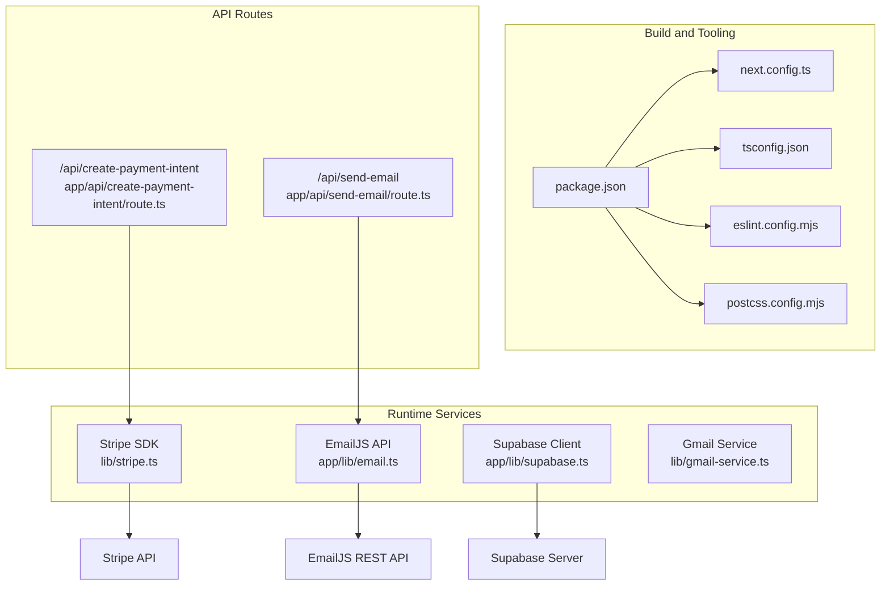
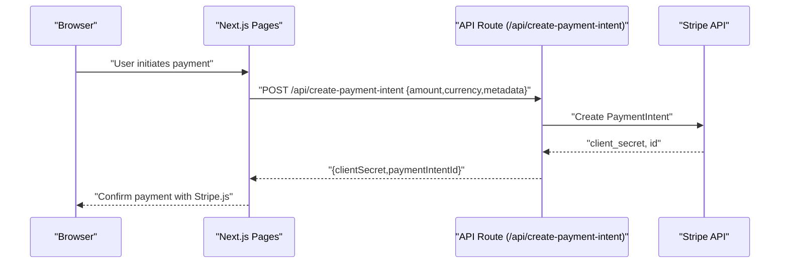
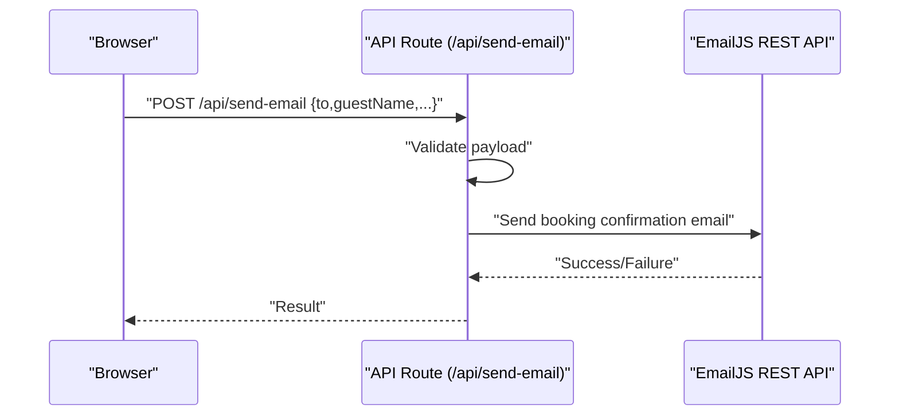
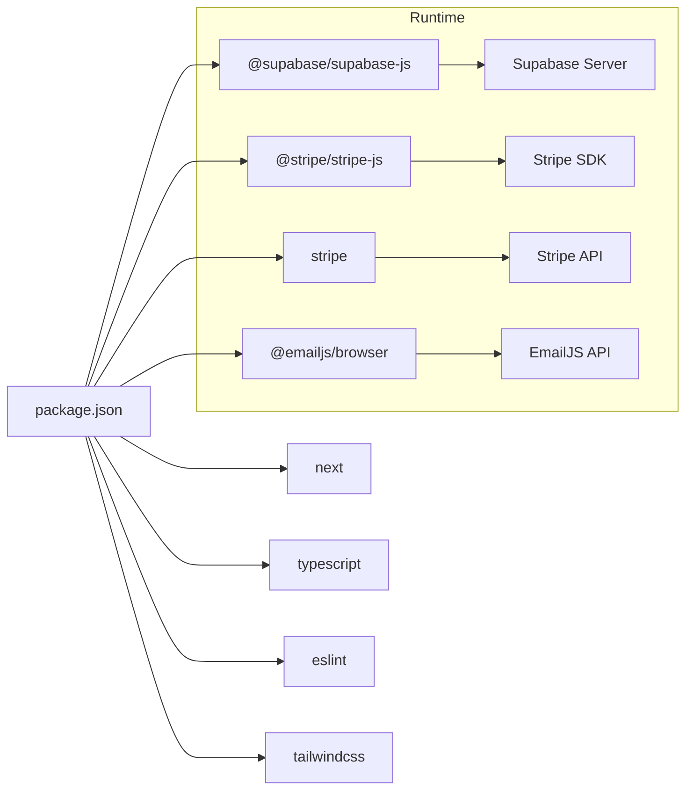

# Configuration and Deployment

<cite>
**Referenced Files in This Document**
- [package.json](file://package.json)
- [next.config.ts](file://next.config.ts)
- [tsconfig.json](file://tsconfig.json)
- [eslint.config.mjs](file://eslint.config.mjs)
- [postcss.config.mjs](file://postcss.config.mjs)
- [app/lib/supabase.ts](file://app/lib/supabase.ts)
- [lib/stripe.ts](file://lib/stripe.ts)
- [app/lib/email.ts](file://app/lib/email.ts)
- [lib/email.ts](file://lib/email.ts)
- [lib/gmail-service.ts](file://lib/gmail-service.ts)
- [app/api/create-payment-intent/route.ts](file://app/api/create-payment-intent/route.ts)
- [app/api/send-email/route.ts](file://app/api/send-email/route.ts)
</cite>

## Table of Contents
1. [Introduction](#introduction)
2. [Project Structure](#project-structure)
3. [Core Components](#core-components)
4. [Architecture Overview](#architecture-overview)
5. [Detailed Component Analysis](#detailed-component-analysis)
6. [Dependency Analysis](#dependency-analysis)
7. [Performance Considerations](#performance-considerations)
8. [Troubleshooting Guide](#troubleshooting-guide)
9. [Conclusion](#conclusion)
10. [Appendices](#appendices)

## Introduction
This document provides comprehensive guidance for configuring and deploying the project across development, staging, and production environments. It covers environment variable configuration for Supabase credentials, Stripe keys, email service settings, and application secrets; build configuration with Next.js optimization settings, TypeScript compilation, and ESLint integration; deployment strategies for Vercel, local servers, and containerized environments; production optimization techniques; performance monitoring setup; security hardening measures; CI/CD pipeline configuration, automated testing integration, and rollback procedures; and troubleshooting guides for common deployment issues and environment-specific configurations.

## Project Structure
The project is a Next.js application with a frontend focused on booking management, integrated with Supabase for authentication and database operations, Stripe for payments, and EmailJS for email notifications. Build-time configuration is handled via Next.js, TypeScript, ESLint, and PostCSS/Tailwind.

**Diagram sources**
- [package.json:1-33](file://package.json#L1-L33)
- [next.config.ts:1-8](file://next.config.ts#L1-L8)
- [tsconfig.json:1-35](file://tsconfig.json#L1-L35)
- [eslint.config.mjs:1-19](file://eslint.config.mjs#L1-L19)
- [postcss.config.mjs:1-8](file://postcss.config.mjs#L1-L8)
- [app/lib/supabase.ts:1-6](file://app/lib/supabase.ts#L1-L6)
- [lib/stripe.ts:1-112](file://lib/stripe.ts#L1-L112)
- [app/lib/email.ts:1-49](file://app/lib/email.ts#L1-L49)
- [lib/gmail-service.ts:1-117](file://lib/gmail-service.ts#L1-L117)
- [app/api/create-payment-intent/route.ts:1-33](file://app/api/create-payment-intent/route.ts#L1-L33)
- [app/api/send-email/route.ts:1-42](file://app/api/send-email/route.ts#L1-L42)

**Section sources**
- [package.json:1-33](file://package.json#L1-L33)
- [next.config.ts:1-8](file://next.config.ts#L1-L8)
- [tsconfig.json:1-35](file://tsconfig.json#L1-L35)
- [eslint.config.mjs:1-19](file://eslint.config.mjs#L1-L19)
- [postcss.config.mjs:1-8](file://postcss.config.mjs#L1-L8)

## Core Components
- Environment variables and secrets
  - Supabase: client initialization uses a hardcoded client URL and key in the current code. These should be moved to environment variables for security.
  - Stripe: client-side publishable key and server-side secret key are hardcoded in multiple locations. Replace with environment variables.
  - EmailJS: requires service ID, template ID, and public/private keys. These must be configured via environment variables.
- Build configuration
  - Next.js: minimal configuration file present; consider adding optimization settings for production.
  - TypeScript: strict mode enabled with bundler module resolution and incremental builds.
  - ESLint: integrates Next.js core web vitals and TypeScript rules with custom ignores.
  - PostCSS/Tailwind: Tailwind plugin configured via PostCSS.
- Runtime services
  - Supabase client initialized in the app layer.
  - Stripe SDK used for client-side payment intents and sessions; server-side API route creates payment intents.
  - EmailJS integration for sending booking confirmation emails; API route validates payload and forwards to email service.
  - Gmail service provides a frontend simulation; production should use a backend transport.

**Section sources**
- [app/lib/supabase.ts:1-6](file://app/lib/supabase.ts#L1-L6)
- [lib/stripe.ts:1-112](file://lib/stripe.ts#L1-L112)
- [app/lib/email.ts:1-49](file://app/lib/email.ts#L1-L49)
- [app/api/create-payment-intent/route.ts:1-33](file://app/api/create-payment-intent/route.ts#L1-L33)
- [app/api/send-email/route.ts:1-42](file://app/api/send-email/route.ts#L1-L42)
- [next.config.ts:1-8](file://next.config.ts#L1-L8)
- [tsconfig.json:1-35](file://tsconfig.json#L1-L35)
- [eslint.config.mjs:1-19](file://eslint.config.mjs#L1-L19)
- [postcss.config.mjs:1-8](file://postcss.config.mjs#L1-L8)

## Architecture Overview
The runtime architecture separates frontend concerns (Next.js pages and components) from backend concerns (API routes). Payments are processed via Stripe using a server-side route to keep secret keys secure. Emails are sent using EmailJS through an API route that validates inputs and forwards to the EmailJS REST API.

**Diagram sources**
- [lib/stripe.ts:17-37](file://lib/stripe.ts#L17-L37)
- [app/api/create-payment-intent/route.ts:7-24](file://app/api/create-payment-intent/route.ts#L7-L24)

**Diagram sources**
- [app/api/send-email/route.ts:4-33](file://app/api/send-email/route.ts#L4-L33)
- [app/lib/email.ts:12-43](file://app/lib/email.ts#L12-L43)

## Detailed Component Analysis

### Environment Variable Configuration
- Supabase
  - Current code initializes the client with a hardcoded URL and key. Move to environment variables and inject at runtime.
  - Reference: [app/lib/supabase.ts:3-6](file://app/lib/supabase.ts#L3-L6)
- Stripe
  - Client-side publishable key and server-side secret key are hardcoded. Replace with environment variables.
  - References:
    - [lib/stripe.ts:4](file://lib/stripe.ts#L4)
    - [app/api/create-payment-intent/route.ts:5](file://app/api/create-payment-intent/route.ts#L5)
- EmailJS
  - Requires EMAILJS_SERVICE_ID, EMAILJS_TEMPLATE_ID, EMAILJS_PUBLIC_KEY, EMAILJS_PRIVATE_KEY.
  - References:
    - [app/lib/email.ts:6-22](file://app/lib/email.ts#L6-L22)
    - [app/api/send-email/route.ts:16-24](file://app/api/send-email/route.ts#L16-L24)

Best practices:
- Store secrets in a secrets manager or platform-provided environment variables.
- Never commit secrets to version control.
- Use separate keys for development, staging, and production.

**Section sources**
- [app/lib/supabase.ts:1-6](file://app/lib/supabase.ts#L1-L6)
- [lib/stripe.ts:1-112](file://lib/stripe.ts#L1-L112)
- [app/lib/email.ts:1-49](file://app/lib/email.ts#L1-L49)
- [app/api/send-email/route.ts:1-42](file://app/api/send-email/route.ts#L1-L42)

### Build Configuration
- Next.js
  - The configuration file exists but is empty. Add production optimizations such as image optimization, static export options, and experimental flags as needed.
  - Reference: [next.config.ts:1-8](file://next.config.ts#L1-L8)
- TypeScript
  - Strict mode enabled, bundler module resolution, isolated modules, and incremental builds improve reliability and performance.
  - Reference: [tsconfig.json:2-24](file://tsconfig.json#L2-L24)
- ESLint
  - Integrates Next.js core web vitals and TypeScript rules; custom ignores override defaults.
  - Reference: [eslint.config.mjs:5-16](file://eslint.config.mjs#L5-L16)
- PostCSS/Tailwind
  - Tailwind plugin configured via PostCSS.
  - Reference: [postcss.config.mjs:1-8](file://postcss.config.mjs#L1-L8)

Recommended additions:
- Next.js: enable static generation for pages where appropriate; configure output tracing for smaller serverless bundles.
- TypeScript: consider enabling noImplicitReturns and strictNullChecks for stricter type checking.
- ESLint: add project-specific rules and disable unused default ignores selectively.

**Section sources**
- [next.config.ts:1-8](file://next.config.ts#L1-L8)
- [tsconfig.json:1-35](file://tsconfig.json#L1-L35)
- [eslint.config.mjs:1-19](file://eslint.config.mjs#L1-L19)
- [postcss.config.mjs:1-8](file://postcss.config.mjs#L1-L8)

### Deployment Strategies
- Vercel
  - Recommended for Next.js deployments. Configure environment variables in Vercel dashboard per environment.
  - Build command: use the existing scripts defined in package.json.
  - References:
    - [package.json:5-10](file://package.json#L5-L10)
    - [next.config.ts:1-8](file://next.config.ts#L1-L8)
- Local server
  - Use the start script to run the production server after building.
  - Reference: [package.json:8](file://package.json#L8)
- Containerized environments
  - Build a minimal Docker image using the production build and start command.
  - Example steps:
    - Install dependencies with production flags.
    - Run Next.js build.
    - Start with the production command.
  - References:
    - [package.json:7, 8:7-8](file://package.json#L7-L8)
    - [next.config.ts:1-8](file://next.config.ts#L1-L8)

Security hardening:
- Pin dependency versions and regularly update.
- Use HTTPS everywhere; enforce HSTS.
- Restrict origin access for API routes and external integrations.

**Section sources**
- [package.json:1-33](file://package.json#L1-L33)
- [next.config.ts:1-8](file://next.config.ts#L1-L8)

### Production Optimization Techniques
- Next.js
  - Enable static generation for content that does not change frequently.
  - Use dynamic imports for heavy components to reduce initial bundle size.
  - Leverage output tracing to minimize serverless bundle size.
- TypeScript
  - Keep strict mode enabled; consider incremental builds for faster CI.
- ESLint
  - Integrate lint-on-save and pre-commit hooks to prevent problematic code from being merged.
- Assets
  - Optimize images and fonts; leverage Next.js image optimization for responsive images.

[No sources needed since this section provides general guidance]

### Performance Monitoring Setup
- Instrument API routes to capture latency and error rates.
- Track client-side metrics using the core web vitals rules already included in ESLint configuration.
- Set up logging for email and payment operations to detect anomalies early.

[No sources needed since this section provides general guidance]

### Security Hardening Measures
- Secrets management
  - Move all hardcoded credentials to environment variables managed by the platform.
- Input validation
  - Validate and sanitize all inputs in API routes before processing.
- CORS and rate limiting
  - Configure CORS policies for API routes and apply rate limits for email and payment endpoints.
- Transport security
  - Enforce TLS for all external API calls (Stripe, EmailJS).

**Section sources**
- [app/api/send-email/route.ts:9-14](file://app/api/send-email/route.ts#L9-L14)
- [app/api/create-payment-intent/route.ts:9-19](file://app/api/create-payment-intent/route.ts#L9-L19)

### CI/CD Pipeline Configuration
- Build and test
  - Use the existing scripts for building and linting.
  - Add automated tests for critical paths (e.g., payment intent creation, email sending).
- Deploy
  - Automate deployment to Vercel or container registry with environment-specific variables.
- Rollback
  - Maintain immutable artifacts and support quick rollbacks to previous successful builds.

References:
- [package.json:5-10](file://package.json#L5-L10)

**Section sources**
- [package.json:1-33](file://package.json#L1-L33)

### Automated Testing Integration
- Unit tests
  - Test Stripe helpers and email utilities in isolation using mocked fetch responses.
- Integration tests
  - Validate API routes with mock external services.
- Linting
  - Ensure ESLint runs in CI to maintain code quality.

[No sources needed since this section provides general guidance]

### Rollback Procedures
- Version control
  - Tag releases and keep deployment logs.
- Platform rollback
  - Use Vercel’s deployment history to roll back to a previous successful build.
- Data safety
  - For Supabase, maintain backups and migration scripts.

[No sources needed since this section provides general guidance]

## Dependency Analysis
The project relies on Next.js for the frontend framework, TypeScript for type safety, ESLint for code quality, and Tailwind via PostCSS. Runtime dependencies include Supabase for authentication and database, Stripe for payments, and EmailJS for email delivery.

**Diagram sources**
- [package.json:11-31](file://package.json#L11-L31)

**Section sources**
- [package.json:1-33](file://package.json#L1-L33)

## Performance Considerations
- Minimize client-side dependencies and lazy-load heavy components.
- Use Next.js static generation and ISR for content-heavy pages.
- Monitor API route performance and external service latencies.
- Optimize database queries and caching strategies for Supabase.

[No sources needed since this section provides general guidance]

## Troubleshooting Guide
Common issues and resolutions:
- Stripe errors
  - Verify secret and publishable keys are set in environment variables and match the expected mode (test vs. live).
  - Check API route error responses for detailed messages.
  - References:
    - [lib/stripe.ts:27-36](file://lib/stripe.ts#L27-L36)
    - [app/api/create-payment-intent/route.ts:25-31](file://app/api/create-payment-intent/route.ts#L25-L31)
- EmailJS failures
  - Confirm EMAILJS_SERVICE_ID, EMAILJS_TEMPLATE_ID, EMAILJS_PUBLIC_KEY, and EMAILJS_PRIVATE_KEY are configured.
  - Review API route validation and error handling.
  - References:
    - [app/lib/email.ts:6-41](file://app/lib/email.ts#L6-L41)
    - [app/api/send-email/route.ts:9-33](file://app/api/send-email/route.ts#L9-L33)
- Supabase connectivity
  - Ensure SUPABASE_URL and SUPABASE_ANON_KEY are set and accessible to the runtime environment.
  - References:
    - [app/lib/supabase.ts:3-6](file://app/lib/supabase.ts#L3-L6)
- Build failures
  - Validate TypeScript configuration and ESLint rules.
  - References:
    - [tsconfig.json:2-24](file://tsconfig.json#L2-L24)
    - [eslint.config.mjs:5-16](file://eslint.config.mjs#L5-L16)

**Section sources**
- [lib/stripe.ts:1-112](file://lib/stripe.ts#L1-L112)
- [app/api/create-payment-intent/route.ts:1-33](file://app/api/create-payment-intent/route.ts#L1-L33)
- [app/lib/email.ts:1-49](file://app/lib/email.ts#L1-L49)
- [app/api/send-email/route.ts:1-42](file://app/api/send-email/route.ts#L1-L42)
- [app/lib/supabase.ts:1-6](file://app/lib/supabase.ts#L1-L6)
- [tsconfig.json:1-35](file://tsconfig.json#L1-L35)
- [eslint.config.mjs:1-19](file://eslint.config.mjs#L1-L19)

## Conclusion
This guide outlines how to securely configure environment variables, optimize the build pipeline, and deploy the project reliably across Vercel, local servers, and containers. By centralizing secrets, validating inputs, instrumenting performance, and establishing robust CI/CD practices, you can achieve a resilient and scalable deployment strategy.

[No sources needed since this section summarizes without analyzing specific files]

## Appendices
- Environment variable reference
  - Supabase: SUPABASE_URL, SUPABASE_ANON_KEY
  - Stripe: STRIPE_PUBLISHABLE_KEY, STRIPE_SECRET_KEY
  - EmailJS: EMAILJS_SERVICE_ID, EMAILJS_TEMPLATE_ID, EMAILJS_PUBLIC_KEY, EMAILJS_PRIVATE_KEY
- Next.js optimization checklist
  - Enable static generation for content pages.
  - Use dynamic imports for heavy components.
  - Configure output tracing for serverless deployments.
- Security checklist
  - Rotate keys regularly.
  - Limit permissions for service accounts.
  - Audit API routes for input validation and error handling.

[No sources needed since this section provides general guidance]