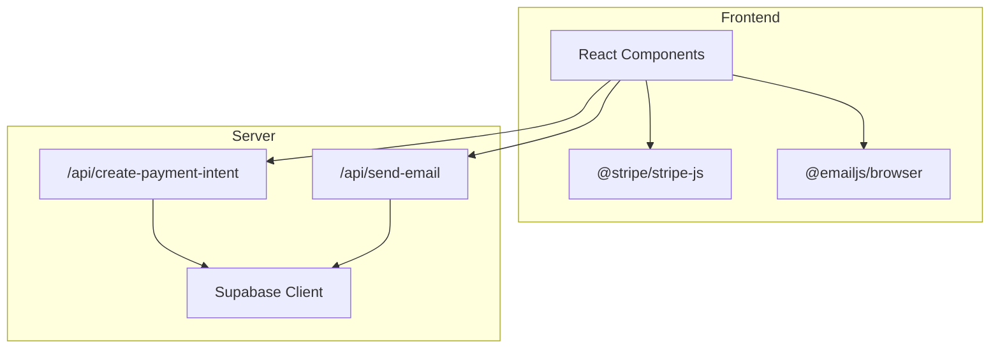
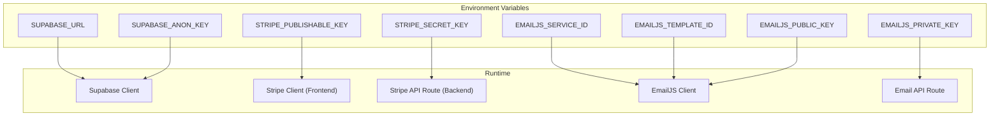
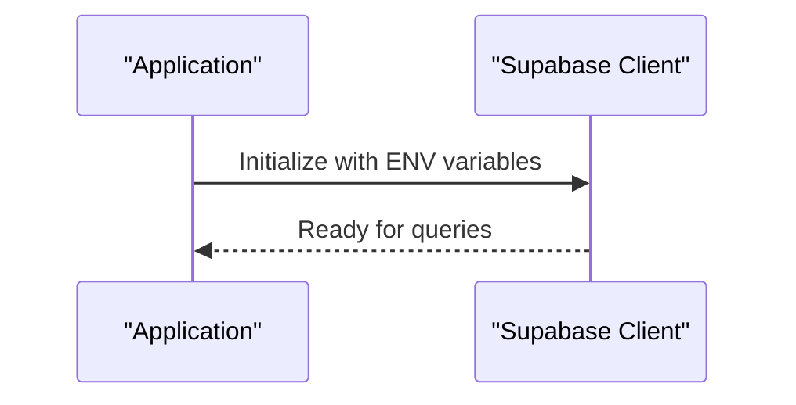
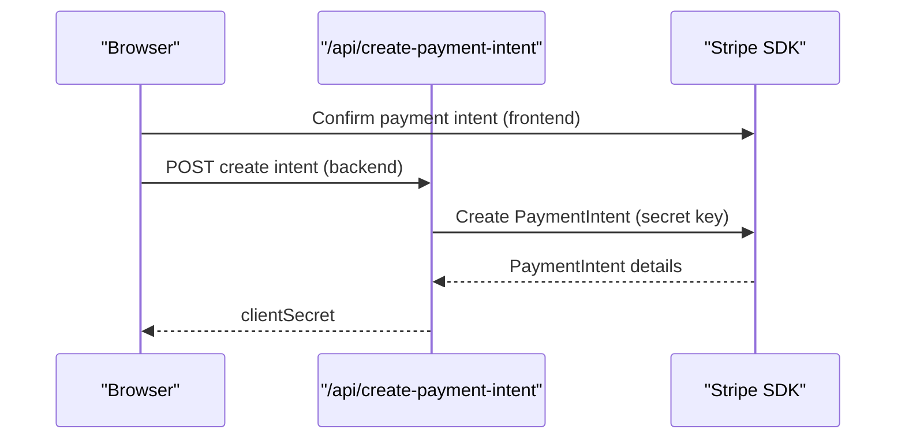
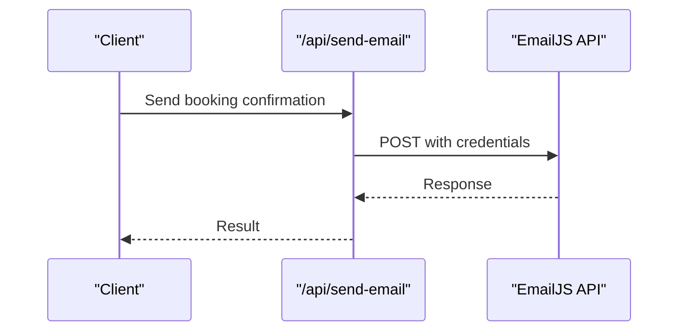
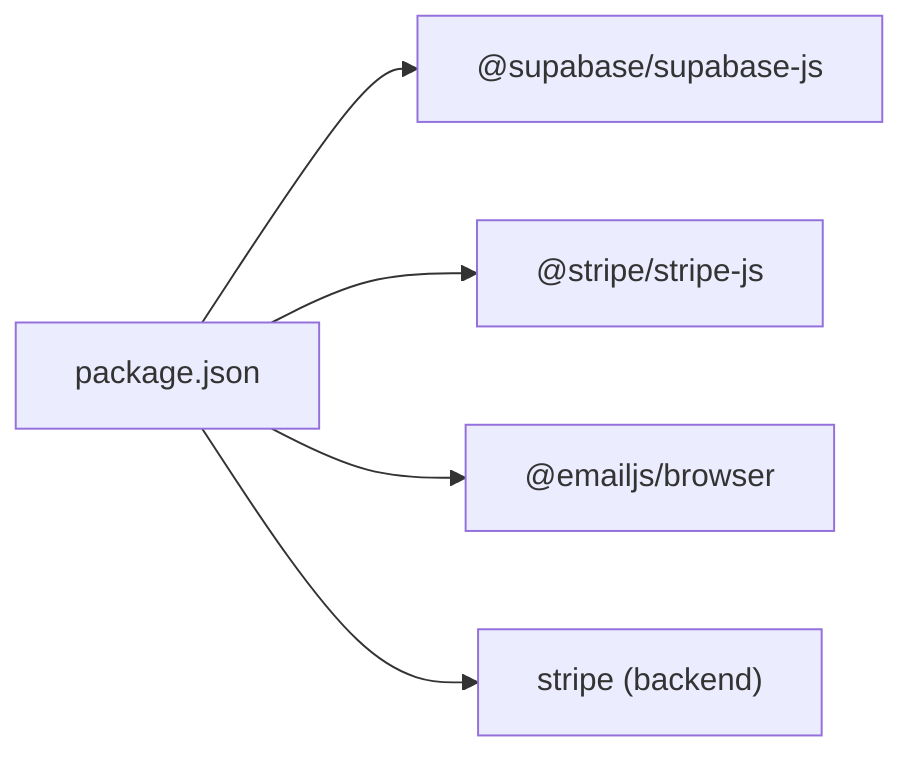

# Environment Variables and Secrets

<cite>
**Referenced Files in This Document**
- [supabase.ts](file://app/lib/supabase.ts)
- [stripe.ts](file://lib/stripe.ts)
- [email.ts](file://app/lib/email.ts)
- [gmail-service.ts](file://lib/gmail-service.ts)
- [create-payment-intent/route.ts](file://app/api/create-payment-intent/route.ts)
- [send-email/route.ts](file://app/api/send-email/route.ts)
- [package.json](file://package.json)
- [next.config.ts](file://next.config.ts)
- [README.md](file://README.md)
</cite>

## Table of Contents
1. [Introduction](#introduction)
2. [Project Structure](#project-structure)
3. [Core Components](#core-components)
4. [Architecture Overview](#architecture-overview)
5. [Detailed Component Analysis](#detailed-component-analysis)
6. [Dependency Analysis](#dependency-analysis)
7. [Performance Considerations](#performance-considerations)
8. [Troubleshooting Guide](#troubleshooting-guide)
9. [Conclusion](#conclusion)
10. [Appendices](#appendices)

## Introduction
This document explains how environment variables and secrets are used across the application, focusing on Supabase, Stripe, and EmailJS integrations. It outlines required variables, differences between development and production, security best practices, validation patterns, and operational procedures for secret rotation, backups, and compliance.

## Project Structure
The application integrates third-party services via client libraries and Next.js API routes:
- Supabase client initialization is centralized in a library module.
- Stripe client-side integration is used for payment UI, while server-side API routes handle secret keys.
- Email sending uses EmailJS with configurable credentials.
- Additional email utilities demonstrate Gmail SMTP usage patterns.



**Diagram sources**
- [supabase.ts:1-6](file://app/lib/supabase.ts#L1-L6)
- [stripe.ts:1-112](file://lib/stripe.ts#L1-L112)
- [email.ts:1-49](file://app/lib/email.ts#L1-L49)
- [create-payment-intent/route.ts:1-33](file://app/api/create-payment-intent/route.ts#L1-L33)
- [send-email/route.ts:1-42](file://app/api/send-email/route.ts#L1-L42)

**Section sources**
- [package.json:11-21](file://package.json#L11-L21)
- [next.config.ts:1-8](file://next.config.ts#L1-L8)

## Core Components
- Supabase client initialization and usage for database operations.
- Stripe client-side integration and server-side payment intent creation.
- EmailJS integration for sending booking confirmation emails.
- Optional Gmail SMTP utilities for demonstration.

Key observations:
- Supabase client is initialized with hardcoded values in the current codebase.
- Stripe client-side library uses a public key.
- Stripe server-side API uses a secret key.
- EmailJS requires service, template, and user credentials.

**Section sources**
- [supabase.ts:1-6](file://app/lib/supabase.ts#L1-L6)
- [stripe.ts:1-112](file://lib/stripe.ts#L1-L112)
- [email.ts:1-49](file://app/lib/email.ts#L1-L49)
- [gmail-service.ts:1-117](file://lib/gmail-service.ts#L1-L117)
- [create-payment-intent/route.ts:1-33](file://app/api/create-payment-intent/route.ts#L1-L33)
- [send-email/route.ts:1-42](file://app/api/send-email/route.ts#L1-L42)

## Architecture Overview
The system relies on environment variables for secure configuration of third-party services. The following diagram maps where variables are consumed:



**Diagram sources**
- [supabase.ts:3-6](file://app/lib/supabase.ts#L3-L6)
- [stripe.ts:1-112](file://lib/stripe.ts#L1-L112)
- [create-payment-intent/route.ts:4-5](file://app/api/create-payment-intent/route.ts#L4-L5)
- [email.ts:6-22](file://app/lib/email.ts#L6-L22)
- [send-email/route.ts:1-42](file://app/api/send-email/route.ts#L1-L42)

## Detailed Component Analysis

### Supabase Configuration
- Current code initializes Supabase with hardcoded values.
- Required variables for production:
  - SUPABASE_URL
  - SUPABASE_ANON_KEY

Recommended approach:
- Replace hardcoded values with environment variables.
- Load variables at runtime and validate presence.



**Diagram sources**
- [supabase.ts:3-6](file://app/lib/supabase.ts#L3-L6)

**Section sources**
- [supabase.ts:1-6](file://app/lib/supabase.ts#L1-L6)

### Stripe Configuration
- Frontend uses publishable key via @stripe/stripe-js.
- Backend API route uses secret key to create payment intents.

Required variables:
- STRIPE_PUBLISHABLE_KEY (frontend)
- STRIPE_SECRET_KEY (backend)



**Diagram sources**
- [stripe.ts:1-112](file://lib/stripe.ts#L1-L112)
- [create-payment-intent/route.ts:1-33](file://app/api/create-payment-intent/route.ts#L1-L33)

**Section sources**
- [stripe.ts:1-112](file://lib/stripe.ts#L1-L112)
- [create-payment-intent/route.ts:1-33](file://app/api/create-payment-intent/route.ts#L1-L33)

### EmailJS Configuration
- Email sending uses EmailJS with service, template, and user credentials.
- Private key is passed via Authorization header.

Required variables:
- EMAILJS_SERVICE_ID
- EMAILJS_TEMPLATE_ID
- EMAILJS_PUBLIC_KEY
- EMAILJS_PRIVATE_KEY



**Diagram sources**
- [email.ts:1-49](file://app/lib/email.ts#L1-L49)
- [send-email/route.ts:1-42](file://app/api/send-email/route.ts#L1-L42)

**Section sources**
- [email.ts:1-49](file://app/lib/email.ts#L1-L49)
- [send-email/route.ts:1-42](file://app/api/send-email/route.ts#L1-L42)

### Gmail SMTP Utilities
- Demonstrates Gmail SMTP usage patterns and password placeholders.
- Intended for backend implementation with secure credential storage.

**Section sources**
- [gmail-service.ts:1-117](file://lib/gmail-service.ts#L1-L117)

## Dependency Analysis
External dependencies that rely on environment variables:
- @supabase/supabase-js
- @stripe/stripe-js
- @emailjs/browser
- stripe (backend)



**Diagram sources**
- [package.json:11-21](file://package.json#L11-L21)

**Section sources**
- [package.json:11-21](file://package.json#L11-L21)

## Performance Considerations
- Avoid frequent re-initialization of SDK clients; reuse instances where possible.
- Cache environment variables at startup to minimize repeated reads.
- Keep network calls minimal; batch requests when feasible.

## Troubleshooting Guide
Common issues and resolutions:
- Missing environment variables
  - Symptom: Runtime errors or failed API calls.
  - Action: Validate .env presence and correct keys; ensure variables are injected by hosting platform.
- Incorrect variable names
  - Symptom: Empty or unexpected values.
  - Action: Verify casing and spelling against documented names.
- Secret exposure risks
  - Symptom: Logs containing secrets.
  - Action: Restrict logging; never print secret values; use structured logging with redaction.
- CORS and origin mismatches (Stripe/Payment)
  - Symptom: Browser errors when confirming payment intents.
  - Action: Configure allowed origins and ensure frontend/backend communication aligns with Stripe settings.
- Email delivery failures
  - Symptom: EmailJS errors or empty responses.
  - Action: Confirm service/template/user IDs; verify private key permissions.

Validation and error handling patterns observed in code:
- API routes validate request payloads and return structured errors.
- Client-side code logs environment variable presence for debugging.

**Section sources**
- [send-email/route.ts:9-14](file://app/api/send-email/route.ts#L9-L14)
- [email.ts:5-10](file://app/lib/email.ts#L5-L10)

## Conclusion
The application currently embeds sensitive values directly in source files. Production readiness requires moving all secrets to environment variables, validating their presence at startup, and implementing secure storage and rotation procedures. The diagrams and patterns outlined here provide a blueprint for secure configuration across Supabase, Stripe, and EmailJS.

## Appendices

### A. Required Environment Variables
- SUPABASE_URL
- SUPABASE_ANON_KEY
- STRIPE_PUBLISHABLE_KEY
- STRIPE_SECRET_KEY
- EMAILJS_SERVICE_ID
- EMAILJS_TEMPLATE_ID
- EMAILJS_PUBLIC_KEY
- EMAILJS_PRIVATE_KEY

### B. Development vs Production Patterns
- Development
  - Use test keys for Stripe and EmailJS.
  - Local .env files for local runs.
- Production
  - Use live keys; inject via hosting provider’s secret manager.
  - Disable debug logging of secrets; enforce strict access controls.

### C. Example .env Structure
```
# Supabase
SUPABASE_URL=https://your-project.supabase.co
SUPABASE_ANON_KEY=your-anon-key

# Stripe
STRIPE_PUBLISHABLE_KEY=pk_live_xxx
STRIPE_SECRET_KEY=sk_live_xxx

# EmailJS
EMAILJS_SERVICE_ID=service_xxx
EMAILJS_TEMPLATE_ID=template_xxx
EMAILJS_PUBLIC_KEY=user_xxx
EMAILJS_PRIVATE_KEY=your-private-token
```

### D. Variable Validation and Error Handling
- Validate presence of required variables at application startup.
- Return clear error messages when variables are missing.
- Log only non-sensitive diagnostics; redact secrets.

### E. Secret Rotation Procedures
- Rotate keys in hosting provider’s secret manager.
- Update environment variables; perform smoke tests.
- Revoke old keys after successful migration.

### F. Backup and Compliance
- Store encrypted backups of secrets; restrict access.
- Audit secret access; maintain logs for compliance.
- Regularly review and prune unused secrets.