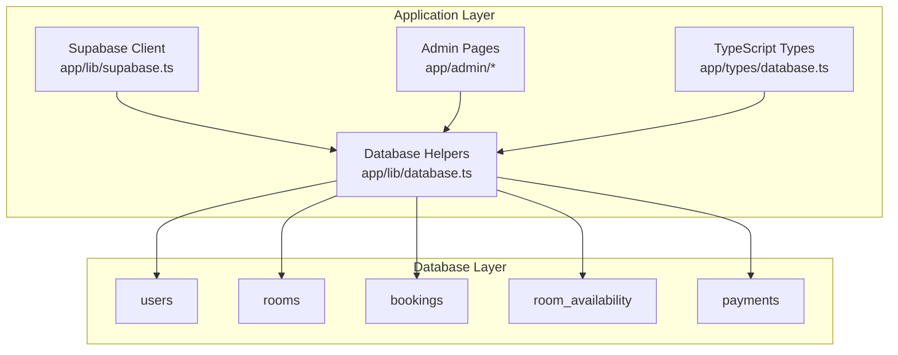
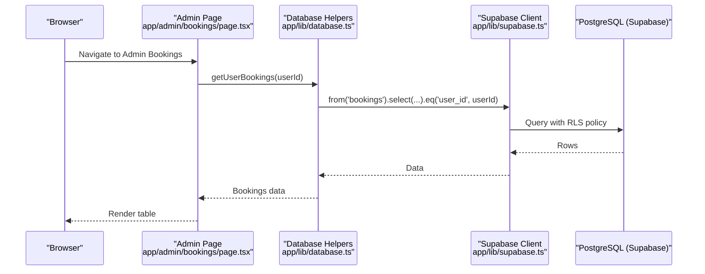
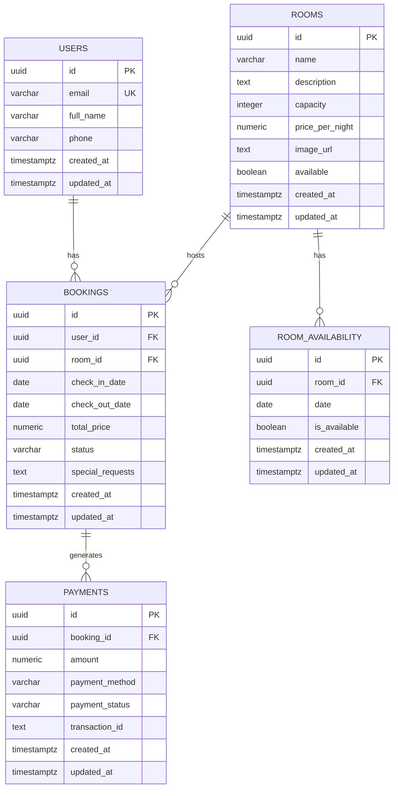
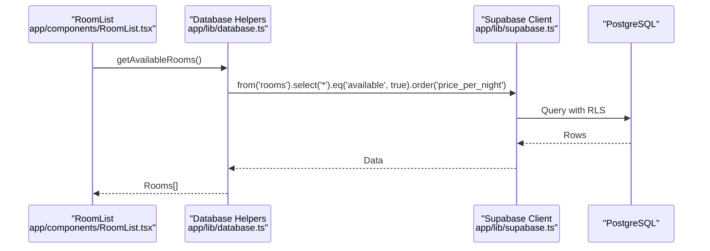
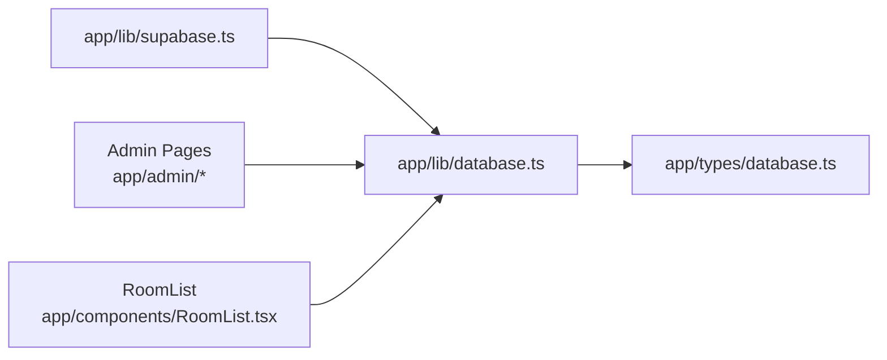

# Database Design

<cite>
**Referenced Files in This Document**
- [database-schema.sql](file://database-schema.sql)
- [setup-database-complete.sql](file://setup-database-complete.sql)
- [rls-policies.sql](file://rls-policies.sql)
- [create-missing-tables.sql](file://create-missing-tables.sql)
- [clean-and-reset.sql](file://clean-and-reset.sql)
- [app/lib/supabase.ts](file://app/lib/supabase.ts)
- [app/lib/database.ts](file://app/lib/database.ts)
- [app/types/database.ts](file://app/types/database.ts)
- [app/admin/bookings/page.tsx](file://app/admin/bookings/page.tsx)
- [app/admin/payments/page.tsx](file://app/admin/payments/page.tsx)
- [app/components/RoomList.tsx](file://app/components/RoomList.tsx)
</cite>

## Table of Contents
1. [Introduction](#introduction)
2. [Project Structure](#project-structure)
3. [Core Components](#core-components)
4. [Architecture Overview](#architecture-overview)
5. [Detailed Component Analysis](#detailed-component-analysis)
6. [Dependency Analysis](#dependency-analysis)
7. [Performance Considerations](#performance-considerations)
8. [Troubleshooting Guide](#troubleshooting-guide)
9. [Conclusion](#conclusion)
10. [Appendices](#appendices)

## Introduction
This document describes the Pythonhostel database schema and data model, focusing on the entities users, rooms, bookings, and payments. It documents table structures, field definitions, primary and foreign keys, indexes, constraints, and referential integrity. It also explains data validation rules, business logic constraints, Row Level Security (RLS) policies, and data access patterns through the Supabase client. Finally, it outlines performance considerations, data lifecycle, retention, and security measures.

## Project Structure
The database design is implemented via SQL scripts and enforced by Supabase. The application code interacts with the database through a typed client and helper functions.

**Diagram sources**
- [app/lib/supabase.ts:1-6](file://app/lib/supabase.ts#L1-L6)
- [app/lib/database.ts:1-433](file://app/lib/database.ts#L1-L433)
- [app/types/database.ts:1-146](file://app/types/database.ts#L1-L146)
- [app/admin/bookings/page.tsx:1-459](file://app/admin/bookings/page.tsx#L1-L459)
- [app/admin/payments/page.tsx:1-288](file://app/admin/payments/page.tsx#L1-L288)

**Section sources**
- [database-schema.sql:1-119](file://database-schema.sql#L1-L119)
- [setup-database-complete.sql:1-269](file://setup-database-complete.sql#L1-L269)
- [app/lib/supabase.ts:1-6](file://app/lib/supabase.ts#L1-L6)
- [app/lib/database.ts:1-433](file://app/lib/database.ts#L1-L433)
- [app/types/database.ts:1-146](file://app/types/database.ts#L1-L146)

## Core Components
- users: Stores user profiles with unique email and timestamps.
- rooms: Stores room definitions with capacity, pricing, availability, and images.
- bookings: Links users and rooms, captures stay dates, total price, status, and requests.
- room_availability: Optimizes availability checks by date per room.
- payments: Tracks payment attempts, methods, statuses, and links to bookings.

Key constraints and indexes:
- Primary keys: UUID defaults for all tables.
- Foreign keys: bookings.user_id -> users.id, bookings.room_id -> rooms.id, payments.booking_id -> bookings.id, room_availability.room_id -> rooms.id.
- Unique constraints: users.email unique, room_availability(room_id, date) unique.
- Check constraints: capacity > 0, price_per_night >= 0, valid_dates (check_out_date > check_in_date), status enums.
- Indexes: bookings(user_id), bookings(room_id), bookings(check_in_date, check_out_date), room_availability(room_id, date), rooms(available).

**Section sources**
- [database-schema.sql:4-62](file://database-schema.sql#L4-L62)
- [setup-database-complete.sql:9-68](file://setup-database-complete.sql#L9-L68)
- [create-missing-tables.sql:4-40](file://create-missing-tables.sql#L4-L40)

## Architecture Overview
The application uses Supabase as the backend database and authentication provider. Application logic is encapsulated in helper functions that perform queries, joins, and RPC calls. RLS policies enforce row-level access control.

**Diagram sources**
- [app/admin/bookings/page.tsx:1-459](file://app/admin/bookings/page.tsx#L1-L459)
- [app/lib/database.ts:121-132](file://app/lib/database.ts#L121-L132)
- [app/lib/supabase.ts:1-6](file://app/lib/supabase.ts#L1-L6)

**Section sources**
- [app/lib/database.ts:1-433](file://app/lib/database.ts#L1-L433)
- [app/lib/supabase.ts:1-6](file://app/lib/supabase.ts#L1-L6)

## Detailed Component Analysis

### Entity Relationship Model

**Diagram sources**
- [database-schema.sql:4-62](file://database-schema.sql#L4-L62)
- [setup-database-complete.sql:9-68](file://setup-database-complete.sql#L9-L68)

**Section sources**
- [database-schema.sql:4-62](file://database-schema.sql#L4-L62)
- [setup-database-complete.sql:9-68](file://setup-database-complete.sql#L9-L68)

### Users Table
- Purpose: Store user account information.
- Constraints: email unique, timestamps updated via trigger.
- Access control: RLS allows users to view/update their own profile; insert with check ensures auth.uid() matches inserted id.

**Section sources**
- [database-schema.sql:4-11](file://database-schema.sql#L4-L11)
- [setup-database-complete.sql:9-17](file://setup-database-complete.sql#L9-L17)
- [rls-policies.sql:10-21](file://rls-policies.sql#L10-L21)

### Rooms Table
- Purpose: Define room inventory with capacity, pricing, availability, and media.
- Constraints: capacity > 0, price_per_night >= 0; availability flag; indexes on available for fast filtering.
- Access control: Public select for available rooms; authenticated users can view all rooms; admin can manage.

**Section sources**
- [database-schema.sql:13-24](file://database-schema.sql#L13-L24)
- [setup-database-complete.sql:19-30](file://setup-database-complete.sql#L19-L30)
- [rls-policies.sql:23-30](file://rls-policies.sql#L23-L30)

### Bookings Table
- Purpose: Track reservation lifecycle between users and rooms.
- Constraints: status enum, valid_dates check, foreign keys to users and rooms, cascading deletes.
- Access control: Users can view/update their own bookings; admin can view/update all.

**Section sources**
- [database-schema.sql:26-39](file://database-schema.sql#L26-L39)
- [setup-database-complete.sql:32-45](file://setup-database-complete.sql#L32-L45)
- [rls-policies.sql:32-43](file://rls-policies.sql#L32-L43)

### Room Availability Table
- Purpose: Optimize availability checks by precomputing daily availability per room.
- Constraints: unique(room_id, date), foreign key to rooms, cascading deletes.
- Access control: Everyone can view availability.

**Section sources**
- [database-schema.sql:41-50](file://database-schema.sql#L41-L50)
- [setup-database-complete.sql:47-56](file://setup-database-complete.sql#L47-L56)
- [rls-policies.sql:45-48](file://rls-policies.sql#L45-L48)

### Payments Table
- Purpose: Record payment attempts, methods, statuses, and transactions.
- Constraints: payment_status enum, foreign key to bookings, cascading deletes.
- Access control: Users can view payments linked to their own bookings; admin can view all.

**Section sources**
- [database-schema.sql:52-62](file://database-schema.sql#L52-L62)
- [setup-database-complete.sql:58-68](file://setup-database-complete.sql#L58-L68)
- [rls-policies.sql:50-69](file://rls-policies.sql#L50-L69)

### Data Validation and Business Logic
- Date validation: check_out_date > check_in_date enforced by constraint.
- Status enums: status and payment_status constrained to predefined values.
- Pricing calculation: application computes total_price based on room price and nights.
- Availability checks: application uses a dedicated query to exclude conflicting bookings.

**Section sources**
- [database-schema.sql:38-38](file://database-schema.sql#L38-L38)
- [app/lib/database.ts:92-119](file://app/lib/database.ts#L92-L119)
- [app/lib/database.ts:314-331](file://app/lib/database.ts#L314-L331)

### Data Access Patterns Through Supabase Client
- Supabase client initialization: centralized in app/lib/supabase.ts.
- Typed helpers: app/lib/database.ts wraps Supabase queries, joins, and RPC calls.
- Types: app/types/database.ts defines TypeScript interfaces for entities and forms.

**Diagram sources**
- [app/components/RoomList.tsx:1-113](file://app/components/RoomList.tsx#L1-L113)
- [app/lib/database.ts:25-34](file://app/lib/database.ts#L25-L34)
- [app/lib/supabase.ts:1-6](file://app/lib/supabase.ts#L1-L6)

**Section sources**
- [app/lib/supabase.ts:1-6](file://app/lib/supabase.ts#L1-L6)
- [app/lib/database.ts:1-433](file://app/lib/database.ts#L1-L433)
- [app/types/database.ts:1-146](file://app/types/database.ts#L1-L146)

### Administrative Views and Data Lifecycle
- Admin pages demonstrate CRUD-like operations on bookings and payments using local storage in the provided UI files. These are illustrative and not connected to the database in these files.
- Data lifecycle: application logic sets timestamps via triggers; RLS policies govern visibility; cascading deletes maintain referential integrity.

**Section sources**
- [app/admin/bookings/page.tsx:1-459](file://app/admin/bookings/page.tsx#L1-L459)
- [app/admin/payments/page.tsx:1-288](file://app/admin/payments/page.tsx#L1-L288)
- [database-schema.sql:95-119](file://database-schema.sql#L95-L119)

## Dependency Analysis
- Supabase client depends on the Supabase project endpoint and service role key.
- Database helpers depend on Supabase client and TypeScript types.
- Frontend components depend on database helpers for data access.

**Diagram sources**
- [app/lib/supabase.ts:1-6](file://app/lib/supabase.ts#L1-L6)
- [app/lib/database.ts:1-433](file://app/lib/database.ts#L1-L433)
- [app/types/database.ts:1-146](file://app/types/database.ts#L1-L146)
- [app/admin/bookings/page.tsx:1-459](file://app/admin/bookings/page.tsx#L1-L459)
- [app/admin/payments/page.tsx:1-288](file://app/admin/payments/page.tsx#L1-L288)
- [app/components/RoomList.tsx:1-113](file://app/components/RoomList.tsx#L1-L113)

**Section sources**
- [app/lib/supabase.ts:1-6](file://app/lib/supabase.ts#L1-L6)
- [app/lib/database.ts:1-433](file://app/lib/database.ts#L1-L433)
- [app/types/database.ts:1-146](file://app/types/database.ts#L1-L146)

## Performance Considerations
- Indexes:
  - bookings(user_id), bookings(room_id): support user and room-centric queries.
  - bookings(check_in_date, check_out_date): optimize date-range filtering.
  - room_availability(room_id, date): optimize per-room availability lookups.
  - rooms(available): accelerate availability filtering.
- Triggers: update_updated_at_column() automatically refreshes updated_at on updates.
- Queries:
  - Use selective column lists and joins only when needed.
  - Prefer indexed columns in WHERE clauses and ORDER BY.
  - Use LIMIT for paginated results.

**Section sources**
- [database-schema.sql:64-70](file://database-schema.sql#L64-L70)
- [setup-database-complete.sql:70-77](file://setup-database-complete.sql#L70-L77)
- [database-schema.sql:95-119](file://database-schema.sql#L95-L119)

## Troubleshooting Guide
- Reset and reinstall:
  - Use clean-and-reset.sql to drop all tables, functions, and recreate the schema cleanly.
- Enable RLS and policies:
  - Ensure RLS is enabled on all tables and policies are created as per setup-database-complete.sql or rls-policies.sql.
- Availability conflicts:
  - Use the availability check function or the provided query to prevent overlapping bookings.
- Admin access:
  - Verify is_admin() function and admin policies if admin-only views are required.

**Section sources**
- [clean-and-reset.sql:1-168](file://clean-and-reset.sql#L1-L168)
- [setup-database-complete.sql:141-253](file://setup-database-complete.sql#L141-L253)
- [rls-policies.sql:1-100](file://rls-policies.sql#L1-L100)
- [app/lib/database.ts:314-331](file://app/lib/database.ts#L314-L331)

## Conclusion
The Pythonhostel database design centers on four core entities with strong referential integrity, explicit constraints, and performance-oriented indexes. Supabase enforces access control via RLS policies, while application helpers encapsulate data access patterns. The schema supports efficient availability checks, robust booking workflows, and secure payment tracking.

## Appendices

### Database Setup Scripts Reference
- Complete setup: [setup-database-complete.sql:1-269](file://setup-database-complete.sql#L1-L269)
- RLS policies: [rls-policies.sql:1-100](file://rls-policies.sql#L1-L100)
- Create missing tables: [create-missing-tables.sql:1-118](file://create-missing-tables.sql#L1-L118)
- Clean reset: [clean-and-reset.sql:1-168](file://clean-and-reset.sql#L1-L168)

### Supabase Client and Types
- Client: [app/lib/supabase.ts:1-6](file://app/lib/supabase.ts#L1-L6)
- Helpers: [app/lib/database.ts:1-433](file://app/lib/database.ts#L1-L433)
- Types: [app/types/database.ts:1-146](file://app/types/database.ts#L1-L146)