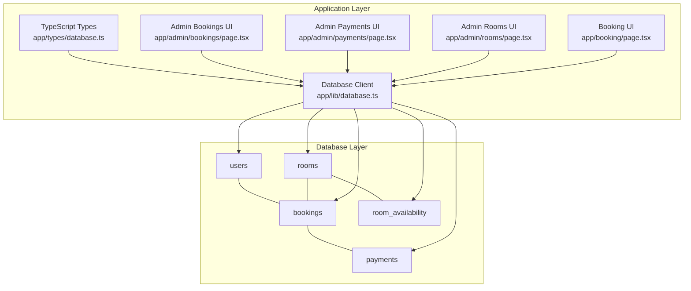
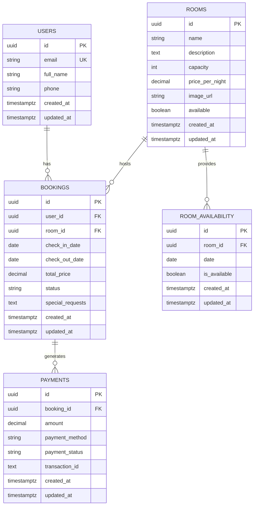
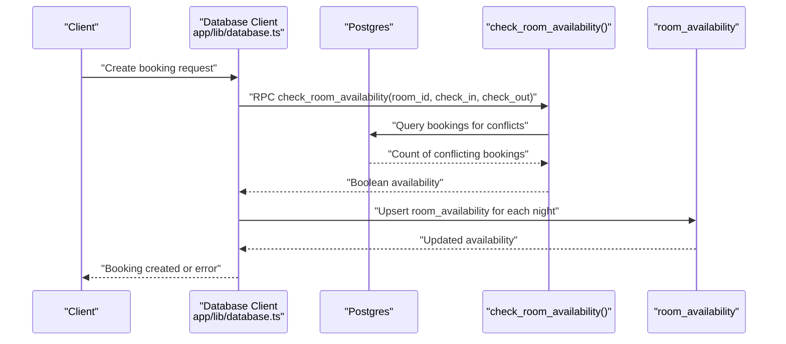
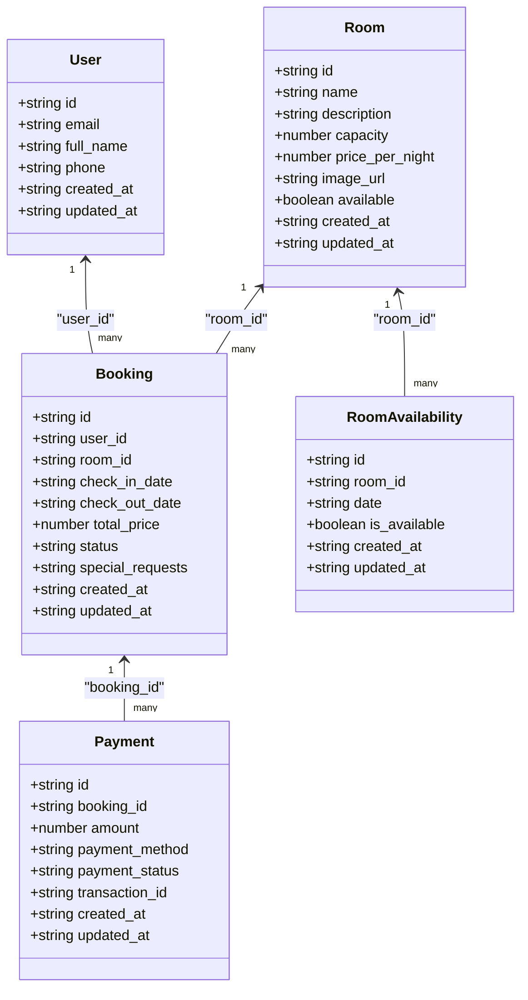
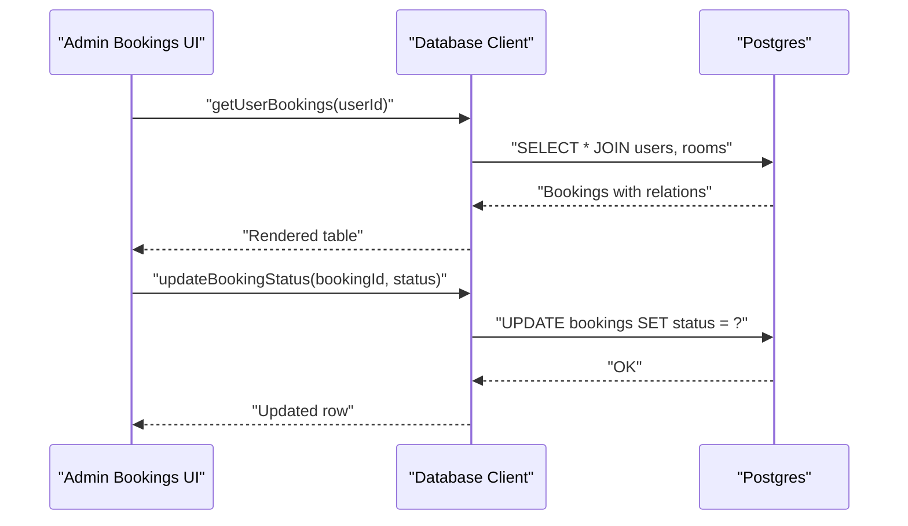
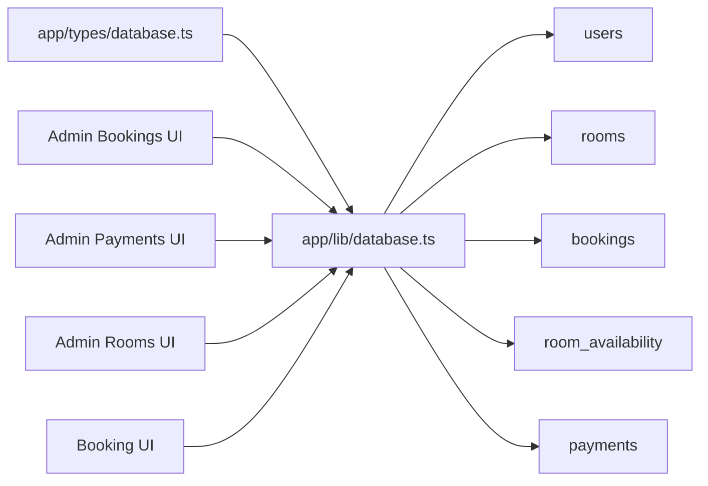

# Entity Relationships

<cite>
**Referenced Files in This Document**
- [database-schema.sql](file://database-schema.sql)
- [setup-database-complete.sql](file://setup-database-complete.sql)
- [create-missing-tables.sql](file://create-missing-tables.sql)
- [clean-and-reset.sql](file://clean-and-reset.sql)
- [create-feedbacks-table.sql](file://create-feedbacks-table.sql)
- [app/lib/database.ts](file://app/lib/database.ts)
- [app/types/database.ts](file://app/types/database.ts)
- [app/admin/bookings/page.tsx](file://app/admin/bookings/page.tsx)
- [app/admin/payments/page.tsx](file://app/admin/payments/page.tsx)
- [app/admin/rooms/page.tsx](file://app/admin/rooms/page.tsx)
- [app/booking/page.tsx](file://app/booking/page.tsx)
</cite>

## Table of Contents
1. [Introduction](#introduction)
2. [Project Structure](#project-structure)
3. [Core Components](#core-components)
4. [Architecture Overview](#architecture-overview)
5. [Detailed Component Analysis](#detailed-component-analysis)
6. [Dependency Analysis](#dependency-analysis)
7. [Performance Considerations](#performance-considerations)
8. [Troubleshooting Guide](#troubleshooting-guide)
9. [Conclusion](#conclusion)

## Introduction
This document describes the entity relationship model for the Pythonhostel database. It focuses on the relationships among users, rooms, bookings, room_availability, and payments. It documents foreign key constraints, referential integrity rules, cascade behaviors, and business rules enforced through relationships. It also explains many-to-one and one-to-many cardinalities and illustrates how the room_availability table optimizes availability queries and prevents double bookings.

## Project Structure
The database schema is defined in SQL scripts and consumed by the Next.js application via Supabase client calls. The application exposes typed interfaces for entities and orchestrates CRUD operations and business workflows.

**Diagram sources**
- [database-schema.sql:3-62](file://database-schema.sql#L3-L62)
- [app/types/database.ts:3-55](file://app/types/database.ts#L3-L55)
- [app/lib/database.ts:1-433](file://app/lib/database.ts#L1-L433)
- [app/admin/bookings/page.tsx:139-459](file://app/admin/bookings/page.tsx#L139-L459)
- [app/admin/payments/page.tsx:50-288](file://app/admin/payments/page.tsx#L50-L288)
- [app/admin/rooms/page.tsx:8-280](file://app/admin/rooms/page.tsx#L8-L280)
- [app/booking/page.tsx:44-434](file://app/booking/page.tsx#L44-L434)

**Section sources**
- [database-schema.sql:3-62](file://database-schema.sql#L3-L62)
- [app/types/database.ts:3-55](file://app/types/database.ts#L3-L55)
- [app/lib/database.ts:1-433](file://app/lib/database.ts#L1-L433)

## Core Components
- users: Stores guest profiles with unique email and timestamps.
- rooms: Stores room definitions with capacity, pricing, availability flag, and timestamps.
- bookings: Links users to rooms for specific stay periods, with status and totals.
- room_availability: Precomputed daily availability per room to optimize queries and prevent double bookings.
- payments: Tracks payment attempts against a booking with method and status.

Key constraints and behaviors:
- Foreign keys:
  - bookings.user_id → users.id (ON DELETE CASCADE)
  - bookings.room_id → rooms.id (ON DELETE CASCADE)
  - room_availability.room_id → rooms.id (ON DELETE CASCADE)
  - payments.booking_id → bookings.id (ON DELETE CASCADE)
- Cascade behavior:
  - Deleting a user deletes their bookings (and indirectly payments via cascade).
  - Deleting a room deletes its bookings and availability records.
- Business checks:
  - bookings.status constrained to pending, confirmed, cancelled.
  - payments.payment_status constrained to pending, completed, failed.
  - bookings.check_out_date > bookings.check_in_date.
  - rooms.capacity > 0 and price_per_night >= 0.
  - room_availability unique constraint on (room_id, date).

**Section sources**
- [database-schema.sql:26-62](file://database-schema.sql#L26-L62)
- [setup-database-complete.sql:32-68](file://setup-database-complete.sql#L32-L68)
- [create-missing-tables.sql:4-40](file://create-missing-tables.sql#L4-L40)

## Architecture Overview
The application uses Supabase to manage the Postgres backend. The database layer defines entities and relationships; the application layer uses typed interfaces and client functions to interact with the database.

**Diagram sources**
- [database-schema.sql:3-62](file://database-schema.sql#L3-L62)
- [setup-database-complete.sql:9-68](file://setup-database-complete.sql#L9-L68)
- [create-missing-tables.sql:4-40](file://create-missing-tables.sql#L4-L40)

## Detailed Component Analysis

### Entities and Relationships

- users ↔ bookings: Many-to-one from bookings to users; one user can have many bookings.
- rooms ↔ bookings: Many-to-one from bookings to rooms; one room can host many bookings.
- rooms → room_availability: One-to-many; each room can have many availability entries.
- bookings → payments: One-to-many; each booking can have many payment attempts.

Cascade behaviors:
- Deleting a user cascades to their bookings and payments.
- Deleting a room cascades to its bookings and availability records.
- Deleting a booking cascades to its payments.

Cardinalities:
- users: 1 ← many bookings
- rooms: 1 ← many bookings
- rooms: 1 ← many room_availability entries
- bookings: 1 ← many payments

**Section sources**
- [database-schema.sql:26-62](file://database-schema.sql#L26-L62)
- [setup-database-complete.sql:32-68](file://setup-database-complete.sql#L32-L68)
- [create-missing-tables.sql:4-40](file://create-missing-tables.sql#L4-L40)

### Room Availability Optimization and Double Booking Prevention
The room_availability table stores daily availability per room. The application uses:
- A stored function to check availability across a date range.
- Application-level queries to exclude unavailable rooms when searching.
- Upsert operations to update availability for a booking period.

**Diagram sources**
- [database-schema.sql:71-93](file://database-schema.sql#L71-L93)
- [app/lib/database.ts:76-89](file://app/lib/database.ts#L76-L89)
- [app/lib/database.ts:314-354](file://app/lib/database.ts#L314-L354)

**Section sources**
- [database-schema.sql:41-50](file://database-schema.sql#L41-L50)
- [database-schema.sql:71-93](file://database-schema.sql#L71-L93)
- [app/lib/database.ts:76-89](file://app/lib/database.ts#L76-L89)
- [app/lib/database.ts:314-354](file://app/lib/database.ts#L314-L354)

### Business Rules Enforced Through Relationships
- Booking status lifecycle:
  - Initial status defaults to pending.
  - Allowed transitions: pending → confirmed or cancelled.
  - Payments are associated with a booking; payment_status is independent but linked to the booking lifecycle.
- Payment-to-booking association:
  - Each payment references a booking; payments are not deleted when a booking is deleted because of the cascade on the booking_id column.
- Room constraints:
  - Capacity and price_per_night are validated at insertion/update.
- Date validity:
  - check_out_date must be strictly greater than check_in_date.

**Section sources**
- [database-schema.sql:26-39](file://database-schema.sql#L26-L39)
- [database-schema.sql:52-62](file://database-schema.sql#L52-L62)
- [setup-database-complete.sql:32-45](file://setup-database-complete.sql#L32-L45)
- [setup-database-complete.sql:58-68](file://setup-database-complete.sql#L58-L68)

### Typed Interfaces and Application Usage
The application defines TypeScript interfaces that mirror the database schema. These interfaces guide client-side logic and API responses.

**Diagram sources**
- [app/types/database.ts:3-55](file://app/types/database.ts#L3-L55)

**Section sources**
- [app/types/database.ts:3-55](file://app/types/database.ts#L3-L55)
- [app/lib/database.ts:1-433](file://app/lib/database.ts#L1-L433)

### UI Workflows and Data Dependencies

- Admin Bookings:
  - Displays bookings with related user and room details.
  - Updates booking status; status constraints apply.
  - Uses Supabase client to fetch and update data.

- Admin Payments:
  - Displays payments linked to bookings.
  - Updates payment status independently of booking status.

- Admin Rooms:
  - Manages room availability and room metadata.
  - Uses upsert operations to update room_availability for date ranges.

- Booking Page:
  - Collects guest and room selection data.
  - Calculates total price and redirects to payment after saving to local storage.

**Diagram sources**
- [app/admin/bookings/page.tsx:121-145](file://app/admin/bookings/page.tsx#L121-L145)
- [app/lib/database.ts:121-156](file://app/lib/database.ts#L121-L156)

**Section sources**
- [app/admin/bookings/page.tsx:121-145](file://app/admin/bookings/page.tsx#L121-L145)
- [app/admin/payments/page.tsx:50-288](file://app/admin/payments/page.tsx#L50-L288)
- [app/admin/rooms/page.tsx:8-280](file://app/admin/rooms/page.tsx#L8-L280)
- [app/booking/page.tsx:44-434](file://app/booking/page.tsx#L44-L434)
- [app/lib/database.ts:121-156](file://app/lib/database.ts#L121-L156)

## Dependency Analysis
- Database-level dependencies:
  - bookings depends on users and rooms via foreign keys.
  - payments depends on bookings via foreign key.
  - room_availability depends on rooms via foreign key.
- Application-level dependencies:
  - app/lib/database.ts depends on Supabase client and exposes typed functions for each entity.
  - UI pages depend on database client functions to render and update data.

**Diagram sources**
- [app/types/database.ts:3-55](file://app/types/database.ts#L3-L55)
- [app/lib/database.ts:1-433](file://app/lib/database.ts#L1-L433)
- [database-schema.sql:3-62](file://database-schema.sql#L3-L62)

**Section sources**
- [app/types/database.ts:3-55](file://app/types/database.ts#L3-L55)
- [app/lib/database.ts:1-433](file://app/lib/database.ts#L1-L433)
- [database-schema.sql:3-62](file://database-schema.sql#L3-L62)

## Performance Considerations
- Indexes:
  - bookings(user_id), bookings(room_id), bookings(check_in_date, check_out_date)
  - room_availability(room_id, date)
  - rooms(available)
- Function-based checks:
  - The check_room_availability function avoids double bookings by checking pending/confirmed bookings overlapping the requested period.
- Upsert strategy:
  - Using upsert on room_availability for entire stay periods reduces write amplification.

Recommendations:
- Monitor slow queries on bookings and room_availability ranges.
- Consider partitioning room_availability by date ranges for very large datasets.
- Ensure application-level date range validation aligns with database constraints.

**Section sources**
- [database-schema.sql:64-70](file://database-schema.sql#L64-L70)
- [database-schema.sql:71-93](file://database-schema.sql#L71-L93)
- [app/lib/database.ts:314-354](file://app/lib/database.ts#L314-L354)

## Troubleshooting Guide
Common issues and resolutions:
- Integrity constraint violations:
  - Ensure bookings.user_id and bookings.room_id reference existing users and rooms.
  - Verify that check_in_date < check_out_date and status/payment_status are within allowed sets.
- Double booking prevention:
  - Use the check_room_availability RPC before inserting a booking.
  - After creating a booking, upsert room_availability for each night to mark it unavailable.
- Cascade deletion:
  - Deleting a user removes their bookings and payments; deleting a room removes its bookings and availability.
- Row-level security (RLS):
  - Some policies restrict access to authenticated users or owners; ensure the session has appropriate permissions.

**Section sources**
- [database-schema.sql:26-62](file://database-schema.sql#L26-L62)
- [setup-database-complete.sql:141-252](file://setup-database-complete.sql#L141-L252)
- [app/lib/database.ts:76-89](file://app/lib/database.ts#L76-L89)
- [app/lib/database.ts:314-354](file://app/lib/database.ts#L314-L354)

## Conclusion
The Pythonhostel database enforces strong referential integrity and business rules through foreign keys, constraints, and stored functions. The room_availability table is central to preventing double bookings and optimizing availability queries. The application’s typed interfaces and client functions provide a clean separation between the database model and UI workflows, enabling safe and predictable operations across users, rooms, bookings, availability, and payments.