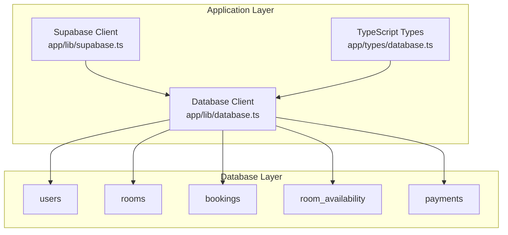
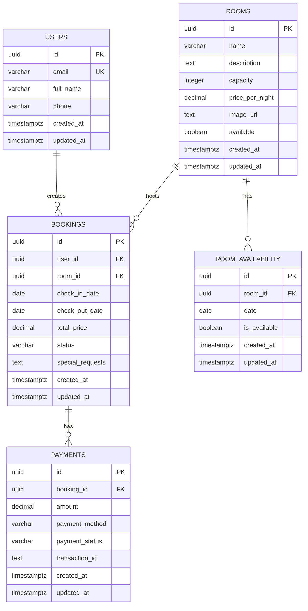
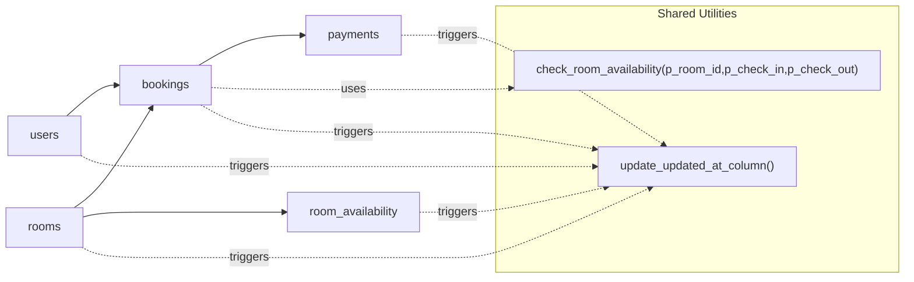

# Schema Definition

<cite>
**Referenced Files in This Document**
- [database-schema.sql](file://database-schema.sql)
- [setup-database-complete.sql](file://setup-database-complete.sql)
- [create-missing-tables.sql](file://create-missing-tables.sql)
- [clean-and-reset.sql](file://clean-and-reset.sql)
- [verify-setup.sql](file://verify-setup.sql)
- [app/lib/database.ts](file://app/lib/database.ts)
- [app/types/database.ts](file://app/types/database.ts)
- [app/lib/supabase.ts](file://app/lib/supabase.ts)
</cite>

## Table of Contents
1. [Introduction](#introduction)
2. [Project Structure](#project-structure)
3. [Core Components](#core-components)
4. [Architecture Overview](#architecture-overview)
5. [Detailed Component Analysis](#detailed-component-analysis)
6. [Dependency Analysis](#dependency-analysis)
7. [Performance Considerations](#performance-considerations)
8. [Troubleshooting Guide](#troubleshooting-guide)
9. [Conclusion](#conclusion)
10. [Appendices](#appendices)

## Introduction
This document provides a comprehensive schema definition for the Pythonhostel database. It details the structure of the users, rooms, bookings, room_availability, and payments tables, including field types, constraints, defaults, and validation rules. It explains the UUID primary key strategy, timezone-aware timestamp management, and decimal precision for financial data. It also documents check constraints for business validation, unique constraints for data integrity, and foreign key relationships. Finally, it outlines table creation scripts, field descriptions, and the rationale behind design choices such as UUID generation and automatic timestamp updates.

## Project Structure
The database schema is defined and managed through SQL scripts and integrated with a Next.js frontend using Supabase client libraries. The schema is designed around five core tables with explicit constraints and indexes to support efficient querying and strong data integrity.

**Diagram sources**
- [app/lib/database.ts:1-433](file://app/lib/database.ts#L1-L433)
- [app/types/database.ts:1-146](file://app/types/database.ts#L1-L146)
- [app/lib/supabase.ts:1-6](file://app/lib/supabase.ts#L1-L6)

**Section sources**
- [database-schema.sql:1-119](file://database-schema.sql#L1-L119)
- [setup-database-complete.sql:1-269](file://setup-database-complete.sql#L1-L269)
- [create-missing-tables.sql:1-118](file://create-missing-tables.sql#L1-L118)
- [clean-and-reset.sql:1-168](file://clean-and-reset.sql#L1-L168)
- [verify-setup.sql:1-57](file://verify-setup.sql#L1-L57)
- [app/lib/database.ts:1-433](file://app/lib/database.ts#L1-L433)
- [app/types/database.ts:1-146](file://app/types/database.ts#L1-L146)
- [app/lib/supabase.ts:1-6](file://app/lib/supabase.ts#L1-L6)

## Core Components
This section defines each table’s purpose, fields, types, constraints, defaults, and relationships.

- users
  - Purpose: Stores guest profiles and authentication identifiers.
  - Primary Key: id (UUID, generated by default).
  - Fields:
    - id: UUID, default generated, primary key.
    - email: VARCHAR(255), unique, not null.
    - full_name: VARCHAR(255).
    - phone: VARCHAR(20).
    - created_at: TIMESTAMP WITH TIME ZONE, default now().
    - updated_at: TIMESTAMP WITH TIME ZONE, default now().
  - Constraints:
    - Unique constraint on email.
  - Defaults and Validation:
    - UUID primary key with default generator.
    - Timestamps default to current time with timezone awareness.
  - Notes:
    - No explicit check constraints.

- rooms
  - Purpose: Defines room inventory, pricing, and availability.
  - Primary Key: id (UUID).
  - Fields:
    - id: UUID, default generated, primary key.
    - name: VARCHAR(255), not null.
    - description: TEXT.
    - capacity: INTEGER, not null, check > 0.
    - price_per_night: DECIMAL(10,2), not null, check >= 0.
    - image_url: TEXT.
    - available: BOOLEAN, default true.
    - created_at: TIMESTAMP WITH TIME ZONE, default now().
    - updated_at: TIMESTAMP WITH TIME ZONE, default now().
  - Constraints:
    - Check constraints on capacity and price_per_night.
  - Defaults and Validation:
    - UUID primary key with default generator.
    - Timestamps default to current time with timezone awareness.
    - available defaults to true.

- bookings
  - Purpose: Manages guest reservations linking users and rooms.
  - Primary Key: id (UUID).
  - Fields:
    - id: UUID, default generated, primary key.
    - user_id: UUID, not null, references users(id) with cascade delete.
    - room_id: UUID, not null, references rooms(id) with cascade delete.
    - check_in_date: DATE, not null.
    - check_out_date: DATE, not null.
    - total_price: DECIMAL(10,2), not null.
    - status: VARCHAR(50), default "pending", check in ("pending","confirmed","cancelled").
    - special_requests: TEXT.
    - created_at: TIMESTAMP WITH TIME ZONE, default now().
    - updated_at: TIMESTAMP WITH TIME ZONE, default now().
  - Constraints:
    - Foreign keys to users and rooms.
    - Check constraint ensuring check_out_date > check_in_date.
    - Status enumeration check.
  - Defaults and Validation:
    - UUID primary key with default generator.
    - Timestamps default to current time with timezone awareness.
    - Status defaults to pending.

- room_availability
  - Purpose: Optimizes availability checks by precomputing daily room availability.
  - Primary Key: id (UUID).
  - Fields:
    - id: UUID, default generated, primary key.
    - room_id: UUID, not null, references rooms(id) with cascade delete.
    - date: DATE, not null.
    - is_available: BOOLEAN, default true.
    - created_at: TIMESTAMP WITH TIME ZONE, default now().
    - updated_at: TIMESTAMP WITH TIME ZONE, default now().
  - Constraints:
    - Unique constraint on (room_id, date).
    - Foreign key to rooms.
  - Defaults and Validation:
    - UUID primary key with default generator.
    - Timestamps default to current time with timezone awareness.
    - is_available defaults to true.

- payments
  - Purpose: Tracks payment transactions associated with bookings.
  - Primary Key: id (UUID).
  - Fields:
    - id: UUID, default generated, primary key.
    - booking_id: UUID, not null, references bookings(id) with cascade delete.
    - amount: DECIMAL(10,2), not null.
    - payment_method: VARCHAR(50), not null.
    - payment_status: VARCHAR(50), default "pending", check in ("pending","completed","failed").
    - transaction_id: TEXT.
    - created_at: TIMESTAMP WITH TIME ZONE, default now().
    - updated_at: TIMESTAMP WITH TIME ZONE, default now().
  - Constraints:
    - Foreign key to bookings.
    - Status enumeration check.
  - Defaults and Validation:
    - UUID primary key with default generator.
    - Timestamps default to current time with timezone awareness.
    - Status defaults to pending.

**Section sources**
- [database-schema.sql:3-62](file://database-schema.sql#L3-L62)
- [setup-database-complete.sql:9-68](file://setup-database-complete.sql#L9-L68)
- [create-missing-tables.sql:4-40](file://create-missing-tables.sql#L4-L40)
- [clean-and-reset.sql:21-80](file://clean-and-reset.sql#L21-L80)

## Architecture Overview
The schema is designed around a central reservation workflow:
- Users create bookings for rooms.
- Room availability is tracked and validated against overlapping bookings.
- Payments are linked to bookings and track transaction status.

**Diagram sources**
- [database-schema.sql:3-62](file://database-schema.sql#L3-L62)
- [setup-database-complete.sql:9-68](file://setup-database-complete.sql#L9-L68)
- [create-missing-tables.sql:4-40](file://create-missing-tables.sql#L4-L40)
- [clean-and-reset.sql:21-80](file://clean-and-reset.sql#L21-L80)

## Detailed Component Analysis

### users Table
- Field Descriptions:
  - id: Unique identifier for each user; UUID with default generator ensures global uniqueness and avoids sequential predictability.
  - email: Unique identifier for authentication; enforced unique constraint prevents duplicates.
  - full_name, phone: Optional contact details.
  - created_at, updated_at: Automatic timestamps with timezone support for auditability.
- Constraints and Defaults:
  - Primary key on id.
  - Unique constraint on email.
  - Default timestamps initialized to current time with timezone.
- Design Rationale:
  - UUID primary key improves security and scalability compared to auto-incremented integers.
  - Timezone-aware timestamps ensure consistent logging across regions.

**Section sources**
- [database-schema.sql:4-11](file://database-schema.sql#L4-L11)
- [setup-database-complete.sql:9-17](file://setup-database-complete.sql#L9-L17)
- [create-missing-tables.sql:4-17](file://create-missing-tables.sql#L4-L17)
- [clean-and-reset.sql:21-29](file://clean-and-reset.sql#L21-L29)

### rooms Table
- Field Descriptions:
  - id: Unique room identifier.
  - name: Room name for display.
  - description: Room details.
  - capacity: Maximum occupancy; validated to be greater than zero.
  - price_per_night: Nightly rate; validated to be non-negative.
  - image_url: Optional media reference.
  - available: Boolean flag indicating listing status; defaults to true.
  - created_at, updated_at: Audit timestamps with timezone.
- Constraints and Defaults:
  - Primary key on id.
  - Check constraints on capacity and price_per_night.
  - Default available to true.
  - Default timestamps initialized to current time with timezone.
- Design Rationale:
  - Decimal(10,2) ensures precise financial representation up to 99999999.99.
  - Capacity and price validations prevent invalid data entry.

**Section sources**
- [database-schema.sql:13-24](file://database-schema.sql#L13-L24)
- [setup-database-complete.sql:19-30](file://setup-database-complete.sql#L19-L30)
- [create-missing-tables.sql:19-28](file://create-missing-tables.sql#L19-L28)
- [clean-and-reset.sql:31-42](file://clean-and-reset.sql#L31-L42)

### bookings Table
- Field Descriptions:
  - id: Unique booking identifier.
  - user_id: References users; cascade delete ensures referential integrity.
  - room_id: References rooms; cascade delete ensures referential integrity.
  - check_in_date, check_out_date: Reservation dates; ordering validated via check constraint.
  - total_price: Calculated amount; stored for historical accuracy.
  - status: Enumerated state with default pending; restricted to predefined values.
  - special_requests: Optional guest notes.
  - created_at, updated_at: Audit timestamps with timezone.
- Constraints and Defaults:
  - Primary key on id.
  - Foreign keys to users and rooms.
  - Check constraint ensuring checkout occurs after checkin.
  - Status enumeration check.
  - Default timestamps initialized to current time with timezone.
- Design Rationale:
  - Status enumeration simplifies reporting and UI logic.
  - Total price stored to preserve historical pricing even if room rates change.

**Section sources**
- [database-schema.sql:26-39](file://database-schema.sql#L26-L39)
- [setup-database-complete.sql:32-45](file://setup-database-complete.sql#L32-L45)
- [create-missing-tables.sql:4-17](file://create-missing-tables.sql#L4-L17)
- [clean-and-reset.sql:44-57](file://clean-and-reset.sql#L44-L57)

### room_availability Table
- Field Descriptions:
  - id: Unique availability record identifier.
  - room_id: References rooms; cascade delete maintains consistency.
  - date: Specific calendar day for availability.
  - is_available: Daily availability flag; defaults to true.
  - created_at, updated_at: Audit timestamps with timezone.
- Constraints and Defaults:
  - Primary key on id.
  - Unique constraint on (room_id, date) to prevent duplicate entries.
  - Foreign key to rooms.
  - Default timestamps initialized to current time with timezone.
  - Default is_available to true.
- Design Rationale:
  - Precomputed daily availability reduces complex overlap checks during booking.
  - Unique composite index ensures atomic updates per room-date pair.

**Section sources**
- [database-schema.sql:41-50](file://database-schema.sql#L41-L50)
- [setup-database-complete.sql:47-56](file://setup-database-complete.sql#L47-L56)
- [create-missing-tables.sql:19-28](file://create-missing-tables.sql#L19-L28)
- [clean-and-reset.sql:59-68](file://clean-and-reset.sql#L59-L68)

### payments Table
- Field Descriptions:
  - id: Unique payment identifier.
  - booking_id: References bookings; cascade delete ensures referential integrity.
  - amount: Transaction amount; stored for audit and reconciliation.
  - payment_method: Method used (e.g., card, bank transfer).
  - payment_status: Enumerated state with default pending; restricted to predefined values.
  - transaction_id: Optional external transaction reference.
  - created_at, updated_at: Audit timestamps with timezone.
- Constraints and Defaults:
  - Primary key on id.
  - Foreign key to bookings.
  - Status enumeration check.
  - Default timestamps initialized to current time with timezone.
  - Default payment_status to pending.
- Design Rationale:
  - Decimal(10,2) ensures precise financial amounts.
  - Separate payment_status allows asynchronous payment processing.

**Section sources**
- [database-schema.sql:52-62](file://database-schema.sql#L52-L62)
- [setup-database-complete.sql:58-68](file://setup-database-complete.sql#L58-L68)
- [create-missing-tables.sql:30-40](file://create-missing-tables.sql#L30-L40)
- [clean-and-reset.sql:70-80](file://clean-and-reset.sql#L70-L80)

### Application Integration
- Supabase Client:
  - The frontend uses a Supabase client configured with a project URL and anonymous API key to interact with the database.
- Database Operations:
  - The database module exposes typed functions for CRUD operations on users, rooms, bookings, room availability, and payments.
  - These functions leverage Supabase’s SQL editor capabilities and RPC functions for complex queries.
- Type Safety:
  - TypeScript types define the shape of records and API responses, ensuring consistency between frontend and backend.

**Section sources**
- [app/lib/supabase.ts:1-6](file://app/lib/supabase.ts#L1-L6)
- [app/lib/database.ts:1-433](file://app/lib/database.ts#L1-L433)
- [app/types/database.ts:1-146](file://app/types/database.ts#L1-L146)

## Dependency Analysis
The schema exhibits clear foreign key dependencies and shared utility functions and triggers.

**Diagram sources**
- [database-schema.sql:71-119](file://database-schema.sql#L71-L119)
- [setup-database-complete.sql:82-139](file://setup-database-complete.sql#L82-L139)
- [create-missing-tables.sql:48-88](file://create-missing-tables.sql#L48-L88)
- [clean-and-reset.sql:89-135](file://clean-and-reset.sql#L89-L135)

**Section sources**
- [database-schema.sql:71-119](file://database-schema.sql#L71-L119)
- [setup-database-complete.sql:82-139](file://setup-database-complete.sql#L82-L139)
- [create-missing-tables.sql:48-88](file://create-missing-tables.sql#L48-L88)
- [clean-and-reset.sql:89-135](file://clean-and-reset.sql#L89-L135)

## Performance Considerations
- Indexes:
  - bookings(user_id), bookings(room_id), bookings(check_in_date, check_out_date): Optimize user and room queries and date-range filtering.
  - room_availability(room_id, date): Supports efficient daily availability lookups.
  - rooms(available): Filters available rooms quickly.
- Triggers:
  - Automatic updated_at updates reduce manual maintenance overhead and ensure consistent audit trails.
- Decimal Precision:
  - DECIMAL(10,2) for monetary fields ensures predictable rounding and avoids floating-point errors.

**Section sources**
- [database-schema.sql:64-69](file://database-schema.sql#L64-L69)
- [setup-database-complete.sql:70-77](file://setup-database-complete.sql#L70-L77)
- [create-missing-tables.sql:42-47](file://create-missing-tables.sql#L42-L47)
- [clean-and-reset.sql:82-87](file://clean-and-reset.sql#L82-L87)

## Troubleshooting Guide
- Reset and Recreate:
  - Use the clean-and-reset script to drop all tables and rebuild the schema from scratch.
- Verify Setup:
  - Run the verification script to confirm tables, test rooms, RLS policies, functions, and counts.
- Common Issues:
  - Duplicate email in users: Unique constraint violation; ensure email uniqueness.
  - Invalid capacity or price: Check constraints on rooms; ensure positive values.
  - Overlapping bookings: Use the availability check function or query to detect conflicts before insertion.
  - Missing tables: Use the create-missing-tables script to add bookings, payments, and room_availability.

**Section sources**
- [clean-and-reset.sql:1-168](file://clean-and-reset.sql#L1-L168)
- [verify-setup.sql:1-57](file://verify-setup.sql#L1-L57)
- [create-missing-tables.sql:1-118](file://create-missing-tables.sql#L1-L118)

## Conclusion
The Pythonhostel schema is designed for scalability, integrity, and clarity. UUIDs provide secure and distributed primary keys; timezone-aware timestamps ensure consistent auditing; and strict check constraints enforce business rules. Foreign keys and indexes support efficient queries and maintain referential integrity. The integration with Supabase and TypeScript types ensures robust application-layer handling of the database.

## Appendices

### Table Creation Scripts
- Complete Setup: [setup-database-complete.sql](file://setup-database-complete.sql)
- Minimal Schema: [database-schema.sql](file://database-schema.sql)
- Create Missing Tables: [create-missing-tables.sql](file://create-missing-tables.sql)
- Clean Reset: [clean-and-reset.sql](file://clean-and-reset.sql)

### Utility Functions and Triggers
- Availability Check Function: [check_room_availability:71-93](file://database-schema.sql#L71-L93)
- Timestamp Update Trigger: [update_updated_at_column:95-118](file://database-schema.sql#L95-L118)

### Application Types
- TypeScript Definitions: [app/types/database.ts](file://app/types/database.ts)