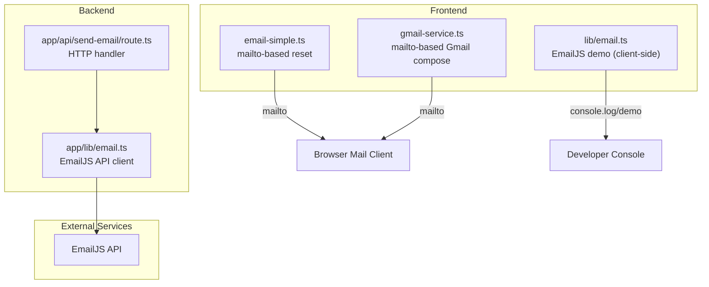
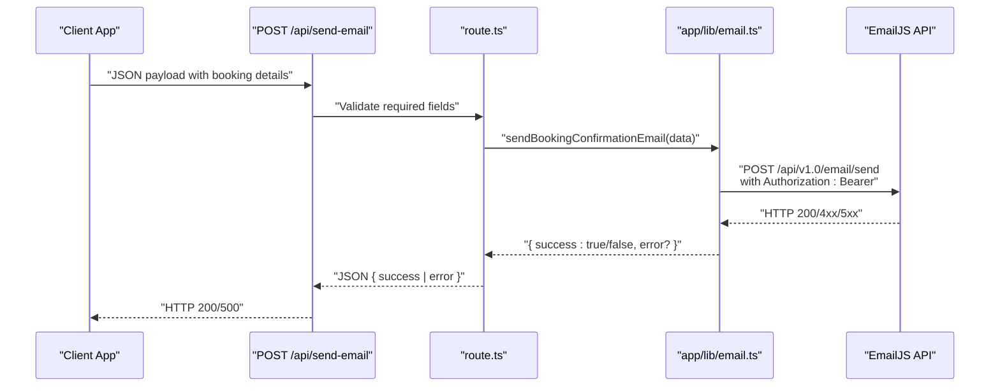
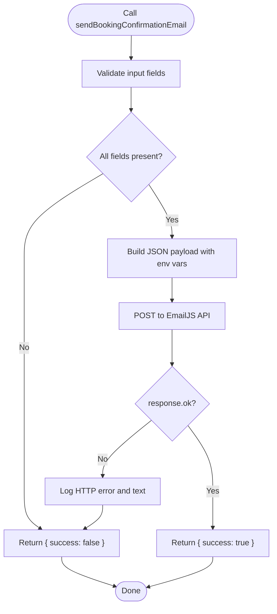
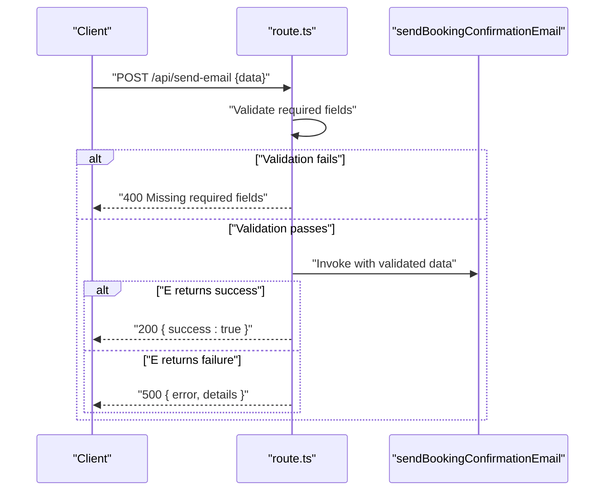
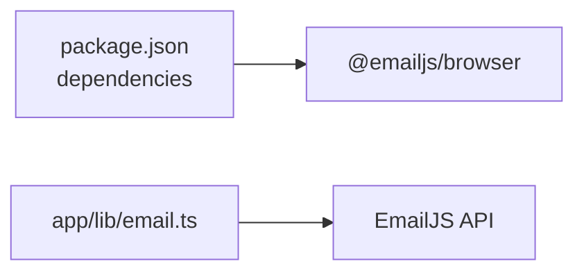

# Email Service Integration

<cite>
**Referenced Files in This Document**
- [email.ts](file://lib/email.ts)
- [gmail-service.ts](file://lib/gmail-service.ts)
- [email-simple.ts](file://lib/email-simple.ts)
- [email.ts](file://app/lib/email.ts)
- [route.ts](file://app/api/send-email/route.ts)
- [package.json](file://package.json)
- [README.md](file://README.md)
</cite>

## Table of Contents
1. [Introduction](#introduction)
2. [Project Structure](#project-structure)
3. [Core Components](#core-components)
4. [Architecture Overview](#architecture-overview)
5. [Detailed Component Analysis](#detailed-component-analysis)
6. [Dependency Analysis](#dependency-analysis)
7. [Performance Considerations](#performance-considerations)
8. [Troubleshooting Guide](#troubleshooting-guide)
9. [Conclusion](#conclusion)
10. [Appendices](#appendices)

## Introduction
This document explains the email service integration for the project, focusing on two primary approaches:
- EmailJS-based sending via a dedicated backend API endpoint
- Gmail SMTP-based sending using a frontend-driven mailto workflow

It covers configuration, authentication, environment variables, API key management, email sending functions, error handling, and practical examples. It also outlines limitations, rate considerations, and cost implications for each provider.

## Project Structure
The email functionality spans both frontend and backend modules:
- Frontend helpers for quick email preparation and user-driven sending
- Backend API for secure EmailJS integration using environment variables
- A Gmail SMTP helper for user-driven email composition

**Diagram sources**
- [email-simple.ts:1-59](file://lib/email-simple.ts#L1-L59)
- [gmail-service.ts:1-117](file://lib/gmail-service.ts#L1-L117)
- [email.ts:1-75](file://lib/email.ts#L1-L75)
- [route.ts:1-42](file://app/api/send-email/route.ts#L1-L42)
- [email.ts:1-49](file://app/lib/email.ts#L1-L49)

**Section sources**
- [email-simple.ts:1-59](file://lib/email-simple.ts#L1-L59)
- [gmail-service.ts:1-117](file://lib/gmail-service.ts#L1-L117)
- [email.ts:1-75](file://lib/email.ts#L1-L75)
- [route.ts:1-42](file://app/api/send-email/route.ts#L1-L42)
- [email.ts:1-49](file://app/lib/email.ts#L1-L49)

## Core Components
- EmailJS backend integration:
  - Securely sends templated emails using EmailJS API with bearer token authentication
  - Uses environment variables for service ID, template ID, public key, and private key
- Gmail SMTP helper:
  - Provides user-driven email composition via mailto links
  - Includes helper functions to generate welcome and reset email content
- Ultra-simple email helper:
  - Opens the default mail client with pre-filled subject/body for password reset
- Legacy EmailJS demo:
  - Demonstrates the EmailJS SDK usage pattern (currently commented out in favor of backend API)

Key functions and responsibilities:
- sendBookingConfirmationEmail: Backend EmailJS client
- POST /api/send-email: HTTP endpoint that validates input and triggers email sending
- sendPasswordResetEmail (simple): mailto-based password reset
- sendGmailEmail: mailto-based Gmail composition
- createGmailPasswordResetEmail / createGmailWelcomeEmail: content builders

**Section sources**
- [email.ts:1-49](file://app/lib/email.ts#L1-L49)
- [route.ts:1-42](file://app/api/send-email/route.ts#L1-L42)
- [email-simple.ts:1-59](file://lib/email-simple.ts#L1-L59)
- [gmail-service.ts:1-117](file://lib/gmail-service.ts#L1-L117)
- [email.ts:1-75](file://lib/email.ts#L1-L75)

## Architecture Overview
The system supports two email pathways:
- Backend pathway: The frontend triggers a Next.js API route, which calls a backend EmailJS client using environment variables and returns structured success/error responses.
- Frontend pathways: Two user-driven flows prepare and open the user's default mail client with pre-filled data.

**Diagram sources**
- [route.ts:1-42](file://app/api/send-email/route.ts#L1-L42)
- [email.ts:1-49](file://app/lib/email.ts#L1-L49)

## Detailed Component Analysis

### Backend EmailJS Integration
- Purpose: Send templated emails securely via EmailJS using a backend client.
- Authentication: Uses bearer token from environment variable for API access.
- Environment variables:
  - EMAILJS_SERVICE_ID: EmailJS service identifier
  - EMAILJS_TEMPLATE_ID: Template identifier for the email
  - EMAILJS_PUBLIC_KEY: Public user identifier
  - EMAILJS_PRIVATE_KEY: Private access token for API requests
- Request payload: Includes service_id, template_id, user_id, accessToken, and template_params.
- Error handling: Logs HTTP errors and returns structured result objects.

**Diagram sources**
- [email.ts:1-49](file://app/lib/email.ts#L1-L49)

**Section sources**
- [email.ts:1-49](file://app/lib/email.ts#L1-L49)

### API Endpoint for Sending Emails
- Route: POST /api/send-email
- Responsibilities:
  - Parse JSON request body
  - Validate required fields
  - Invoke backend EmailJS client
  - Return appropriate HTTP status and JSON response
- Error handling:
  - 400 for missing fields
  - 500 for internal errors or failed email sending

**Diagram sources**
- [route.ts:1-42](file://app/api/send-email/route.ts#L1-L42)
- [email.ts:1-49](file://app/lib/email.ts#L1-L49)

**Section sources**
- [route.ts:1-42](file://app/api/send-email/route.ts#L1-L42)

### Frontend Ultra-Simple Email Helper (mailto)
- Purpose: Quickly prepare and open the default mail client with a pre-filled password reset email.
- Functionality:
  - Generates subject and body for password reset
  - Opens mailto link in a new tab/window
  - Logs preparation steps to the console
- Limitations:
  - Requires user action to send
  - No delivery confirmation or error reporting

**Section sources**
- [email-simple.ts:1-59](file://lib/email-simple.ts#L1-L59)

### Gmail SMTP Helper (mailto)
- Purpose: Allow users to compose and send emails using their own Gmail account via the mailto protocol.
- Functionality:
  - Accepts sender credentials and recipient details
  - Builds a mailto link with pre-filled subject/from/body
  - Opens the default mail client
  - Includes helper functions to generate welcome and reset email content
- Limitations:
  - Requires user action to send
  - No delivery confirmation or error reporting
  - Relies on user's default mail client configuration

**Section sources**
- [gmail-service.ts:1-117](file://lib/gmail-service.ts#L1-L117)

### Legacy EmailJS Demo (Client-Side)
- Purpose: Demonstrates how EmailJS SDK would be used client-side.
- Observations:
  - Contains commented-out SDK usage and placeholders for keys
  - Currently logs to console instead of sending
- Migration recommendation:
  - Prefer backend EmailJS client for security and reliability

**Section sources**
- [email.ts:1-75](file://lib/email.ts#L1-L75)

## Dependency Analysis
- Runtime dependencies:
  - @emailjs/browser: Enables EmailJS SDK usage in the browser (present for potential client-side integration)
- Backend EmailJS client:
  - Uses native fetch to call EmailJS API
  - Relies on environment variables injected at runtime

**Diagram sources**
- [package.json:11-21](file://package.json#L11-L21)
- [email.ts:1-49](file://app/lib/email.ts#L1-L49)

**Section sources**
- [package.json:11-21](file://package.json#L11-L21)
- [email.ts:1-49](file://app/lib/email.ts#L1-L49)

## Performance Considerations
- Backend EmailJS client:
  - Network latency depends on external API performance
  - Request size is small; overhead mainly from network round-trip
- Frontend mailto helpers:
  - Near-zero computational overhead
  - Delivery timing and success depend on user’s mail client
- Recommendations:
  - Use backend EmailJS client for production to avoid exposing credentials
  - Batch or debounce repeated email requests at the UI level

## Troubleshooting Guide
Common issues and resolutions:
- Missing environment variables:
  - Symptom: Backend returns errors or logs missing configuration
  - Resolution: Set EMAILJS_SERVICE_ID, EMAILJS_TEMPLATE_ID, EMAILJS_PUBLIC_KEY, EMAILJS_PRIVATE_KEY
- Invalid bearer token:
  - Symptom: HTTP 401/403 from EmailJS API
  - Resolution: Verify EMAILJS_PRIVATE_KEY and ensure it matches the configured service
- Missing required fields:
  - Symptom: API returns 400 with "Missing required fields"
  - Resolution: Ensure to, guestName, roomName, checkIn, checkOut, totalPrice, bookingId are provided
- Frontend mailto blocked:
  - Symptom: Popup blocked or mail client not opening
  - Resolution: Trigger via user gesture (e.g., button click), and allow popups in the browser

**Section sources**
- [email.ts:1-49](file://app/lib/email.ts#L1-L49)
- [route.ts:1-42](file://app/api/send-email/route.ts#L1-L42)
- [email-simple.ts:1-59](file://lib/email-simple.ts#L1-L59)
- [gmail-service.ts:1-117](file://lib/gmail-service.ts#L1-L117)

## Conclusion
The project integrates email services through a secure backend EmailJS client and flexible frontend mailto-based workflows. The backend approach centralizes authentication and template management while the frontend helpers provide immediate user-driven composition. For production, prefer the backend EmailJS client and manage environment variables securely.

## Appendices

### Practical Examples

- Backend EmailJS initialization and sending:
  - Prepare environment variables:
    - EMAILJS_SERVICE_ID
    - EMAILJS_TEMPLATE_ID
    - EMAILJS_PUBLIC_KEY
    - EMAILJS_PRIVATE_KEY
  - Trigger the API:
    - POST /api/send-email with JSON payload containing booking details
  - Expected outcomes:
    - Success: HTTP 200 with { success: true }
    - Failure: HTTP 500 with { error, details }

- Frontend mailto-based password reset:
  - Call the helper with recipient email and reset link
  - The browser opens the default mail client with pre-filled subject/body
  - User completes and sends manually

- Gmail SMTP helper usage:
  - Provide sender credentials and recipient details
  - Generate email content via helper functions
  - Open mailto link to prefill the compose window

**Section sources**
- [email.ts:1-49](file://app/lib/email.ts#L1-L49)
- [route.ts:1-42](file://app/api/send-email/route.ts#L1-L42)
- [email-simple.ts:1-59](file://lib/email-simple.ts#L1-L59)
- [gmail-service.ts:1-117](file://lib/gmail-service.ts#L1-L117)

### Provider Limitations, Rate Limits, and Costs

- EmailJS
  - Limitations:
    - Requires a registered account and configured service/template
    - Delivery confirmation and bounce handling depend on provider features
  - Rate limits and costs:
    - Subject to EmailJS subscription tiers; review official documentation for current rates and quotas

- Gmail SMTP (mailto)
  - Limitations:
    - Relies on user’s default mail client
    - No programmatic delivery confirmation or error reporting
  - Rate limits and costs:
    - None for the mailto protocol itself; user’s mail client may impose usage policies

[No sources needed since this section provides general guidance]