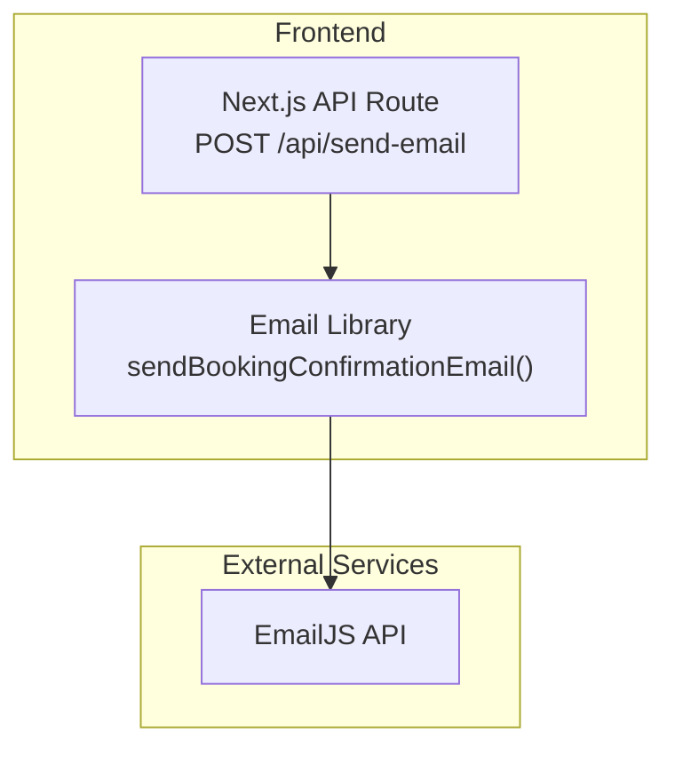
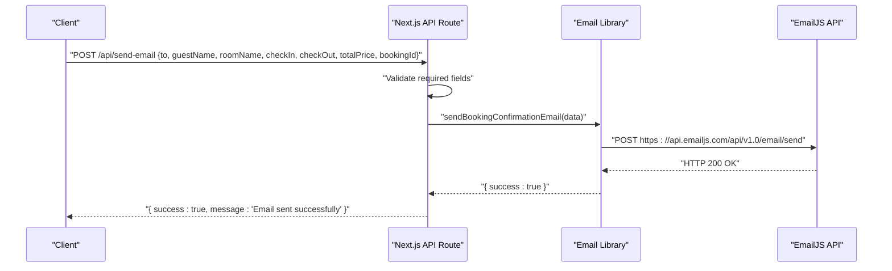
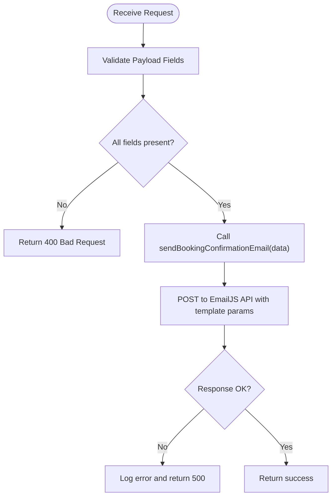
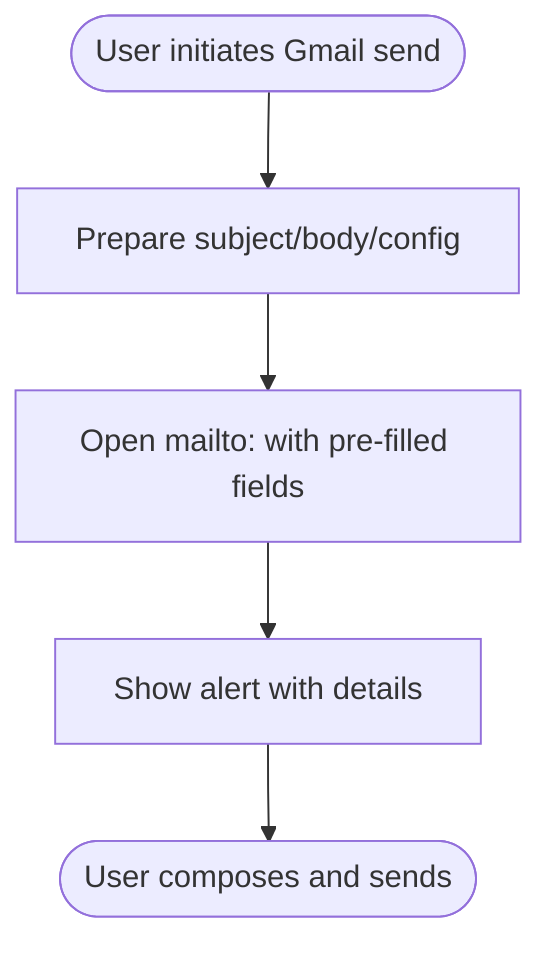
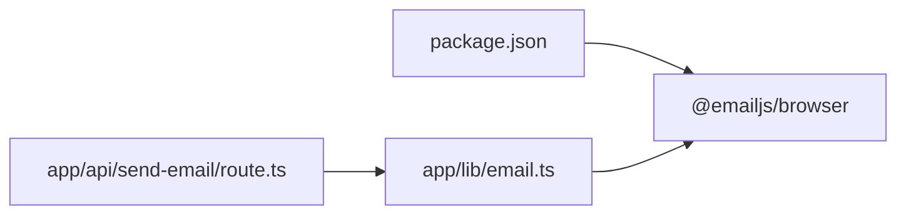

# Email System

<cite>
**Referenced Files in This Document**
- [app/api/send-email/route.ts](file://app/api/send-email/route.ts)
- [app/lib/email.ts](file://app/lib/email.ts)
- [lib/email.ts](file://lib/email.ts)
- [lib/gmail-service.ts](file://lib/gmail-service.ts)
- [lib/email-simple.ts](file://lib/email-simple.ts)
- [notifications.py](file://notifications.py)
- [package.json](file://package.json)
</cite>

## Table of Contents
1. [Introduction](#introduction)
2. [Project Structure](#project-structure)
3. [Core Components](#core-components)
4. [Architecture Overview](#architecture-overview)
5. [Detailed Component Analysis](#detailed-component-analysis)
6. [Dependency Analysis](#dependency-analysis)
7. [Performance Considerations](#performance-considerations)
8. [Troubleshooting Guide](#troubleshooting-guide)
9. [Conclusion](#conclusion)
10. [Appendices](#appendices)

## Introduction
This document explains the email notification system in the project, focusing on:
- EmailJS integration for browser-based sending
- Gmail SMTP simulation for user-initiated sends
- Template management for different notification types
- Automated email workflows for bookings, confirmations, and administrative alerts
- Email API endpoints, customization options, and delivery tracking
- Content formatting, localization support, and bulk processing
- Deliverability best practices, spam prevention, and fallback strategies

## Project Structure
The email system spans both frontend and backend areas:
- A Next.js API route exposes an endpoint to send booking confirmation emails via EmailJS
- A reusable library encapsulates the EmailJS call and template parameters
- Additional email utilities exist for simpler workflows and Gmail-based simulations
- A Python script demonstrates transactional email via a third-party provider

**Diagram sources**
- [app/api/send-email/route.ts:1-42](file://app/api/send-email/route.ts#L1-L42)
- [app/lib/email.ts:1-49](file://app/lib/email.ts#L1-L49)

**Section sources**
- [app/api/send-email/route.ts:1-42](file://app/api/send-email/route.ts#L1-L42)
- [app/lib/email.ts:1-49](file://app/lib/email.ts#L1-L49)

## Core Components
- EmailJS-based booking confirmation endpoint
  - Endpoint: POST /api/send-email
  - Validates required fields and forwards to the EmailJS library
- EmailJS library
  - Sends a templated email using EmailJS API with configured service, template, and parameters
- Gmail SMTP simulation
  - Provides functions to prepare and open a pre-filled compose window for Gmail
- Simple email utility
  - Opens a default mail client with a prepared reset link
- Third-party provider example
  - Demonstrates transactional email via a provider SDK

Key environment variables used by the EmailJS integration:
- EMAILJS_SERVICE_ID
- EMAILJS_TEMPLATE_ID
- EMAILJS_PUBLIC_KEY
- EMAILJS_PRIVATE_KEY

**Section sources**
- [app/api/send-email/route.ts:1-42](file://app/api/send-email/route.ts#L1-L42)
- [app/lib/email.ts:1-49](file://app/lib/email.ts#L1-L49)
- [lib/gmail-service.ts:1-117](file://lib/gmail-service.ts#L1-L117)
- [lib/email-simple.ts:1-59](file://lib/email-simple.ts#L1-L59)
- [notifications.py:1-53](file://notifications.py#L1-L53)

## Architecture Overview
The email workflow for booking confirmations is a client-to-API-to-EmailJS flow. The API route validates input, constructs a payload with template parameters, and invokes the EmailJS library, which performs the actual send against the EmailJS API.

**Diagram sources**
- [app/api/send-email/route.ts:1-42](file://app/api/send-email/route.ts#L1-L42)
- [app/lib/email.ts:1-49](file://app/lib/email.ts#L1-L49)

## Detailed Component Analysis

### EmailJS Booking Confirmation Workflow
- Endpoint: POST /api/send-email
  - Accepts JSON payload with recipient and booking details
  - Returns structured success/error responses
- Email library
  - Sends a templated email using EmailJS
  - Uses environment variables for service, template, and credentials
  - Emits detailed logs and error messages on failure

**Diagram sources**
- [app/api/send-email/route.ts:1-42](file://app/api/send-email/route.ts#L1-L42)
- [app/lib/email.ts:1-49](file://app/lib/email.ts#L1-L49)

**Section sources**
- [app/api/send-email/route.ts:1-42](file://app/api/send-email/route.ts#L1-L42)
- [app/lib/email.ts:1-49](file://app/lib/email.ts#L1-L49)

### EmailJS Template Management
- Template parameters supported by the EmailJS library include:
  - to_email, to_name, from_name
  - room_name, check_in, check_out, total_price, booking_id
  - message (plaintext)
- These parameters are passed to the EmailJS template via the EmailJS API call
- The EmailJS service and template identifiers are configured via environment variables

Practical template customization options:
- Modify subject and message fields in the EmailJS template
- Use dynamic placeholders for guestName, roomName, dates, and price
- Add branding and links tailored to the booking experience

**Section sources**
- [app/lib/email.ts:18-34](file://app/lib/email.ts#L18-L34)

### Gmail SMTP Simulation
- Purpose: Allow users to send emails using their own Gmail account via a pre-filled compose window
- Functions:
  - sendGmailEmail(config, to, subject, message)
  - createGmailPasswordResetEmail(resetLink, userEmail)
  - createGmailWelcomeEmail(userName, userEmail)
- Behavior:
  - Opens a mailto link with pre-filled fields
  - Displays an alert with preparation details
  - Intended for user-driven sends rather than automated workflows

**Diagram sources**
- [lib/gmail-service.ts:9-69](file://lib/gmail-service.ts#L9-L69)

**Section sources**
- [lib/gmail-service.ts:1-117](file://lib/gmail-service.ts#L1-L117)

### Simple Email Utility
- Purpose: Quickly prepare and open a password reset email in the default mail client
- Functions:
  - sendPasswordResetEmail(email, resetLink)
  - copyResetLink(email, resetLink)
- Behavior:
  - Constructs subject and body
  - Opens mailto link or copies reset link to clipboard

**Section sources**
- [lib/email-simple.ts:1-59](file://lib/email-simple.ts#L1-L59)

### Third-Party Provider Example (Python)
- Demonstrates transactional email via a provider SDK
- Includes HTML content and sender configuration
- Useful as a reference for server-side email delivery

**Section sources**
- [notifications.py:1-53](file://notifications.py#L1-L53)

## Dependency Analysis
- Frontend dependencies relevant to email:
  - @emailjs/browser: Enables browser-based EmailJS integration
- Runtime dependencies:
  - Next.js API routes handle requests and responses
  - Environment variables supply EmailJS credentials

**Diagram sources**
- [package.json:11-21](file://package.json#L11-L21)
- [app/api/send-email/route.ts:1-42](file://app/api/send-email/route.ts#L1-L42)
- [app/lib/email.ts:1-49](file://app/lib/email.ts#L1-L49)

**Section sources**
- [package.json:11-21](file://package.json#L11-L21)
- [app/api/send-email/route.ts:1-42](file://app/api/send-email/route.ts#L1-L42)
- [app/lib/email.ts:1-49](file://app/lib/email.ts#L1-L49)

## Performance Considerations
- Asynchronous processing: Email sending is performed asynchronously via fetch; avoid blocking UI threads
- Network reliability: EmailJS API calls may fail; implement retry logic and exponential backoff for production
- Payload size: Keep template parameters concise; avoid oversized payloads
- Caching: Reuse prepared templates and avoid repeated heavy computations before sending

## Troubleshooting Guide
Common issues and resolutions:
- Missing environment variables
  - Symptom: EmailJS API errors or empty logs
  - Action: Set EMAILJS_SERVICE_ID, EMAILJS_TEMPLATE_ID, EMAILJS_PUBLIC_KEY, EMAILJS_PRIVATE_KEY
- Validation failures
  - Symptom: 400 Bad Request from /api/send-email
  - Action: Ensure all required fields are present in the request payload
- EmailJS API errors
  - Symptom: Non-OK response with error text
  - Action: Inspect logs and verify service/template IDs and access tokens
- Gmail simulation not sending
  - Symptom: No email dispatched
  - Action: Confirm default mail client is configured and user approves sending

Operational checks:
- Verify EmailJS configuration logs during send attempts
- Monitor network connectivity and API rate limits
- For Gmail simulation, ensure mailto protocol is enabled in the environment

**Section sources**
- [app/api/send-email/route.ts:9-14](file://app/api/send-email/route.ts#L9-L14)
- [app/lib/email.ts:37-41](file://app/lib/email.ts#L37-L41)
- [lib/gmail-service.ts:58-62](file://lib/gmail-service.ts#L58-L62)

## Conclusion
The email system integrates EmailJS for browser-based booking confirmations, with a dedicated Next.js API route and a reusable library for sending templated emails. Supporting utilities enable user-driven Gmail sends and simplified reset flows. While the current implementation focuses on booking confirmations, the EmailJS template parameters and environment-based configuration provide a foundation for extending to other notification types, including administrative alerts and receipts. For production, add robust error handling, retries, logging, and consider server-side providers for higher deliverability and scalability.

## Appendices

### Email API Endpoints
- POST /api/send-email
  - Description: Sends a booking confirmation email via EmailJS
  - Request body fields: to, guestName, roomName, checkIn, checkOut, totalPrice, bookingId
  - Success response: { success: true, message: 'Email sent successfully' }
  - Error responses: 400 (Bad Request), 500 (Internal Server Error)

**Section sources**
- [app/api/send-email/route.ts:4-33](file://app/api/send-email/route.ts#L4-L33)

### Template Customization Options
- EmailJS template parameters:
  - to_email, to_name, from_name
  - room_name, check_in, check_out, total_price, booking_id
  - message (plaintext)
- Customization tips:
  - Adjust subject and message in the EmailJS template
  - Use placeholders for dynamic content (dates, names, prices)
  - Add branding and links for a seamless user experience

**Section sources**
- [app/lib/email.ts:23-33](file://app/lib/email.ts#L23-L33)

### Delivery Tracking Mechanisms
- Current state: The EmailJS integration returns a success/failure indicator; there is no built-in delivery tracking
- Recommendations:
  - Implement webhooks or callbacks from EmailJS to capture delivery events
  - Store email records with status and timestamps for auditability
  - Add retry queues for transient failures

### Email Content Formatting and Localization
- Content formatting:
  - Use EmailJS templates to structure subject and body
  - For richer content, adopt HTML templates with responsive designs
- Localization:
  - Parameterize subjects and messages by locale
  - Maintain separate templates per language and switch based on user preferences

### Bulk Email Processing
- Current state: The system supports single-send flows
- Recommendations:
  - Offload bulk sends to a server-side job queue
  - Batch requests and stagger sends to respect provider rate limits
  - Track per-recipient status and aggregate analytics

### Practical Examples of Email Templates
- Booking confirmation
  - Recipient: Guest
  - Content: Room details, check-in/out dates, total price, booking ID
  - Links: View reservation, help/support
- Payment receipt
  - Recipient: Guest
  - Content: Transaction summary, amount paid, date, merchant info
  - Links: Download receipt, support
- Administrative notification
  - Recipient: Admin team
  - Content: Summary of actions, affected users, timestamps
  - Links: Dashboard, logs

### Deliverability Best Practices and Spam Prevention
- Sender reputation
  - Use verified sender domains and addresses
  - Maintain consistent sending patterns
- Content hygiene
  - Avoid spam trigger words and excessive markup
  - Include clear unsubscribe or manage preferences links
- Authentication
  - Configure SPF/DKIM/DMARC for your domain
  - Use dedicated sending credentials and APIs
- Fallback strategies
  - Implement retries with backoff
  - Switch providers or use alternative channels (SMS) for critical alerts
  - Log and monitor failures for timely intervention