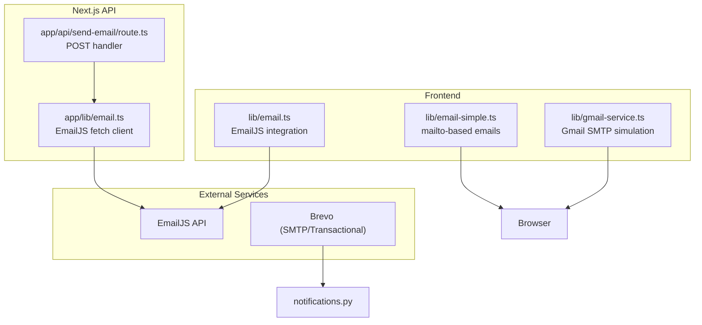
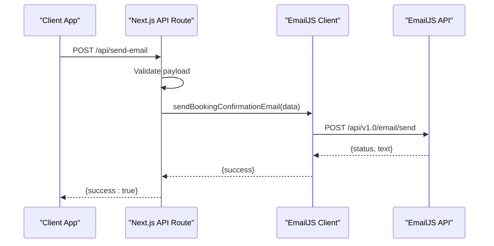
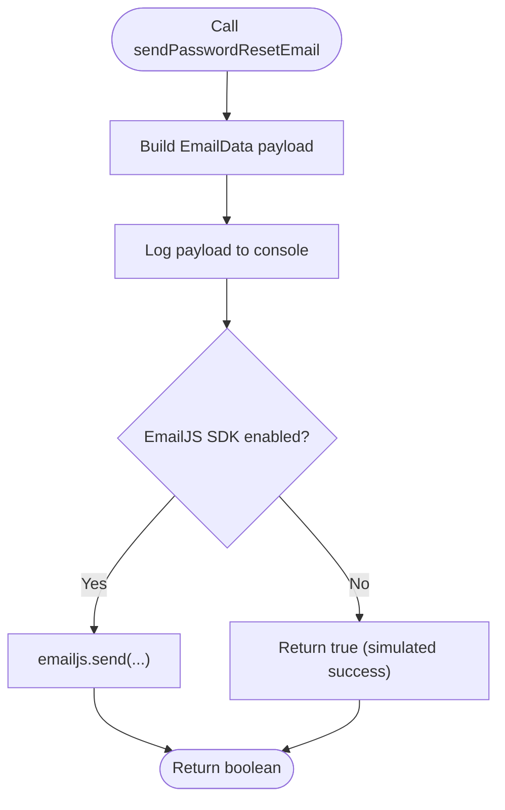
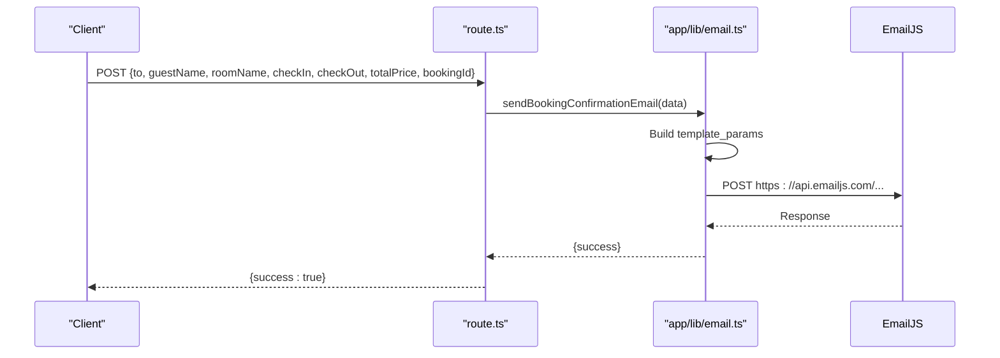
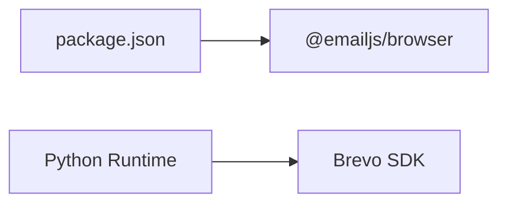

# Email Templates and Content Management

<cite>
**Referenced Files in This Document**
- [email.ts](file://lib/email.ts)
- [email-simple.ts](file://lib/email-simple.ts)
- [gmail-service.ts](file://lib/gmail-service.ts)
- [email.ts](file://app/lib/email.ts)
- [route.ts](file://app/api/send-email/route.ts)
- [notifications.py](file://notifications.py)
- [package.json](file://package.json)
- [page.tsx](file://app/reset-password/page.tsx)
</cite>

## Table of Contents
1. [Introduction](#introduction)
2. [Project Structure](#project-structure)
3. [Core Components](#core-components)
4. [Architecture Overview](#architecture-overview)
5. [Detailed Component Analysis](#detailed-component-analysis)
6. [Dependency Analysis](#dependency-analysis)
7. [Performance Considerations](#performance-considerations)
8. [Troubleshooting Guide](#troubleshooting-guide)
9. [Conclusion](#conclusion)

## Introduction
This document explains the email template management and content formatting system used in the project. It covers the EmailData interface, template customization options, and content generation workflows for different email types such as welcome emails, password reset emails, booking confirmations, and administrative notifications. It also documents template variables, dynamic content insertion, localization considerations, and outlines approaches for HTML email formatting, plain text alternatives, responsive design, template versioning, A/B testing, and content approval workflows.

## Project Structure
The email system spans multiple modules:
- Frontend utilities for sending emails via web APIs and simulating EmailJS integration
- Backend Next.js API route for sending booking confirmation emails via EmailJS
- Python-based notification service for HTML email delivery via Brevo (formerly Sendinblue)
- Additional helpers for Gmail SMTP simulation and simple mailto links

**Diagram sources**
- [email.ts:1-75](file://lib/email.ts#L1-L75)
- [email-simple.ts:1-59](file://lib/email-simple.ts#L1-L59)
- [gmail-service.ts:1-117](file://lib/gmail-service.ts#L1-L117)
- [email.ts:1-49](file://app/lib/email.ts#L1-L49)
- [route.ts:1-42](file://app/api/send-email/route.ts#L1-L42)
- [notifications.py:1-52](file://notifications.py#L1-L52)

**Section sources**
- [email.ts:1-75](file://lib/email.ts#L1-L75)
- [email-simple.ts:1-59](file://lib/email-simple.ts#L1-L59)
- [gmail-service.ts:1-117](file://lib/gmail-service.ts#L1-L117)
- [email.ts:1-49](file://app/lib/email.ts#L1-L49)
- [route.ts:1-42](file://app/api/send-email/route.ts#L1-L42)
- [notifications.py:1-52](file://notifications.py#L1-L52)

## Core Components
- EmailData interface: Defines the shape of email payloads for EmailJS-based flows.
- EmailJS integration: Two implementations exist—one in the frontend library and another in the Next.js API module—both preparing template parameters and calling the EmailJS API.
- Simple mailto-based emails: Provides a quick way to open the default email client with pre-filled subject and body.
- Gmail SMTP simulation: Allows users to prepare and preview emails using their Gmail credentials locally.
- Brevo transactional emails: Python script demonstrates HTML email formatting and responsive design considerations.

Key responsibilities:
- Define template variables and dynamic content insertion points
- Support multiple delivery channels (EmailJS, SMTP simulation, mailto)
- Provide hooks for localization and content customization
- Enable extensibility for HTML vs plain text variants

**Section sources**
- [email.ts:4-9](file://lib/email.ts#L4-L9)
- [email.ts:1-49](file://app/lib/email.ts#L1-L49)
- [email-simple.ts:1-59](file://lib/email-simple.ts#L1-L59)
- [gmail-service.ts:1-117](file://lib/gmail-service.ts#L1-L117)
- [notifications.py:1-52](file://notifications.py#L1-L52)

## Architecture Overview
The system supports multiple email delivery pathways:
- Frontend EmailJS: Uses a browser-side SDK to send templated emails via EmailJS.
- Next.js API EmailJS: Server-side fetch-based EmailJS client for secure credential handling.
- Simple mailto: Opens the user’s default email client with a prepared message.
- Gmail SMTP simulation: Prepares an email using Gmail credentials and opens the client.
- Brevo transactional: Sends HTML emails with responsive design and embedded styles.

**Diagram sources**
- [route.ts:1-42](file://app/api/send-email/route.ts#L1-L42)
- [email.ts:1-49](file://app/lib/email.ts#L1-L49)

**Section sources**
- [route.ts:1-42](file://app/api/send-email/route.ts#L1-L42)
- [email.ts:1-49](file://app/lib/email.ts#L1-L49)

## Detailed Component Analysis

### EmailData Interface and Template Variables
The EmailData interface defines the contract for email payloads intended for EmailJS templates. It includes:
- to_email: recipient address
- subject: email subject line
- message: email body content
- reset_link: optional password reset link

Template variables commonly used in EmailJS-based flows include:
- to_email, to_name, from_name
- room_name, check_in, check_out, total_price, booking_id
- message: a dynamic message field for localized content

These variables are passed as template_params to the EmailJS API.

**Section sources**
- [email.ts:4-9](file://lib/email.ts#L4-L9)
- [email.ts:23-33](file://app/lib/email.ts#L23-L33)

### EmailJS Integration (Frontend Library)
The frontend library provides:
- sendPasswordResetEmail: builds a reset email message and logs the payload for simulation
- sendWelcomeEmail: composes a welcome message and logs the payload

Both functions simulate EmailJS calls and return a boolean success indicator. The commented-out code shows how to integrate the official EmailJS SDK.

**Diagram sources**
- [email.ts:11-53](file://lib/email.ts#L11-L53)

**Section sources**
- [email.ts:1-75](file://lib/email.ts#L1-L75)

### EmailJS Integration (Next.js API Module)
The Next.js API module sends booking confirmation emails using a fetch-based client:
- Validates incoming payload
- Calls a dedicated function that posts to the EmailJS API
- Returns structured success/error responses

Template parameters include guest and booking details suitable for confirmation emails.

**Diagram sources**
- [route.ts:4-24](file://app/api/send-email/route.ts#L4-L24)
- [email.ts:1-49](file://app/lib/email.ts#L1-L49)

**Section sources**
- [route.ts:1-42](file://app/api/send-email/route.ts#L1-L42)
- [email.ts:1-49](file://app/lib/email.ts#L1-L49)

### Simple Mailto-Based Emails
The simple email utility:
- Constructs a subject and body for password reset
- Opens the default email client via mailto
- Optionally copies the reset link to clipboard

This approach requires no external credentials and works immediately in the browser.

**Section sources**
- [email-simple.ts:1-59](file://lib/email-simple.ts#L1-L59)

### Gmail SMTP Simulation
The Gmail service:
- Accepts credentials and target email
- Builds a message and opens the default client with pre-filled fields
- Includes helper functions to create welcome and reset messages

This enables local development and testing without a backend transport.

**Section sources**
- [gmail-service.ts:1-117](file://lib/gmail-service.ts#L1-L117)

### Brevo Transactional Emails (HTML)
The Python script demonstrates:
- Using Brevo’s TransactionalEmailsApi
- Building HTML content with embedded styles for responsive design
- Sending a confirmation email with a call-to-action button

This approach supports rich HTML emails with mobile-friendly layouts.

**Section sources**
- [notifications.py:1-52](file://notifications.py#L1-L52)

### Password Reset Flow (UI)
The reset password page validates tokens and handles user input. While not directly responsible for email composition, it integrates with the broader reset workflow by receiving a token and prompting the user to set a new password.

**Section sources**
- [page.tsx:1-181](file://app/reset-password/page.tsx#L1-L181)

## Dependency Analysis
External dependencies related to email:
- @emailjs/browser: enables EmailJS integration in the browser
- Node.js runtime and Python environment for backend-like scripts

**Diagram sources**
- [package.json:11-21](file://package.json#L11-L21)
- [notifications.py:1-52](file://notifications.py#L1-L52)

**Section sources**
- [package.json:1-33](file://package.json#L1-L33)
- [notifications.py:1-52](file://notifications.py#L1-L52)

## Performance Considerations
- Minimize network requests: batch email operations when possible and cache template parameters.
- Use server-side delivery for sensitive credentials: the Next.js API module avoids exposing private keys in the frontend.
- Optimize HTML emails: keep styles inline and avoid heavy assets for faster rendering.
- Asynchronous processing: defer non-critical email tasks to background jobs to reduce latency.

## Troubleshooting Guide
Common issues and resolutions:
- EmailJS API errors: Check service_id, template_id, and access tokens; verify environment variables are present and correctly formatted.
- Network failures: Ensure the EmailJS endpoint is reachable and credentials are valid.
- Frontend-only flows: When using mailto or Gmail simulation, users must have a configured default email client.
- Python-based delivery: Verify Brevo API key and sender configuration.

Operational checks:
- Logging: All email functions log payloads and outcomes for debugging.
- Validation: The Next.js route validates required fields and returns structured errors.

**Section sources**
- [email.ts:37-41](file://app/lib/email.ts#L37-L41)
- [route.ts:9-14](file://app/api/send-email/route.ts#L9-L14)
- [email-simple.ts:22-34](file://lib/email-simple.ts#L22-L34)
- [gmail-service.ts:19-24](file://lib/gmail-service.ts#L19-L24)
- [notifications.py:43-49](file://notifications.py#L43-L49)

## Conclusion
The project provides a flexible email system supporting multiple delivery channels and content formats. EmailData defines a consistent interface for template parameters, while EmailJS integrations enable scalable, serverless email delivery. Simple mailto and Gmail simulation approaches facilitate rapid development and testing. HTML email support via Brevo allows rich, responsive content. Extending the system to include localization, versioning, A/B testing, and approval workflows involves standardizing template variables, adding metadata/version fields, and integrating with a content governance layer.