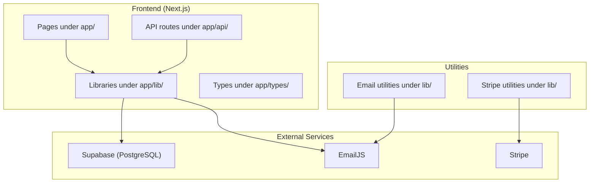
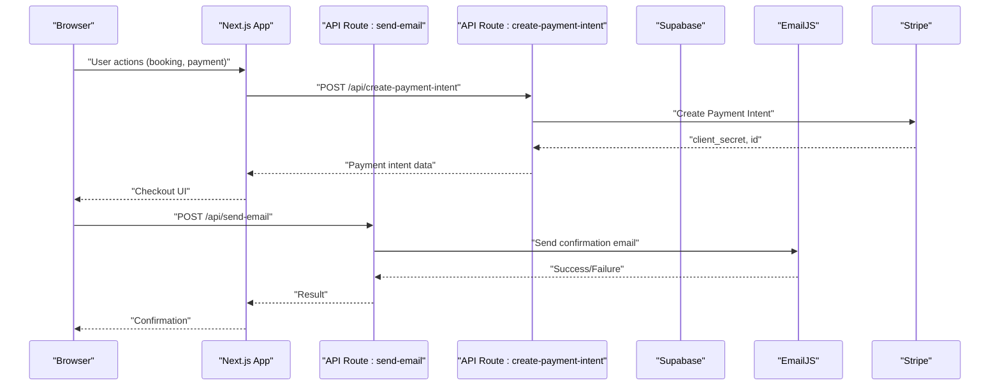
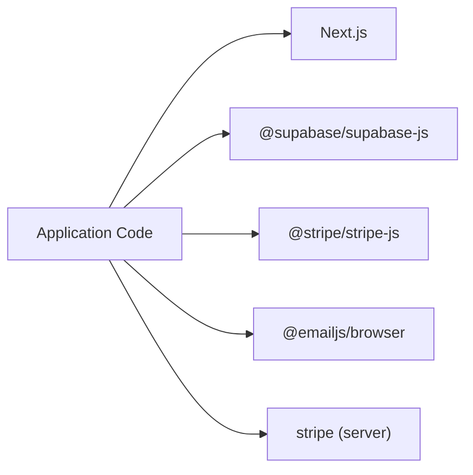

# Getting Started

<cite>
**Referenced Files in This Document**
- [README.md](file://README.md)
- [package.json](file://package.json)
- [next.config.ts](file://next.config.ts)
- [app/lib/supabase.ts](file://app/lib/supabase.ts)
- [app/lib/database.ts](file://app/lib/database.ts)
- [app/types/database.ts](file://app/types/database.ts)
- [setup-database-complete.sql](file://setup-database-complete.sql)
- [database-schema.sql](file://database-schema.sql)
- [clean-and-reset.sql](file://clean-and-reset.sql)
- [app/lib/email.ts](file://app/lib/email.ts)
- [lib/email.ts](file://lib/email.ts)
- [lib/stripe.ts](file://lib/stripe.ts)
- [app/api/send-email/route.ts](file://app/api/send-email/route.ts)
- [app/api/create-payment-intent/route.ts](file://app/api/create-payment-intent/route.ts)
</cite>

## Table of Contents
1. [Introduction](#introduction)
2. [Project Structure](#project-structure)
3. [Core Components](#core-components)
4. [Architecture Overview](#architecture-overview)
5. [Detailed Component Analysis](#detailed-component-analysis)
6. [Dependency Analysis](#dependency-analysis)
7. [Performance Considerations](#performance-considerations)
8. [Troubleshooting Guide](#troubleshooting-guide)
9. [Conclusion](#conclusion)
10. [Appendices](#appendices)

## Introduction
This guide helps you install, configure, and run the Pythonhostel project locally. It covers prerequisites, environment setup, database configuration with Supabase, development server startup, and how to navigate the project. You will also find verification steps, quick start examples, and troubleshooting tips for common setup issues.

## Project Structure
The project is a Next.js application with a modern frontend stack and backend integrations for authentication, database, email, and payments. Key areas include:
- Frontend pages under app/
- Backend API routes under app/api/
- Database abstraction and Supabase client under app/lib/
- TypeScript types under app/types/
- Utilities for email and Stripe under lib/

**Diagram sources**
- [package.json:1-33](file://package.json#L1-L33)
- [app/lib/supabase.ts:1-6](file://app/lib/supabase.ts#L1-L6)
- [app/lib/database.ts:1-433](file://app/lib/database.ts#L1-L433)
- [lib/email.ts:1-75](file://lib/email.ts#L1-L75)
- [lib/stripe.ts:1-112](file://lib/stripe.ts#L1-L112)

**Section sources**
- [package.json:1-33](file://package.json#L1-L33)
- [next.config.ts:1-8](file://next.config.ts#L1-L8)

## Core Components
- Supabase client initialization and database operations
- Email sending via EmailJS
- Stripe payment intents and checkout
- Next.js API routes for email and payment intent creation

Key implementation references:
- Supabase client: [app/lib/supabase.ts:1-6](file://app/lib/supabase.ts#L1-L6)
- Database helpers: [app/lib/database.ts:1-433](file://app/lib/database.ts#L1-L433)
- Email utilities: [app/lib/email.ts:1-49](file://app/lib/email.ts#L1-L49), [lib/email.ts:1-75](file://lib/email.ts#L1-L75)
- Stripe utilities: [lib/stripe.ts:1-112](file://lib/stripe.ts#L1-L112)
- API routes: [app/api/send-email/route.ts:1-42](file://app/api/send-email/route.ts#L1-L42), [app/api/create-payment-intent/route.ts:1-33](file://app/api/create-payment-intent/route.ts#L1-L33)

**Section sources**
- [app/lib/supabase.ts:1-6](file://app/lib/supabase.ts#L1-L6)
- [app/lib/database.ts:1-433](file://app/lib/database.ts#L1-L433)
- [app/lib/email.ts:1-49](file://app/lib/email.ts#L1-L49)
- [lib/email.ts:1-75](file://lib/email.ts#L1-L75)
- [lib/stripe.ts:1-112](file://lib/stripe.ts#L1-L112)
- [app/api/send-email/route.ts:1-42](file://app/api/send-email/route.ts#L1-L42)
- [app/api/create-payment-intent/route.ts:1-33](file://app/api/create-payment-intent/route.ts#L1-L33)

## Architecture Overview
The application uses a client-server model:
- Next.js app handles routing and rendering
- API routes under app/api expose server-side endpoints
- Supabase provides PostgreSQL-backed data storage and Row Level Security
- EmailJS sends transactional emails
- Stripe processes payments via Payment Intents

**Diagram sources**
- [app/api/send-email/route.ts:1-42](file://app/api/send-email/route.ts#L1-L42)
- [app/api/create-payment-intent/route.ts:1-33](file://app/api/create-payment-intent/route.ts#L1-L33)
- [lib/stripe.ts:1-112](file://lib/stripe.ts#L1-L112)
- [app/lib/email.ts:1-49](file://app/lib/email.ts#L1-L49)

## Detailed Component Analysis

### Prerequisites
- Node.js runtime and a package manager (npm, yarn, pnpm, or bun)
- Git for version control
- A modern web browser

Verification:
- Confirm Node.js and npm are installed by running node -v and npm -v in your terminal.

**Section sources**
- [README.md:5-15](file://README.md#L5-L15)

### Step-by-Step Installation
1. Clone the repository (if applicable) and open the project folder.
2. Install dependencies:
   - Run your preferred package manager’s install command.
3. Start the development server:
   - Use npm run dev, yarn dev, pnpm dev, or bun dev.
4. Open http://localhost:3000 in your browser.

Notes:
- The project uses Next.js scripts defined in package.json.
- Port 3000 is used by default.

**Section sources**
- [README.md:5-17](file://README.md#L5-L17)
- [package.json:5-10](file://package.json#L5-L10)

### Environment Setup and Required Variables
The application requires environment variables for external services. Define the following variables in your environment or a .env.local file at the project root:

- Supabase
  - NEXT_PUBLIC_SUPABASE_URL: Supabase project URL
  - NEXT_PUBLIC_SUPABASE_ANON_KEY: Supabase anonymous key
  - SUPABASE_SERVICE_ROLE_KEY: Supabase service role key (for server-side operations)

- EmailJS
  - EMAILJS_SERVICE_ID: Service ID from EmailJS
  - EMAILJS_TEMPLATE_ID: Template ID from EmailJS
  - EMAILJS_PUBLIC_KEY: Public key from EmailJS
  - EMAILJS_PRIVATE_KEY: Private key from EmailJS

- Stripe
  - STRIPE_SECRET_KEY: Stripe secret key for server-side operations
  - STRIPE_PUBLISHABLE_KEY: Stripe publishable key for client-side operations

Notes:
- These variables are referenced by the code in app/lib/supabase.ts, app/lib/email.ts, and lib/stripe.ts.
- The current repository contains placeholder keys in the code; replace them with your actual credentials.

**Section sources**
- [app/lib/supabase.ts:1-6](file://app/lib/supabase.ts#L1-L6)
- [app/lib/email.ts:1-49](file://app/lib/email.ts#L1-L49)
- [lib/stripe.ts:1-112](file://lib/stripe.ts#L1-L112)

### Database Configuration with Supabase
Follow these steps to set up the database:

1. Create a new Supabase project and note the Project URL and anon key.
2. Open the SQL Editor in Supabase and run the complete setup script:
   - [setup-database-complete.sql:1-269](file://setup-database-complete.sql#L1-L269)
3. Verify the schema:
   - [database-schema.sql:1-119](file://database-schema.sql#L1-L119)
4. Optional: Reset or clean the database using:
   - [clean-and-reset.sql:1-168](file://clean-and-reset.sql#L1-L168)

What the setup script does:
- Creates tables: users, rooms, bookings, room_availability, payments
- Adds indexes for performance
- Defines utility functions (e.g., availability checks)
- Enables Row Level Security (RLS) and sets policies
- Inserts sample rooms for testing

Security and policies:
- Policies restrict access based on user authentication and admin roles.
- The admin policy relies on a specific admin email; update it to match your admin email.

**Section sources**
- [setup-database-complete.sql:1-269](file://setup-database-complete.sql#L1-L269)
- [database-schema.sql:1-119](file://database-schema.sql#L1-L119)
- [clean-and-reset.sql:1-168](file://clean-and-reset.sql#L1-L168)

### Initial Project Setup
After installing dependencies and configuring environment variables:

1. Confirm Supabase connectivity:
   - Initialize the Supabase client with your URL and keys.
   - Reference: [app/lib/supabase.ts:1-6](file://app/lib/supabase.ts#L1-L6)
2. Verify database helpers:
   - Use the database functions to interact with tables.
   - Reference: [app/lib/database.ts:1-433](file://app/lib/database.ts#L1-L433)
3. Test email sending:
   - Configure EmailJS variables and call the email utility.
   - Reference: [app/lib/email.ts:1-49](file://app/lib/email.ts#L1-L49), [lib/email.ts:1-75](file://lib/email.ts#L1-L75)
4. Test payment intents:
   - Configure Stripe variables and call the Stripe utility.
   - Reference: [lib/stripe.ts:1-112](file://lib/stripe.ts#L1-L112)

**Section sources**
- [app/lib/supabase.ts:1-6](file://app/lib/supabase.ts#L1-L6)
- [app/lib/database.ts:1-433](file://app/lib/database.ts#L1-L433)
- [app/lib/email.ts:1-49](file://app/lib/email.ts#L1-L49)
- [lib/email.ts:1-75](file://lib/email.ts#L1-L75)
- [lib/stripe.ts:1-112](file://lib/stripe.ts#L1-L112)

### Development Server Startup and Port Configuration
- Start the development server with your chosen package manager.
- The default port is 3000.
- Access the application at http://localhost:3000.

Port customization:
- Next.js configuration is minimal; adjust via your package manager scripts or environment if needed.
- Reference: [next.config.ts:1-8](file://next.config.ts#L1-L8), [package.json:5-10](file://package.json#L5-L10)

**Section sources**
- [README.md:5-17](file://README.md#L5-L17)
- [next.config.ts:1-8](file://next.config.ts#L1-L8)
- [package.json:5-10](file://package.json#L5-L10)

### Basic Project Structure Navigation
- app/: Contains Next.js pages and API routes
  - app/admin/: Admin dashboards and protected routes
  - app/api/: Server endpoints (e.g., email, payment intent)
  - app/components/: Shared UI components
  - app/lib/: Supabase client and database helpers
  - app/types/: TypeScript definitions
- lib/: Utilities for email and Stripe
- Root SQL files: Database setup and reset scripts

Navigation tips:
- Explore app/admin/dashboard and app/admin/bookings for admin sections.
- Review app/api/* for backend endpoints.
- Check app/types/database.ts for data models.

**Section sources**
- [app/types/database.ts:1-146](file://app/types/database.ts#L1-L146)

## Dependency Analysis
The project depends on several libraries:
- Next.js framework
- Supabase client for database operations
- Stripe client for payments
- EmailJS for email delivery
- Tailwind CSS and TypeScript for styling and typing

**Diagram sources**
- [package.json:11-31](file://package.json#L11-L31)

**Section sources**
- [package.json:11-31](file://package.json#L11-L31)

## Performance Considerations
- Database queries rely on indexes defined in the schema. Keep them intact for optimal performance.
- Use Supabase RLS policies to minimize unnecessary data retrieval.
- Minimize payload sizes in API routes and avoid heavy computations on the client.

[No sources needed since this section provides general guidance]

## Troubleshooting Guide
Common issues and resolutions:

- Supabase connection fails
  - Verify NEXT_PUBLIC_SUPABASE_URL and NEXT_PUBLIC_SUPABASE_ANON_KEY are set.
  - Confirm Supabase project is reachable and RLS is configured as expected.
  - Reference: [app/lib/supabase.ts:1-6](file://app/lib/supabase.ts#L1-L6)

- Email sending errors
  - Ensure EMAILJS_SERVICE_ID, EMAILJS_TEMPLATE_ID, EMAILJS_PUBLIC_KEY, and EMAILJS_PRIVATE_KEY are set.
  - Check the API route logs for detailed error messages.
  - Reference: [app/lib/email.ts:1-49](file://app/lib/email.ts#L1-L49), [app/api/send-email/route.ts:1-42](file://app/api/send-email/route.ts#L1-L42)

- Payment intent creation failures
  - Confirm STRIPE_SECRET_KEY and STRIPE_PUBLISHABLE_KEY are set.
  - Review the API route logs for Stripe errors.
  - Reference: [lib/stripe.ts:1-112](file://lib/stripe.ts#L1-L112), [app/api/create-payment-intent/route.ts:1-33](file://app/api/create-payment-intent/route.ts#L1-L33)

- Database setup problems
  - Re-run the complete setup script or the clean-and-reset script if tables conflict.
  - Reference: [setup-database-complete.sql:1-269](file://setup-database-complete.sql#L1-L269), [clean-and-reset.sql:1-168](file://clean-and-reset.sql#L1-L168)

- Port conflicts
  - Change the port in your package manager scripts or use a different port.
  - Reference: [package.json:5-10](file://package.json#L5-L10)

**Section sources**
- [app/lib/supabase.ts:1-6](file://app/lib/supabase.ts#L1-L6)
- [app/lib/email.ts:1-49](file://app/lib/email.ts#L1-L49)
- [app/api/send-email/route.ts:1-42](file://app/api/send-email/route.ts#L1-L42)
- [lib/stripe.ts:1-112](file://lib/stripe.ts#L1-L112)
- [app/api/create-payment-intent/route.ts:1-33](file://app/api/create-payment-intent/route.ts#L1-L33)
- [setup-database-complete.sql:1-269](file://setup-database-complete.sql#L1-L269)
- [clean-and-reset.sql:1-168](file://clean-and-reset.sql#L1-L168)
- [package.json:5-10](file://package.json#L5-L10)

## Conclusion
You now have the essentials to install, configure, and run the Pythonhostel project locally. Replace placeholder keys with your own credentials, initialize the database using the provided scripts, and start the development server. Use the troubleshooting guide to resolve common issues and refer to the project structure navigation to explore admin dashboards and booking features.

[No sources needed since this section summarizes without analyzing specific files]

## Appendices

### Quick Start Examples
- Start the development server:
  - npm run dev, yarn dev, pnpm dev, or bun dev
  - Visit http://localhost:3000
- Access admin dashboard:
  - Navigate to the admin area under app/admin/
- Access booking system:
  - Use the booking page under app/booking/

**Section sources**
- [README.md:5-17](file://README.md#L5-L17)

### Verification Steps
- Confirm the development server starts without errors.
- Verify database tables exist and sample rooms are inserted.
- Send a test email via the email API route.
- Create a test payment intent via the payment intent API route.

**Section sources**
- [setup-database-complete.sql:254-263](file://setup-database-complete.sql#L254-L263)
- [app/api/send-email/route.ts:1-42](file://app/api/send-email/route.ts#L1-L42)
- [app/api/create-payment-intent/route.ts:1-33](file://app/api/create-payment-intent/route.ts#L1-L33)