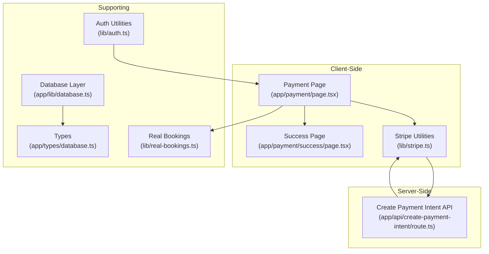
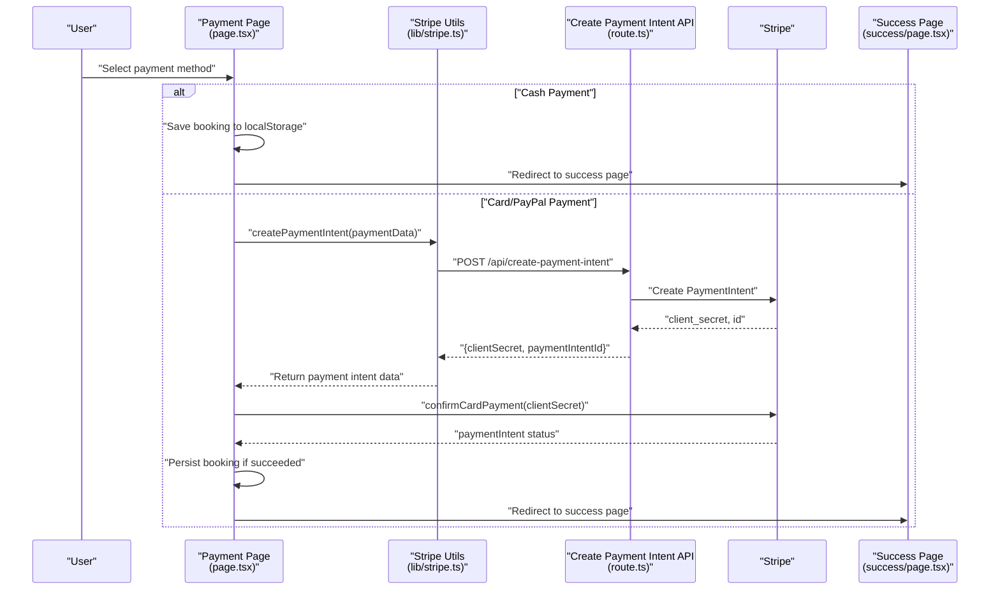
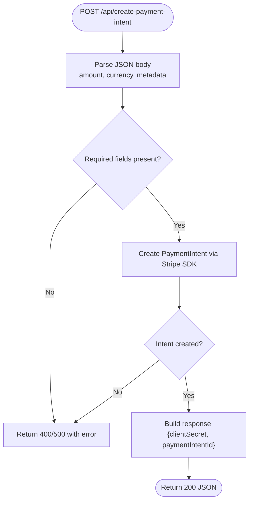
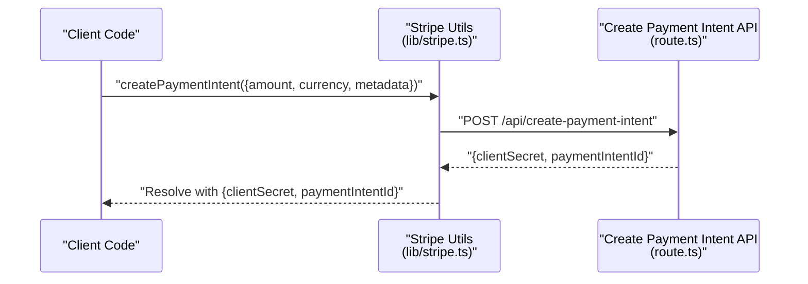
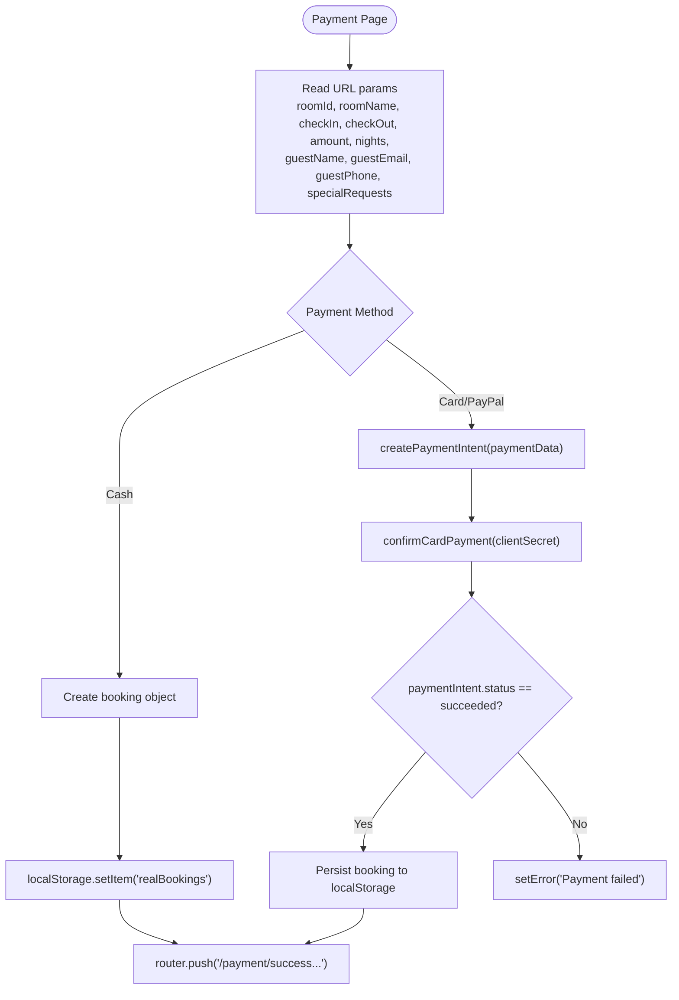
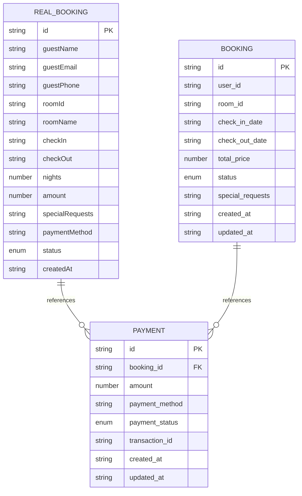
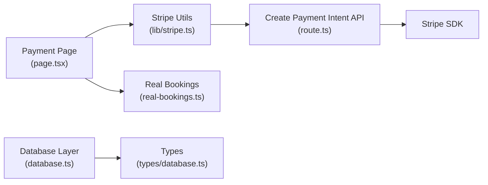

# Payment API Endpoints

<cite>
**Referenced Files in This Document**
- [route.ts](file://app/api/create-payment-intent/route.ts)
- [stripe.ts](file://lib/stripe.ts)
- [page.tsx](file://app/payment/page.tsx)
- [success/page.tsx](file://app/payment/success/page.tsx)
- [package.json](file://package.json)
- [auth.ts](file://lib/auth.ts)
- [real-bookings.ts](file://lib/real-bookings.ts)
- [database.ts](file://app/lib/database.ts)
- [types/database.ts](file://app/types/database.ts)
</cite>

## Table of Contents
1. [Introduction](#introduction)
2. [Project Structure](#project-structure)
3. [Core Components](#core-components)
4. [Architecture Overview](#architecture-overview)
5. [Detailed Component Analysis](#detailed-component-analysis)
6. [Dependency Analysis](#dependency-analysis)
7. [Performance Considerations](#performance-considerations)
8. [Security Considerations](#security-considerations)
9. [Troubleshooting Guide](#troubleshooting-guide)
10. [Conclusion](#conclusion)

## Introduction
This document provides comprehensive API documentation for the payment processing endpoints, focusing on the /api/create-payment-intent endpoint. It covers request/response schemas, payload validation, error handling, the payment intent creation process, amount calculation, currency handling, and metadata attachment. It also explains frontend integration patterns, client-side payment initiation, success/error callbacks, security considerations, rate limiting, input sanitization, examples of payment flow implementation, error handling strategies, and debugging techniques for payment processing failures.

## Project Structure
The payment system spans client-side React components, a Next.js API route, and supporting libraries for Stripe integration and local storage persistence. The key files involved in payment processing are:

- API route for payment intent creation
- Client-side Stripe integration utilities
- Payment page and success page components
- Authentication and input sanitization utilities
- Local storage-based booking persistence
- Database and type definitions for extended payment workflows

**Diagram sources**
- [route.ts:1-33](file://app/api/create-payment-intent/route.ts#L1-L33)
- [stripe.ts:1-112](file://lib/stripe.ts#L1-L112)
- [page.tsx:1-352](file://app/payment/page.tsx#L1-L352)
- [success/page.tsx:1-74](file://app/payment/success/page.tsx#L1-L74)
- [auth.ts:1-57](file://lib/auth.ts#L1-L57)
- [real-bookings.ts:1-120](file://lib/real-bookings.ts#L1-L120)
- [database.ts:1-433](file://app/lib/database.ts#L1-L433)
- [types/database.ts:1-146](file://app/types/database.ts#L1-L146)

**Section sources**
- [route.ts:1-33](file://app/api/create-payment-intent/route.ts#L1-L33)
- [stripe.ts:1-112](file://lib/stripe.ts#L1-L112)
- [page.tsx:1-352](file://app/payment/page.tsx#L1-L352)
- [success/page.tsx:1-74](file://app/payment/success/page.tsx#L1-L74)
- [auth.ts:1-57](file://lib/auth.ts#L1-L57)
- [real-bookings.ts:1-120](file://lib/real-bookings.ts#L1-L120)
- [database.ts:1-433](file://app/lib/database.ts#L1-L433)
- [types/database.ts:1-146](file://app/types/database.ts#L1-L146)

## Core Components
- Create Payment Intent API: Handles POST requests to create Stripe payment intents with amount, currency, and metadata.
- Stripe Utilities: Provides client-side helpers to create payment intents, confirm payments, redirect to checkout, and format amounts.
- Payment Page: Orchestrates payment initiation, collects guest details, handles cash vs. card payments, and manages success/error states.
- Success Page: Displays payment confirmation details after successful payment.
- Authentication Utilities: Offers input sanitization and validation helpers applicable to payment flows.
- Real Bookings: Manages local storage persistence for bookings and supports cash payment scenarios.
- Database Layer and Types: Defines payment-related data structures and provides CRUD operations for payments and bookings.

**Section sources**
- [route.ts:7-32](file://app/api/create-payment-intent/route.ts#L7-L32)
- [stripe.ts:17-37](file://lib/stripe.ts#L17-L37)
- [page.tsx:34-176](file://app/payment/page.tsx#L34-L176)
- [success/page.tsx:5-74](file://app/payment/success/page.tsx#L5-L74)
- [auth.ts:50-57](file://lib/auth.ts#L50-L57)
- [real-bookings.ts:21-37](file://lib/real-bookings.ts#L21-L37)
- [database.ts:214-226](file://app/lib/database.ts#L214-L226)
- [types/database.ts:46-55](file://app/types/database.ts#L46-L55)

## Architecture Overview
The payment flow integrates client-side and server-side components:

- Client initiates payment via the Payment Page.
- For card payments, the client calls the Stripe utility to create a payment intent.
- The Stripe utility posts to the Next.js API route to create a Stripe payment intent.
- The API route interacts with Stripe SDK to create the intent and returns clientSecret and paymentIntentId.
- The client confirms the payment using Stripe.js and redirects to the Success Page upon completion.
- For cash payments, the client saves a booking locally and redirects to the Success Page.

**Diagram sources**
- [page.tsx:34-176](file://app/payment/page.tsx#L34-L176)
- [stripe.ts:17-37](file://lib/stripe.ts#L17-L37)
- [route.ts:7-32](file://app/api/create-payment-intent/route.ts#L7-L32)
- [success/page.tsx:5-74](file://app/payment/success/page.tsx#L5-L74)

## Detailed Component Analysis

### API Endpoint: /api/create-payment-intent
- Purpose: Creates a Stripe payment intent with validated parameters and returns clientSecret and paymentIntentId.
- Request Schema:
  - amount: number (required)
  - currency: string (optional, defaults to eur)
  - metadata: object (optional)
- Response Schema:
  - clientSecret: string
  - paymentIntentId: string
- Error Handling:
  - Returns 500 with error message on failure.
- Processing Logic:
  - Extracts amount, currency, and metadata from request body.
  - Calls Stripe SDK to create a payment intent with automatic_payment_methods enabled.
  - Returns JSON with clientSecret and paymentIntentId.

**Diagram sources**
- [route.ts:7-32](file://app/api/create-payment-intent/route.ts#L7-L32)

**Section sources**
- [route.ts:7-32](file://app/api/create-payment-intent/route.ts#L7-L32)

### Client-Side Payment Utilities (lib/stripe.ts)
- createPaymentIntent(paymentData):
  - Sends POST to /api/create-payment-intent with JSON payload.
  - Validates response.ok and throws on errors.
  - Returns clientSecret and paymentIntentId.
- confirmPayment(paymentIntentId):
  - Placeholder for confirming payment via another endpoint.
- redirectToCheckout(sessionId):
  - Redirects to Stripe Checkout using sessionId.
- createCheckoutSession(items):
  - Placeholder for creating Stripe Checkout sessions.
- Amount Formatting:
  - formatAmountForStripe(amount): converts dollars to cents.
  - formatAmountFromStripe(amount): converts cents to dollars.

**Diagram sources**
- [stripe.ts:17-37](file://lib/stripe.ts#L17-L37)
- [route.ts:7-32](file://app/api/create-payment-intent/route.ts#L7-L32)

**Section sources**
- [stripe.ts:17-37](file://lib/stripe.ts#L17-L37)
- [stripe.ts:103-112](file://lib/stripe.ts#L103-L112)

### Frontend Integration: Payment Page (app/payment/page.tsx)
- Collects booking parameters from URL search params.
- Supports two payment methods:
  - Cash on Arrival: Saves booking to localStorage and redirects to success page.
  - Card/PayPal: Creates payment intent, mounts Stripe Elements, confirms payment, persists booking, and redirects to success page.
- Error handling:
  - Displays user-friendly error messages.
  - Logs errors to console.
- Success flow:
  - Builds booking object with metadata.
  - Persists to localStorage.
  - Navigates to success page with booking details.

**Diagram sources**
- [page.tsx:8-176](file://app/payment/page.tsx#L8-L176)
- [real-bookings.ts:21-37](file://lib/real-bookings.ts#L21-L37)

**Section sources**
- [page.tsx:8-176](file://app/payment/page.tsx#L8-L176)
- [real-bookings.ts:21-37](file://lib/real-bookings.ts#L21-L37)

### Success Page (app/payment/success/page.tsx)
- Reads bookingId, roomName, checkIn, checkOut, nights, amount from URL.
- Renders a success message and booking summary.

**Section sources**
- [success/page.tsx:5-74](file://app/payment/success/page.tsx#L5-L74)

### Data Models and Persistence
- Real Booking Model:
  - Fields include id, guestName, guestEmail, guestPhone, roomId, roomName, checkIn, checkOut, nights, amount, specialRequests, paymentMethod, status, createdAt.
  - Persisted in localStorage for cash payments.
- Payment Model (for extended workflows):
  - Fields include id, booking_id, amount, payment_method, payment_status, transaction_id, created_at, updated_at.
  - CRUD operations available via database layer.

**Diagram sources**
- [real-bookings.ts:3-18](file://lib/real-bookings.ts#L3-L18)
- [types/database.ts:24-35](file://app/types/database.ts#L24-L35)
- [types/database.ts:46-55](file://app/types/database.ts#L46-L55)

**Section sources**
- [real-bookings.ts:3-18](file://lib/real-bookings.ts#L3-L18)
- [types/database.ts:46-55](file://app/types/database.ts#L46-L55)
- [database.ts:214-226](file://app/lib/database.ts#L214-L226)

## Dependency Analysis
- Dependencies:
  - @stripe/stripe-js and stripe are used for client-side and server-side Stripe integrations.
  - Next.js API routes handle payment intent creation.
- Coupling:
  - Payment Page depends on Stripe Utilities and Real Bookings.
  - Stripe Utilities depend on Next.js fetch and the API route.
  - API route depends on Stripe SDK.

**Diagram sources**
- [package.json:11-21](file://package.json#L11-L21)
- [page.tsx:1-7](file://app/payment/page.tsx#L1-L7)
- [stripe.ts:1-5](file://lib/stripe.ts#L1-L5)
- [route.ts:1-6](file://app/api/create-payment-intent/route.ts#L1-L6)
- [real-bookings.ts:1-1](file://lib/real-bookings.ts#L1-L1)
- [database.ts:1-3](file://app/lib/database.ts#L1-L3)
- [types/database.ts:1-2](file://app/types/database.ts#L1-L2)

**Section sources**
- [package.json:11-21](file://package.json#L11-L21)
- [page.tsx:1-7](file://app/payment/page.tsx#L1-L7)
- [stripe.ts:1-5](file://lib/stripe.ts#L1-L5)
- [route.ts:1-6](file://app/api/create-payment-intent/route.ts#L1-L6)
- [real-bookings.ts:1-1](file://lib/real-bookings.ts#L1-L1)
- [database.ts:1-3](file://app/lib/database.ts#L1-L3)
- [types/database.ts:1-2](file://app/types/database.ts#L1-L2)

## Performance Considerations
- Amount Calculation:
  - Use formatAmountForStripe to convert dollar amounts to cents before sending to Stripe to avoid precision errors.
- Currency Handling:
  - Default currency is EUR; ensure frontend and backend align on currency selection.
- Metadata Attachment:
  - Attach only necessary metadata to reduce payload size and improve processing speed.
- Network Efficiency:
  - Minimize redundant API calls; batch operations where possible.
- Client-Side Rendering:
  - Avoid heavy computations on the client; delegate to server APIs when feasible.

[No sources needed since this section provides general guidance]

## Security Considerations
- API Endpoint Protection:
  - Restrict access to /api/create-payment-intent using middleware or authentication tokens.
  - Validate and sanitize all incoming request parameters.
- Rate Limiting:
  - Implement rate limiting to prevent abuse of the payment intent creation endpoint.
- Input Sanitization:
  - Use sanitizeInput for any user-provided strings to mitigate XSS risks.
- Secret Keys:
  - Store Stripe secret keys in environment variables and never expose them in client-side code.
- HTTPS:
  - Ensure all communication occurs over HTTPS to protect sensitive data.
- Error Handling:
  - Do not leak internal error details to clients; return generic error messages while logging specifics server-side.

**Section sources**
- [auth.ts:50-57](file://lib/auth.ts#L50-L57)
- [route.ts:5-5](file://app/api/create-payment-intent/route.ts#L5-L5)

## Troubleshooting Guide
- Common Issues:
  - Missing amount or invalid amount type: Ensure amount is a positive number.
  - Currency mismatch: Verify currency matches supported values and client expectations.
  - Metadata validation: Ensure metadata is a valid JSON object.
  - Stripe SDK initialization: Confirm public and secret keys are configured correctly.
- Debugging Steps:
  - Log request payloads and responses on both client and server.
  - Inspect Stripe dashboard for payment intent statuses and events.
  - Use browser developer tools to monitor network requests and console logs.
  - Validate frontend error messages and ensure they are user-friendly without exposing sensitive details.
- Error Handling Strategies:
  - Centralize error handling in Stripe utilities and Payment Page.
  - Provide retry mechanisms for transient failures.
  - Fallback to cash payment option when card payment fails.

**Section sources**
- [page.tsx:171-176](file://app/payment/page.tsx#L171-L176)
- [stripe.ts:33-36](file://lib/stripe.ts#L33-L36)
- [route.ts:25-31](file://app/api/create-payment-intent/route.ts#L25-L31)

## Conclusion
The payment processing system integrates a Next.js API route with client-side Stripe utilities to create and confirm payment intents. The Payment Page orchestrates user interactions, handles cash and card payments, and persists bookings. Robust error handling, input sanitization, and security measures are essential for a reliable and secure payment experience. Extending the system with database-backed payments and comprehensive rate limiting will further enhance reliability and scalability.