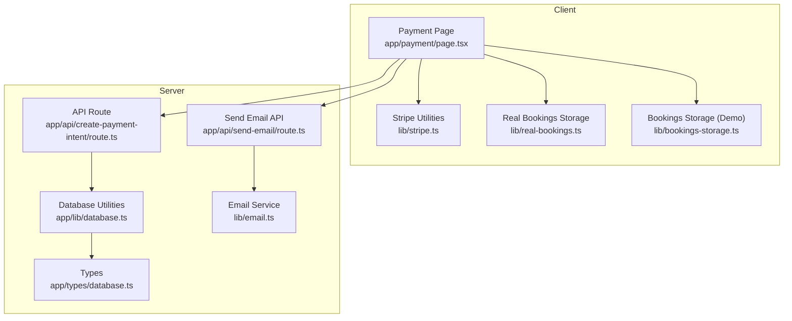
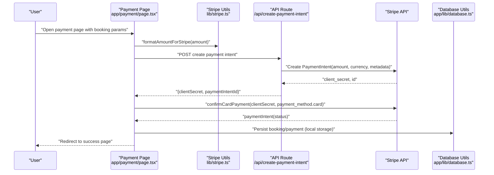
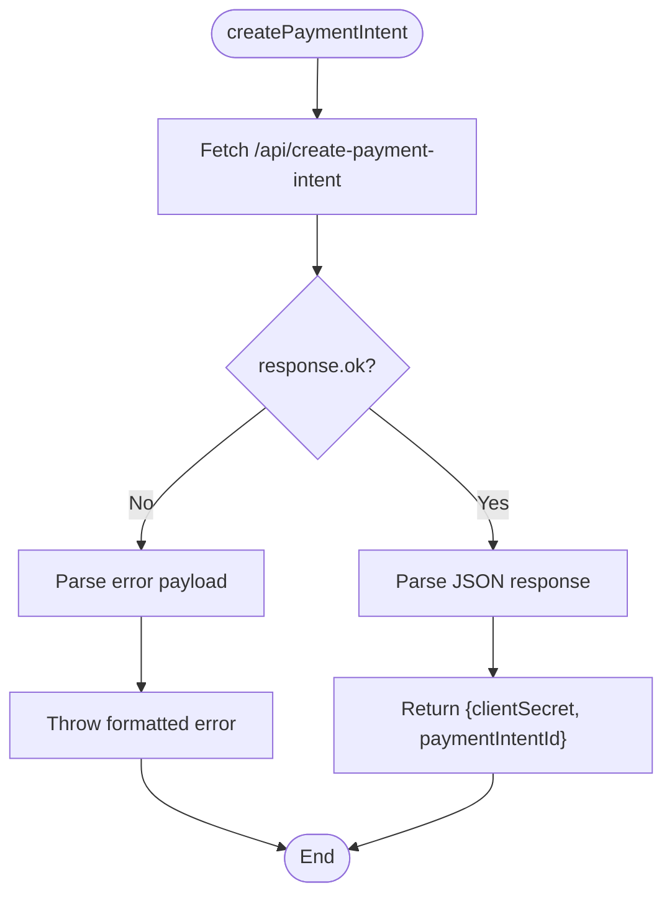
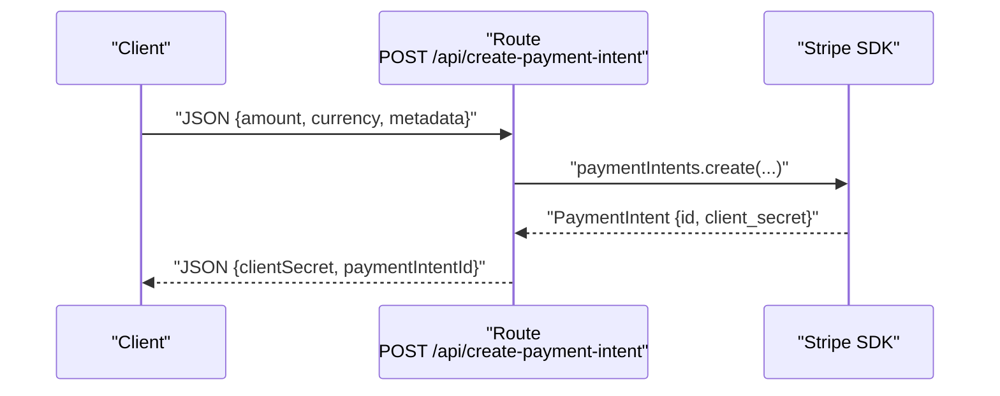
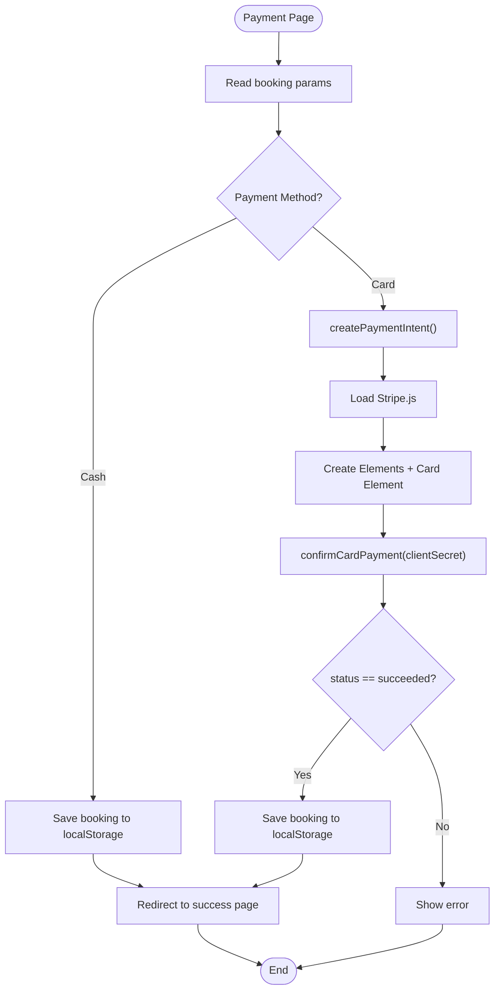
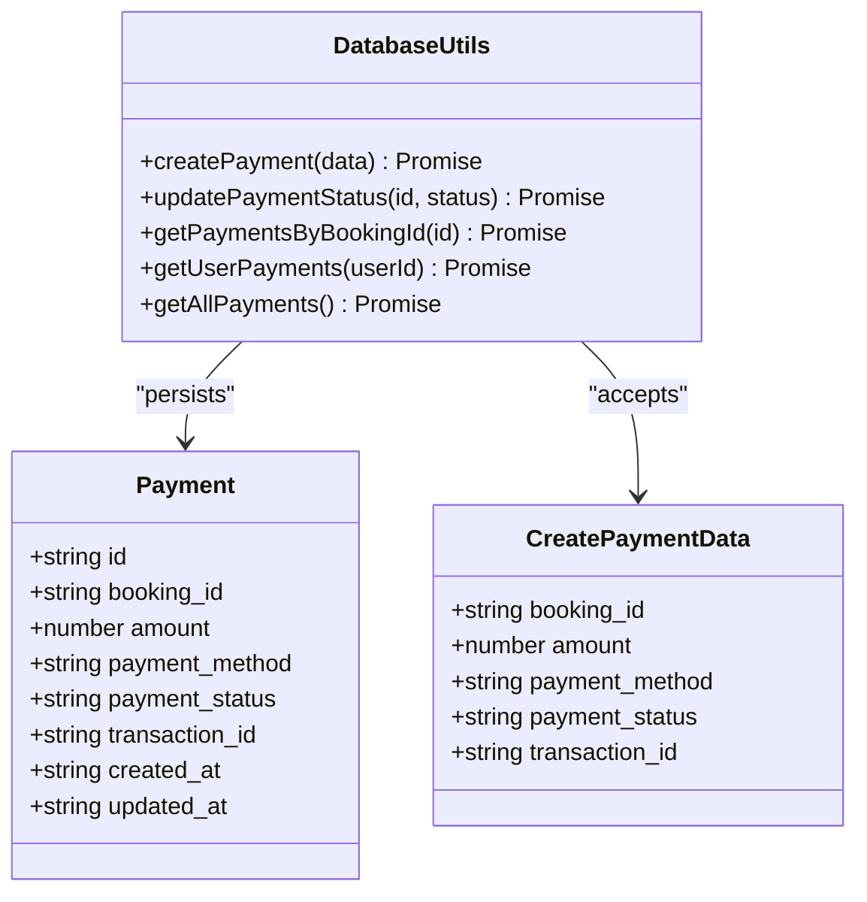
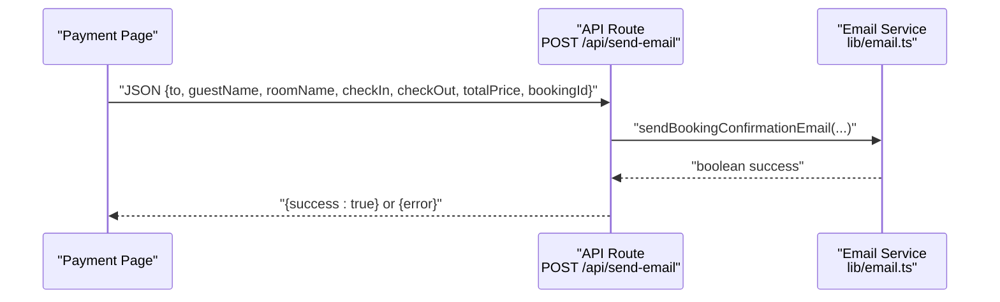
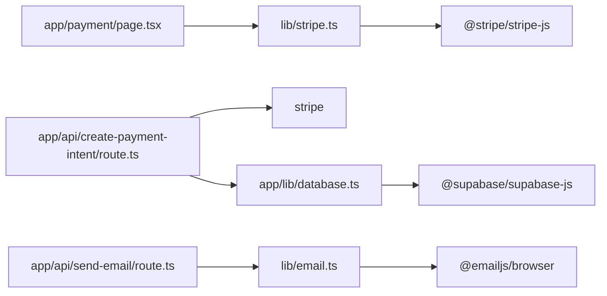

# Payment Processing

<cite>
**Referenced Files in This Document**
- [lib/stripe.ts](file://lib/stripe.ts)
- [app/api/create-payment-intent/route.ts](file://app/api/create-payment-intent/route.ts)
- [app/payment/page.tsx](file://app/payment/page.tsx)
- [app/payment/success/page.tsx](file://app/payment/success/page.tsx)
- [app/lib/database.ts](file://app/lib/database.ts)
- [app/types/database.ts](file://app/types/database.ts)
- [lib/real-bookings.ts](file://lib/real-bookings.ts)
- [lib/bookings-storage.ts](file://lib/bookings-storage.ts)
- [app/api/send-email/route.ts](file://app/api/send-email/route.ts)
- [lib/email.ts](file://lib/email.ts)
- [package.json](file://package.json)
</cite>

## Table of Contents
1. [Introduction](#introduction)
2. [Project Structure](#project-structure)
3. [Core Components](#core-components)
4. [Architecture Overview](#architecture-overview)
5. [Detailed Component Analysis](#detailed-component-analysis)
6. [Dependency Analysis](#dependency-analysis)
7. [Performance Considerations](#performance-considerations)
8. [Security and Compliance](#security-and-compliance)
9. [Testing Strategies](#testing-strategies)
10. [Troubleshooting Guide](#troubleshooting-guide)
11. [Conclusion](#conclusion)

## Introduction
This document provides comprehensive API documentation for the payment processing system. It covers Stripe integration for payment intent creation, amount formatting, currency handling, and payment confirmation workflows. It also documents backend API endpoints, request/response schemas, error handling strategies, the complete payment flow from booking confirmation to payment completion, webhook handling considerations, reconciliation processes, security and PCI compliance, tokenization of sensitive data, fraud prevention measures, testing strategies with Stripe test modes, sandbox environments, and production deployment considerations.

## Project Structure
The payment processing system spans client-side utilities, Next.js API routes, frontend pages, and database utilities. The key areas are:
- Client-side Stripe utilities for intent creation, confirmation, and amount formatting
- Next.js API route for creating Stripe payment intents
- Frontend payment page orchestrating payment flow
- Success page displaying confirmation details
- Database utilities for persisting payments and bookings
- Email service for sending booking confirmations

**Diagram sources**
- [app/payment/page.tsx:1-352](file://app/payment/page.tsx#L1-L352)
- [lib/stripe.ts:1-112](file://lib/stripe.ts#L1-L112)
- [app/api/create-payment-intent/route.ts:1-33](file://app/api/create-payment-intent/route.ts#L1-L33)
- [lib/real-bookings.ts:1-120](file://lib/real-bookings.ts#L1-L120)
- [lib/bookings-storage.ts:1-191](file://lib/bookings-storage.ts#L1-L191)
- [app/lib/database.ts:1-433](file://app/lib/database.ts#L1-L433)
- [app/types/database.ts:1-146](file://app/types/database.ts#L1-L146)
- [app/api/send-email/route.ts:1-42](file://app/api/send-email/route.ts#L1-L42)
- [lib/email.ts:1-75](file://lib/email.ts#L1-L75)

**Section sources**
- [lib/stripe.ts:1-112](file://lib/stripe.ts#L1-L112)
- [app/api/create-payment-intent/route.ts:1-33](file://app/api/create-payment-intent/route.ts#L1-L33)
- [app/payment/page.tsx:1-352](file://app/payment/page.tsx#L1-L352)
- [app/payment/success/page.tsx:1-74](file://app/payment/success/page.tsx#L1-L74)
- [app/lib/database.ts:1-433](file://app/lib/database.ts#L1-L433)
- [app/types/database.ts:1-146](file://app/types/database.ts#L1-L146)
- [lib/real-bookings.ts:1-120](file://lib/real-bookings.ts#L1-L120)
- [lib/bookings-storage.ts:1-191](file://lib/bookings-storage.ts#L1-L191)
- [app/api/send-email/route.ts:1-42](file://app/api/send-email/route.ts#L1-L42)
- [lib/email.ts:1-75](file://lib/email.ts#L1-L75)

## Core Components
- Stripe client utilities:
  - Payment intent creation via a dedicated endpoint
  - Amount formatting helpers for Stripe’s minor units
  - Checkout session creation and redirection helpers
- Next.js API route:
  - Creates Stripe payment intents with amount, currency, and metadata
  - Returns client secret and payment intent ID
- Frontend payment page:
  - Collects booking parameters and guest details
  - Handles cash-on-arrival and card payment flows
  - Confirms payment with Stripe Elements and updates local storage
- Success page:
  - Displays booking confirmation summary
- Database utilities:
  - Persist payments and bookings
  - Retrieve and update payment statuses
- Email service:
  - Sends booking confirmation emails via an API route

**Section sources**
- [lib/stripe.ts:16-112](file://lib/stripe.ts#L16-L112)
- [app/api/create-payment-intent/route.ts:7-32](file://app/api/create-payment-intent/route.ts#L7-L32)
- [app/payment/page.tsx:34-176](file://app/payment/page.tsx#L34-L176)
- [app/payment/success/page.tsx:5-74](file://app/payment/success/page.tsx#L5-L74)
- [app/lib/database.ts:214-272](file://app/lib/database.ts#L214-L272)
- [app/types/database.ts:46-96](file://app/types/database.ts#L46-L96)
- [app/api/send-email/route.ts:4-41](file://app/api/send-email/route.ts#L4-L41)

## Architecture Overview
The payment flow integrates client-side Stripe utilities with a Next.js API route to create and confirm payment intents. The frontend handles UI orchestration, while the backend interacts with Stripe and persists data locally for demonstration purposes.

**Diagram sources**
- [app/payment/page.tsx:73-137](file://app/payment/page.tsx#L73-L137)
- [lib/stripe.ts:17-37](file://lib/stripe.ts#L17-L37)
- [app/api/create-payment-intent/route.ts:7-24](file://app/api/create-payment-intent/route.ts#L7-L24)

## Detailed Component Analysis

### Stripe Integration Utilities
- Purpose: Provide client-side helpers for payment intent creation, amount formatting, and checkout sessions.
- Key functions:
  - createPaymentIntent: Posts to the Next.js API route to create a Stripe payment intent.
  - formatAmountForStripe/formatAmountFromStripe: Convert between major and minor units.
  - createCheckoutSession/redirectToCheckout: Optional helpers for Stripe Checkout sessions.
- Error handling: Catches and logs errors during intent creation and session creation.

**Diagram sources**
- [lib/stripe.ts:17-37](file://lib/stripe.ts#L17-L37)

**Section sources**
- [lib/stripe.ts:6-112](file://lib/stripe.ts#L6-L112)

### Next.js API Route: Create Payment Intent
- Endpoint: POST /api/create-payment-intent
- Request body: amount (minor units), currency (default EUR), metadata (bookingId, userId, roomName, guest info)
- Response: { clientSecret, paymentIntentId }
- Error handling: Logs error and returns 500 with error message

**Diagram sources**
- [app/api/create-payment-intent/route.ts:7-24](file://app/api/create-payment-intent/route.ts#L7-L24)

**Section sources**
- [app/api/create-payment-intent/route.ts:1-33](file://app/api/create-payment-intent/route.ts#L1-L33)

### Frontend Payment Page
- Responsibilities:
  - Reads booking parameters from URL search params
  - Supports cash-on-arrival and card payment methods
  - Uses Stripe Elements to collect card details
  - Confirms payment and persists booking to local storage
  - Redirects to success page upon completion
- Data model:
  - Booking object includes guest details, room info, nights, amount, and payment method
  - Local storage keys for persisted bookings

**Diagram sources**
- [app/payment/page.tsx:34-176](file://app/payment/page.tsx#L34-L176)

**Section sources**
- [app/payment/page.tsx:1-352](file://app/payment/page.tsx#L1-L352)
- [lib/real-bookings.ts:21-37](file://lib/real-bookings.ts#L21-L37)

### Success Page
- Displays booking confirmation details including room, check-in/out, nights, and total paid.
- Provides navigation to reservations and home.

**Section sources**
- [app/payment/success/page.tsx:1-74](file://app/payment/success/page.tsx#L1-L74)

### Database Utilities and Types
- Payment persistence:
  - createPayment: Inserts a payment record linked to a booking
  - updatePaymentStatus: Updates payment status (pending/completed/failed)
  - getPaymentsByBookingId/getUserPayments/getAllPayments: Retrieval helpers
- Types:
  - Payment interface defines fields for amount, method, status, and optional transaction ID
  - CreatePaymentData mirrors insertion payload

**Diagram sources**
- [app/types/database.ts:46-96](file://app/types/database.ts#L46-L96)
- [app/lib/database.ts:214-272](file://app/lib/database.ts#L214-L272)

**Section sources**
- [app/lib/database.ts:214-272](file://app/lib/database.ts#L214-L272)
- [app/types/database.ts:46-96](file://app/types/database.ts#L46-L96)

### Email Service and API
- Email service:
  - sendWelcomeEmail/sendPasswordResetEmail: Prepare and log email content
- Send email API:
  - Validates required fields and forwards to email service
  - Returns success or error with appropriate status codes

**Diagram sources**
- [app/api/send-email/route.ts:4-41](file://app/api/send-email/route.ts#L4-L41)
- [lib/email.ts:11-74](file://lib/email.ts#L11-L74)

**Section sources**
- [app/api/send-email/route.ts:1-42](file://app/api/send-email/route.ts#L1-L42)
- [lib/email.ts:1-75](file://lib/email.ts#L1-L75)

## Dependency Analysis
- External libraries:
  - @stripe/stripe-js and stripe for client and server integrations
  - @supabase/supabase-js for database operations
  - @emailjs/browser for email service
- Internal dependencies:
  - Frontend payment page depends on Stripe utilities and local storage
  - API route depends on Stripe SDK
  - Database utilities depend on Supabase client and TypeScript types

**Diagram sources**
- [package.json:11-21](file://package.json#L11-L21)
- [lib/stripe.ts:1](file://lib/stripe.ts#L1)
- [app/api/create-payment-intent/route.ts:2](file://app/api/create-payment-intent/route.ts#L2)
- [app/lib/database.ts:1](file://app/lib/database.ts#L1)
- [lib/email.ts:1](file://lib/email.ts#L1)

**Section sources**
- [package.json:1-33](file://package.json#L1-L33)

## Performance Considerations
- Minimize network requests: Batch Stripe operations and avoid redundant calls.
- Client-side caching: Cache formatted amounts and metadata to reduce re-computation.
- Asynchronous loading: Load Stripe.js lazily and mount Elements only when needed.
- Database writes: Persist only after successful payment confirmation to avoid partial states.
- Error boundaries: Surface actionable errors without overwhelming the UI.

## Security and Compliance
- PCI compliance:
  - Use Stripe.js Elements to collect card data on the client; never transmit raw PAN to your servers.
  - Avoid storing sensitive cardholder data.
- Tokenization:
  - Rely on Stripe to tokenize card data; store only Stripe-provided identifiers.
- Data protection:
  - Sanitize and validate all inputs on the server.
  - Use HTTPS and secure cookies/session storage.
- Fraud prevention:
  - Enable Radar rules and 3D Secure when available.
  - Monitor declined transactions and implement risk scoring.
- Webhook handling:
  - Implement server-side webhooks to reconcile payment events and update statuses.
  - Verify webhook signatures and idempotency keys.
- Reconciliation:
  - Match Stripe event ids to local records and update payment_status accordingly.
  - Periodic reconciliation reports to detect discrepancies.

## Testing Strategies
- Stripe test mode:
  - Use test publishable and secret keys to simulate payment intents and confirmations.
  - Test various scenarios: success, failure, 3D Secure, and mandate flows.
- Sandbox environments:
  - Run tests against a local or staging environment mirroring production data shapes.
- Unit/integration tests:
  - Mock Stripe SDK responses for intent creation and confirmation.
  - Validate error handling paths and response schemas.
- End-to-end tests:
  - Automate browser flows for payment page, card input, and success redirection.
- Production deployment:
  - Store secrets in environment variables and CI/CD vaults.
  - Enable logging and monitoring for payment failures and latency.
  - Set up alerts for webhook delivery failures and reconciliation gaps.

## Troubleshooting Guide
- Payment intent creation fails:
  - Verify API route receives valid amount, currency, and metadata.
  - Check Stripe SDK initialization and API key correctness.
- Payment confirmation errors:
  - Inspect clientSecret validity and card element mounting.
  - Review Stripe.js error messages and handle user-recoverable issues.
- Local storage persistence:
  - Ensure localStorage is available and not blocked by browser settings.
  - Validate booking object shape before saving.
- Email delivery:
  - Confirm required fields are present in the send-email API request.
  - Check email service logs and template configuration.

**Section sources**
- [app/api/create-payment-intent/route.ts:25-31](file://app/api/create-payment-intent/route.ts#L25-L31)
- [lib/stripe.ts:33-37](file://lib/stripe.ts#L33-L37)
- [app/payment/page.tsx:171-176](file://app/payment/page.tsx#L171-L176)
- [app/api/send-email/route.ts:9-14](file://app/api/send-email/route.ts#L9-L14)

## Conclusion
The payment processing system integrates Stripe for secure payment intent creation and confirmation, with a clear separation between client-side UI orchestration and server-side intent management. While the current implementation focuses on local storage for demonstration, the architecture supports seamless migration to persistent storage and webhook-driven reconciliation. Adhering to PCI guidelines, implementing robust error handling, and leveraging Stripe’s built-in fraud tools ensures a secure and reliable payment experience.