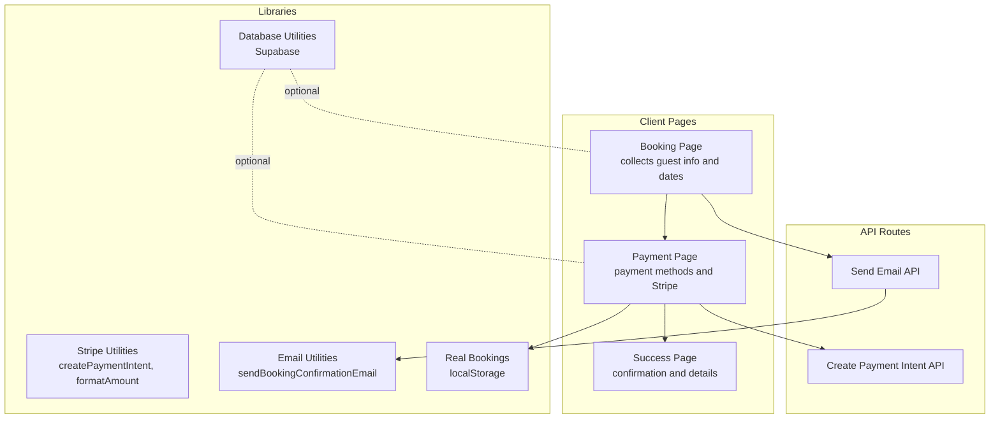
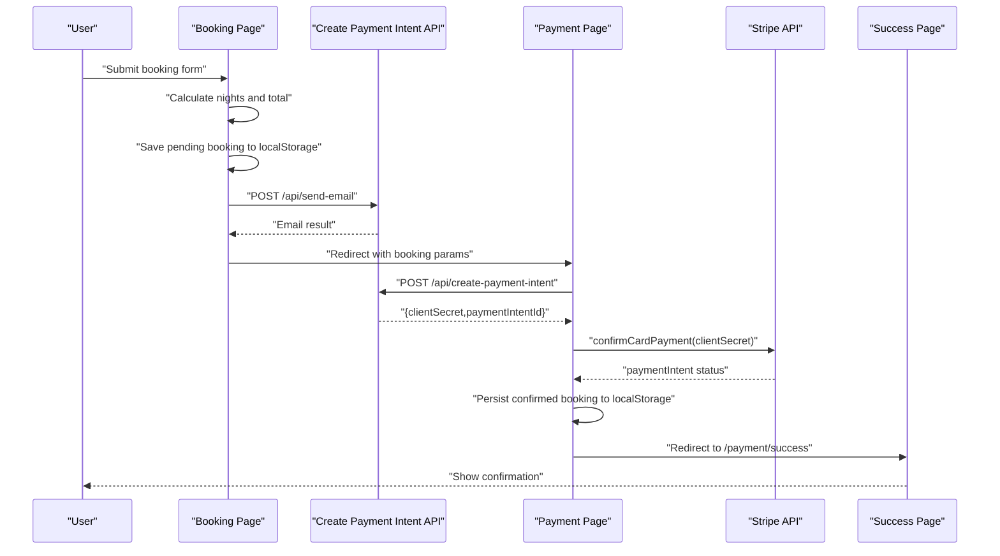
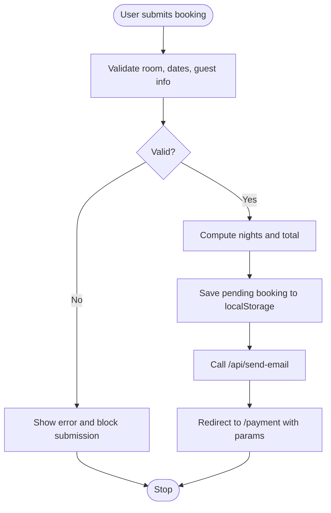
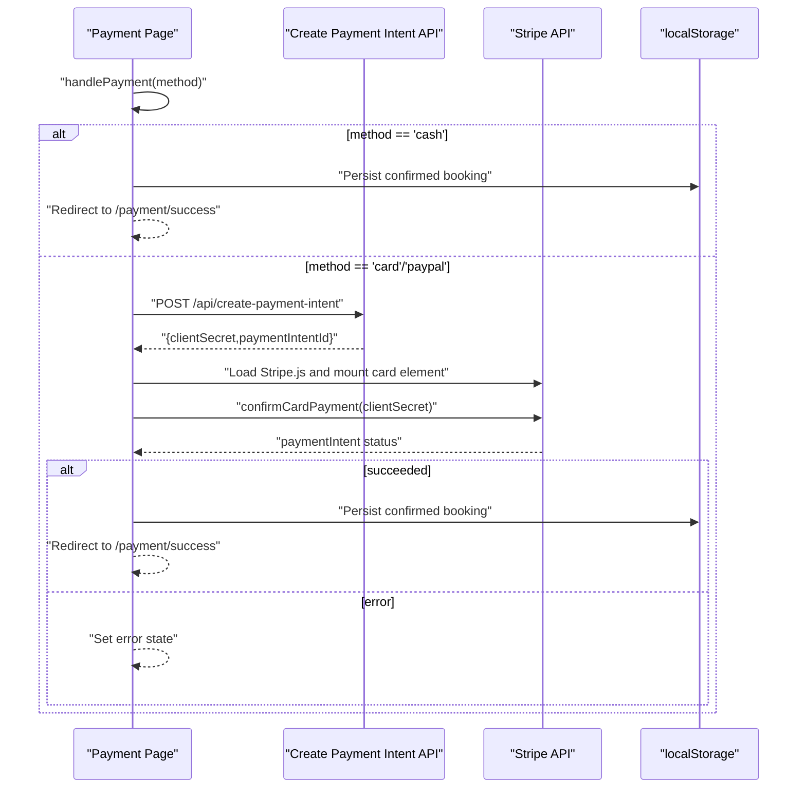
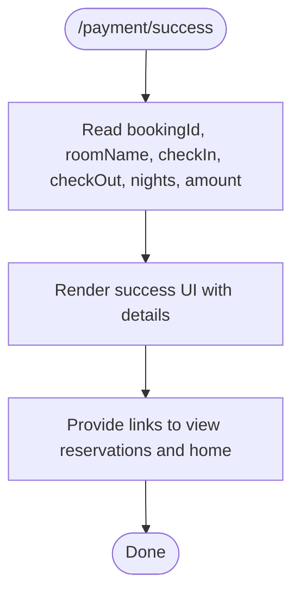
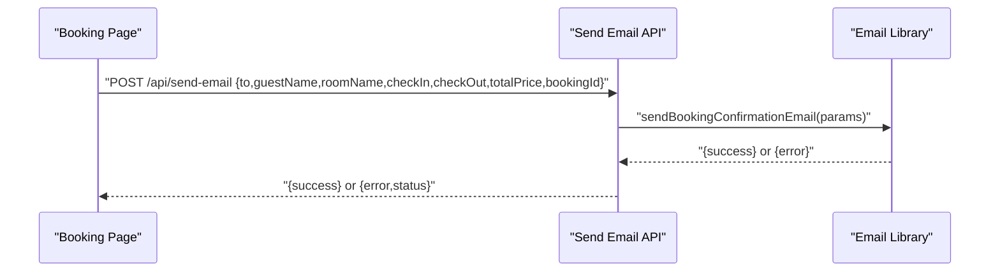
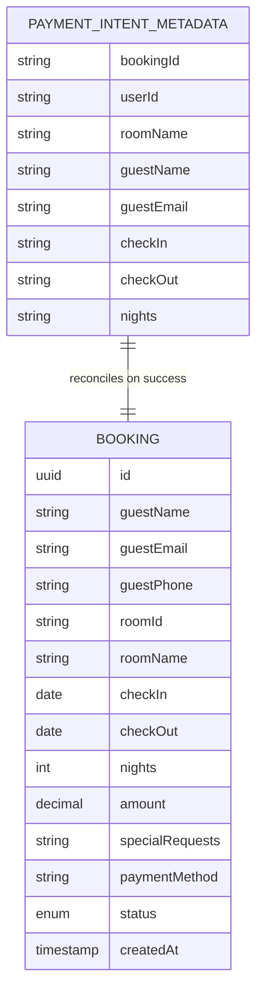
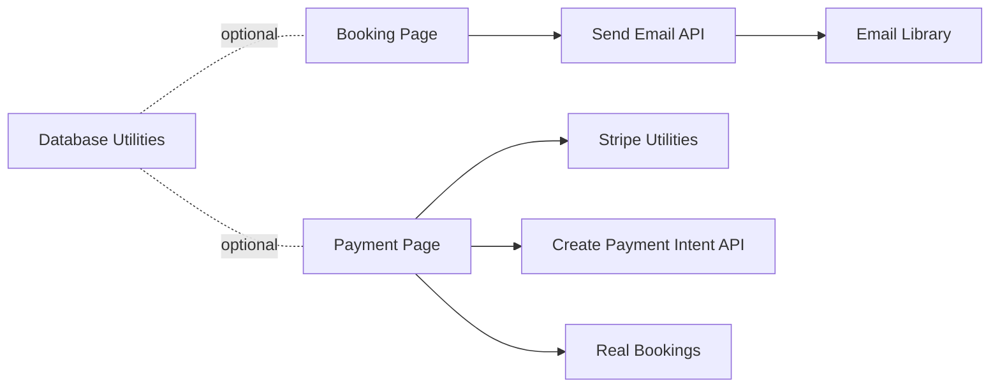

# Payment Workflow

<cite>
**Referenced Files in This Document**
- [app/booking/page.tsx](file://app/booking/page.tsx)
- [app/payment/page.tsx](file://app/payment/page.tsx)
- [app/payment/success/page.tsx](file://app/payment/success/page.tsx)
- [lib/stripe.ts](file://lib/stripe.ts)
- [app/api/create-payment-intent/route.ts](file://app/api/create-payment-intent/route.ts)
- [app/api/send-email/route.ts](file://app/api/send-email/route.ts)
- [app/lib/email.ts](file://app/lib/email.ts)
- [lib/real-bookings.ts](file://lib/real-bookings.ts)
- [lib/bookings-storage.ts](file://lib/bookings-storage.ts)
- [app/lib/database.ts](file://app/lib/database.ts)
- [database-schema.sql](file://database-schema.sql)
</cite>

## Table of Contents
1. [Introduction](#introduction)
2. [Project Structure](#project-structure)
3. [Core Components](#core-components)
4. [Architecture Overview](#architecture-overview)
5. [Detailed Component Analysis](#detailed-component-analysis)
6. [Dependency Analysis](#dependency-analysis)
7. [Performance Considerations](#performance-considerations)
8. [Troubleshooting Guide](#troubleshooting-guide)
9. [Conclusion](#conclusion)

## Introduction
This document explains the complete payment workflow from booking confirmation to payment completion. It covers session creation, Stripe integration, payment confirmation handling, success page rendering, and user feedback mechanisms. It also documents how booking data is integrated with payment processing via metadata, reconciliation strategies, error handling, retries, fallbacks, and user experience considerations such as loading states and progress indicators.

## Project Structure
The payment workflow spans client-side pages, API routes, and shared libraries:
- Booking page collects guest and stay details and redirects to the payment page with booking parameters.
- Payment page handles payment methods, creates a Stripe PaymentIntent, confirms payment, and persists booking data.
- Success page displays confirmation details and navigation links.
- Shared Stripe utilities encapsulate API interactions and amount formatting.
- Email API route and library send booking confirmation emails.
- Local storage utilities persist bookings for local development and admin dashboards.
- Supabase database utilities support full persistence and reporting.

**Diagram sources**
- [app/booking/page.tsx:1-434](file://app/booking/page.tsx#L1-L434)
- [app/payment/page.tsx:1-352](file://app/payment/page.tsx#L1-L352)
- [app/payment/success/page.tsx:1-74](file://app/payment/success/page.tsx#L1-L74)
- [lib/stripe.ts:1-112](file://lib/stripe.ts#L1-L112)
- [app/api/create-payment-intent/route.ts:1-33](file://app/api/create-payment-intent/route.ts#L1-L33)
- [app/api/send-email/route.ts:1-42](file://app/api/send-email/route.ts#L1-L42)
- [app/lib/email.ts:1-49](file://app/lib/email.ts#L1-L49)
- [lib/real-bookings.ts:1-120](file://lib/real-bookings.ts#L1-L120)
- [app/lib/database.ts:1-433](file://app/lib/database.ts#L1-L433)

**Section sources**
- [app/booking/page.tsx:1-434](file://app/booking/page.tsx#L1-L434)
- [app/payment/page.tsx:1-352](file://app/payment/page.tsx#L1-L352)
- [app/payment/success/page.tsx:1-74](file://app/payment/success/page.tsx#L1-L74)
- [lib/stripe.ts:1-112](file://lib/stripe.ts#L1-L112)
- [app/api/create-payment-intent/route.ts:1-33](file://app/api/create-payment-intent/route.ts#L1-L33)
- [app/api/send-email/route.ts:1-42](file://app/api/send-email/route.ts#L1-L42)
- [app/lib/email.ts:1-49](file://app/lib/email.ts#L1-L49)
- [lib/real-bookings.ts:1-120](file://lib/real-bookings.ts#L1-L120)
- [app/lib/database.ts:1-433](file://app/lib/database.ts#L1-L433)

## Core Components
- Booking Page: Validates inputs, calculates nights and total price, saves a pending booking to localStorage, sends a confirmation email, and navigates to the payment page with booking parameters.
- Payment Page: Receives booking parameters, supports cash-on-arrival and card payments, creates a Stripe PaymentIntent, mounts Stripe Elements, confirms payment, persists a confirmed booking to localStorage, and redirects to the success page.
- Success Page: Displays booking confirmation details and navigation actions.
- Stripe Utilities: Encapsulates PaymentIntent creation, amount formatting, and Stripe SDK interactions.
- Email API and Library: Sends booking confirmation emails via EmailJS.
- Real Bookings Utilities: Persist and manage bookings in localStorage for admin dashboards.
- Database Utilities: Optional Supabase-backed persistence and reporting for production-grade deployments.

**Section sources**
- [app/booking/page.tsx:76-170](file://app/booking/page.tsx#L76-L170)
- [app/payment/page.tsx:34-176](file://app/payment/page.tsx#L34-L176)
- [app/payment/success/page.tsx:5-74](file://app/payment/success/page.tsx#L5-L74)
- [lib/stripe.ts:17-37](file://lib/stripe.ts#L17-L37)
- [app/api/send-email/route.ts:4-41](file://app/api/send-email/route.ts#L4-L41)
- [app/lib/email.ts:1-49](file://app/lib/email.ts#L1-L49)
- [lib/real-bookings.ts:21-37](file://lib/real-bookings.ts#L21-L37)
- [app/lib/database.ts:92-119](file://app/lib/database.ts#L92-L119)

## Architecture Overview
The payment workflow integrates client-side pages, serverless API routes, and external services:
- Client-side booking form posts to the payment page with query parameters.
- Payment page creates a PaymentIntent server-side and confirms payment client-side with Stripe Elements.
- On success, the payment page persists a confirmed booking and redirects to the success page.
- An email confirmation is sent asynchronously via an API route.

**Diagram sources**
- [app/booking/page.tsx:150-165](file://app/booking/page.tsx#L150-L165)
- [app/api/create-payment-intent/route.ts:7-24](file://app/api/create-payment-intent/route.ts#L7-L24)
- [lib/stripe.ts:17-37](file://lib/stripe.ts#L17-L37)
- [app/payment/page.tsx:88-135](file://app/payment/page.tsx#L88-L135)
- [app/payment/success/page.tsx:5-74](file://app/payment/success/page.tsx#L5-L74)

## Detailed Component Analysis

### Booking Confirmation to Payment Preparation
- Validates required fields and dates.
- Calculates nights and total price.
- Saves a pending booking to localStorage for admin visibility.
- Attempts to send a confirmation email via the Email API.
- Redirects to the payment page with booking parameters.

**Diagram sources**
- [app/booking/page.tsx:76-170](file://app/booking/page.tsx#L76-L170)

**Section sources**
- [app/booking/page.tsx:76-170](file://app/booking/page.tsx#L76-L170)

### Payment Processing with Stripe
- Receives booking parameters from the URL.
- Supports cash-on-arrival and card/payPal payment methods.
- For card/payPal:
  - Creates a PaymentIntent server-side with amount and metadata.
  - Loads Stripe.js and mounts a card element.
  - Confirms payment with Stripe Elements.
  - On success, persists a confirmed booking and redirects to the success page.
- For cash-on-arrival:
  - Immediately creates and persists a confirmed booking and redirects to the success page.

**Diagram sources**
- [app/payment/page.tsx:34-176](file://app/payment/page.tsx#L34-L176)
- [app/api/create-payment-intent/route.ts:7-24](file://app/api/create-payment-intent/route.ts#L7-L24)
- [lib/stripe.ts:17-37](file://lib/stripe.ts#L17-L37)

**Section sources**
- [app/payment/page.tsx:34-176](file://app/payment/page.tsx#L34-L176)
- [app/api/create-payment-intent/route.ts:7-24](file://app/api/create-payment-intent/route.ts#L7-L24)
- [lib/stripe.ts:17-37](file://lib/stripe.ts#L17-L37)

### Success Page Implementation and User Feedback
- Reads booking parameters from the URL.
- Displays a success message, booking summary, and navigation links.
- Provides quick actions to view reservations or return home.

**Diagram sources**
- [app/payment/success/page.tsx:5-74](file://app/payment/success/page.tsx#L5-L74)

**Section sources**
- [app/payment/success/page.tsx:5-74](file://app/payment/success/page.tsx#L5-L74)

### Email Confirmation Flow
- The booking page calls the Email API with booking details.
- The API route validates inputs and delegates to the email library.
- The email library sends a confirmation email via EmailJS.

**Diagram sources**
- [app/booking/page.tsx:132-148](file://app/booking/page.tsx#L132-L148)
- [app/api/send-email/route.ts:4-41](file://app/api/send-email/route.ts#L4-L41)
- [app/lib/email.ts:1-49](file://app/lib/email.ts#L1-L49)

**Section sources**
- [app/booking/page.tsx:132-148](file://app/booking/page.tsx#L132-L148)
- [app/api/send-email/route.ts:4-41](file://app/api/send-email/route.ts#L4-L41)
- [app/lib/email.ts:1-49](file://app/lib/email.ts#L1-L49)

### Metadata Passing and Payment Reconciliation
- PaymentIntent metadata includes booking identifiers and guest/stay details.
- On success, the Payment Page persists a booking with the same bookingId used in metadata.
- Local storage stores confirmed bookings for immediate admin visibility.
- Supabase database utilities provide optional persistent storage and reporting.

**Diagram sources**
- [app/payment/page.tsx:76-86](file://app/payment/page.tsx#L76-L86)
- [lib/real-bookings.ts:21-37](file://lib/real-bookings.ts#L21-L37)
- [app/lib/database.ts:215-226](file://app/lib/database.ts#L215-L226)

**Section sources**
- [app/payment/page.tsx:76-86](file://app/payment/page.tsx#L76-L86)
- [lib/real-bookings.ts:21-37](file://lib/real-bookings.ts#L21-L37)
- [app/lib/database.ts:215-226](file://app/lib/database.ts#L215-L226)

## Dependency Analysis
- Client pages depend on shared Stripe utilities for PaymentIntent creation and amount formatting.
- Payment page depends on the Create Payment Intent API route.
- Email confirmation depends on the Send Email API route and the EmailJS library.
- Local storage utilities are used for quick prototyping and admin dashboards.
- Supabase database utilities provide optional production-grade persistence.

**Diagram sources**
- [app/payment/page.tsx:1-10](file://app/payment/page.tsx#L1-L10)
- [lib/stripe.ts:17-37](file://lib/stripe.ts#L17-L37)
- [app/api/create-payment-intent/route.ts:1-6](file://app/api/create-payment-intent/route.ts#L1-L6)
- [app/booking/page.tsx:132-148](file://app/booking/page.tsx#L132-L148)
- [app/api/send-email/route.ts:1-3](file://app/api/send-email/route.ts#L1-L3)
- [app/lib/email.ts:1-10](file://app/lib/email.ts#L1-L10)
- [lib/real-bookings.ts:1-3](file://lib/real-bookings.ts#L1-L3)
- [app/lib/database.ts:1-2](file://app/lib/database.ts#L1-L2)

**Section sources**
- [app/payment/page.tsx:1-10](file://app/payment/page.tsx#L1-L10)
- [lib/stripe.ts:17-37](file://lib/stripe.ts#L17-L37)
- [app/api/create-payment-intent/route.ts:1-6](file://app/api/create-payment-intent/route.ts#L1-L6)
- [app/booking/page.tsx:132-148](file://app/booking/page.tsx#L132-L148)
- [app/api/send-email/route.ts:1-3](file://app/api/send-email/route.ts#L1-L3)
- [app/lib/email.ts:1-10](file://app/lib/email.ts#L1-L10)
- [lib/real-bookings.ts:1-3](file://lib/real-bookings.ts#L1-L3)
- [app/lib/database.ts:1-2](file://app/lib/database.ts#L1-L2)

## Performance Considerations
- Minimize network calls: batch email sending and payment intent creation where appropriate.
- Cache Stripe public keys and SDK initialization to reduce repeated loads.
- Use optimistic UI updates for immediate feedback while asynchronous operations complete.
- Debounce or throttle repeated submissions to prevent duplicate intents or bookings.
- Consider server-side caching for frequently accessed room availability checks.

## Troubleshooting Guide
Common issues and remedies:
- Missing booking parameters on the payment page:
  - Cause: Navigation bypassed the booking page or URL malformed.
  - Fix: Validate parameters and redirect to booking if missing.
- Payment intent creation failure:
  - Cause: Backend error or invalid amount/metadata.
  - Fix: Log detailed error messages and surface user-friendly messages.
- Stripe Elements load failure:
  - Cause: Network issues or invalid publishable key.
  - Fix: Retry loading, show error state, and provide manual retry.
- Payment confirmation errors:
  - Cause: Declined card, invalid details, or network timeout.
  - Fix: Display specific error messages, allow retry, and log failures.
- Email delivery failures:
  - Cause: Missing environment variables or EmailJS API errors.
  - Fix: Validate environment variables, retry with exponential backoff, and notify admins.
- Local storage persistence issues:
  - Cause: Browser privacy modes or quota exceeded.
  - Fix: Fallback to server-side persistence (Supabase) and warn users.

**Section sources**
- [app/payment/page.tsx:26-31](file://app/payment/page.tsx#L26-L31)
- [app/api/create-payment-intent/route.ts:25-31](file://app/api/create-payment-intent/route.ts#L25-L31)
- [lib/stripe.ts:33-37](file://lib/stripe.ts#L33-L37)
- [app/lib/email.ts:37-47](file://app/lib/email.ts#L37-L47)
- [lib/real-bookings.ts:40-49](file://lib/real-bookings.ts#L40-L49)

## Conclusion
The payment workflow integrates a straightforward booking-to-payment flow with Stripe, robust error handling, and user-centric feedback. Client-side pages coordinate with serverless APIs to create PaymentIntents, confirm payments, persist bookings, and send email confirmations. For production, integrate Supabase for reliable persistence and reporting, secure environment variables for Stripe and EmailJS, and implement retry/backoff strategies for resilience.