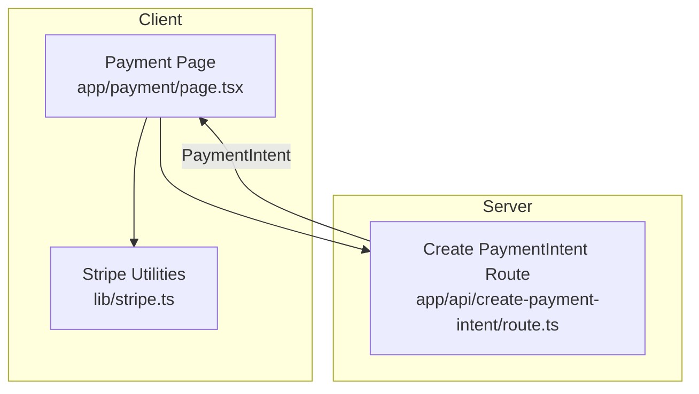
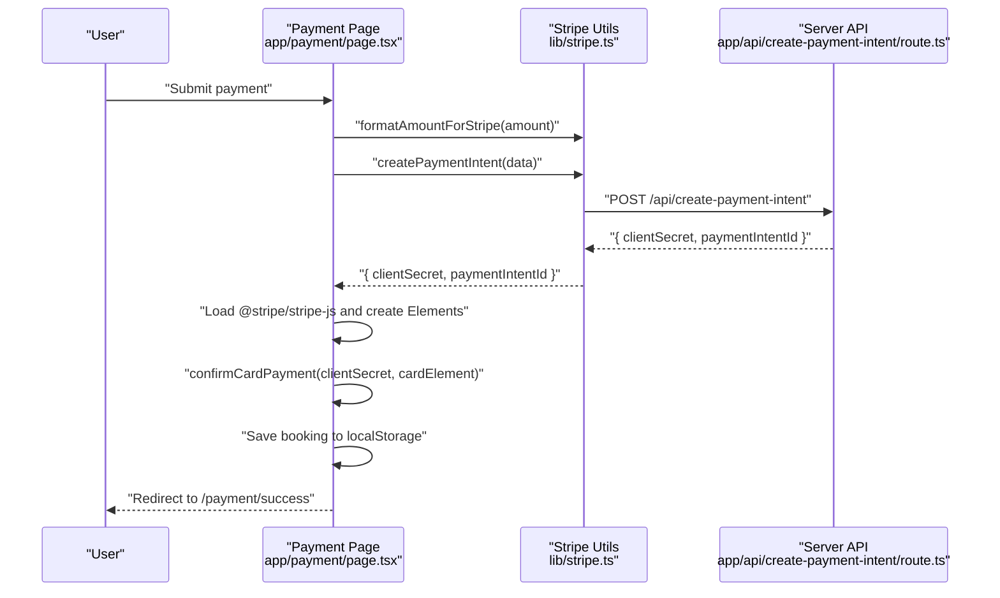
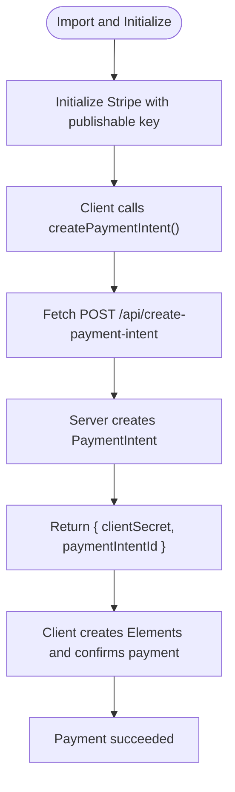
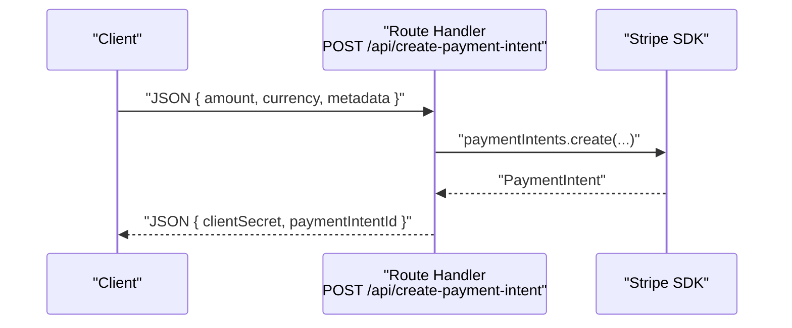
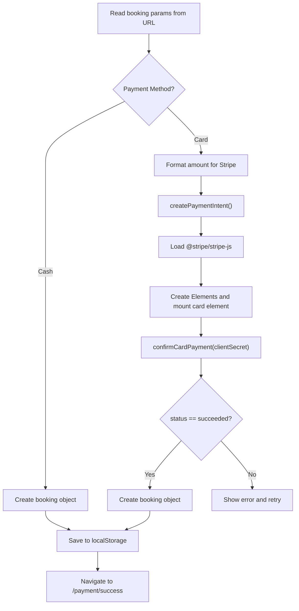
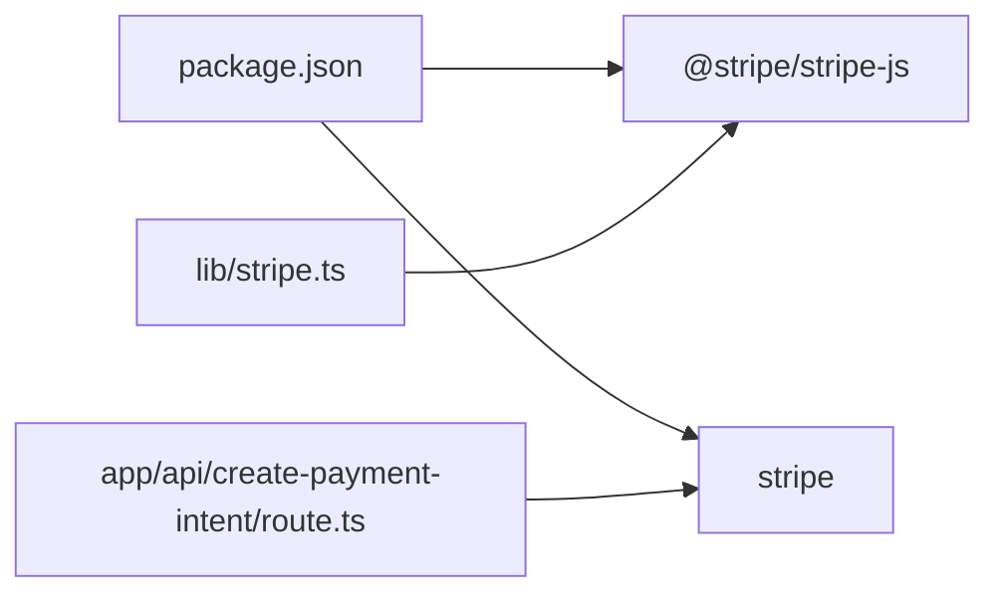

# Stripe Integration

<cite>
**Referenced Files in This Document**
- [lib/stripe.ts](file://lib/stripe.ts)
- [app/payment/page.tsx](file://app/payment/page.tsx)
- [app/api/create-payment-intent/route.ts](file://app/api/create-payment-intent/route.ts)
- [app/payment/success/page.tsx](file://app/payment/success/page.tsx)
- [app/booking/page.tsx](file://app/booking/page.tsx)
- [package.json](file://package.json)
</cite>

## Table of Contents
1. [Introduction](#introduction)
2. [Project Structure](#project-structure)
3. [Core Components](#core-components)
4. [Architecture Overview](#architecture-overview)
5. [Detailed Component Analysis](#detailed-component-analysis)
6. [Dependency Analysis](#dependency-analysis)
7. [Performance Considerations](#performance-considerations)
8. [Troubleshooting Guide](#troubleshooting-guide)
9. [Conclusion](#conclusion)

## Introduction
This document explains the Stripe integration for the Next.js application, focusing on client-side payment processing, server-side payment intent creation, currency formatting utilities, and checkout session management. It also covers Stripe publishable key configuration, environment variable management, testing with Stripe test mode, and best practices for secure payment processing.

## Project Structure
The Stripe integration spans three primary areas:
- Client library for Stripe SDK initialization and payment utilities
- Next.js API route for creating PaymentIntents on the server
- Payment UI pages orchestrating the payment flow and success confirmation

**Diagram sources**
- [app/payment/page.tsx:1-352](file://app/payment/page.tsx#L1-L352)
- [lib/stripe.ts:1-112](file://lib/stripe.ts#L1-L112)
- [app/api/create-payment-intent/route.ts:1-33](file://app/api/create-payment-intent/route.ts#L1-L33)

**Section sources**
- [lib/stripe.ts:1-112](file://lib/stripe.ts#L1-L112)
- [app/payment/page.tsx:1-352](file://app/payment/page.tsx#L1-L352)
- [app/api/create-payment-intent/route.ts:1-33](file://app/api/create-payment-intent/route.ts#L1-L33)

## Core Components
- Stripe SDK initialization and client utilities
  - Publishable key initialization for client-side operations
  - PaymentIntent creation via client fetch to server endpoint
  - Amount formatting helpers for currency conversion
  - Checkout session creation and redirect utilities
- Next.js API route for PaymentIntent creation
  - Server-side Stripe SDK initialization with secret key
  - PaymentIntent creation with automatic payment methods enabled
- Payment UI orchestration
  - Collects booking parameters and guest details
  - Handles cash-on-arrival and card payment flows
  - Uses Stripe Elements to confirm card payments
  - Redirects to success page upon completion

**Section sources**
- [lib/stripe.ts:1-112](file://lib/stripe.ts#L1-L112)
- [app/api/create-payment-intent/route.ts:1-33](file://app/api/create-payment-intent/route.ts#L1-L33)
- [app/payment/page.tsx:1-352](file://app/payment/page.tsx#L1-L352)

## Architecture Overview
The payment flow consists of:
- Client collects booking and guest details
- Client creates a PaymentIntent on the server
- Client initializes Stripe Elements and confirms the payment
- On success, client saves booking locally and navigates to success page

**Diagram sources**
- [app/payment/page.tsx:34-176](file://app/payment/page.tsx#L34-L176)
- [lib/stripe.ts:17-37](file://lib/stripe.ts#L17-L37)
- [app/api/create-payment-intent/route.ts:7-24](file://app/api/create-payment-intent/route.ts#L7-L24)

## Detailed Component Analysis

### Stripe SDK Initialization and Utilities
- Publishable key configuration
  - The client initializes the Stripe SDK with a publishable key for browser-side operations.
  - The key is loaded once and reused for Elements and redirects.
- PaymentIntent creation
  - The client sends a POST request to the server endpoint with amount, currency, and metadata.
  - The server responds with a client secret and payment intent ID.
- Amount formatting utilities
  - Converts amounts to the smallest currency unit (e.g., cents) for Stripe and back.
- Checkout session management
  - Provides functions to create checkout sessions and redirect to Stripe-hosted checkout.

**Diagram sources**
- [lib/stripe.ts:1-112](file://lib/stripe.ts#L1-L112)
- [app/api/create-payment-intent/route.ts:1-33](file://app/api/create-payment-intent/route.ts#L1-L33)

**Section sources**
- [lib/stripe.ts:1-112](file://lib/stripe.ts#L1-L112)

### Next.js API Route: Create PaymentIntent
- Initializes the Stripe SDK with a secret key
- Accepts amount, currency, and metadata from the request body
- Creates a PaymentIntent with automatic payment methods enabled
- Returns the client secret and payment intent ID

**Diagram sources**
- [app/api/create-payment-intent/route.ts:7-24](file://app/api/create-payment-intent/route.ts#L7-L24)

**Section sources**
- [app/api/create-payment-intent/route.ts:1-33](file://app/api/create-payment-intent/route.ts#L1-L33)

### Payment UI Orchestration
- Collects booking parameters and guest details from URL search params
- Supports cash-on-arrival and card payment methods
- For card payments:
  - Formats amount for Stripe
  - Creates PaymentIntent via client utility
  - Initializes Stripe Elements and mounts a card element
  - Confirms the card payment with the returned client secret
  - Saves booking to local storage and navigates to success page
- For cash payments:
  - Immediately creates and saves a booking, then navigates to success page

**Diagram sources**
- [app/payment/page.tsx:34-176](file://app/payment/page.tsx#L34-L176)
- [lib/stripe.ts:17-37](file://lib/stripe.ts#L17-L37)

**Section sources**
- [app/payment/page.tsx:1-352](file://app/payment/page.tsx#L1-L352)

### Success Page
- Reads booking details from URL search params
- Displays a success message and booking summary

**Section sources**
- [app/payment/success/page.tsx:1-74](file://app/payment/success/page.tsx#L1-L74)

### Booking Page Integration
- Collects guest information and calculates totals
- Redirects to the payment page with booking parameters

**Section sources**
- [app/booking/page.tsx:150-165](file://app/booking/page.tsx#L150-L165)

## Dependency Analysis
- Client dependencies
  - @stripe/stripe-js for browser-side payment processing
  - stripe for server-side payment intent creation
- Package dependencies
  - The project includes both client and server Stripe packages

**Diagram sources**
- [package.json:11-21](file://package.json#L11-L21)
- [lib/stripe.ts:1](file://lib/stripe.ts#L1)
- [app/api/create-payment-intent/route.ts:2](file://app/api/create-payment-intent/route.ts#L2)

**Section sources**
- [package.json:1-33](file://package.json#L1-L33)

## Performance Considerations
- Minimize network requests by batching UI updates and avoiding redundant re-initializations of Stripe Elements.
- Cache formatted amounts and metadata to reduce repeated conversions.
- Use server-side PaymentIntent creation to prevent client-side exposure of secret keys.

## Troubleshooting Guide
- Stripe publishable key not loading
  - Verify the key initialization in the client utility and ensure it matches your Stripe Dashboard configuration.
  - Confirm the key is accessible in the browser context.
- PaymentIntent creation fails
  - Check server logs for errors during PaymentIntent creation.
  - Ensure the request payload includes amount, currency, and metadata.
- Amount formatting issues
  - Confirm that amounts are converted to the smallest currency unit before sending to Stripe.
  - Verify the reverse conversion on the client for display purposes.
- Redirect flow problems
  - Ensure the client secret is present and valid before attempting payment confirmation.
  - Confirm that the success page receives the expected booking parameters.
- Testing with Stripe test mode
  - Use Stripe test cards and keys for development and testing.
  - Validate that the publishable and secret keys are configured for test mode.

## Conclusion
The Stripe integration leverages a clean separation between client and server responsibilities: the client handles UI and Elements, while the server manages secure PaymentIntent creation. By following the outlined patterns for initialization, amount formatting, and flow orchestration, the application maintains a robust and secure payment experience. For production, ensure environment variables are used for keys and that all sensitive operations remain server-side.