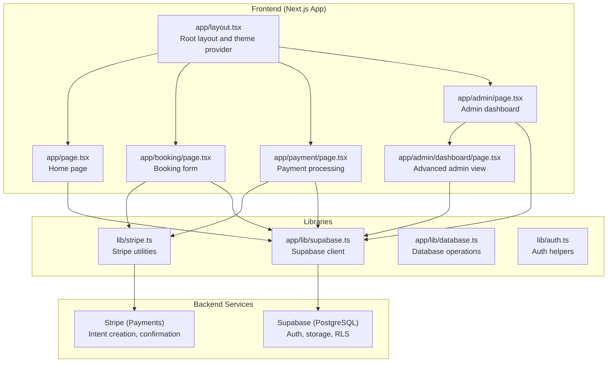
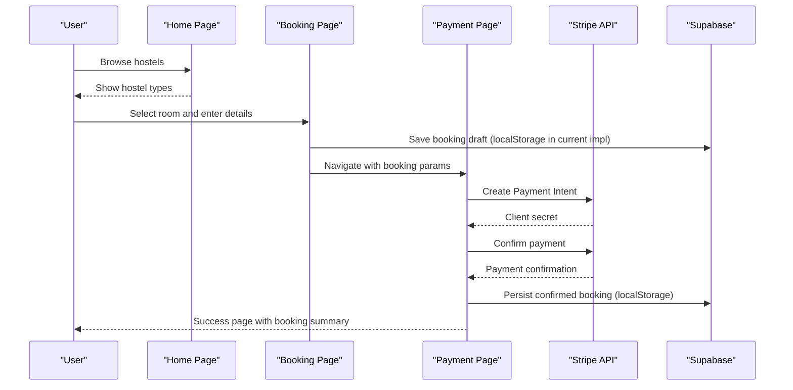
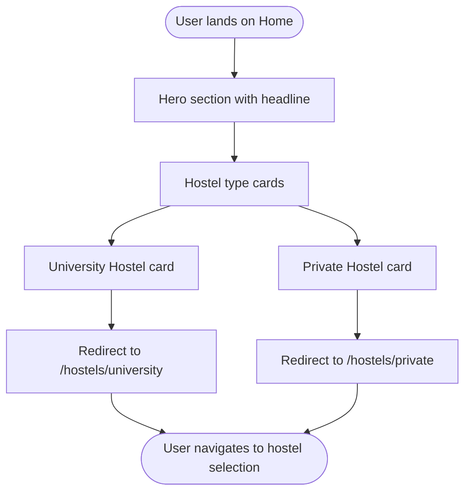
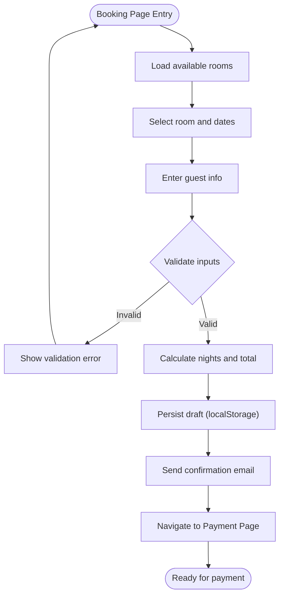
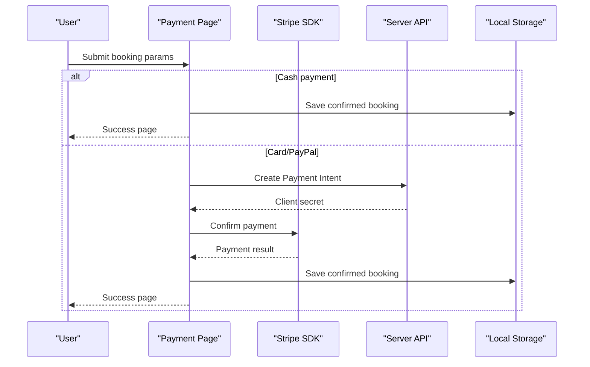
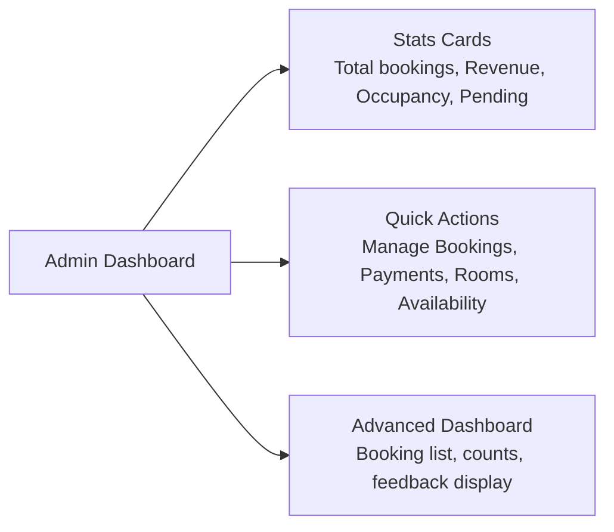
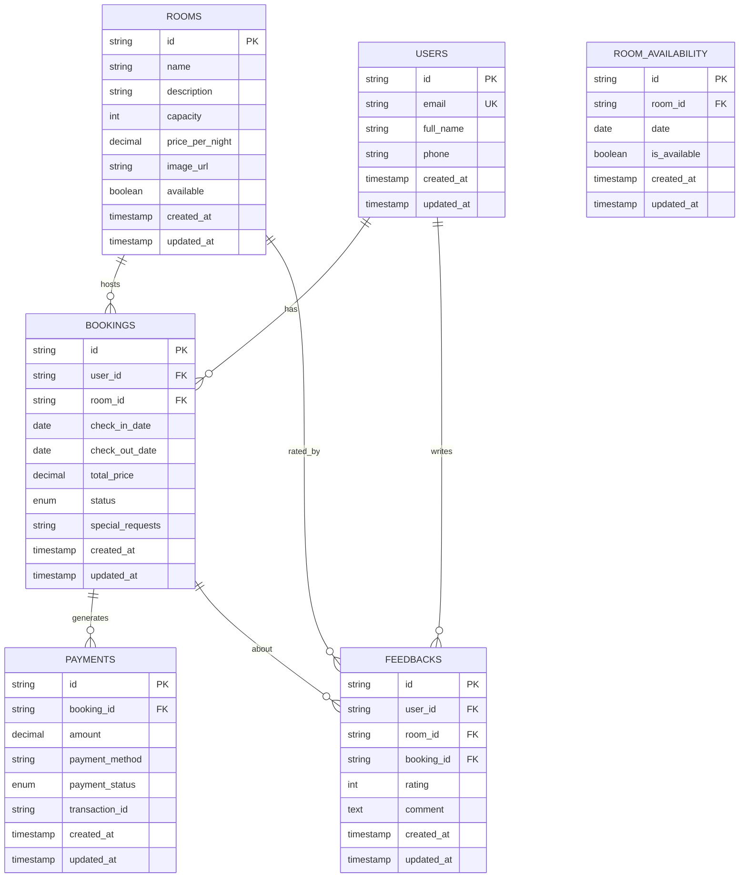
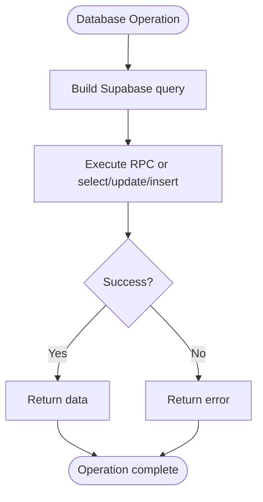
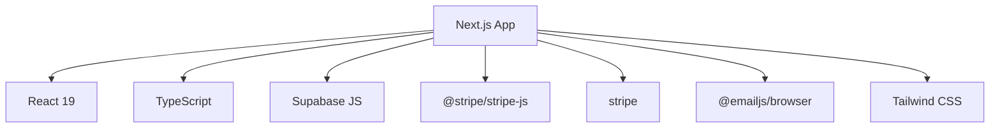

# Project Overview

<cite>
**Referenced Files in This Document**
- [README.md](file://README.md)
- [package.json](file://package.json)
- [next.config.ts](file://next.config.ts)
- [app/layout.tsx](file://app/layout.tsx)
- [app/lib/supabase.ts](file://app/lib/supabase.ts)
- [lib/stripe.ts](file://lib/stripe.ts)
- [app/page.tsx](file://app/page.tsx)
- [app/booking/page.tsx](file://app/booking/page.tsx)
- [app/payment/page.tsx](file://app/payment/page.tsx)
- [app/admin/page.tsx](file://app/admin/page.tsx)
- [app/admin/dashboard/page.tsx](file://app/admin/dashboard/page.tsx)
- [app/types/database.ts](file://app/types/database.ts)
- [app/lib/database.ts](file://app/lib/database.ts)
- [lib/auth.ts](file://lib/auth.ts)
- [ANALYSE_PROJET_COMPLET.md](file://ANALYSE_PROJET_COMPLET.md)
- [PLAN_PRESENTATION_ENTREPRISE.md](file://PLAN_PRESENTATION_ENTREPRISE.md)
</cite>

## Table of Contents
1. [Introduction](#introduction)
2. [Project Structure](#project-structure)
3. [Core Components](#core-components)
4. [Architecture Overview](#architecture-overview)
5. [Detailed Component Analysis](#detailed-component-analysis)
6. [Dependency Analysis](#dependency-analysis)
7. [Performance Considerations](#performance-considerations)
8. [Troubleshooting Guide](#troubleshooting-guide)
9. [Conclusion](#conclusion)
10. [Appendices](#appendices)

## Introduction
BookingHostel is a complete hostel management system designed to streamline the end-to-end hospitality experience for both customers and operators. It enables guests to discover and book accommodations, process secure payments, and receive automated confirmations, while providing operators with a centralized administrative dashboard to monitor occupancy, revenue, and bookings.

Key value propositions:
- Seamless customer journey from discovery to confirmation
- Secure and flexible payment processing
- Real-time operational insights for hostel managers
- Scalable architecture ready for production deployment

Target audiences:
- Hostel operators seeking an all-in-one management solution
- Customers looking for a fast, reliable booking experience

Main capabilities:
- Room browsing and selection
- Booking creation and validation
- Payment processing via Stripe (sandbox-ready)
- Administrative dashboard with analytics and controls
- Email notifications and feedback collection

**Section sources**
- [README.md:1-37](file://README.md#L1-L37)
- [ANALYSE_PROJET_COMPLET.md:1-192](file://ANALYSE_PROJET_COMPLET.md#L1-L192)

## Project Structure
The project follows a modern Next.js 16 App Router architecture with a clear separation of concerns:
- Frontend pages under app/ for user-facing flows (home, booking, payment, admin)
- Backend integration points under app/api/ for server actions (payment intents, email)
- Shared libraries for Supabase client initialization and Stripe utilities
- Strongly typed domain models under app/types/
- Authentication helpers and database abstraction under lib/

**Diagram sources**
- [app/layout.tsx:1-28](file://app/layout.tsx#L1-L28)
- [app/page.tsx:1-149](file://app/page.tsx#L1-L149)
- [app/booking/page.tsx:1-434](file://app/booking/page.tsx#L1-L434)
- [app/payment/page.tsx:1-352](file://app/payment/page.tsx#L1-L352)
- [app/admin/page.tsx:1-181](file://app/admin/page.tsx#L1-L181)
- [app/admin/dashboard/page.tsx:1-205](file://app/admin/dashboard/page.tsx#L1-L205)
- [app/lib/supabase.ts:1-6](file://app/lib/supabase.ts#L1-L6)
- [lib/stripe.ts:1-112](file://lib/stripe.ts#L1-L112)
- [app/lib/database.ts:1-433](file://app/lib/database.ts#L1-L433)
- [lib/auth.ts:1-57](file://lib/auth.ts#L1-L57)

**Section sources**
- [package.json:1-33](file://package.json#L1-L33)
- [next.config.ts:1-8](file://next.config.ts#L1-L8)
- [app/layout.tsx:1-28](file://app/layout.tsx#L1-L28)

## Core Components
- Supabase integration for authentication, data persistence, and row-level security policies
- Stripe SDK for payment intent creation and confirmation
- TypeScript types for domain entities (users, rooms, bookings, payments, feedback)
- Admin dashboard with statistics and booking management
- Email notification pipeline for booking confirmations

Technology stack highlights:
- Next.js 16 with App Router for routing and SSR/SSG
- TypeScript for type safety across frontend and backend utilities
- Supabase for database and auth
- Stripe for payments
- Tailwind CSS via PostCSS for styling

**Section sources**
- [package.json:11-31](file://package.json#L11-L31)
- [app/lib/supabase.ts:1-6](file://app/lib/supabase.ts#L1-L6)
- [lib/stripe.ts:1-112](file://lib/stripe.ts#L1-L112)
- [app/types/database.ts:1-146](file://app/types/database.ts#L1-L146)

## Architecture Overview
The system is built around a client-server hybrid:
- Client-side React components handle UI and user interactions
- Supabase provides backend-as-a-service for data and auth
- Stripe handles payment orchestration
- Serverless API routes support payment intent creation and email dispatch

**Diagram sources**
- [app/page.tsx:1-149](file://app/page.tsx#L1-L149)
- [app/booking/page.tsx:1-434](file://app/booking/page.tsx#L1-L434)
- [app/payment/page.tsx:1-352](file://app/payment/page.tsx#L1-L352)
- [lib/stripe.ts:17-37](file://lib/stripe.ts#L17-L37)

## Detailed Component Analysis

### Home Page and Navigation
The home page introduces hostel types and features, guiding users toward booking. It integrates a global navigation bar and theme context.

**Diagram sources**
- [app/page.tsx:14-112](file://app/page.tsx#L14-L112)

**Section sources**
- [app/page.tsx:1-149](file://app/page.tsx#L1-L149)
- [app/layout.tsx:1-28](file://app/layout.tsx#L1-L28)

### Booking Workflow
The booking flow validates guest details, calculates totals, and prepares payment redirection.

**Diagram sources**
- [app/booking/page.tsx:44-178](file://app/booking/page.tsx#L44-L178)

**Section sources**
- [app/booking/page.tsx:1-434](file://app/booking/page.tsx#L1-L434)

### Payment Processing
The payment page supports multiple methods, with Stripe integration for card payments and a simplified cash-on-arrival flow.

**Diagram sources**
- [app/payment/page.tsx:8-176](file://app/payment/page.tsx#L8-L176)
- [lib/stripe.ts:17-37](file://lib/stripe.ts#L17-L37)

**Section sources**
- [app/payment/page.tsx:1-352](file://app/payment/page.tsx#L1-L352)
- [lib/stripe.ts:1-112](file://lib/stripe.ts#L1-L112)

### Administrative Dashboard
Admin dashboards present key metrics and enable booking management. One implementation focuses on statistics and quick actions; another offers a more traditional admin interface with booking lists and feedback display.

**Diagram sources**
- [app/admin/page.tsx:50-178](file://app/admin/page.tsx#L50-L178)
- [app/admin/dashboard/page.tsx:51-202](file://app/admin/dashboard/page.tsx#L51-L202)

**Section sources**
- [app/admin/page.tsx:1-181](file://app/admin/page.tsx#L1-L181)
- [app/admin/dashboard/page.tsx:1-205](file://app/admin/dashboard/page.tsx#L1-L205)

### Data Model and Types
The system defines strongly typed domain entities for users, rooms, bookings, payments, availability, and feedback. These types inform both frontend components and backend utilities.

**Diagram sources**
- [app/types/database.ts:3-146](file://app/types/database.ts#L3-L146)

**Section sources**
- [app/types/database.ts:1-146](file://app/types/database.ts#L1-L146)

### Database Abstraction Layer
The database library encapsulates CRUD operations, availability checks, dashboard statistics, and feedback management. It leverages Supabase queries and RPC functions.

**Diagram sources**
- [app/lib/database.ts:1-433](file://app/lib/database.ts#L1-L433)

**Section sources**
- [app/lib/database.ts:1-433](file://app/lib/database.ts#L1-L433)

### Authentication Utilities
Basic authentication helpers provide password hashing, verification, token generation/verification, and input sanitization. These utilities support a secure foundation for user management.

**Section sources**
- [lib/auth.ts:1-57](file://lib/auth.ts#L1-L57)

## Dependency Analysis
External dependencies and their roles:
- Next.js 16: Framework for pages, routing, and SSR
- React 19: UI library
- Supabase JS: Database, auth, and RLS
- Stripe JS: Payment processing
- Tailwind CSS: Utility-first styling
- TypeScript: Type safety

**Diagram sources**
- [package.json:11-31](file://package.json#L11-L31)

**Section sources**
- [package.json:1-33](file://package.json#L1-33)

## Performance Considerations
- Use server-side rendering and static generation where appropriate for improved SEO and speed
- Implement lazy loading for images and components
- Optimize database queries with proper indexing and selective field retrieval
- Minimize client-side JavaScript bundles and leverage code splitting
- Cache frequently accessed data and use CDN for assets

## Troubleshooting Guide
Common issues and resolutions:
- Payment intent creation failures: Verify Stripe publishable key and server route availability
- Email delivery problems: Confirm email service configuration and network connectivity
- Authentication errors: Ensure secure token handling and HTTPS enforcement
- Database query timeouts: Review query complexity and add necessary indexes

**Section sources**
- [lib/stripe.ts:17-37](file://lib/stripe.ts#L17-L37)
- [lib/auth.ts:15-35](file://lib/auth.ts#L15-L35)
- [ANALYSE_PROJET_COMPLET.md:10-60](file://ANALYSE_PROJET_COMPLET.md#L10-L60)

## Conclusion
BookingHostel delivers a robust foundation for a hostel management platform, combining intuitive customer workflows with powerful administrative capabilities. While the current implementation demonstrates core functionality, further enhancements in security, payment integration, and operational tooling are recommended for production readiness.

## Appendices

### Technology Stack Summary
- Frontend: Next.js 16, React 19, TypeScript, Tailwind CSS
- Backend: Supabase (PostgreSQL, Auth, RLS)
- Payments: Stripe (sandbox-ready)
- Utilities: EmailJS for notifications

**Section sources**
- [package.json:11-31](file://package.json#L11-L31)
- [PLAN_PRESENTATION_ENTREPRISE.md:101-124](file://PLAN_PRESENTATION_ENTREPRISE.md#L101-L124)