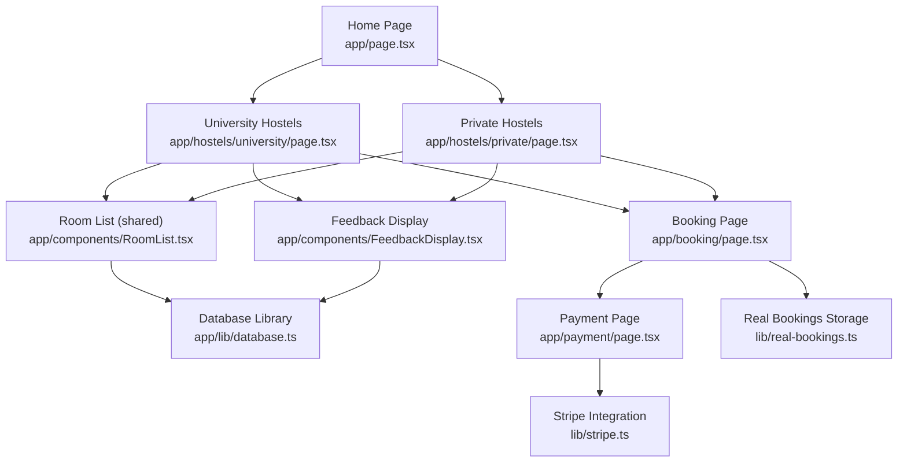
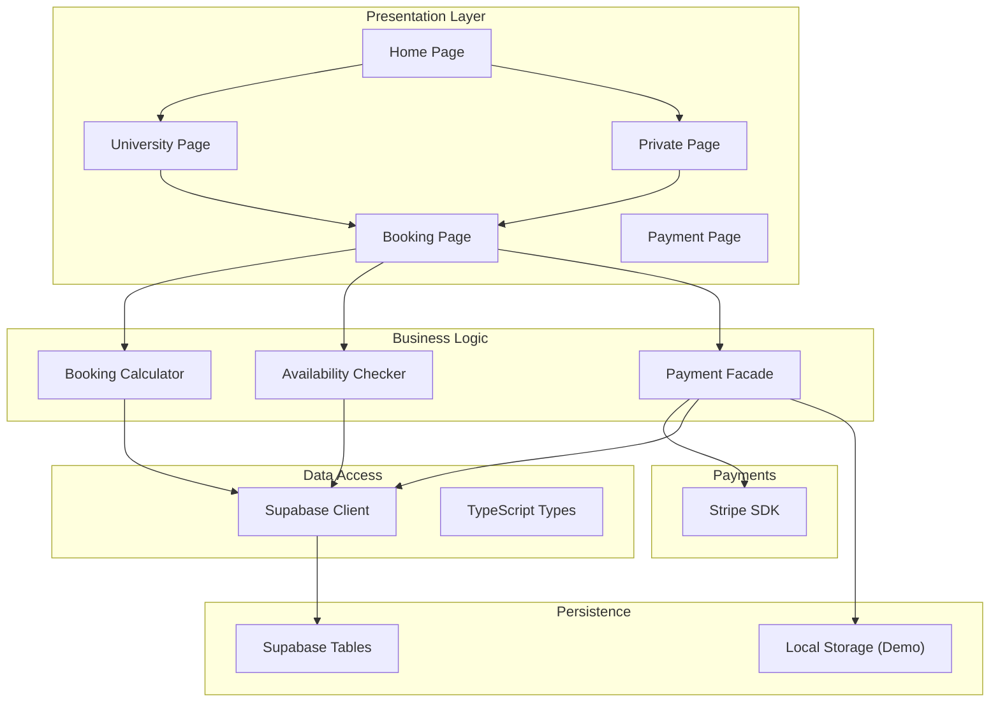
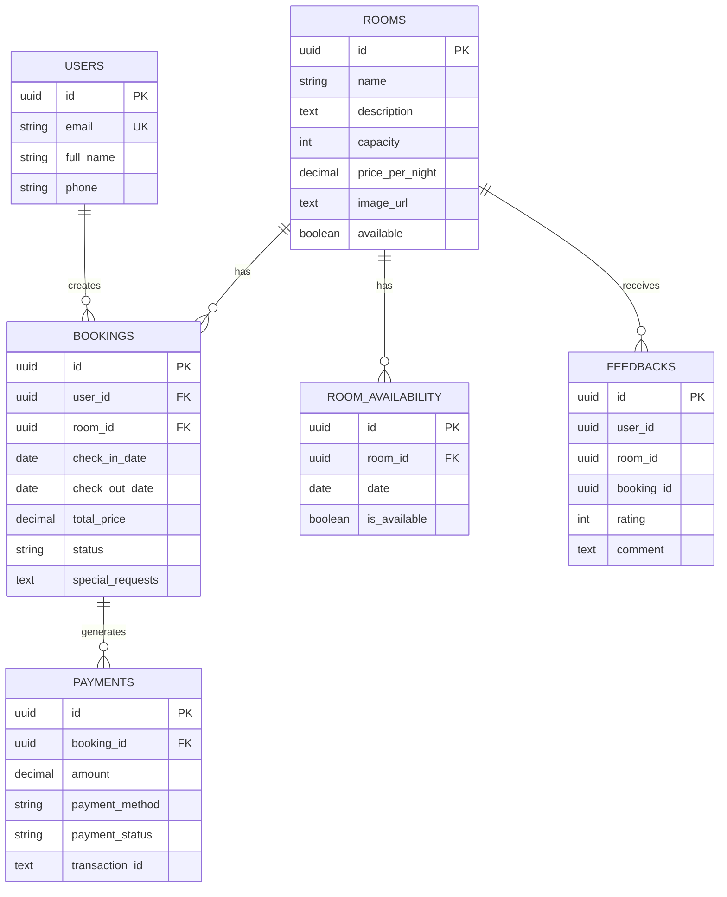
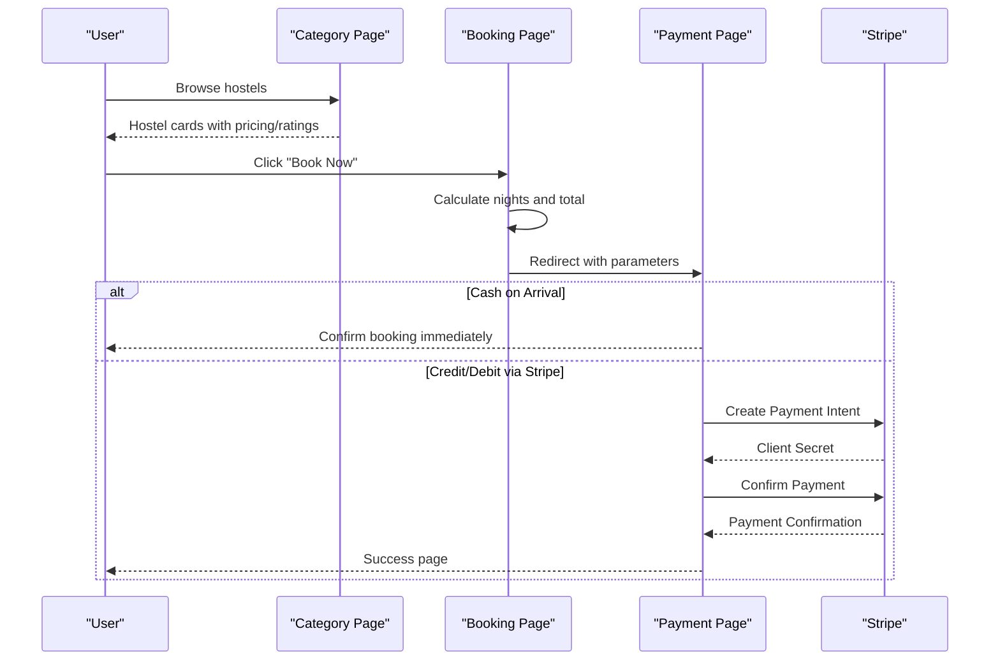
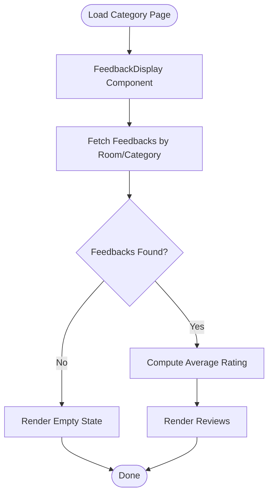
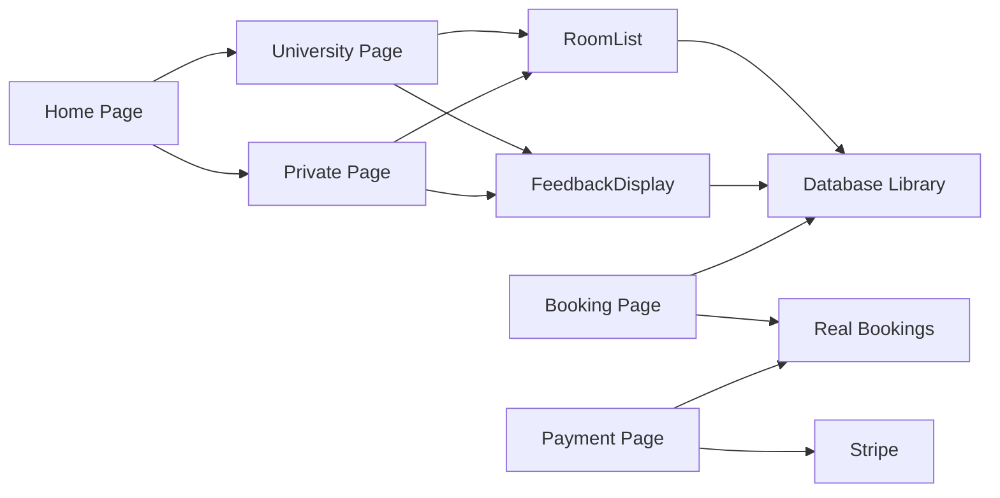

# Room Categorization System

<cite>
**Referenced Files in This Document**
- [app/page.tsx](file://app/page.tsx)
- [app/hostels/university/page.tsx](file://app/hostels/university/page.tsx)
- [app/hostels/private/page.tsx](file://app/hostels/private/page.tsx)
- [app/components/RoomList.tsx](file://app/components/RoomList.tsx)
- [app/components/FeedbackDisplay.tsx](file://app/components/FeedbackDisplay.tsx)
- [app/booking/page.tsx](file://app/booking/page.tsx)
- [app/payment/page.tsx](file://app/payment/page.tsx)
- [app/layout.tsx](file://app/layout.tsx)
- [app/types/database.ts](file://app/types/database.ts)
- [app/lib/database.ts](file://app/lib/database.ts)
- [lib/stripe.ts](file://lib/stripe.ts)
- [database-schema.sql](file://database-schema.sql)
- [lib/real-bookings.ts](file://lib/real-bookings.ts)
</cite>

## Table of Contents
1. [Introduction](#introduction)
2. [Project Structure](#project-structure)
3. [Core Components](#core-components)
4. [Architecture Overview](#architecture-overview)
5. [Detailed Component Analysis](#detailed-component-analysis)
6. [Dependency Analysis](#dependency-analysis)
7. [Performance Considerations](#performance-considerations)
8. [Troubleshooting Guide](#troubleshooting-guide)
9. [Conclusion](#conclusion)

## Introduction
This document explains the room categorization system that separates university and private hostels within the BookingHostel platform. It covers the distinct characteristics, target audiences, pricing structures, routing separation, data models, and how categories influence user experience and booking workflows. It also documents implementation differences between university hostels (student residences near campuses) and private hostels (independent accommodations), along with category-specific features, filtering mechanisms, and integration with the overall booking system.

## Project Structure
The system is organized around Next.js pages and shared components:
- Home page presents two hostel categories and links to dedicated category pages
- Category pages display hostel listings and integrate feedback systems
- Shared components handle room lists, feedback display, and booking summaries
- Database abstraction and types define the core data model
- Payment integration supports multiple methods, including cash-on-arrival

**Diagram sources**
- [app/page.tsx:28-112](file://app/page.tsx#L28-L112)
- [app/hostels/university/page.tsx:1-71](file://app/hostels/university/page.tsx#L1-L71)
- [app/hostels/private/page.tsx:1-71](file://app/hostels/private/page.tsx#L1-L71)
- [app/components/RoomList.tsx:1-113](file://app/components/RoomList.tsx#L1-L113)
- [app/components/FeedbackDisplay.tsx:1-155](file://app/components/FeedbackDisplay.tsx#L1-L155)
- [app/booking/page.tsx:1-434](file://app/booking/page.tsx#L1-L434)
- [app/payment/page.tsx:1-352](file://app/payment/page.tsx#L1-L352)
- [lib/stripe.ts:1-112](file://lib/stripe.ts#L1-L112)
- [lib/real-bookings.ts:1-120](file://lib/real-bookings.ts#L1-L120)

**Section sources**
- [app/page.tsx:28-112](file://app/page.tsx#L28-L112)
- [app/layout.tsx:1-28](file://app/layout.tsx#L1-L28)

## Core Components
- Home page: Presents category cards with feature highlights and navigation to category pages
- Category pages: Render hostel listings with pricing, ratings, and Google Maps integration; include feedback sections
- Room list component: Centralized listing for available rooms with availability and booking actions
- Feedback display component: Loads and renders reviews with average rating calculation and optional submission form
- Booking page: Collects guest info, dates, and preferences; calculates totals and redirects to payment
- Payment page: Handles payment methods (including cash-on-arrival) and confirms booking
- Database library: Provides CRUD operations for rooms, bookings, availability, payments, and feedback
- Types: Strongly typed interfaces for database entities and API payloads
- Stripe integration: Payment intent creation and confirmation utilities
- Real bookings storage: Local persistence for booking records during development/demo

**Section sources**
- [app/hostels/university/page.tsx:5-71](file://app/hostels/university/page.tsx#L5-L71)
- [app/hostels/private/page.tsx:5-71](file://app/hostels/private/page.tsx#L5-L71)
- [app/components/RoomList.tsx:7-113](file://app/components/RoomList.tsx#L7-L113)
- [app/components/FeedbackDisplay.tsx:12-155](file://app/components/FeedbackDisplay.tsx#L12-L155)
- [app/booking/page.tsx:44-434](file://app/booking/page.tsx#L44-L434)
- [app/payment/page.tsx:8-352](file://app/payment/page.tsx#L8-L352)
- [app/lib/database.ts:1-433](file://app/lib/database.ts#L1-L433)
- [app/types/database.ts:1-146](file://app/types/database.ts#L1-L146)
- [lib/stripe.ts:1-112](file://lib/stripe.ts#L1-L112)
- [lib/real-bookings.ts:1-120](file://lib/real-bookings.ts#L1-L120)

## Architecture Overview
The system follows a layered architecture:
- Presentation layer: Next.js pages and shared components
- Business logic: Booking calculations, availability checks, and payment orchestration
- Data access: Supabase client wrapper with typed interfaces
- Persistence: Supabase tables and local storage for demo bookings
- Payment: Stripe integration with fallback to cash-on-arrival

**Diagram sources**
- [app/booking/page.tsx:92-178](file://app/booking/page.tsx#L92-L178)
- [app/lib/database.ts:76-89](file://app/lib/database.ts#L76-L89)
- [lib/stripe.ts:17-37](file://lib/stripe.ts#L17-L37)
- [lib/real-bookings.ts:21-37](file://lib/real-bookings.ts#L21-L37)
- [database-schema.sql:13-62](file://database-schema.sql#L13-L62)

## Detailed Component Analysis

### University Hostels vs Private Hostels
- University hostels:
  - Target audience: Students and academic visitors
  - Characteristics: Study-friendly environment, high-speed WiFi, quiet spaces, student discounts
  - Pricing: Lower nightly rates suitable for budget-conscious users
  - Routing: Dedicated category page under `/hostels/university`
- Private hostels:
  - Target audience: Travelers and professionals seeking privacy and comfort
  - Characteristics: Private rooms, premium amenities, 24/7 reception, city center locations
  - Pricing: Higher nightly rates reflecting premium services
  - Routing: Dedicated category page under `/hostels/private`

Category pages share UI patterns (image galleries, ratings, pricing, Google Maps) while differing in content and feedback identifiers.

**Section sources**
- [app/page.tsx:43-70](file://app/page.tsx#L43-L70)
- [app/page.tsx:80-108](file://app/page.tsx#L80-L108)
- [app/hostels/university/page.tsx:16-17](file://app/hostels/university/page.tsx#L16-L17)
- [app/hostels/private/page.tsx:16-17](file://app/hostels/private/page.tsx#L16-L17)

### Data Models and Filtering
The system defines core entities and relationships:
- Room: id, name, description, capacity, price_per_night, image_url, available
- Booking: user_id, room_id, check_in_date, check_out_date, total_price, status, special_requests
- RoomAvailability: room_id, date, is_available
- Payment: booking_id, amount, payment_method, payment_status, transaction_id
- Feedback: user_id, room_id, booking_id, rating, comment

Filtering and search capabilities include:
- Capacity-based filtering
- Price-based filtering
- Availability checks across date ranges
- Average rating computation for feedback

**Diagram sources**
- [database-schema.sql:4-62](file://database-schema.sql#L4-L62)
- [app/types/database.ts:12-137](file://app/types/database.ts#L12-L137)

**Section sources**
- [app/types/database.ts:12-137](file://app/types/database.ts#L12-L137)
- [app/lib/database.ts:159-181](file://app/lib/database.ts#L159-L181)
- [app/lib/database.ts:314-331](file://app/lib/database.ts#L314-L331)
- [app/lib/database.ts:413-432](file://app/lib/database.ts#L413-L432)

### Booking Workflow and Category Influence
The booking workflow is consistent across categories:
1. Select a room from the chosen category
2. Enter guest information and stay dates
3. Calculate total price based on nightly rate and number of nights
4. Choose payment method (cash-on-arrival or Stripe)
5. Confirm booking and receive confirmation

Category pages influence the user experience by:
- Presenting hostel-specific imagery and descriptions
- Providing targeted feedback collections (university vs private)
- Offering contextual Google Maps integration for each hostel

**Diagram sources**
- [app/hostels/university/page.tsx:39-41](file://app/hostels/university/page.tsx#L39-L41)
- [app/hostels/private/page.tsx:39-41](file://app/hostels/private/page.tsx#L39-L41)
- [app/booking/page.tsx:103-178](file://app/booking/page.tsx#L103-L178)
- [app/payment/page.tsx:34-176](file://app/payment/page.tsx#L34-L176)
- [lib/stripe.ts:17-37](file://lib/stripe.ts#L17-L37)

**Section sources**
- [app/booking/page.tsx:76-178](file://app/booking/page.tsx#L76-L178)
- [app/payment/page.tsx:34-176](file://app/payment/page.tsx#L34-L176)
- [lib/stripe.ts:17-37](file://lib/stripe.ts#L17-L37)

### Feedback Integration and Category-Specific Features
Feedback is integrated into category pages:
- Each category page passes a category identifier to the feedback component
- The feedback component loads reviews and computes average ratings
- Optional form submission allows guests to leave reviews

Category-specific features:
- University hostels emphasize study-friendly environments and student discounts
- Private hostels highlight privacy, premium amenities, and central locations

**Diagram sources**
- [app/hostels/university/page.tsx:66](file://app/hostels/university/page.tsx#L66)
- [app/hostels/private/page.tsx:66](file://app/hostels/private/page.tsx#L66)
- [app/components/FeedbackDisplay.tsx:21-52](file://app/components/FeedbackDisplay.tsx#L21-L52)

**Section sources**
- [app/components/FeedbackDisplay.tsx:12-155](file://app/components/FeedbackDisplay.tsx#L12-L155)
- [app/hostels/university/page.tsx:66](file://app/hostels/university/page.tsx#L66)
- [app/hostels/private/page.tsx:66](file://app/hostels/private/page.tsx#L66)

### Implementation Differences Between Categories
- Content and branding:
  - University hostels use a university-themed design and messaging
  - Private hostels use a home-like theme with comfort-focused copy
- Pricing presentation:
  - Both pages present nightly rates; university hostels emphasize affordability
- Feedback targeting:
  - Each category page passes a category identifier to the feedback component for targeted review collection
- Routing:
  - Separate Next.js routes for each category enable independent SEO and UX

**Section sources**
- [app/hostels/university/page.tsx:16-17](file://app/hostels/university/page.tsx#L16-L17)
- [app/hostels/private/page.tsx:16-17](file://app/hostels/private/page.tsx#L16-L17)
- [app/hostels/university/page.tsx:34](file://app/hostels/university/page.tsx#L34)
- [app/hostels/private/page.tsx:34](file://app/hostels/private/page.tsx#L34)

## Dependency Analysis
Key dependencies and relationships:
- Pages depend on shared components for consistency
- Database library abstracts Supabase operations with typed interfaces
- Payment page depends on Stripe utilities and real bookings storage
- Feedback component depends on database library and local storage fallback

**Diagram sources**
- [app/hostels/university/page.tsx:1-4](file://app/hostels/university/page.tsx#L1-L4)
- [app/hostels/private/page.tsx:1-4](file://app/hostels/private/page.tsx#L1-L4)
- [app/components/RoomList.tsx:1-6](file://app/components/RoomList.tsx#L1-L6)
- [app/components/FeedbackDisplay.tsx:1-5](file://app/components/FeedbackDisplay.tsx#L1-L5)
- [app/booking/page.tsx:42](file://app/booking/page.tsx#L42)
- [app/payment/page.tsx:5](file://app/payment/page.tsx#L5)
- [lib/stripe.ts:1-2](file://lib/stripe.ts#L1-L2)
- [lib/real-bookings.ts:1-2](file://lib/real-bookings.ts#L1-L2)

**Section sources**
- [app/lib/database.ts:1-3](file://app/lib/database.ts#L1-L3)
- [lib/stripe.ts:1-112](file://lib/stripe.ts#L1-L112)
- [lib/real-bookings.ts:1-120](file://lib/real-bookings.ts#L1-L120)

## Performance Considerations
- Database queries:
  - Use indexed columns for bookings and room availability to optimize date range searches
  - Prefer server-side filtering (capacity, max price) to reduce payload sizes
- Client-side rendering:
  - Keep booking and payment forms lightweight; defer heavy computations to server APIs
- Caching:
  - Cache frequently accessed room lists and availability windows
- Images:
  - Lazy-load images in hostel listings to improve initial page load times

## Troubleshooting Guide
Common issues and resolutions:
- Booking date validation:
  - Ensure check-out date is after check-in date; otherwise, prevent submission and display an error
- Email format validation:
  - Validate email addresses before proceeding to payment
- Payment failures:
  - Stripe errors should be caught and displayed; offer retry or alternative payment methods
- Feedback loading:
  - If database queries fail, fall back to local storage for reviews to maintain UX continuity
- Availability conflicts:
  - Use the availability checker to prevent double bookings during selection

**Section sources**
- [app/booking/page.tsx:77-97](file://app/booking/page.tsx#L77-L97)
- [app/booking/page.tsx:132-148](file://app/booking/page.tsx#L132-L148)
- [app/components/FeedbackDisplay.tsx:21-52](file://app/components/FeedbackDisplay.tsx#L21-L52)
- [app/lib/database.ts:76-89](file://app/lib/database.ts#L76-L89)

## Conclusion
The room categorization system cleanly separates university and private hostels through dedicated pages, category-specific messaging, and targeted feedback mechanisms. The underlying data model and database library support robust filtering, availability checks, and payment processing. The booking workflow remains consistent across categories, ensuring a predictable user experience while allowing category-specific enhancements. Together, these components provide a scalable foundation for expanding the platform’s offerings and improving operational insights through dashboards and analytics.