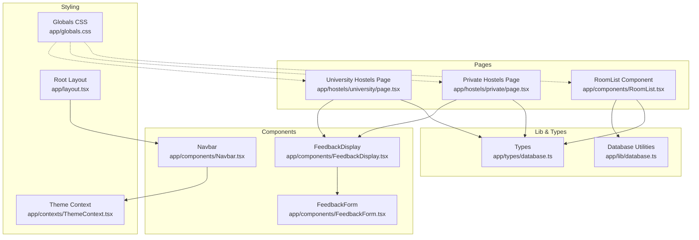
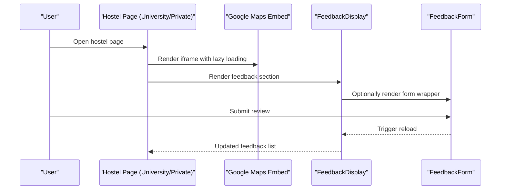
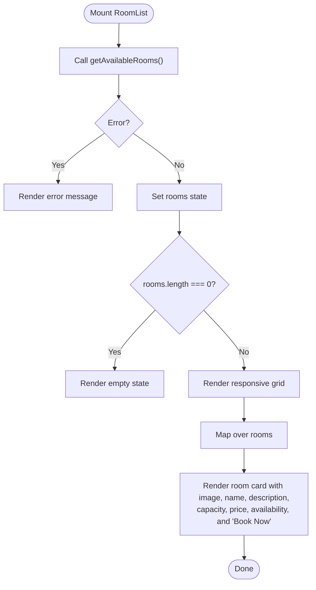
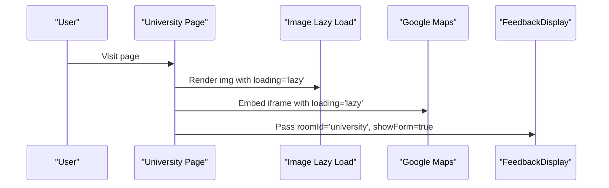
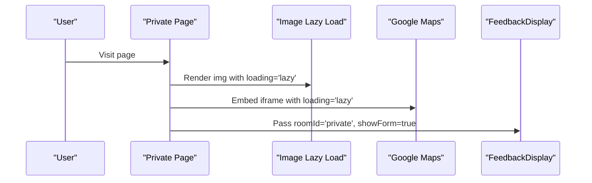
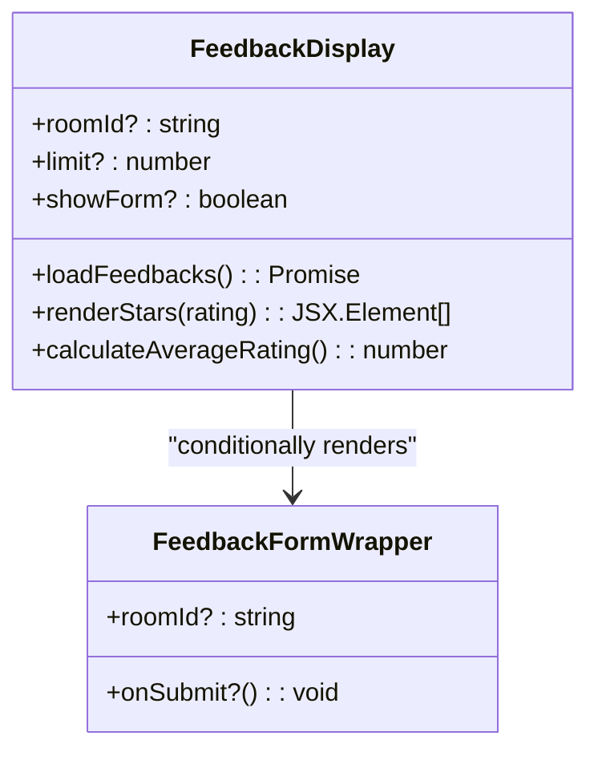
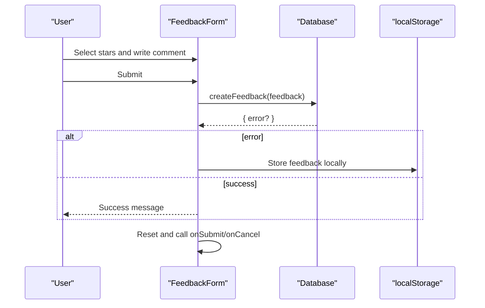
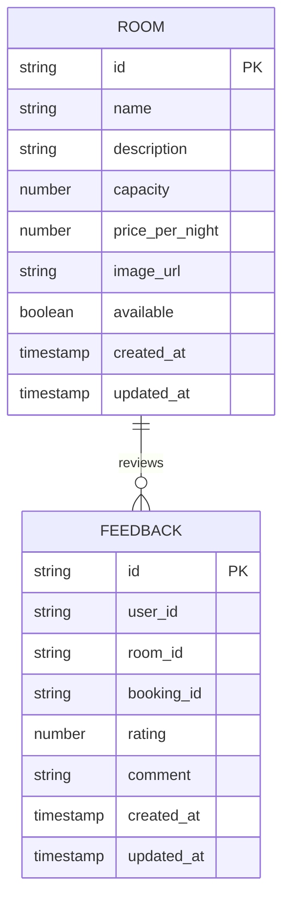
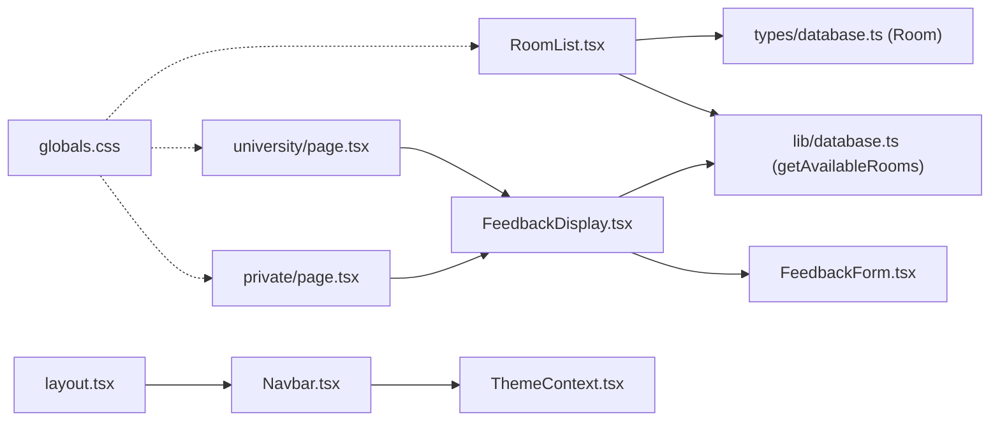

# Room Listing and Display

<cite>
**Referenced Files in This Document**
- [RoomList.tsx](file://app/components/RoomList.tsx)
- [university/page.tsx](file://app/hostels/university/page.tsx)
- [private/page.tsx](file://app/hostels/private/page.tsx)
- [database.ts](file://app/lib/database.ts)
- [database.ts](file://app/types/database.ts)
- [FeedbackDisplay.tsx](file://app/components/FeedbackDisplay.tsx)
- [FeedbackForm.tsx](file://app/components/FeedbackForm.tsx)
- [Navbar.tsx](file://app/components/Navbar.tsx)
- [globals.css](file://app/globals.css)
- [layout.tsx](file://app/layout.tsx)
- [ThemeContext.tsx](file://app/contexts/ThemeContext.tsx)
- [package.json](file://package.json)
</cite>

## Table of Contents
1. [Introduction](#introduction)
2. [Project Structure](#project-structure)
3. [Core Components](#core-components)
4. [Architecture Overview](#architecture-overview)
5. [Detailed Component Analysis](#detailed-component-analysis)
6. [Dependency Analysis](#dependency-analysis)
7. [Performance Considerations](#performance-considerations)
8. [Troubleshooting Guide](#troubleshooting-guide)
9. [Conclusion](#conclusion)

## Introduction
This document explains the room listing and display functionality across the application. It covers:
- Hostel pages for university and private hostels with static data structures and responsive layouts
- The RoomList component architecture, prop handling, and dynamic content generation
- UI presentation including images, pricing, ratings, location information, and interactive elements
- Examples of hostel data models, image handling with lazy loading, Google Maps embed integration, and feedback display integration
- Styling patterns using Tailwind CSS classes and responsive design considerations

## Project Structure
The room listing and display functionality spans several components and pages:
- Hostel listing pages for university and private hostels
- A reusable RoomList component for dynamic room listings
- Feedback components for displaying and submitting guest reviews
- Shared UI components like Navbar and global styles
- Type definitions and database utilities for data fetching and model consistency

**Diagram sources**
- [university/page.tsx:1-71](file://app/hostels/university/page.tsx#L1-L71)
- [private/page.tsx:1-71](file://app/hostels/private/page.tsx#L1-L71)
- [RoomList.tsx:1-113](file://app/components/RoomList.tsx#L1-L113)
- [FeedbackDisplay.tsx:1-155](file://app/components/FeedbackDisplay.tsx#L1-L155)
- [FeedbackForm.tsx:1-138](file://app/components/FeedbackForm.tsx#L1-L138)
- [Navbar.tsx:1-35](file://app/components/Navbar.tsx#L1-L35)
- [database.ts:1-433](file://app/lib/database.ts#L1-L433)
- [database.ts:1-146](file://app/types/database.ts#L1-L146)
- [globals.css:1-239](file://app/globals.css#L1-L239)
- [layout.tsx:1-28](file://app/layout.tsx#L1-L28)
- [ThemeContext.tsx:1-59](file://app/contexts/ThemeContext.tsx#L1-L59)

**Section sources**
- [university/page.tsx:1-71](file://app/hostels/university/page.tsx#L1-L71)
- [private/page.tsx:1-71](file://app/hostels/private/page.tsx#L1-L71)
- [RoomList.tsx:1-113](file://app/components/RoomList.tsx#L1-L113)
- [FeedbackDisplay.tsx:1-155](file://app/components/FeedbackDisplay.tsx#L1-L155)
- [FeedbackForm.tsx:1-138](file://app/components/FeedbackForm.tsx#L1-L138)
- [Navbar.tsx:1-35](file://app/components/Navbar.tsx#L1-L35)
- [database.ts:1-433](file://app/lib/database.ts#L1-L433)
- [database.ts:1-146](file://app/types/database.ts#L1-L146)
- [globals.css:1-239](file://app/globals.css#L1-L239)
- [layout.tsx:1-28](file://app/layout.tsx#L1-L28)
- [ThemeContext.tsx:1-59](file://app/contexts/ThemeContext.tsx#L1-L59)

## Core Components
- RoomList: Fetches available rooms from Supabase and renders a responsive grid with images, pricing, capacity, availability, and “Book Now” actions.
- University/Private Hostels Pages: Static hostel listings with images, ratings, prices, location badges, and embedded Google Maps.
- FeedbackDisplay: Loads and displays guest reviews with average rating calculation and optional feedback form integration.
- FeedbackForm: Handles star rating selection, comment submission, and persistence fallbacks.
- Navbar and ThemeContext: Provide navigation and theme switching with persistent user preference.
- Global Styles: Define color tokens, shadows, transitions, and responsive utilities.

**Section sources**
- [RoomList.tsx:1-113](file://app/components/RoomList.tsx#L1-L113)
- [university/page.tsx:1-71](file://app/hostels/university/page.tsx#L1-L71)
- [private/page.tsx:1-71](file://app/hostels/private/page.tsx#L1-L71)
- [FeedbackDisplay.tsx:1-155](file://app/components/FeedbackDisplay.tsx#L1-L155)
- [FeedbackForm.tsx:1-138](file://app/components/FeedbackForm.tsx#L1-L138)
- [Navbar.tsx:1-35](file://app/components/Navbar.tsx#L1-L35)
- [ThemeContext.tsx:1-59](file://app/contexts/ThemeContext.tsx#L1-L59)
- [globals.css:1-239](file://app/globals.css#L1-L239)

## Architecture Overview
The room listing architecture combines static pages for predefined hostels and a dynamic component for database-backed room listings. Both pathways integrate feedback and map components to enrich the user experience.

**Diagram sources**
- [university/page.tsx:44-71](file://app/hostels/university/page.tsx#L44-L71)
- [private/page.tsx:44-71](file://app/hostels/private/page.tsx#L44-L71)
- [FeedbackDisplay.tsx:104-112](file://app/components/FeedbackDisplay.tsx#L104-L112)
- [FeedbackForm.tsx:1-138](file://app/components/FeedbackForm.tsx#L1-L138)

## Detailed Component Analysis

### RoomList Component
- Purpose: Dynamically fetch available rooms and render a responsive card grid.
- Data Source: Uses Supabase to query rooms where available is true, ordered by price.
- Props: None (fetches internally).
- Rendering Pattern:
  - Loading state with centered text.
  - Error state with red alert.
  - Empty state with emoji and message.
  - Grid layout using Tailwind responsive classes (1 column on small, 2 on medium, 3 on large).
  - Each card includes:
    - Placeholder image area with gradient background and house emoji.
    - Room name and optional description.
    - Capacity and price per night.
    - Availability badge with color-coded label.
    - “Book Now” link with conditional enabled/disabled state.
- Interactions:
  - Click prevention on “Book Now” when unavailable.
  - Navigation to booking page with room ID query parameter.

**Diagram sources**
- [RoomList.tsx:7-113](file://app/components/RoomList.tsx#L7-L113)
- [database.ts:26-34](file://app/lib/database.ts#L26-L34)

**Section sources**
- [RoomList.tsx:1-113](file://app/components/RoomList.tsx#L1-L113)
- [database.ts:26-34](file://app/lib/database.ts#L26-L34)

### University Hostels Page
- Data Model: Static array of hostels with id, name, location, price, rating, and image URL.
- Rendering Pattern:
  - Responsive grid of cards with lazy-loaded images.
  - Location badge indicating “University.”
  - Star rating display and nightly price.
  - “Book Now” link to the booking page.
  - Embedded Google Maps iframe with lazy loading and explicit referrer policy.
- Feedback Integration: Renders FeedbackDisplay with roomId set to “university,” enabling review submission.

**Diagram sources**
- [university/page.tsx:1-71](file://app/hostels/university/page.tsx#L1-L71)
- [FeedbackDisplay.tsx:12-19](file://app/components/FeedbackDisplay.tsx#L12-L19)

**Section sources**
- [university/page.tsx:1-71](file://app/hostels/university/page.tsx#L1-L71)

### Private Hostels Page
- Data Model: Static array of hostels mirroring the university page structure.
- Rendering Pattern:
  - Same card layout with lazy-loaded images.
  - Location badge indicating “Private.”
  - Star rating and nightly price.
  - “Book Now” link to the booking page.
  - Embedded Google Maps iframe with lazy loading and explicit referrer policy.
- Feedback Integration: Renders FeedbackDisplay with roomId set to “private,” enabling review submission.

**Diagram sources**
- [private/page.tsx:1-71](file://app/hostels/private/page.tsx#L1-L71)
- [FeedbackDisplay.tsx:12-19](file://app/components/FeedbackDisplay.tsx#L12-L19)

**Section sources**
- [private/page.tsx:1-71](file://app/hostels/private/page.tsx#L1-L71)

### FeedbackDisplay Component
- Purpose: Load and display guest reviews with an optional form to submit new feedback.
- Props:
  - roomId?: string (optional filtering by room)
  - limit?: number (default 5)
  - showForm?: boolean (default false)
- Behavior:
  - Fetches feedbacks via database utility with fallback to localStorage.
  - Calculates average rating and renders star indicators.
  - Conditionally renders the feedback form wrapper and toggles visibility.
  - Displays empty state when no feedbacks are present.
- Integration:
  - Used on both hostel pages to show and optionally collect reviews.

**Diagram sources**
- [FeedbackDisplay.tsx:6-155](file://app/components/FeedbackDisplay.tsx#L6-L155)

**Section sources**
- [FeedbackDisplay.tsx:1-155](file://app/components/FeedbackDisplay.tsx#L1-L155)

### FeedbackForm Component
- Purpose: Collect star rating and comment, submit to database with localStorage fallback.
- Props:
  - roomId?: string
  - bookingId?: string
  - onSubmit?(): void
  - onCancel?(): void
- Behavior:
  - Interactive star rating with hover preview.
  - Validation prevents empty comments.
  - Submission attempts database insert; falls back to localStorage on error.
  - Success state with auto-hide and reset.

**Diagram sources**
- [FeedbackForm.tsx:13-138](file://app/components/FeedbackForm.tsx#L13-L138)
- [database.ts:357-365](file://app/lib/database.ts#L357-L365)

**Section sources**
- [FeedbackForm.tsx:1-138](file://app/components/FeedbackForm.tsx#L1-L138)
- [database.ts:357-365](file://app/lib/database.ts#L357-L365)

### Data Models and Types
- Room: Defines room attributes including id, name, description, capacity, price_per_night, image_url, available flag, and timestamps.
- Feedback: Defines review attributes including id, user_id, room_id, booking_id, rating (1–5), comment, and timestamps.
- Database Utilities:
  - getAvailableRooms: Fetches rooms where available is true, ordered by price.
  - getFeedbacks: Retrieves feedbacks optionally filtered by room_id with limit.
  - createFeedback: Inserts feedback and falls back to localStorage on failure.
- These types and utilities underpin both the dynamic RoomList and static hostel pages’ feedback integration.

**Diagram sources**
- [database.ts:12-22](file://app/types/database.ts#L12-L22)
- [database.ts:128-145](file://app/types/database.ts#L128-L145)
- [database.ts:26-34](file://app/lib/database.ts#L26-L34)
- [database.ts:367-381](file://app/lib/database.ts#L367-L381)

**Section sources**
- [database.ts:1-146](file://app/types/database.ts#L1-L146)
- [database.ts:26-34](file://app/lib/database.ts#L26-L34)
- [database.ts:367-381](file://app/lib/database.ts#L367-L381)

### Styling Patterns and Responsive Design
- Tailwind Classes:
  - Grid responsiveness: grid-cols-1 md:grid-cols-2 lg:grid-cols-3 for RoomList cards.
  - Color tokens: primary/accent colors, background/foreground, card backgrounds.
  - Transitions and hover effects: shadow transitions, button hover scaling.
  - Utility classes: rounded, p-6, text-sm, font-bold, inline-block badges.
- Global Styles:
  - CSS custom properties define theme-aware colors and shadows.
  - Animations and transitions for interactive elements.
  - Responsive typography using clamp for scalable headings.
- Theme Context:
  - Persistent light/dark mode via localStorage and HTML class toggling.
  - Navbar integrates theme toggle with icons.

**Section sources**
- [RoomList.tsx:55-111](file://app/components/RoomList.tsx#L55-L111)
- [university/page.tsx:19-61](file://app/hostels/university/page.tsx#L19-L61)
- [private/page.tsx:19-61](file://app/hostels/private/page.tsx#L19-L61)
- [globals.css:1-239](file://app/globals.css#L1-L239)
- [ThemeContext.tsx:11-59](file://app/contexts/ThemeContext.tsx#L11-L59)
- [layout.tsx:1-28](file://app/layout.tsx#L1-L28)

## Dependency Analysis
- RoomList depends on:
  - Room type definition for rendering.
  - Database utility for fetching available rooms.
- Hostel pages depend on:
  - Static hostel arrays.
  - FeedbackDisplay for reviews.
  - Navbar for navigation.
- Feedback components depend on:
  - Database utilities for CRUD operations.
  - localStorage fallback for offline scenarios.
- Styling and theme:
  - Global CSS defines tokens consumed by components.
  - ThemeContext persists user preference and toggles HTML class.

**Diagram sources**
- [RoomList.tsx:1-113](file://app/components/RoomList.tsx#L1-L113)
- [database.ts:12-22](file://app/types/database.ts#L12-L22)
- [database.ts:26-34](file://app/lib/database.ts#L26-L34)
- [university/page.tsx:1-71](file://app/hostels/university/page.tsx#L1-L71)
- [private/page.tsx:1-71](file://app/hostels/private/page.tsx#L1-L71)
- [FeedbackDisplay.tsx:1-155](file://app/components/FeedbackDisplay.tsx#L1-L155)
- [FeedbackForm.tsx:1-138](file://app/components/FeedbackForm.tsx#L1-L138)
- [Navbar.tsx:1-35](file://app/components/Navbar.tsx#L1-L35)
- [ThemeContext.tsx:1-59](file://app/contexts/ThemeContext.tsx#L1-L59)
- [layout.tsx:1-28](file://app/layout.tsx#L1-L28)
- [globals.css:1-239](file://app/globals.css#L1-L239)

**Section sources**
- [RoomList.tsx:1-113](file://app/components/RoomList.tsx#L1-L113)
- [university/page.tsx:1-71](file://app/hostels/university/page.tsx#L1-L71)
- [private/page.tsx:1-71](file://app/hostels/private/page.tsx#L1-L71)
- [FeedbackDisplay.tsx:1-155](file://app/components/FeedbackDisplay.tsx#L1-L155)
- [FeedbackForm.tsx:1-138](file://app/components/FeedbackForm.tsx#L1-L138)
- [Navbar.tsx:1-35](file://app/components/Navbar.tsx#L1-L35)
- [ThemeContext.tsx:1-59](file://app/contexts/ThemeContext.tsx#L1-L59)
- [layout.tsx:1-28](file://app/layout.tsx#L1-L28)
- [globals.css:1-239](file://app/globals.css#L1-L239)
- [database.ts:1-433](file://app/lib/database.ts#L1-L433)
- [database.ts:1-146](file://app/types/database.ts#L1-L146)

## Performance Considerations
- Lazy loading:
  - Images and Google Maps iframes use loading="lazy" to defer offscreen resources.
- Minimal re-renders:
  - RoomList uses a single fetch on mount and state updates only when data changes.
- Local storage fallback:
  - FeedbackDisplay and FeedbackForm fall back to localStorage to reduce server calls and improve resilience.
- Responsive grids:
  - Tailwind’s responsive classes minimize layout thrashing by adjusting columns based on viewport.

[No sources needed since this section provides general guidance]

## Troubleshooting Guide
- RoomList shows “No rooms available”:
  - Verify database records have available=true and that getAvailableRooms returns data.
- RoomList shows an error:
  - Check network connectivity and Supabase credentials; errors propagate to the UI.
- “Book Now” disabled:
  - Confirm room.available is true; otherwise the link is disabled.
- Feedback not appearing:
  - Ensure roomId passed to FeedbackDisplay matches stored feedback room_id.
  - On database errors, confirm localStorage fallback contains entries.
- Google Maps not loading:
  - Confirm iframe src is valid and loading="lazy" is present; check referrerPolicy and allowFullScreen.

**Section sources**
- [RoomList.tsx:28-52](file://app/components/RoomList.tsx#L28-L52)
- [RoomList.tsx:91-105](file://app/components/RoomList.tsx#L91-L105)
- [FeedbackDisplay.tsx:21-52](file://app/components/FeedbackDisplay.tsx#L21-L52)
- [university/page.tsx:44-58](file://app/hostels/university/page.tsx#L44-L58)
- [private/page.tsx:44-58](file://app/hostels/private/page.tsx#L44-L58)

## Conclusion
The room listing and display system combines static hostel pages with a dynamic RoomList component to deliver a cohesive, responsive experience. Consistent use of Tailwind CSS, theme-aware styling, and integrated feedback and map components ensures a modern, accessible interface. Data models and database utilities provide reliable, type-safe interactions, while lazy loading and local storage fallbacks enhance performance and resilience.