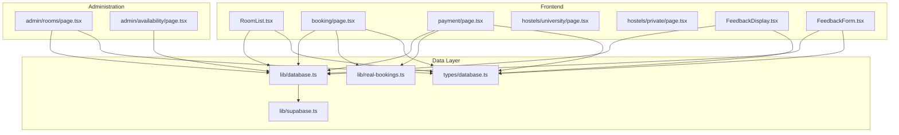
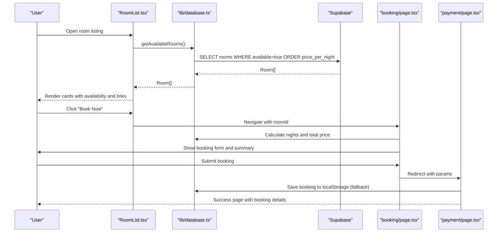
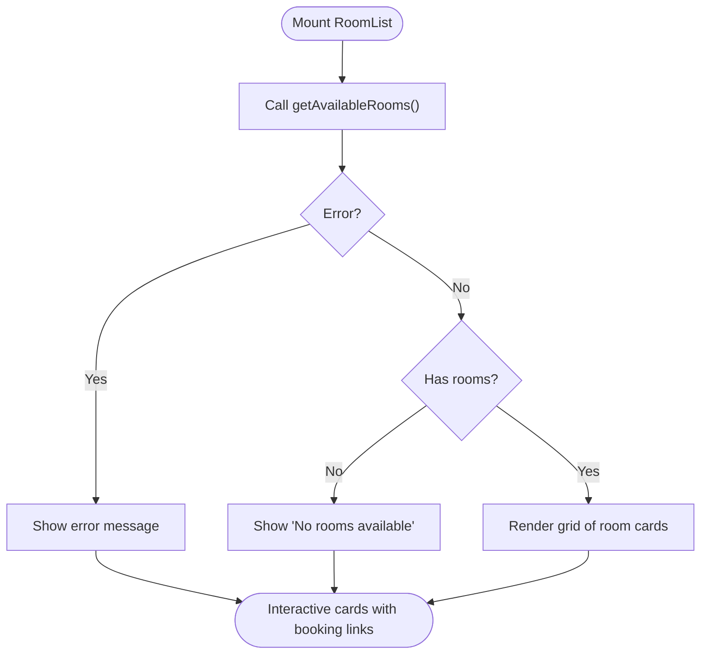
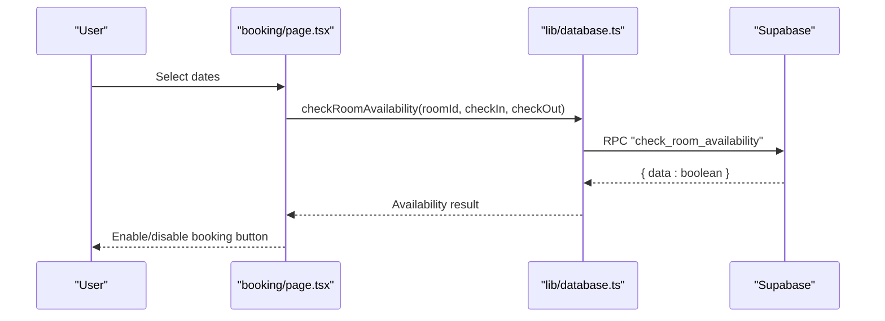
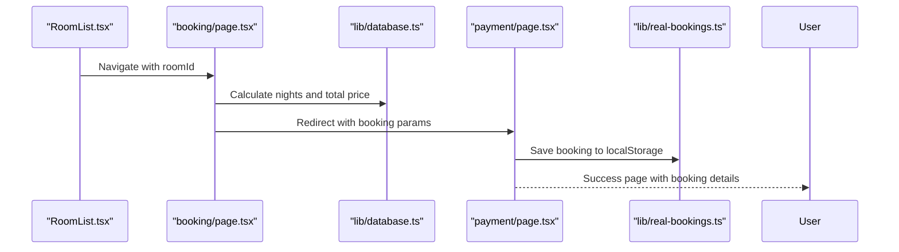
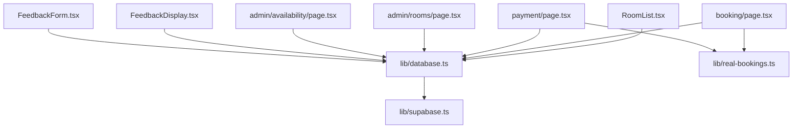

# Room Management System

<cite>
**Referenced Files in This Document**
- [RoomList.tsx](file://app/components/RoomList.tsx)
- [database.ts](file://app/lib/database.ts)
- [database.ts (types)](file://app/types/database.ts)
- [booking/page.tsx](file://app/booking/page.tsx)
- [payment/page.tsx](file://app/payment/page.tsx)
- [university/page.tsx](file://app/hostels/university/page.tsx)
- [private/page.tsx](file://app/hostels/private/page.tsx)
- [admin/rooms/page.tsx](file://app/admin/rooms/page.tsx)
- [supabase.ts](file://app/lib/supabase.ts)
- [real-bookings.ts](file://lib/real-bookings.ts)
- [FeedbackDisplay.tsx](file://app/components/FeedbackDisplay.tsx)
- [FeedbackForm.tsx](file://app/components/FeedbackForm.tsx)
- [admin/availability/page.tsx](file://app/admin/availability/page.tsx)
</cite>

## Table of Contents
1. [Introduction](#introduction)
2. [Project Structure](#project-structure)
3. [Core Components](#core-components)
4. [Architecture Overview](#architecture-overview)
5. [Detailed Component Analysis](#detailed-component-analysis)
6. [Dependency Analysis](#dependency-analysis)
7. [Performance Considerations](#performance-considerations)
8. [Troubleshooting Guide](#troubleshooting-guide)
9. [Conclusion](#conclusion)

## Introduction
This document provides comprehensive documentation for the room management system. It explains room categorization (university/private hostels), room listing and display functionality, availability checking mechanisms, and room details presentation. It also documents room data models, pricing structures, capacity management, and image handling. The RoomList component implementation, filtering and sorting capabilities, and user interaction patterns are covered in detail. Practical examples of room booking workflows, availability validation logic, and integration with the booking system are included. Room feature management, special amenities handling, and responsive design considerations are addressed.

## Project Structure
The room management system spans several Next.js pages and shared components:
- Frontend room listing and booking: RoomList, booking page, payment page
- Hostel categories: University and private hostels pages
- Administration: Rooms management, availability management
- Data layer: Supabase client, database service, type definitions
- Feedback system: Display and submission components



**Diagram sources**
- [RoomList.tsx:1-113](file://app/components/RoomList.tsx#L1-L113)
- [database.ts:1-433](file://app/lib/database.ts#L1-L433)
- [database.ts (types):1-146](file://app/types/database.ts#L1-L146)
- [booking/page.tsx:1-434](file://app/booking/page.tsx#L1-L434)
- [payment/page.tsx:1-352](file://app/payment/page.tsx#L1-L352)
- [university/page.tsx:1-71](file://app/hostels/university/page.tsx#L1-L71)
- [private/page.tsx:1-71](file://app/hostels/private/page.tsx#L1-L71)
- [admin/rooms/page.tsx:1-280](file://app/admin/rooms/page.tsx#L1-L280)
- [admin/availability/page.tsx:1-200](file://app/admin/availability/page.tsx#L1-L200)
- [supabase.ts:1-6](file://app/lib/supabase.ts#L1-L6)
- [real-bookings.ts:1-120](file://lib/real-bookings.ts#L1-L120)

**Section sources**
- [RoomList.tsx:1-113](file://app/components/RoomList.tsx#L1-L113)
- [database.ts:1-433](file://app/lib/database.ts#L1-L433)
- [database.ts (types):1-146](file://app/types/database.ts#L1-L146)
- [booking/page.tsx:1-434](file://app/booking/page.tsx#L1-L434)
- [payment/page.tsx:1-352](file://app/payment/page.tsx#L1-L352)
- [university/page.tsx:1-71](file://app/hostels/university/page.tsx#L1-L71)
- [private/page.tsx:1-71](file://app/hostels/private/page.tsx#L1-L71)
- [admin/rooms/page.tsx:1-280](file://app/admin/rooms/page.tsx#L1-L280)
- [admin/availability/page.tsx:1-200](file://app/admin/availability/page.tsx#L1-L200)
- [supabase.ts:1-6](file://app/lib/supabase.ts#L1-L6)
- [real-bookings.ts:1-120](file://lib/real-bookings.ts#L1-L120)

## Core Components
- RoomList: Fetches and displays available rooms with basic details and booking links.
- Database service: Provides CRUD operations for rooms, availability, bookings, and payments.
- Booking page: Handles room selection, guest info, dates, special requests, and payment method selection.
- Payment page: Processes payments via Stripe for card/paypal or confirms cash-on-arrival.
- Admin rooms page: Adds, edits, and deletes rooms; toggles availability indicators.
- Admin availability page: Manages daily room availability with fallback to localStorage.
- Type definitions: Strongly typed Room, Booking, Payment, RoomAvailability, and related interfaces.
- Feedback system: Displays and submits guest feedback with star ratings and fallback storage.

**Section sources**
- [RoomList.tsx:1-113](file://app/components/RoomList.tsx#L1-L113)
- [database.ts:25-90](file://app/lib/database.ts#L25-L90)
- [booking/page.tsx:44-178](file://app/booking/page.tsx#L44-L178)
- [payment/page.tsx:8-176](file://app/payment/page.tsx#L8-L176)
- [admin/rooms/page.tsx:8-92](file://app/admin/rooms/page.tsx#L8-L92)
- [admin/availability/page.tsx:27-89](file://app/admin/availability/page.tsx#L27-L89)
- [database.ts (types):12-66](file://app/types/database.ts#L12-L66)
- [FeedbackDisplay.tsx:12-138](file://app/components/FeedbackDisplay.tsx#L12-L138)
- [FeedbackForm.tsx:13-137](file://app/components/FeedbackForm.tsx#L13-L137)

## Architecture Overview
The system follows a layered architecture:
- Presentation layer: Next.js pages and components for user interaction
- Business logic: Database service orchestrating Supabase queries and calculations
- Data persistence: Supabase database with RPC functions and structured tables
- Local fallback: localStorage for bookings and feedback when backend is unavailable



**Diagram sources**
- [RoomList.tsx:12-26](file://app/components/RoomList.tsx#L12-L26)
- [database.ts:25-34](file://app/lib/database.ts#L25-L34)
- [booking/page.tsx:63-178](file://app/booking/page.tsx#L63-L178)
- [payment/page.tsx:34-176](file://app/payment/page.tsx#L34-L176)

## Detailed Component Analysis

### Room Data Model and Pricing
- Room model includes id, name, description, capacity, price_per_night, optional image_url, availability flag, and timestamps.
- Pricing is per night and calculated in the booking flow based on check-in/check-out dates.
- Capacity management ensures rooms meet guest count requirements.

```mermaid
classDiagram
class Room {
+string id
+string name
+string description
+number capacity
+number price_per_night
+string image_url
+boolean available
+string created_at
+string updated_at
}
class Booking {
+string id
+string user_id
+string room_id
+string check_in_date
+string check_out_date
+number total_price
+enum status
+string special_requests
+string created_at
+string updated_at
}
class Payment {
+string id
+string booking_id
+number amount
+string payment_method
+enum payment_status
+string transaction_id
+string created_at
+string updated_at
}
class RoomAvailability {
+string id
+string room_id
+string date
+boolean is_available
+string created_at
+string updated_at
}
Room "1" o-- "many" Booking : "has"
Booking "1" "1" o-- "1" Payment : "processed_by"
Room "1" o-- "many" RoomAvailability : "daily_availability"
```

**Diagram sources**
- [database.ts (types):12-66](file://app/types/database.ts#L12-L66)

**Section sources**
- [database.ts (types):12-66](file://app/types/database.ts#L12-L66)

### Room Listing and Display (RoomList)
- Fetches available rooms and renders a responsive grid with images, descriptions, capacity, price, and availability badge.
- Links to the booking page with the selected room id.
- Handles loading, error, and empty states.



**Diagram sources**
- [RoomList.tsx:12-52](file://app/components/RoomList.tsx#L12-L52)

**Section sources**
- [RoomList.tsx:1-113](file://app/components/RoomList.tsx#L1-L113)
- [database.ts:25-34](file://app/lib/database.ts#L25-L34)

### Availability Checking Mechanisms
- Available rooms are fetched with ordering by price.
- A dedicated RPC function checks room availability for specific dates.
- Daily availability table supports granular scheduling and bulk updates.



**Diagram sources**
- [database.ts:76-89](file://app/lib/database.ts#L76-L89)
- [booking/page.tsx:76-98](file://app/booking/page.tsx#L76-L98)

**Section sources**
- [database.ts:76-89](file://app/lib/database.ts#L76-L89)
- [database.ts:314-331](file://app/lib/database.ts#L314-L331)
- [database.ts:288-312](file://app/lib/database.ts#L288-L312)

### Room Details Presentation
- University and private hostel pages present curated lists with images, ratings, prices, and embedded maps.
- These pages demonstrate category-specific presentation and integration with feedback components.

**Section sources**
- [university/page.tsx:1-71](file://app/hostels/university/page.tsx#L1-L71)
- [private/page.tsx:1-71](file://app/hostels/private/page.tsx#L1-L71)
- [FeedbackDisplay.tsx:12-138](file://app/components/FeedbackDisplay.tsx#L12-L138)

### Room Management (Admin)
- Admin rooms page allows adding/editing/deleting rooms and toggling availability indicators.
- Uses forms to capture name, description, capacity, price, and optional image URL.
- Integrates with Supabase for persistence.

**Section sources**
- [admin/rooms/page.tsx:8-92](file://app/admin/rooms/page.tsx#L8-L92)
- [database.ts:46-74](file://app/lib/database.ts#L46-L74)

### Availability Management (Admin)
- Admin availability page filters and updates daily room availability.
- Falls back to localStorage when database operations fail.

**Section sources**
- [admin/availability/page.tsx:27-89](file://app/admin/availability/page.tsx#L27-L89)
- [database.ts:288-312](file://app/lib/database.ts#L288-L312)

### Booking Workflow and Integration
- RoomList → Booking page: Passes roomId via URL parameters.
- Booking page validates inputs, calculates nights and total price, and saves to localStorage as a fallback.
- Payment page handles Stripe card/paypal payments or confirms cash-on-arrival booking.
- Success page displays booking summary and navigation.



**Diagram sources**
- [RoomList.tsx:91-105](file://app/components/RoomList.tsx#L91-L105)
- [booking/page.tsx:63-178](file://app/booking/page.tsx#L63-L178)
- [payment/page.tsx:34-176](file://app/payment/page.tsx#L34-L176)
- [real-bookings.ts:21-37](file://lib/real-bookings.ts#L21-L37)

**Section sources**
- [booking/page.tsx:44-178](file://app/booking/page.tsx#L44-L178)
- [payment/page.tsx:8-176](file://app/payment/page.tsx#L8-L176)
- [real-bookings.ts:1-120](file://lib/real-bookings.ts#L1-L120)

### Filtering and Sorting Capabilities
- Available rooms are ordered by price per night.
- Search filters support capacity and maximum price thresholds.
- Admin rooms page provides a grid view with edit/delete actions.

**Section sources**
- [database.ts:31-31](file://app/lib/database.ts#L31-L31)
- [database.ts:159-181](file://app/lib/database.ts#L159-L181)
- [admin/rooms/page.tsx:219-267](file://app/admin/rooms/page.tsx#L219-L267)

### User Interaction Patterns
- Room selection via clickable cards with visual feedback.
- Interactive booking form with real-time summary calculation.
- Payment method selection with immediate action for cash-on-arrival.
- Responsive grid layouts adapting to mobile, tablet, and desktop screens.

**Section sources**
- [RoomList.tsx:54-111](file://app/components/RoomList.tsx#L54-L111)
- [booking/page.tsx:203-424](file://app/booking/page.tsx#L203-L424)
- [payment/page.tsx:254-342](file://app/payment/page.tsx#L254-L342)

### Feature Management and Amenities
- Room model supports optional description and image_url for feature representation.
- Feedback system captures star ratings and comments, enabling amenity-related discussions.
- Hostel category pages showcase distinct themes (university vs private) with imagery and ratings.

**Section sources**
- [database.ts (types):12-22](file://app/types/database.ts#L12-L22)
- [university/page.tsx:19-61](file://app/hostels/university/page.tsx#L19-L61)
- [private/page.tsx:19-61](file://app/hostels/private/page.tsx#L19-L61)
- [FeedbackDisplay.tsx:54-66](file://app/components/FeedbackDisplay.tsx#L54-L66)

### Image Handling
- RoomList uses a gradient placeholder when image_url is missing.
- Admin rooms page conditionally renders images when available.
- Hostel category pages use external image URLs and lazy loading.

**Section sources**
- [RoomList.tsx:58-61](file://app/components/RoomList.tsx#L58-L61)
- [admin/rooms/page.tsx:222-228](file://app/admin/rooms/page.tsx#L222-L228)
- [university/page.tsx:23-28](file://app/hostels/university/page.tsx#L23-L28)
- [private/page.tsx:23-28](file://app/hostels/private/page.tsx#L23-L28)

## Dependency Analysis
The system exhibits clear separation of concerns:
- Components depend on the database service for data access.
- Database service depends on Supabase client for persistence.
- Booking and payment flows integrate with localStorage as a fallback mechanism.
- Feedback components rely on database service with localStorage fallback.



**Diagram sources**
- [RoomList.tsx:1-5](file://app/components/RoomList.tsx#L1-L5)
- [database.ts:1-2](file://app/lib/database.ts#L1-L2)
- [booking/page.tsx:42-42](file://app/booking/page.tsx#L42-L42)
- [payment/page.tsx:5-6](file://app/payment/page.tsx#L5-L6)
- [admin/rooms/page.tsx:4-5](file://app/admin/rooms/page.tsx#L4-L5)
- [admin/availability/page.tsx:1-1](file://app/admin/availability/page.tsx#L1-L1)
- [FeedbackDisplay.tsx:3-4](file://app/components/FeedbackDisplay.tsx#L3-L4)
- [FeedbackForm.tsx:3-4](file://app/components/FeedbackForm.tsx#L3-L4)
- [supabase.ts:1-6](file://app/lib/supabase.ts#L1-L6)
- [real-bookings.ts:1-1](file://lib/real-bookings.ts#L1-L1)

**Section sources**
- [RoomList.tsx:1-5](file://app/components/RoomList.tsx#L1-L5)
- [database.ts:1-2](file://app/lib/database.ts#L1-L2)
- [booking/page.tsx:42-42](file://app/booking/page.tsx#L42-L42)
- [payment/page.tsx:5-6](file://app/payment/page.tsx#L5-L6)
- [admin/rooms/page.tsx:4-5](file://app/admin/rooms/page.tsx#L4-L5)
- [admin/availability/page.tsx:1-1](file://app/admin/availability/page.tsx#L1-L1)
- [FeedbackDisplay.tsx:3-4](file://app/components/FeedbackDisplay.tsx#L3-L4)
- [FeedbackForm.tsx:3-4](file://app/components/FeedbackForm.tsx#L3-L4)
- [supabase.ts:1-6](file://app/lib/supabase.ts#L1-L6)
- [real-bookings.ts:1-1](file://lib/real-bookings.ts#L1-L1)

## Performance Considerations
- Database queries order available rooms by price to optimize perceived value and reduce client-side sorting overhead.
- LocalStorage fallback minimizes downtime impact for bookings and feedback.
- Lazy loading for images improves initial page load performance.
- Responsive grid layouts adapt to screen sizes, reducing layout shifts.

## Troubleshooting Guide
- Room availability issues: Verify daily availability entries and ensure RPC function exists on the backend.
- Booking failures: Check localStorage fallback and network connectivity; confirm payment intent creation and Stripe elements initialization.
- Admin operations: Confirm Supabase credentials and table permissions; verify upsert behavior for availability updates.
- Feedback retrieval: Ensure database connectivity; localStorage fallback is used when database errors occur.

**Section sources**
- [database.ts:76-89](file://app/lib/database.ts#L76-L89)
- [payment/page.tsx:94-135](file://app/payment/page.tsx#L94-L135)
- [admin/availability/page.tsx:62-89](file://app/admin/availability/page.tsx#L62-L89)
- [FeedbackDisplay.tsx:21-52](file://app/components/FeedbackDisplay.tsx#L21-L52)

## Conclusion
The room management system provides a robust foundation for displaying available rooms, managing inventory, and facilitating bookings. Its layered architecture separates concerns effectively, while Supabase and localStorage ensure reliability and scalability. The components demonstrate strong typing, responsive design, and clear user interaction patterns, supporting both customer-facing and administrative workflows.