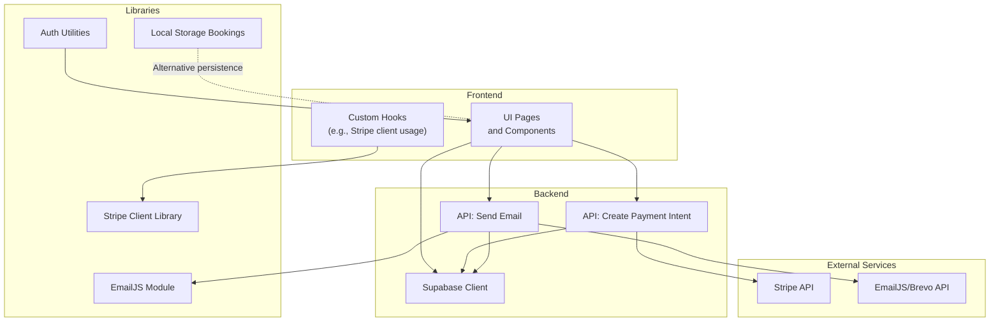
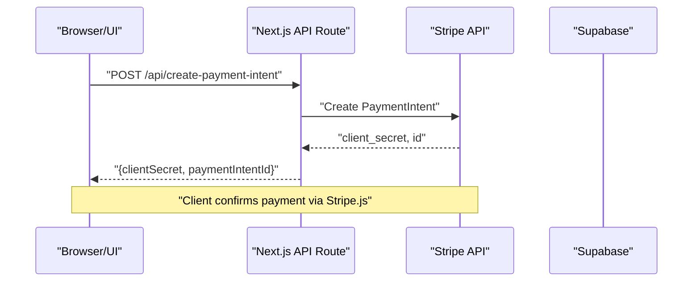
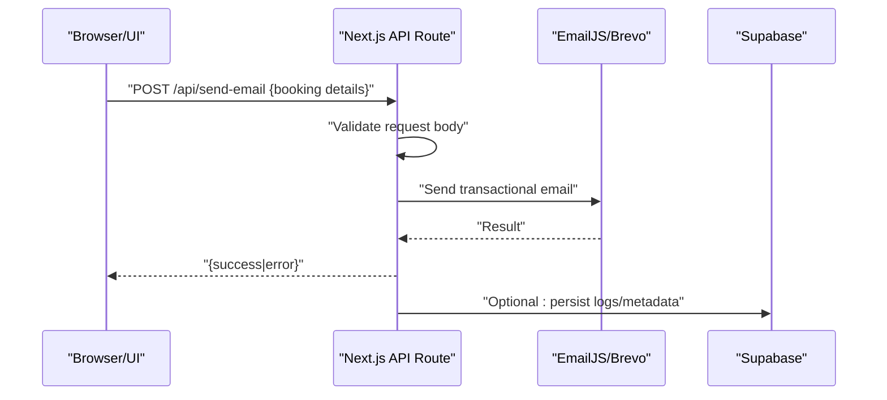
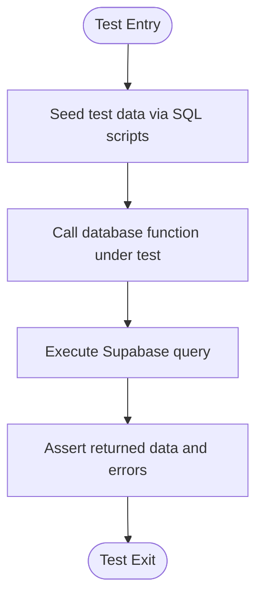
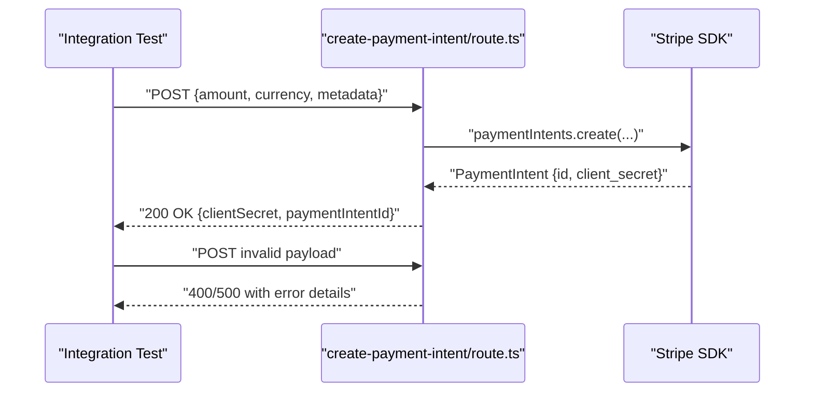
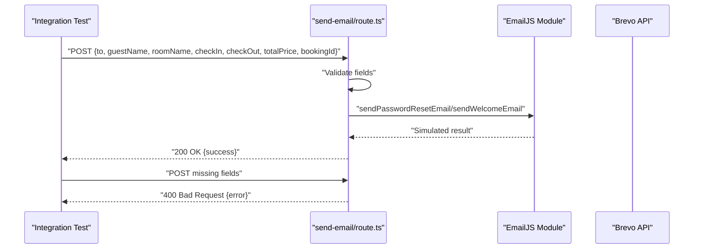
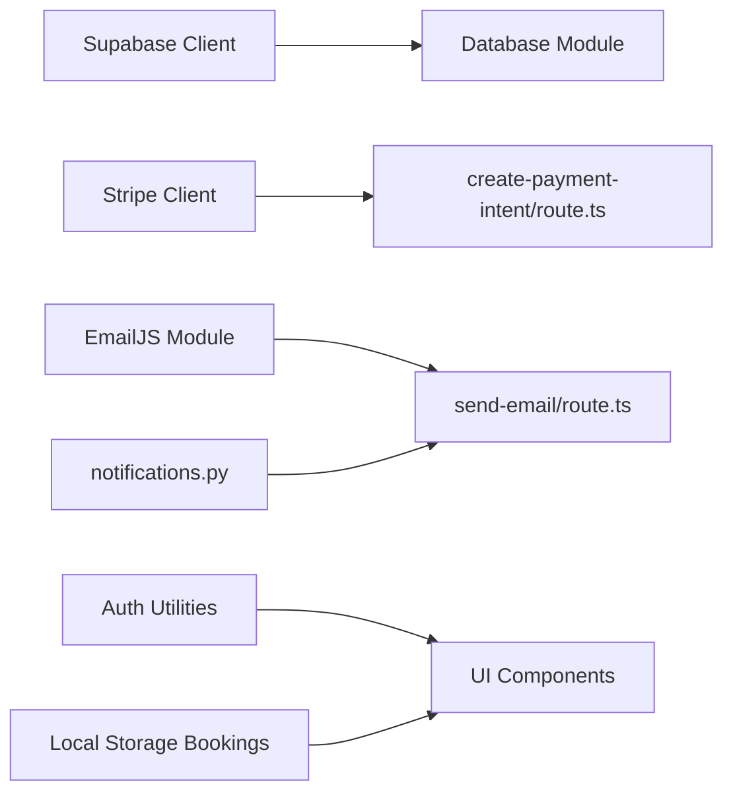

# Integration Testing

<cite>
**Referenced Files in This Document**
- [README.md](file://README.md)
- [package.json](file://package.json)
- [notifications.py](file://notifications.py)
- [lib/email.ts](file://lib/email.ts)
- [lib/stripe.ts](file://lib/stripe.ts)
- [app/lib/database.ts](file://app/lib/database.ts)
- [app/lib/supabase.ts](file://app/lib/supabase.ts)
- [app/api/create-payment-intent/route.ts](file://app/api/create-payment-intent/route.ts)
- [app/api/send-email/route.ts](file://app/api/send-email/route.ts)
- [lib/auth.ts](file://lib/auth.ts)
- [lib/bookings-storage.ts](file://lib/bookings-storage.ts)
- [lib/real-bookings.ts](file://lib/real-bookings.ts)
</cite>

## Table of Contents
1. [Introduction](#introduction)
2. [Project Structure](#project-structure)
3. [Core Components](#core-components)
4. [Architecture Overview](#architecture-overview)
5. [Detailed Component Analysis](#detailed-component-analysis)
6. [Dependency Analysis](#dependency-analysis)
7. [Performance Considerations](#performance-considerations)
8. [Troubleshooting Guide](#troubleshooting-guide)
9. [Conclusion](#conclusion)
10. [Appendices](#appendices)

## Introduction
This document describes integration testing approaches for the Pythonhostel application with a focus on:
- Database operations and Supabase integration, including CRUD and transaction-like behavior
- API endpoint testing for payment processing and email services
- Third-party service integration testing for Stripe payments, EmailJS notifications, and authentication flows
- Database seeding strategies, test environment setup, and end-to-end workflow testing
- Testing patterns for real-time data synchronization and webhook processing

The goal is to provide a practical, repeatable guide that balances code-level understanding with high-level testing strategies suitable for developers and QA engineers.

## Project Structure
The repository combines a Next.js frontend with TypeScript/React UI, a small backend implemented as Next.js App Router API handlers, and auxiliary libraries for email, payments, authentication, and local storage. Key areas for integration testing include:
- Supabase client initialization and database module
- Payment processing via Stripe and Next.js API routes
- Email delivery via EmailJS and a Brevo-based Python script
- Authentication utilities and input sanitization
- Local storage-backed booking persistence

**Diagram sources**
- [app/api/create-payment-intent/route.ts:1-33](file://app/api/create-payment-intent/route.ts#L1-L33)
- [app/api/send-email/route.ts:1-42](file://app/api/send-email/route.ts#L1-L42)
- [app/lib/database.ts:1-433](file://app/lib/database.ts#L1-L433)
- [app/lib/supabase.ts:1-6](file://app/lib/supabase.ts#L1-L6)
- [lib/stripe.ts:1-112](file://lib/stripe.ts#L1-L112)
- [lib/email.ts:1-75](file://lib/email.ts#L1-L75)
- [lib/auth.ts:1-57](file://lib/auth.ts#L1-L57)
- [lib/real-bookings.ts:1-120](file://lib/real-bookings.ts#L1-L120)

**Section sources**
- [README.md:1-37](file://README.md#L1-L37)
- [package.json:1-33](file://package.json#L1-L33)

## Core Components
This section outlines the core building blocks relevant to integration testing.

- Supabase client and database module
  - Provides typed CRUD operations for users, rooms, bookings, payments, availability, and feedback
  - Exposes helper functions for availability checks, dashboard statistics, and upsert operations
  - Supports joins and computed fields for richer queries

- Stripe integration
  - Frontend helpers for creating payment intents, sessions, and redirecting to Stripe Checkout
  - Backend API handler to create payment intents using Stripe secret key
  - Amount formatting helpers for Stripe’s minor units

- Email services
  - EmailJS module with placeholder logic and simulated send flows
  - Python-based Brevo transactional email script for booking confirmations
  - Next.js API route to validate and dispatch email requests

- Authentication utilities
  - Password hashing and verification
  - Token generation and verification (JWT-like base64 payload)
  - Input validation and sanitization

- Local storage bookings
  - Alternative persistence layer for bookings using browser localStorage
  - Useful for UI-driven tests and offline scenarios

**Section sources**
- [app/lib/database.ts:1-433](file://app/lib/database.ts#L1-L433)
- [app/lib/supabase.ts:1-6](file://app/lib/supabase.ts#L1-L6)
- [lib/stripe.ts:1-112](file://lib/stripe.ts#L1-L112)
- [app/api/create-payment-intent/route.ts:1-33](file://app/api/create-payment-intent/route.ts#L1-L33)
- [lib/email.ts:1-75](file://lib/email.ts#L1-L75)
- [notifications.py:1-53](file://notifications.py#L1-L53)
- [app/api/send-email/route.ts:1-42](file://app/api/send-email/route.ts#L1-L42)
- [lib/auth.ts:1-57](file://lib/auth.ts#L1-L57)
- [lib/real-bookings.ts:1-120](file://lib/real-bookings.ts#L1-L120)

## Architecture Overview
The integration testing architecture centers around realistic end-to-end flows that exercise Supabase, Stripe, and email services through the Next.js API routes and client-side helpers.

**Diagram sources**
- [lib/stripe.ts:17-37](file://lib/stripe.ts#L17-L37)
- [app/api/create-payment-intent/route.ts:7-32](file://app/api/create-payment-intent/route.ts#L7-L32)

**Diagram sources**
- [app/api/send-email/route.ts:4-41](file://app/api/send-email/route.ts#L4-L41)
- [lib/email.ts:11-53](file://lib/email.ts#L11-L53)
- [notifications.py:4-50](file://notifications.py#L4-L50)

## Detailed Component Analysis

### Database Operations and Supabase Integration
Testing database operations requires:
- Supabase client initialization and environment variable management
- CRUD operations for users, rooms, bookings, payments, availability, and feedback
- Transaction-like behavior using Supabase upserts and joins
- Stored procedures and RPC calls for domain logic (e.g., availability checks)

Recommended testing patterns:
- Seed test data using SQL scripts and insert fixtures via the database module
- Mock Supabase client in unit tests to isolate logic while validating query shapes
- Use real Supabase instances for integration tests behind a test schema or isolated table sets
- Validate join queries and computed fields (e.g., dashboard stats) to ensure correctness

**Diagram sources**
- [app/lib/database.ts:1-433](file://app/lib/database.ts#L1-L433)
- [app/lib/supabase.ts:1-6](file://app/lib/supabase.ts#L1-L6)

**Section sources**
- [app/lib/database.ts:1-433](file://app/lib/database.ts#L1-L433)
- [app/lib/supabase.ts:1-6](file://app/lib/supabase.ts#L1-L6)

### Payment Processing API and Stripe Integration
Testing payment flows involves:
- Validating request payloads and error responses in the API route
- Verifying Stripe API interactions and error handling
- Ensuring amount formatting aligns with Stripe’s minor units
- Confirming client-side flows (payment intent creation, session creation, redirect)

Testing strategies:
- Use a Stripe test mode key and mock Stripe responses to simulate success/failure scenarios
- Validate HTTP status codes and JSON payloads returned by the API route
- Test boundary conditions (zero amounts, invalid currencies, missing metadata)
- Verify client-side helpers handle errors gracefully and surface meaningful messages

**Diagram sources**
- [app/api/create-payment-intent/route.ts:7-32](file://app/api/create-payment-intent/route.ts#L7-L32)
- [lib/stripe.ts:17-37](file://lib/stripe.ts#L17-L37)

**Section sources**
- [app/api/create-payment-intent/route.ts:1-33](file://app/api/create-payment-intent/route.ts#L1-L33)
- [lib/stripe.ts:1-112](file://lib/stripe.ts#L1-L112)

### Email Services Testing (EmailJS and Brevo)
Testing email flows includes:
- Request validation in the email API route
- EmailJS module behavior (placeholder logic and simulated sends)
- Brevo-based Python script for transactional emails
- End-to-end confirmation email delivery

Testing strategies:
- Validate required fields and return appropriate HTTP statuses
- Mock external APIs to simulate success and failure paths
- Use test email addresses and sandbox environments for providers
- Verify email content and templating logic without sending real emails during tests

**Diagram sources**
- [app/api/send-email/route.ts:4-41](file://app/api/send-email/route.ts#L4-L41)
- [lib/email.ts:11-75](file://lib/email.ts#L11-L75)
- [notifications.py:4-50](file://notifications.py#L4-L50)

**Section sources**
- [app/api/send-email/route.ts:1-42](file://app/api/send-email/route.ts#L1-L42)
- [lib/email.ts:1-75](file://lib/email.ts#L1-L75)
- [notifications.py:1-53](file://notifications.py#L1-L53)

### Authentication and Input Validation
Testing authentication and input validation ensures:
- Password hashing and verification work correctly
- Token generation and expiration logic
- Email and password format validation
- Input sanitization against XSS and HTML injection

Testing strategies:
- Unit tests for hashing/verification with known plaintext and hashed pairs
- Boundary tests for token expiration and malformed tokens
- Validation tests for email/password regex and sanitization rules
- Integration tests to ensure sanitized inputs are persisted safely

**Section sources**
- [lib/auth.ts:1-57](file://lib/auth.ts#L1-L57)

### Local Storage Bookings and Real-Time Patterns
Testing local storage-backed bookings:
- Persist, retrieve, update, and delete operations
- Statistics computation and uniqueness extraction
- Real-time updates via localStorage events (if applicable)

Testing strategies:
- Mock localStorage in tests to avoid browser dependencies
- Validate deterministic ID generation and sorting logic
- Simulate concurrent updates and race conditions
- Complement with Supabase-based tests for server-side persistence

**Section sources**
- [lib/real-bookings.ts:1-120](file://lib/real-bookings.ts#L1-L120)
- [lib/bookings-storage.ts:1-191](file://lib/bookings-storage.ts#L1-L191)

## Dependency Analysis
Key dependencies and their roles in integration testing:
- Supabase client and database module: central for all persistence operations
- Stripe client library and API route: central for payment processing
- EmailJS module and Python Brevo script: central for email delivery
- Authentication utilities: support secure user management
- Local storage modules: alternative persistence for UI-focused tests

**Diagram sources**
- [app/lib/supabase.ts:1-6](file://app/lib/supabase.ts#L1-L6)
- [app/lib/database.ts:1-433](file://app/lib/database.ts#L1-L433)
- [lib/stripe.ts:1-112](file://lib/stripe.ts#L1-L112)
- [app/api/create-payment-intent/route.ts:1-33](file://app/api/create-payment-intent/route.ts#L1-L33)
- [lib/email.ts:1-75](file://lib/email.ts#L1-L75)
- [notifications.py:1-53](file://notifications.py#L1-L53)
- [app/api/send-email/route.ts:1-42](file://app/api/send-email/route.ts#L1-L42)
- [lib/auth.ts:1-57](file://lib/auth.ts#L1-L57)
- [lib/real-bookings.ts:1-120](file://lib/real-bookings.ts#L1-L120)

**Section sources**
- [package.json:11-21](file://package.json#L11-L21)

## Performance Considerations
- Minimize round-trips by batching database writes and using upserts where appropriate
- Cache frequently accessed data (e.g., room lists) to reduce database load
- Use pagination for large datasets in dashboard views
- Optimize Stripe API calls by reusing payment intents when safe
- Avoid heavy synchronous operations in API routes; defer non-critical tasks to background jobs

## Troubleshooting Guide
Common integration testing issues and resolutions:
- Supabase connection failures
  - Ensure environment variables are configured and reachable from the test environment
  - Use a dedicated test schema or isolated tables to prevent cross-test interference
- Stripe API errors
  - Validate test keys and network connectivity
  - Mock Stripe responses to simulate various failure modes (rate limits, invalid card, etc.)
- Email delivery failures
  - Verify provider credentials and sandbox settings
  - Use test addresses and provider-specific sandbox features
- Authentication validation errors
  - Confirm regex patterns and sanitization logic match expectations
  - Test edge cases for token expiration and malformed tokens
- Local storage inconsistencies
  - Mock localStorage in tests to avoid browser-specific behavior
  - Validate deterministic ID generation and JSON parsing

**Section sources**
- [app/api/create-payment-intent/route.ts:25-31](file://app/api/create-payment-intent/route.ts#L25-L31)
- [app/api/send-email/route.ts:9-14](file://app/api/send-email/route.ts#L9-L14)
- [lib/email.ts:34-44](file://lib/email.ts#L34-L44)
- [lib/auth.ts:25-35](file://lib/auth.ts#L25-L35)
- [lib/real-bookings.ts:40-49](file://lib/real-bookings.ts#L40-L49)

## Conclusion
Integration testing in Pythonhostel should emphasize end-to-end flows across Supabase, Stripe, and email services. By combining seeded test data, mocked external services, and robust request/response validation, teams can reliably test payment processing, email delivery, authentication, and persistence. Complement these with local storage tests for UI-driven scenarios and real-time synchronization patterns.

## Appendices

### Database Seeding Strategies
- Use SQL scripts to seed initial data and reset test environments
- Prefer deterministic fixtures for repeatable tests
- Isolate tests using separate schemas or tables to avoid cross-contamination

**Section sources**
- [app/lib/database.ts:1-433](file://app/lib/database.ts#L1-L433)

### Test Environment Setup
- Configure environment variables for Supabase and Stripe test keys
- Set up provider sandbox accounts for EmailJS/Brevo
- Use isolated databases or schemas for integration tests

**Section sources**
- [app/lib/supabase.ts:1-6](file://app/lib/supabase.ts#L1-L6)
- [package.json:11-21](file://package.json#L11-L21)

### End-to-End Workflow Testing
- Payment workflow: create payment intent -> client confirmation -> status updates
- Email workflow: submit booking details -> validate fields -> send email -> log result
- Authentication workflow: register -> verify email -> login -> token validation

**Section sources**
- [lib/stripe.ts:17-37](file://lib/stripe.ts#L17-L37)
- [app/api/create-payment-intent/route.ts:7-32](file://app/api/create-payment-intent/route.ts#L7-L32)
- [app/api/send-email/route.ts:4-41](file://app/api/send-email/route.ts#L4-L41)
- [lib/email.ts:11-75](file://lib/email.ts#L11-L75)
- [lib/auth.ts:1-57](file://lib/auth.ts#L1-L57)

### Webhook Processing and Real-Time Synchronization
- Stripe webhooks: validate signatures, handle events, update payment/booking statuses
- Real-time sync: use Supabase Realtime or polling to reflect changes across clients
- Testing: stub webhook endpoints, simulate event payloads, and assert state transitions

[No sources needed since this section provides general guidance]