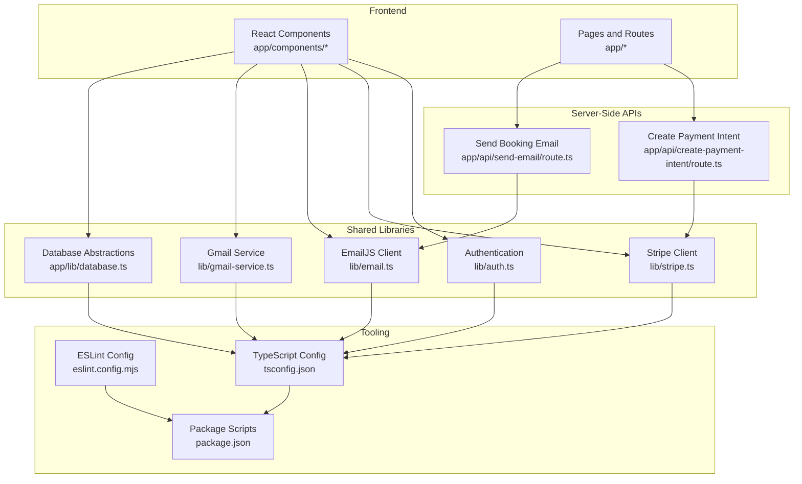
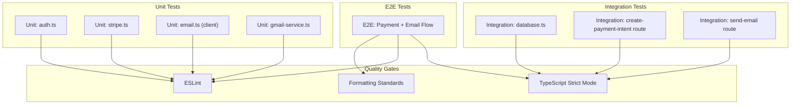
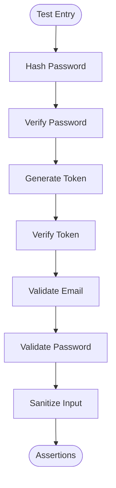
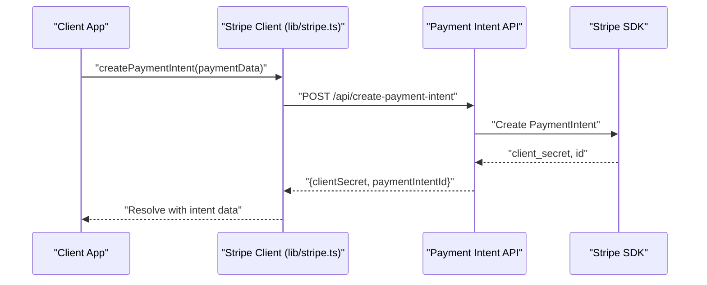
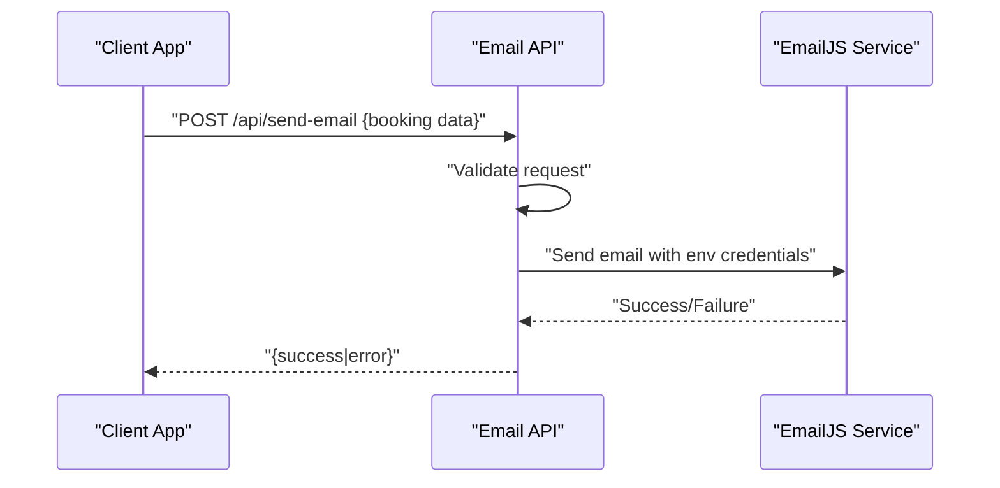
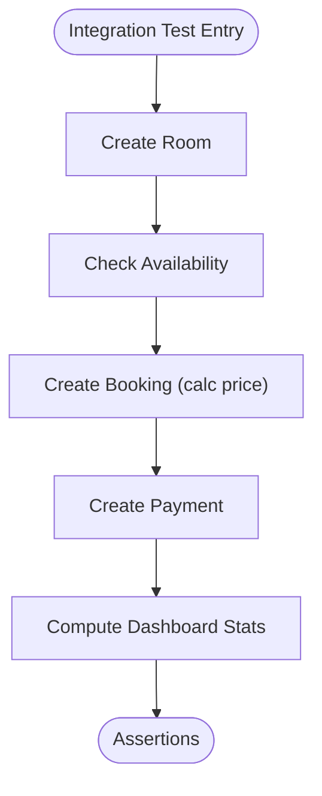
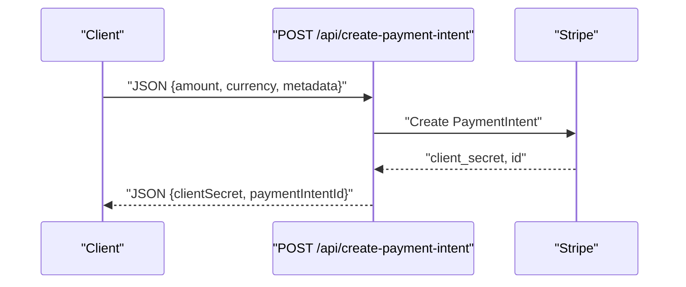
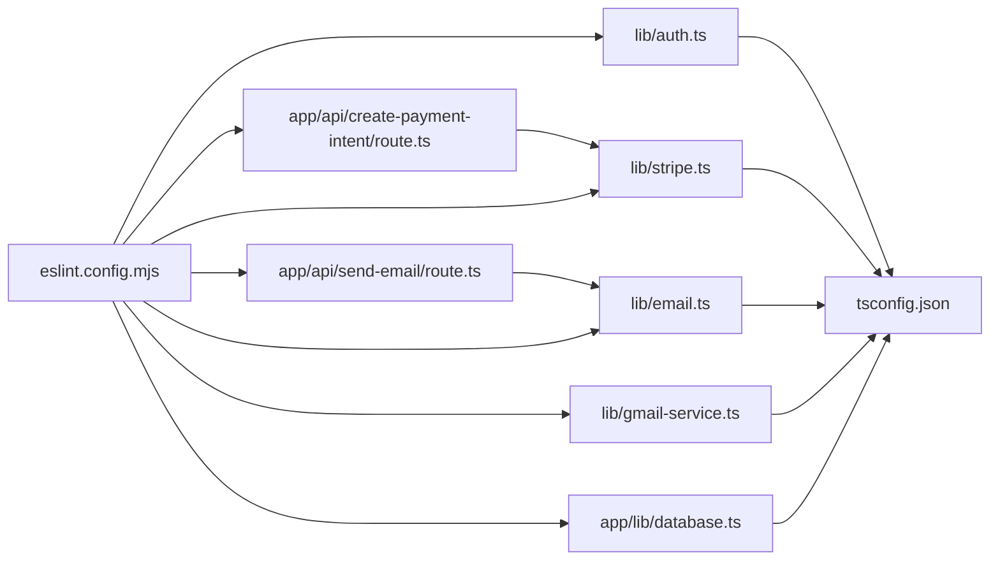

# Testing and Quality Assurance

<cite>
**Referenced Files in This Document**
- [package.json](file://package.json)
- [eslint.config.mjs](file://eslint.config.mjs)
- [tsconfig.json](file://tsconfig.json)
- [lib/auth.ts](file://lib/auth.ts)
- [lib/stripe.ts](file://lib/stripe.ts)
- [lib/email.ts](file://lib/email.ts)
- [lib/gmail-service.ts](file://lib/gmail-service.ts)
- [app/lib/email.ts](file://app/lib/email.ts)
- [app/lib/database.ts](file://app/lib/database.ts)
- [app/api/create-payment-intent/route.ts](file://app/api/create-payment-intent/route.ts)
- [app/api/send-email/route.ts](file://app/api/send-email/route.ts)
- [node_modules/next/dist/docs/01-app/02-guides/testing/vitest.md](file://node_modules/next/dist/docs/01-app/02-guides/testing/vitest.md)
- [node_modules/next/dist/docs/01-app/02-guides/testing/jest.md](file://node_modules/next/dist/docs/01-app/02-guides/testing/jest.md)
</cite>

## Table of Contents
1. [Introduction](#introduction)
2. [Project Structure](#project-structure)
3. [Core Components](#core-components)
4. [Architecture Overview](#architecture-overview)
5. [Detailed Component Analysis](#detailed-component-analysis)
6. [Dependency Analysis](#dependency-analysis)
7. [Performance Considerations](#performance-considerations)
8. [Troubleshooting Guide](#troubleshooting-guide)
9. [Conclusion](#conclusion)
10. [Appendices](#appendices)

## Introduction
This document defines comprehensive testing and quality assurance practices for the Pythonhostel project. It covers unit testing strategies for authentication logic, payment processing functions, and email service components; integration testing approaches for database operations, API endpoints, and third-party service integrations; code quality tooling including ESLint configuration, TypeScript strict mode enforcement, and formatting standards; performance testing methodologies; security testing practices; accessibility compliance verification; best practices for React components, database query optimization, and API endpoint validation; and guidelines for continuous integration testing and automated quality gates.

## Project Structure
The project is a Next.js application with a clear separation of concerns:
- Frontend React components and pages under app/
- Shared libraries under lib/ (authentication, payment, email, and Gmail service)
- API routes under app/api/ for server-side endpoints
- Tooling configuration for linting, TypeScript, and testing

**Diagram sources**
- [package.json:1-33](file://package.json#L1-L33)
- [eslint.config.mjs:1-19](file://eslint.config.mjs#L1-L19)
- [tsconfig.json:1-35](file://tsconfig.json#L1-L35)
- [lib/auth.ts:1-57](file://lib/auth.ts#L1-L57)
- [lib/stripe.ts:1-112](file://lib/stripe.ts#L1-L112)
- [lib/email.ts:1-75](file://lib/email.ts#L1-L75)
- [lib/gmail-service.ts:1-117](file://lib/gmail-service.ts#L1-L117)
- [app/lib/database.ts:1-433](file://app/lib/database.ts#L1-L433)
- [app/api/create-payment-intent/route.ts:1-33](file://app/api/create-payment-intent/route.ts#L1-L33)
- [app/api/send-email/route.ts:1-42](file://app/api/send-email/route.ts#L1-L42)

**Section sources**
- [package.json:1-33](file://package.json#L1-L33)
- [eslint.config.mjs:1-19](file://eslint.config.mjs#L1-L19)
- [tsconfig.json:1-35](file://tsconfig.json#L1-L35)

## Core Components
This section outlines the core modules to be tested and validated for correctness, robustness, and security.

- Authentication library
  - Password hashing and verification
  - Token generation and verification
  - Email and password validation
  - Input sanitization
- Payment processing
  - Client-side Stripe helpers for intents, sessions, and amount formatting
  - Server-side API for creating payment intents
- Email services
  - EmailJS-based client-side email sending
  - Gmail SMTP service for real email dispatch
  - Server-side email sending via EmailJS
- Database abstractions
  - Supabase-based CRUD and analytics queries
  - Room availability checks and updates
  - Booking and payment lifecycle operations
- API endpoints
  - Payment intent creation
  - Booking confirmation email delivery

**Section sources**
- [lib/auth.ts:1-57](file://lib/auth.ts#L1-L57)
- [lib/stripe.ts:1-112](file://lib/stripe.ts#L1-L112)
- [lib/email.ts:1-75](file://lib/email.ts#L1-L75)
- [lib/gmail-service.ts:1-117](file://lib/gmail-service.ts#L1-L117)
- [app/lib/email.ts:1-49](file://app/lib/email.ts#L1-L49)
- [app/lib/database.ts:1-433](file://app/lib/database.ts#L1-L433)
- [app/api/create-payment-intent/route.ts:1-33](file://app/api/create-payment-intent/route.ts#L1-L33)
- [app/api/send-email/route.ts:1-42](file://app/api/send-email/route.ts#L1-L42)

## Architecture Overview
The testing architecture integrates unit, integration, and E2E strategies across frontend, backend, and third-party services.

**Diagram sources**
- [lib/auth.ts:1-57](file://lib/auth.ts#L1-L57)
- [lib/stripe.ts:1-112](file://lib/stripe.ts#L1-L112)
- [lib/email.ts:1-75](file://lib/email.ts#L1-L75)
- [lib/gmail-service.ts:1-117](file://lib/gmail-service.ts#L1-L117)
- [app/lib/database.ts:1-433](file://app/lib/database.ts#L1-L433)
- [app/api/create-payment-intent/route.ts:1-33](file://app/api/create-payment-intent/route.ts#L1-L33)
- [app/api/send-email/route.ts:1-42](file://app/api/send-email/route.ts#L1-L42)
- [eslint.config.mjs:1-19](file://eslint.config.mjs#L1-L19)
- [tsconfig.json:1-35](file://tsconfig.json#L1-L35)

## Detailed Component Analysis

### Authentication Logic Testing
Recommended unit tests for authentication functions:
- Password hashing and verification
  - Positive and negative cases for correct/incorrect passwords
  - Boundary conditions for salt rounds and timing
- Token generation and verification
  - Valid token creation and expiration handling
  - Malformed and expired token scenarios
- Input validation
  - Email format validation with valid and invalid patterns
  - Password strength validation with weak, strong, and edge cases
- Input sanitization
  - Removal of script tags and HTML tags
  - Edge cases with whitespace and special characters

**Diagram sources**
- [lib/auth.ts:1-57](file://lib/auth.ts#L1-L57)

**Section sources**
- [lib/auth.ts:1-57](file://lib/auth.ts#L1-L57)

### Payment Processing Testing
Recommended unit tests for Stripe client helpers and server-side API:
- Client-side helpers
  - Amount formatting to/from Stripe units
  - Error handling for network failures and invalid inputs
  - Session creation and payment confirmation flows
- Server-side API
  - Request validation (amount, currency, metadata)
  - Stripe SDK integration and error propagation
  - Response shape and status codes

**Diagram sources**
- [lib/stripe.ts:1-112](file://lib/stripe.ts#L1-L112)
- [app/api/create-payment-intent/route.ts:1-33](file://app/api/create-payment-intent/route.ts#L1-L33)

**Section sources**
- [lib/stripe.ts:1-112](file://lib/stripe.ts#L1-L112)
- [app/api/create-payment-intent/route.ts:1-33](file://app/api/create-payment-intent/route.ts#L1-L33)

### Email Service Components Testing
Recommended unit tests for email services:
- EmailJS client-side
  - Successful send simulation and error handling
  - Environment variable logging and validation
- Gmail SMTP service
  - Email composition and mailto link generation
  - Error handling and user feedback
- Server-side email API
  - Request validation and required fields
  - Authorization header and EmailJS API integration
  - Error propagation and structured responses

**Diagram sources**
- [app/api/send-email/route.ts:1-42](file://app/api/send-email/route.ts#L1-L42)
- [app/lib/email.ts:1-49](file://app/lib/email.ts#L1-L49)

**Section sources**
- [lib/email.ts:1-75](file://lib/email.ts#L1-L75)
- [lib/gmail-service.ts:1-117](file://lib/gmail-service.ts#L1-L117)
- [app/lib/email.ts:1-49](file://app/lib/email.ts#L1-L49)
- [app/api/send-email/route.ts:1-42](file://app/api/send-email/route.ts#L1-L42)

### Database Operations Testing
Recommended integration tests for database abstractions:
- CRUD operations
  - Create, read, update, delete for users, rooms, bookings, payments
- Business logic
  - Room availability checks and updates
  - Booking total price calculation
  - Dashboard statistics aggregation
- Query correctness
  - Filtering, ordering, and joins
  - Upsert semantics for availability

**Diagram sources**
- [app/lib/database.ts:1-433](file://app/lib/database.ts#L1-L433)

**Section sources**
- [app/lib/database.ts:1-433](file://app/lib/database.ts#L1-L433)

### API Endpoint Testing
Recommended integration tests for API endpoints:
- Payment intent creation
  - Valid request payload and Stripe SDK response
  - Error handling for invalid or missing fields
- Send booking email
  - Required fields validation
  - EmailJS API integration and error propagation

**Diagram sources**
- [app/api/create-payment-intent/route.ts:1-33](file://app/api/create-payment-intent/route.ts#L1-L33)

**Section sources**
- [app/api/create-payment-intent/route.ts:1-33](file://app/api/create-payment-intent/route.ts#L1-L33)
- [app/api/send-email/route.ts:1-42](file://app/api/send-email/route.ts#L1-L42)

## Dependency Analysis
Testing dependencies and coupling:
- Unit tests depend on pure functions and isolated modules
- Integration tests depend on external services (Stripe, EmailJS, Supabase)
- Tooling dependencies (ESLint, TypeScript) enforce code quality and type safety

**Diagram sources**
- [lib/auth.ts:1-57](file://lib/auth.ts#L1-L57)
- [lib/stripe.ts:1-112](file://lib/stripe.ts#L1-L112)
- [lib/email.ts:1-75](file://lib/email.ts#L1-L75)
- [lib/gmail-service.ts:1-117](file://lib/gmail-service.ts#L1-L117)
- [app/lib/database.ts:1-433](file://app/lib/database.ts#L1-L433)
- [app/api/create-payment-intent/route.ts:1-33](file://app/api/create-payment-intent/route.ts#L1-L33)
- [app/api/send-email/route.ts:1-42](file://app/api/send-email/route.ts#L1-L42)
- [eslint.config.mjs:1-19](file://eslint.config.mjs#L1-L19)
- [tsconfig.json:1-35](file://tsconfig.json#L1-L35)

**Section sources**
- [eslint.config.mjs:1-19](file://eslint.config.mjs#L1-L19)
- [tsconfig.json:1-35](file://tsconfig.json#L1-L35)

## Performance Considerations
- Unit tests
  - Keep tests fast by mocking external services and using deterministic inputs
- Integration tests
  - Use lightweight test databases or in-memory fixtures where possible
  - Batch requests and avoid unnecessary round trips
- API tests
  - Stub Stripe and EmailJS responses to simulate latency and failure modes
- Database tests
  - Normalize queries and avoid N+1 selects; use transactional fixtures
- CI performance
  - Parallelize test suites and cache dependencies

## Troubleshooting Guide
Common issues and resolutions:
- ESLint failures
  - Ensure configuration aligns with Next.js and TypeScript settings
  - Run linting locally before committing
- TypeScript errors
  - Enable strict mode and fix type mismatches
  - Avoid disabling strict mode globally
- Stripe integration
  - Validate secret/public keys and network connectivity
  - Mock Stripe SDK in tests to prevent flakiness
- EmailJS integration
  - Verify environment variables and API credentials
  - Log and capture API error responses for diagnostics
- Database queries
  - Review Supabase SQL functions and RPCs
  - Use explain plans for complex queries

**Section sources**
- [eslint.config.mjs:1-19](file://eslint.config.mjs#L1-L19)
- [tsconfig.json:1-35](file://tsconfig.json#L1-L35)
- [lib/stripe.ts:1-112](file://lib/stripe.ts#L1-L112)
- [app/api/create-payment-intent/route.ts:1-33](file://app/api/create-payment-intent/route.ts#L1-L33)
- [app/lib/email.ts:1-49](file://app/lib/email.ts#L1-L49)
- [app/lib/database.ts:1-433](file://app/lib/database.ts#L1-L433)

## Conclusion
The Pythonhostel project can achieve robust quality assurance by combining unit tests for pure logic, integration tests for external services and database operations, and E2E tests for critical flows. Enforcing ESLint and TypeScript strict mode ensures consistent code quality, while performance and security practices protect reliability and user trust.

## Appendices

### Code Quality Tools
- ESLint configuration
  - Extends Next.js core-web-vitals and TypeScript configurations
  - Overrides default ignores to include development artifacts
- TypeScript strict mode
  - Enabled globally with strict type checking and no emit
  - JSX and incremental compilation configured
- Formatting standards
  - Use Prettier-compatible defaults enforced by editor integrations
  - Keep imports and paths aligned with tsconfig paths

**Section sources**
- [eslint.config.mjs:1-19](file://eslint.config.mjs#L1-L19)
- [tsconfig.json:1-35](file://tsconfig.json#L1-L35)

### Testing Framework Recommendations
- Unit and component testing
  - Use Vitest with React Testing Library for fast, DOM-focused tests
  - Configure jsdom environment and React plugin
- Snapshot testing
  - Optional snapshot tests for UI stability
- E2E testing
  - Use Playwright or Cypress for browser automation
  - Focus on critical user journeys (payment and email confirmation)

**Section sources**
- [node_modules/next/dist/docs/01-app/02-guides/testing/vitest.md:1-244](file://node_modules/next/dist/docs/01-app/02-guides/testing/vitest.md#L1-L244)
- [node_modules/next/dist/docs/01-app/02-guides/testing/jest.md:1-424](file://node_modules/next/dist/docs/01-app/02-guides/testing/jest.md#L1-L424)

### Continuous Integration and Quality Gates
- Pre-commit checks
  - Run ESLint and TypeScript type checks
- CI pipeline stages
  - Install dependencies
  - Lint and type-check
  - Run unit tests
  - Run integration tests against ephemeral environments
  - Run E2E tests
- Quality gates
  - Fail builds on lint/type failures
  - Require passing unit and integration suites
  - Optional coverage thresholds for critical modules

[No sources needed since this section provides general guidance]