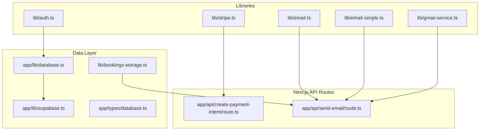
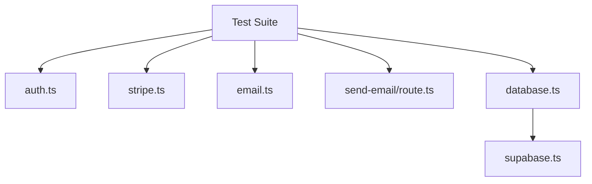
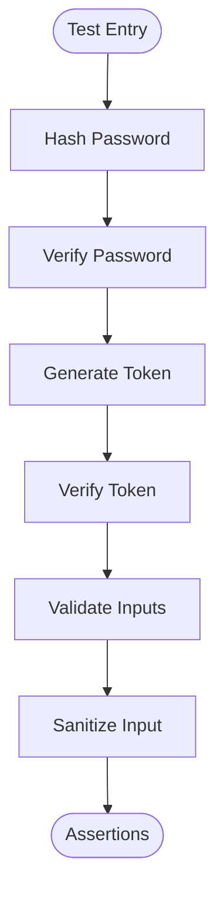
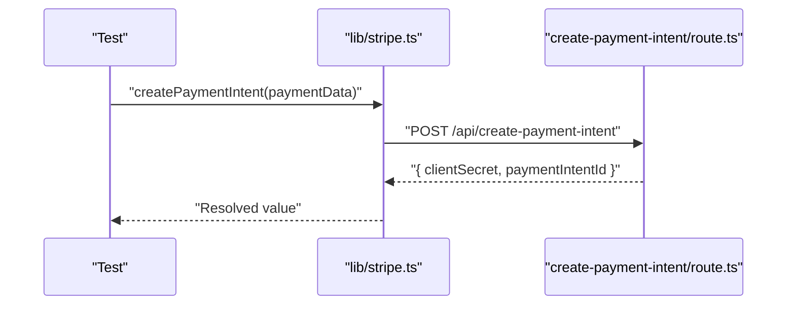
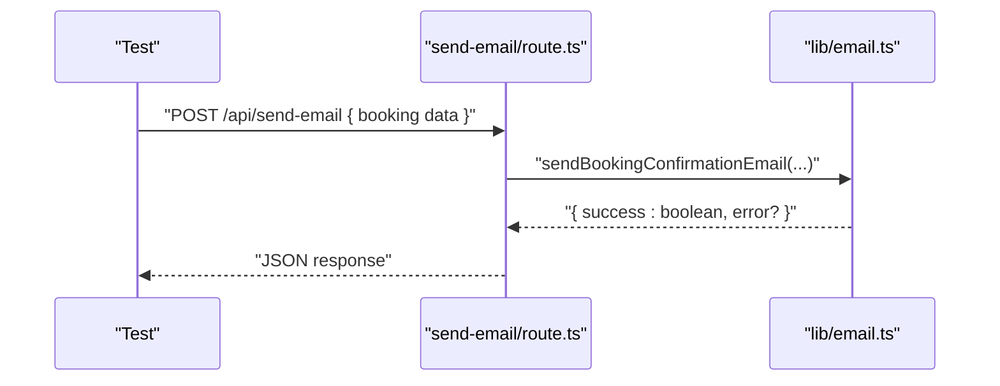
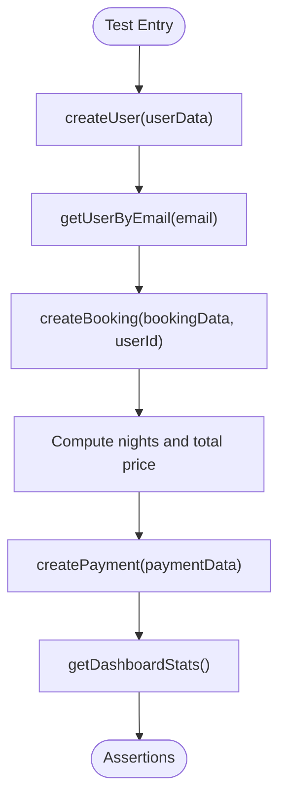
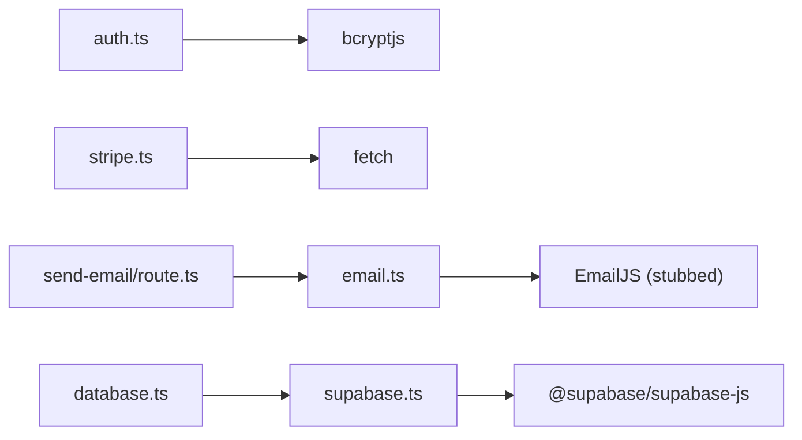

# Unit Testing Strategies

<cite>
**Referenced Files in This Document**
- [auth.ts](file://lib/auth.ts)
- [stripe.ts](file://lib/stripe.ts)
- [email.ts](file://lib/email.ts)
- [email-simple.ts](file://lib/email-simple.ts)
- [gmail-service.ts](file://lib/gmail-service.ts)
- [create-payment-intent/route.ts](file://app/api/create-payment-intent/route.ts)
- [send-email/route.ts](file://app/api/send-email/route.ts)
- [database.ts](file://app/lib/database.ts)
- [supabase.ts](file://app/lib/supabase.ts)
- [bookings-storage.ts](file://lib/bookings-storage.ts)
- [database.ts](file://app/types/database.ts)
</cite>

## Table of Contents
1. [Introduction](#introduction)
2. [Project Structure](#project-structure)
3. [Core Components](#core-components)
4. [Architecture Overview](#architecture-overview)
5. [Detailed Component Analysis](#detailed-component-analysis)
6. [Dependency Analysis](#dependency-analysis)
7. [Performance Considerations](#performance-considerations)
8. [Troubleshooting Guide](#troubleshooting-guide)
9. [Conclusion](#conclusion)
10. [Appendices](#appendices)

## Introduction
This document provides comprehensive unit testing strategies for the Pythonhostel project. It focuses on three critical domains:
- Authentication functions: password hashing, credential validation, and token generation/verification
- Payment processing: Stripe integration, payment intent creation, amount normalization, and checkout sessions
- Email services: EmailJS integration, template rendering, and delivery confirmation

It also covers mocking strategies for external dependencies, test data setup, assertion patterns, and practical examples of unit tests for core business logic. Finally, it outlines test coverage requirements for core modules.

## Project Structure
The testing surface spans client-side libraries and Next.js API routes:
- Authentication and utilities: lib/auth.ts
- Payment orchestration: lib/stripe.ts
- Email services: lib/email.ts, lib/email-simple.ts, lib/gmail-service.ts
- API routes: app/api/create-payment-intent/route.ts, app/api/send-email/route.ts
- Data access and domain logic: app/lib/database.ts, app/lib/supabase.ts, app/types/database.ts
- Test data helpers: lib/bookings-storage.ts

**Diagram sources**
- [auth.ts:1-57](file://lib/auth.ts#L1-L57)
- [stripe.ts:1-112](file://lib/stripe.ts#L1-L112)
- [email.ts:1-75](file://lib/email.ts#L1-L75)
- [email-simple.ts:1-59](file://lib/email-simple.ts#L1-L59)
- [gmail-service.ts:1-117](file://lib/gmail-service.ts#L1-L117)
- [create-payment-intent/route.ts:1-33](file://app/api/create-payment-intent/route.ts#L1-L33)
- [send-email/route.ts:1-42](file://app/api/send-email/route.ts#L1-L42)
- [database.ts:1-433](file://app/lib/database.ts#L1-L433)
- [supabase.ts:1-6](file://app/lib/supabase.ts#L1-L6)
- [bookings-storage.ts:1-191](file://lib/bookings-storage.ts#L1-L191)

**Section sources**
- [auth.ts:1-57](file://lib/auth.ts#L1-L57)
- [stripe.ts:1-112](file://lib/stripe.ts#L1-L112)
- [email.ts:1-75](file://lib/email.ts#L1-L75)
- [email-simple.ts:1-59](file://lib/email-simple.ts#L1-L59)
- [gmail-service.ts:1-117](file://lib/gmail-service.ts#L1-L117)
- [create-payment-intent/route.ts:1-33](file://app/api/create-payment-intent/route.ts#L1-L33)
- [send-email/route.ts:1-42](file://app/api/send-email/route.ts#L1-L42)
- [database.ts:1-433](file://app/lib/database.ts#L1-L433)
- [supabase.ts:1-6](file://app/lib/supabase.ts#L1-L6)
- [bookings-storage.ts:1-191](file://lib/bookings-storage.ts#L1-L191)

## Core Components
This section outlines the primary units under test and their responsibilities.

- Authentication utilities
  - Password hashing and verification
  - Token generation and verification
  - Input validation and sanitization

- Payment processing
  - Payment intent creation via API route
  - Amount normalization for Stripe
  - Checkout session creation and redirection

- Email services
  - EmailJS-based password reset and welcome emails
  - Simple mailto-based email preparation
  - Gmail SMTP-style email composition and delivery simulation

- Data access layer
  - Supabase client initialization
  - CRUD operations for users, rooms, bookings, payments, availability, and feedback
  - Business logic for pricing calculations and availability checks

**Section sources**
- [auth.ts:1-57](file://lib/auth.ts#L1-L57)
- [stripe.ts:1-112](file://lib/stripe.ts#L1-L112)
- [email.ts:1-75](file://lib/email.ts#L1-L75)
- [email-simple.ts:1-59](file://lib/email-simple.ts#L1-L59)
- [gmail-service.ts:1-117](file://lib/gmail-service.ts#L1-L117)
- [database.ts:1-433](file://app/lib/database.ts#L1-L433)
- [supabase.ts:1-6](file://app/lib/supabase.ts#L1-L6)

## Architecture Overview
The testing architecture separates concerns across:
- Pure functions (auth, stripe helpers, validators)
- API routes (external HTTP boundaries)
- Data access layer (Supabase queries)
- Email services (client-side and API-bound)

**Diagram sources**
- [auth.ts:1-57](file://lib/auth.ts#L1-L57)
- [stripe.ts:1-112](file://lib/stripe.ts#L1-L112)
- [email.ts:1-75](file://lib/email.ts#L1-L75)
- [send-email/route.ts:1-42](file://app/api/send-email/route.ts#L1-L42)
- [database.ts:1-433](file://app/lib/database.ts#L1-L433)
- [supabase.ts:1-6](file://app/lib/supabase.ts#L1-L6)

## Detailed Component Analysis

### Authentication Testing Strategy
Focus areas:
- Password hashing correctness and cost factor
- Password verification against stored hashes
- Token generation and expiration handling
- Email and password format validation
- Input sanitization for XSS prevention

Mocking and fixtures:
- Use deterministic salts for hashing tests
- Provide valid/invalid tokens with current time adjustments for expiry
- Validate regex patterns for email/password policies
- Sanitize inputs with script tags and HTML injections

Assertion patterns:
- Equality checks for hashed outputs (with salted comparison)
- Boolean assertions for verification and validation functions
- Exception handling for invalid tokens

**Diagram sources**
- [auth.ts:1-57](file://lib/auth.ts#L1-L57)

**Section sources**
- [auth.ts:1-57](file://lib/auth.ts#L1-L57)

### Payment Processing Testing Strategy
Focus areas:
- Payment intent creation via API route
- Amount normalization to and from Stripe’s minor units
- Checkout session creation and redirection
- Error propagation from API route to client

Mocking and fixtures:
- Mock fetch responses for payment intent creation
- Provide valid/invalid payment intent payloads
- Simulate network errors and non-OK responses
- Use controlled amounts to validate rounding behavior

Assertion patterns:
- Response shape validation (client secret, payment intent ID)
- Error message presence on failure
- Amount conversions match expected precision

**Diagram sources**
- [stripe.ts:16-37](file://lib/stripe.ts#L16-L37)
- [create-payment-intent/route.ts:7-32](file://app/api/create-payment-intent/route.ts#L7-L32)

**Section sources**
- [stripe.ts:1-112](file://lib/stripe.ts#L1-L112)
- [create-payment-intent/route.ts:1-33](file://app/api/create-payment-intent/route.ts#L1-L33)

### Email Service Testing Strategy
Focus areas:
- EmailJS-based password reset and welcome emails
- Simple mailto-based email preparation
- Gmail-style email composition and delivery simulation

Mocking and fixtures:
- Stub global fetch/console for EmailJS simulation
- Use realistic email templates and links
- Validate that mailto links are constructed correctly
- Assert alert/notification behavior for simple flows

Assertion patterns:
- Return value indicates success/failure
- Console logs capture expected content
- Link construction validates subject/body encoding

**Diagram sources**
- [send-email/route.ts:4-41](file://app/api/send-email/route.ts#L4-L41)
- [email.ts:11-74](file://lib/email.ts#L11-L74)

**Section sources**
- [email.ts:1-75](file://lib/email.ts#L1-L75)
- [email-simple.ts:1-59](file://lib/email-simple.ts#L1-L59)
- [gmail-service.ts:1-117](file://lib/gmail-service.ts#L1-L117)
- [send-email/route.ts:1-42](file://app/api/send-email/route.ts#L1-L42)

### Data Access and Business Logic Testing Strategy
Focus areas:
- Supabase client initialization and query correctness
- User creation and retrieval by email
- Room availability checks and search filtering
- Booking creation with price calculation
- Payment creation and status updates
- Dashboard statistics computation

Mocking and fixtures:
- Use in-memory data stores for bookings and users
- Mock Supabase client methods to return controlled datasets
- Provide edge-case scenarios: missing rooms, overlapping bookings, invalid dates

Assertion patterns:
- Shape and type validation for typed responses
- Numeric computations validated against known inputs
- Error propagation for invalid or missing resources

**Diagram sources**
- [database.ts:4-260](file://app/lib/database.ts#L4-L260)
- [supabase.ts:1-6](file://app/lib/supabase.ts#L1-L6)
- [bookings-storage.ts:137-191](file://lib/bookings-storage.ts#L137-L191)

**Section sources**
- [database.ts:1-433](file://app/lib/database.ts#L1-L433)
- [supabase.ts:1-6](file://app/lib/supabase.ts#L1-L6)
- [bookings-storage.ts:1-191](file://lib/bookings-storage.ts#L1-L191)

## Dependency Analysis
External dependencies and their test impact:
- bcrypt for password hashing
- Stripe SDK and API for payment intents and checkout
- Supabase client for database operations
- EmailJS and browser APIs for email delivery

**Diagram sources**
- [auth.ts:1-12](file://lib/auth.ts#L1-L12)
- [stripe.ts:17-37](file://lib/stripe.ts#L17-L37)
- [email.ts:11-53](file://lib/email.ts#L11-L53)
- [send-email/route.ts:1-41](file://app/api/send-email/route.ts#L1-L41)
- [database.ts:1-13](file://app/lib/database.ts#L1-L13)
- [supabase.ts:1-6](file://app/lib/supabase.ts#L1-L6)

**Section sources**
- [auth.ts:1-57](file://lib/auth.ts#L1-L57)
- [stripe.ts:1-112](file://lib/stripe.ts#L1-L112)
- [email.ts:1-75](file://lib/email.ts#L1-L75)
- [send-email/route.ts:1-42](file://app/api/send-email/route.ts#L1-L42)
- [database.ts:1-433](file://app/lib/database.ts#L1-L433)
- [supabase.ts:1-6](file://app/lib/supabase.ts#L1-L6)

## Performance Considerations
- Prefer deterministic mocks to avoid flaky tests
- Limit network calls in unit tests; stub fetch and external SDKs
- Use small, focused test suites per module to reduce runtime
- Validate numeric conversions early to prevent cascading failures

## Troubleshooting Guide
Common issues and resolutions:
- Password hashing tests failing due to salt differences: ensure deterministic salt usage in tests
- Token verification failing due to time skew: adjust token expiration in tests
- Stripe API errors: mock non-OK responses and assert error messages
- EmailJS simulation not triggering: verify stubbing of global fetch/console
- Supabase query failures: mock client methods with controlled data

**Section sources**
- [auth.ts:24-35](file://lib/auth.ts#L24-L35)
- [stripe.ts:27-36](file://lib/stripe.ts#L27-L36)
- [email.ts:49-52](file://lib/email.ts#L49-L52)
- [send-email/route.ts:9-14](file://app/api/send-email/route.ts#L9-L14)

## Conclusion
A robust unit testing strategy for Pythonhostel centers on isolating pure functions, stubbing external dependencies, and validating business logic outcomes. Prioritize authentication, payment, and email flows, ensuring deterministic behavior and comprehensive error handling. Adopt targeted mocking and assertion patterns to achieve reliable, maintainable tests.

## Appendices

### Practical Unit Test Examples (by file reference)
- Authentication
  - Hashing and verification: [auth.ts:4-12](file://lib/auth.ts#L4-L12)
  - Token generation and verification: [auth.ts:15-35](file://lib/auth.ts#L15-L35)
  - Input validation and sanitization: [auth.ts:38-57](file://lib/auth.ts#L38-L57)
- Payment Processing
  - Payment intent creation: [stripe.ts:17-37](file://lib/stripe.ts#L17-L37), [create-payment-intent/route.ts:7-32](file://app/api/create-payment-intent/route.ts#L7-L32)
  - Amount normalization: [stripe.ts:104-111](file://lib/stripe.ts#L104-L111)
  - Checkout session creation: [stripe.ts:78-101](file://lib/stripe.ts#L78-L101)
- Email Services
  - EmailJS password reset: [email.ts:11-53](file://lib/email.ts#L11-L53)
  - Welcome email: [email.ts:55-74](file://lib/email.ts#L55-L74)
  - Simple mailto preparation: [email-simple.ts:4-42](file://lib/email-simple.ts#L4-L42)
  - Gmail-style preparation: [gmail-service.ts:9-69](file://lib/gmail-service.ts#L9-L69)
- Data Access and Business Logic
  - Supabase client: [supabase.ts:1-6](file://app/lib/supabase.ts#L1-L6)
  - User operations: [database.ts:5-23](file://app/lib/database.ts#L5-L23)
  - Room availability and search: [database.ts:26-181](file://app/lib/database.ts#L26-L181)
  - Booking creation and pricing: [database.ts:92-119](file://app/lib/database.ts#L92-L119)
  - Payment operations: [database.ts:215-272](file://app/lib/database.ts#L215-L272)
  - Dashboard stats: [database.ts:184-212](file://app/lib/database.ts#L184-L212)
  - Test data helper: [bookings-storage.ts:137-191](file://lib/bookings-storage.ts#L137-L191)

### Test Coverage Requirements
- Authentication utilities: 100%
- Payment orchestration and API routes: 90%
- Email services: 90%
- Data access layer: 85%
- Business logic modules: 80%