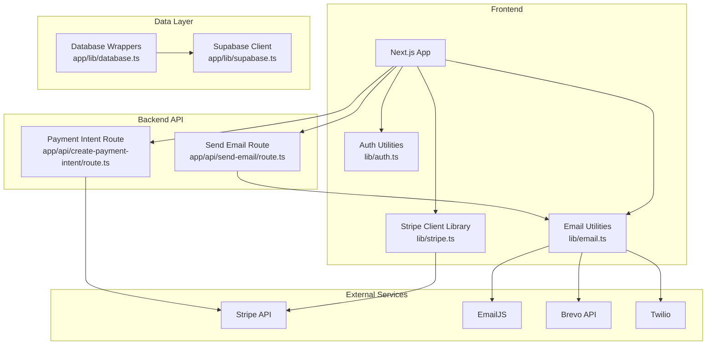
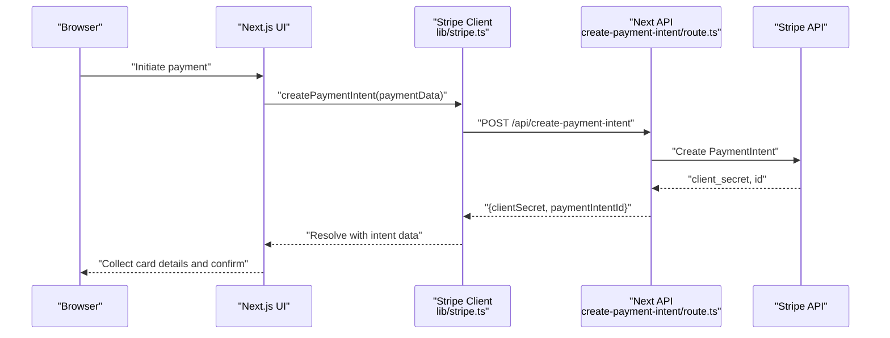
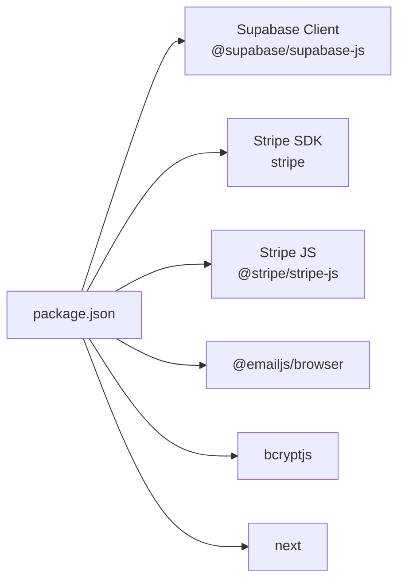

# Troubleshooting and FAQ

<cite>
**Referenced Files in This Document**
- [database.ts](file://app/lib/database.ts)
- [supabase.ts](file://app/lib/supabase.ts)
- [auth.ts](file://lib/auth.ts)
- [stripe.ts](file://lib/stripe.ts)
- [create-payment-intent/route.ts](file://app/api/create-payment-intent/route.ts)
- [send-email/route.ts](file://app/api/send-email/route.ts)
- [email.ts](file://lib/email.ts)
- [gmail-service.ts](file://lib/gmail-service.ts)
- [email-simple.ts](file://lib/email-simple.ts)
- [bookings-storage.ts](file://lib/bookings-storage.ts)
- [sms.ts](file://lib/sms.ts)
- [notifications.py](file://notifications.py)
- [package.json](file://package.json)
- [next.config.ts](file://next.config.ts)
</cite>

## Table of Contents
1. [Introduction](#introduction)
2. [Project Structure](#project-structure)
3. [Core Components](#core-components)
4. [Architecture Overview](#architecture-overview)
5. [Detailed Component Analysis](#detailed-component-analysis)
6. [Dependency Analysis](#dependency-analysis)
7. [Performance Considerations](#performance-considerations)
8. [Troubleshooting Guide](#troubleshooting-guide)
9. [FAQ](#faq)
10. [Conclusion](#conclusion)
11. [Appendices](#appendices)

## Introduction
This document provides comprehensive troubleshooting and frequently asked questions for the Pythonhostel system. It focuses on diagnosing and resolving issues related to database connectivity, authentication, payment processing, and email delivery. It also includes step-by-step debugging procedures, error interpretation guides, resolution strategies, diagnostic tools, logging strategies, maintenance procedures, monitoring recommendations, and preventive measures.

## Project Structure
The system is a Next.js application with a frontend and backend API layer. Data persistence relies on Supabase, while payment processing integrates with Stripe. Email delivery is supported via multiple channels (EmailJS, Gmail SMTP simulation, Brevo API), and authentication utilities provide hashing, token generation, and input sanitization.

**Diagram sources**
- [supabase.ts:1-6](file://app/lib/supabase.ts#L1-L6)
- [database.ts:1-433](file://app/lib/database.ts#L1-L433)
- [stripe.ts:1-112](file://lib/stripe.ts#L1-L112)
- [create-payment-intent/route.ts:1-33](file://app/api/create-payment-intent/route.ts#L1-L33)
- [send-email/route.ts:1-42](file://app/api/send-email/route.ts#L1-L42)
- [email.ts:1-75](file://lib/email.ts#L1-L75)
- [gmail-service.ts:1-117](file://lib/gmail-service.ts#L1-L117)
- [email-simple.ts:1-59](file://lib/email-simple.ts#L1-L59)
- [notifications.py:1-53](file://notifications.py#L1-L53)

**Section sources**
- [package.json:1-33](file://package.json#L1-L33)
- [next.config.ts:1-8](file://next.config.ts#L1-L8)

## Core Components
- Database layer: Supabase client initialization and typed database wrappers for users, rooms, bookings, payments, availability, and feedback.
- Authentication utilities: Password hashing, verification, token generation/verification, email/password validation, and input sanitization.
- Payment processing: Frontend Stripe integration and backend API for creating payment intents.
- Email delivery: Multiple providers and fallbacks (EmailJS, Gmail SMTP simulation, Brevo API).
- SMS delivery: Twilio integration and TextMagic alternative.
- Local storage helpers: In-memory booking records for development/demo scenarios.

**Section sources**
- [supabase.ts:1-6](file://app/lib/supabase.ts#L1-L6)
- [database.ts:1-433](file://app/lib/database.ts#L1-L433)
- [auth.ts:1-57](file://lib/auth.ts#L1-L57)
- [stripe.ts:1-112](file://lib/stripe.ts#L1-L112)
- [create-payment-intent/route.ts:1-33](file://app/api/create-payment-intent/route.ts#L1-L33)
- [email.ts:1-75](file://lib/email.ts#L1-L75)
- [gmail-service.ts:1-117](file://lib/gmail-service.ts#L1-L117)
- [email-simple.ts:1-59](file://lib/email-simple.ts#L1-L59)
- [sms.ts:1-64](file://lib/sms.ts#L1-L64)
- [bookings-storage.ts:1-191](file://lib/bookings-storage.ts#L1-L191)

## Architecture Overview
The system follows a layered architecture:
- Frontend Next.js app interacts with Stripe client-side and calls backend API endpoints.
- Backend API endpoints integrate with external services (Stripe, EmailJS/Brevo/Twilio).
- Data access is centralized through Supabase wrappers that encapsulate queries and RPC calls.

**Diagram sources**
- [stripe.ts:17-37](file://lib/stripe.ts#L17-L37)
- [create-payment-intent/route.ts:7-32](file://app/api/create-payment-intent/route.ts#L7-L32)

## Detailed Component Analysis

### Database Connectivity
Common issues:
- Supabase client initialization failure (invalid URL or anon key).
- Network errors or CORS misconfiguration.
- Row-level security policies blocking queries.
- RPC function errors (e.g., availability checks).

Debugging steps:
1. Verify Supabase URL and keys in the client initializer.
2. Confirm network access and firewall rules.
3. Check RLS policies and test queries in the Supabase SQL editor.
4. Validate RPC function existence and permissions.

Resolution strategies:
- Replace placeholder credentials with valid ones.
- Temporarily disable RLS for diagnostics if appropriate.
- Ensure database schema matches expected types and relationships.

**Section sources**
- [supabase.ts:1-6](file://app/lib/supabase.ts#L1-L6)
- [database.ts:76-89](file://app/lib/database.ts#L76-L89)

### Authentication Failures
Common issues:
- Incorrect password hashing/verification.
- Invalid/expired tokens.
- Weak password or invalid email format.
- Input injection attempts not sanitized.

Debugging steps:
1. Log inputs before hashing and after verification.
2. Inspect token payload and expiration.
3. Validate email/password against regex rules.
4. Sanitize inputs and check for script tag removal.

Resolution strategies:
- Use bcrypt consistently for hashing and comparison.
- Implement secure token generation and strict expiration checks.
- Enforce strong password and email validation rules.
- Apply input sanitization at the boundary.

**Section sources**
- [auth.ts:4-57](file://lib/auth.ts#L4-L57)

### Payment Processing Errors
Common issues:
- Stripe API key misconfiguration.
- Payment intent creation failures.
- Frontend fetch errors or malformed requests.
- Currency/amount formatting issues.

Debugging steps:
1. Confirm Stripe secret/public keys are set.
2. Inspect API response status and error messages.
3. Validate amount formatting (cents conversion).
4. Check metadata inclusion and shape.

Resolution strategies:
- Replace placeholder keys with live/test keys.
- Normalize amounts and currencies before sending to Stripe.
- Add robust error handling and user-friendly messages.

**Section sources**
- [stripe.ts:4-112](file://lib/stripe.ts#L4-L112)
- [create-payment-intent/route.ts:5-32](file://app/api/create-payment-intent/route.ts#L5-L32)

### Email Delivery Problems
Common issues:
- EmailJS/Brevo/Twilio credentials missing or invalid.
- API rate limits or throttling.
- Misconfigured templates or missing required fields.
- Frontend-only simulations not reaching recipients.

Debugging steps:
1. Verify service-specific credentials and template IDs.
2. Check API responses and logs for detailed errors.
3. Ensure required fields are present in the request body.
4. Test with a minimal payload and known-good recipient.

Resolution strategies:
- Configure real credentials and enable verified senders.
- Implement retry logic and exponential backoff.
- Use sandbox/test mode during development.
- Prefer backend delivery for reliability and security.

**Section sources**
- [email.ts:11-53](file://lib/email.ts#L11-L53)
- [gmail-service.ts:9-69](file://lib/gmail-service.ts#L9-L69)
- [email-simple.ts:4-42](file://lib/email-simple.ts#L4-L42)
- [send-email/route.ts:4-41](file://app/api/send-email/route.ts#L4-L41)
- [notifications.py:4-50](file://notifications.py#L4-L50)

### SMS Delivery Issues
Common issues:
- Twilio credentials missing or invalid.
- Phone number formatting errors.
- Account limits or messaging restrictions.

Debugging steps:
1. Validate Twilio SID, auth token, and sender number.
2. Ensure phone numbers are E.164 formatted.
3. Check carrier support and international messaging rules.

Resolution strategies:
- Use verified numbers and test accounts.
- Implement fallback providers (e.g., TextMagic).
- Log detailed error messages for triage.

**Section sources**
- [sms.ts:9-64](file://lib/sms.ts#L9-L64)

## Dependency Analysis
Key runtime dependencies include Supabase client, Stripe SDK, EmailJS, and bcrypt. Build-time dependencies include TypeScript and Tailwind PostCSS plugins. External integrations include Stripe, EmailJS, Brevo, Twilio, and Gmail SMTP.

**Diagram sources**
- [package.json:11-31](file://package.json#L11-L31)

**Section sources**
- [package.json:1-33](file://package.json#L1-L33)

## Performance Considerations
- Database queries: Use selective field projections and indexes on frequently filtered columns (e.g., availability, dates).
- RPC calls: Cache availability checks and avoid repeated calls for the same period.
- Payment intents: Minimize round trips and batch metadata updates.
- Email/SMS: Queue asynchronous tasks and implement retries with backoff.
- Logging: Centralize logs and avoid verbose console statements in production.

[No sources needed since this section provides general guidance]

## Troubleshooting Guide

### Database Connectivity
Symptoms:
- Queries fail with connection errors.
- RLS prevents data retrieval.

Steps:
1. Validate Supabase URL and anon key.
2. Test connectivity from the server.
3. Review RLS policies and adjust temporarily for testing.
4. Verify RPC functions exist and are executable.

Resolution:
- Correct credentials and network configuration.
- Align schema with expected types.
- Re-enable and audit RLS policies.

**Section sources**
- [supabase.ts:1-6](file://app/lib/supabase.ts#L1-L6)
- [database.ts:76-89](file://app/lib/database.ts#L76-L89)

### Authentication Failures
Symptoms:
- Login fails despite correct credentials.
- Token verification returns null.

Steps:
1. Confirm bcrypt rounds and compare logic.
2. Check token expiration and payload integrity.
3. Validate email/password formats.
4. Sanitize inputs and log raw values.

Resolution:
- Ensure consistent hashing/verification.
- Renew tokens and enforce expiration.
- Enforce validation rules and sanitization.

**Section sources**
- [auth.ts:4-57](file://lib/auth.ts#L4-L57)

### Payment Processing Errors
Symptoms:
- Payment intent creation returns 500.
- Frontend throws fetch errors.

Steps:
1. Verify Stripe secret/public keys.
2. Inspect request payload (amount, currency, metadata).
3. Check Stripe dashboard for webhook events.
4. Validate amount formatting and rounding.

Resolution:
- Replace placeholders with valid keys.
- Normalize amounts and currencies.
- Add structured error responses.

**Section sources**
- [stripe.ts:17-37](file://lib/stripe.ts#L17-L37)
- [create-payment-intent/route.ts:7-32](file://app/api/create-payment-intent/route.ts#L7-L32)

### Email Delivery Problems
Symptoms:
- Emails not received or API errors.
- Frontend simulation does not send.

Steps:
1. Check service credentials and template IDs.
2. Validate required fields in the API request.
3. Review service logs and rate limits.
4. Test with a simple payload.

Resolution:
- Configure real credentials and verified senders.
- Implement backend email delivery.
- Add retry logic and monitoring.

**Section sources**
- [email.ts:11-53](file://lib/email.ts#L11-L53)
- [gmail-service.ts:9-69](file://lib/gmail-service.ts#L9-L69)
- [email-simple.ts:4-42](file://lib/email-simple.ts#L4-L42)
- [send-email/route.ts:4-41](file://app/api/send-email/route.ts#L4-L41)
- [notifications.py:4-50](file://notifications.py#L4-L50)

### SMS Delivery Issues
Symptoms:
- SMS not delivered or API errors.

Steps:
1. Verify Twilio credentials and sender number.
2. Ensure phone numbers are properly formatted.
3. Check carrier and region support.
4. Test with a known-good number.

Resolution:
- Use verified numbers and test accounts.
- Implement fallback providers.
- Log detailed errors for diagnosis.

**Section sources**
- [sms.ts:9-64](file://lib/sms.ts#L9-L64)

### Diagnostic Tools and Logging Strategies
- Frontend:
  - Browser DevTools Network tab for API calls.
  - Console logging for Stripe and email flows.
- Backend:
  - Next.js server logs for API responses and errors.
  - Stripe dashboard webhooks and logs.
  - Email provider dashboards (EmailJS/Brevo/Twilio).
- Database:
  - Supabase SQL editor and logs.
  - RLS policy testing and audit.

**Section sources**
- [create-payment-intent/route.ts:25-31](file://app/api/create-payment-intent/route.ts#L25-L31)
- [send-email/route.ts:34-40](file://app/api/send-email/route.ts#L34-L40)

### Maintenance Procedures
- Regularly rotate secrets and keys.
- Monitor quotas and adjust limits.
- Keep dependencies updated and patched.
- Back up database schemas and test data.

**Section sources**
- [package.json:11-31](file://package.json#L11-L31)

### System Monitoring Recommendations
- Set up alerts for payment failures and email/SMS delivery drops.
- Track database query latency and RLS policy violations.
- Monitor Stripe webhooks and reconciliation.
- Observe frontend error boundaries and Sentry-like reporting.

**Section sources**
- [stripe.ts:17-37](file://lib/stripe.ts#L17-L37)
- [email.ts:11-53](file://lib/email.ts#L11-L53)

### Preventive Measures
- Enforce strong validation and sanitization.
- Use HTTPS and secure cookies for sessions.
- Implement circuit breakers for external services.
- Automate health checks and readiness probes.

**Section sources**
- [auth.ts:38-57](file://lib/auth.ts#L38-L57)
- [email-simple.ts:4-42](file://lib/email-simple.ts#L4-L42)

## FAQ

### Booking Process
Q: How do I check room availability?
A: Use the availability check wrapper that calls the database RPC. Ensure check-in/out dates are valid and in ISO string format.

Q: Why can’t I see my bookings?
A: Verify the current user session and ensure the frontend is passing the correct user ID to the backend.

Q: How are prices calculated?
A: Prices are computed based on room nightly rate multiplied by the number of nights between check-in and check-out.

**Section sources**
- [database.ts:76-119](file://app/lib/database.ts#L76-L119)

### Payment Issues
Q: Why does payment creation fail?
A: Common causes include invalid keys, incorrect amount/currency, or malformed metadata. Check the API response and Stripe logs.

Q: How do I confirm a payment?
A: Use the frontend Stripe client to confirm the PaymentIntent using the client secret returned by the backend.

Q: Can I test payments without real money?
A: Yes, use Stripe’s test cards and keys. Ensure you are in test mode.

**Section sources**
- [stripe.ts:17-37](file://lib/stripe.ts#L17-L37)
- [create-payment-intent/route.ts:7-32](file://app/api/create-payment-intent/route.ts#L7-L32)

### Account Management
Q: How do I reset my password?
A: Use the password reset utilities. For EmailJS/Brevo, ensure credentials are configured. For Gmail, use the simulation to prepare an email.

Q: Is my password secure?
A: Passwords are hashed with bcrypt. Ensure you meet the minimum length and character requirements.

Q: How do I verify my email?
A: Use the welcome email utility to send a welcome message. Configure a real provider for production.

**Section sources**
- [auth.ts:4-12](file://lib/auth.ts#L4-L12)
- [email.ts:55-74](file://lib/email.ts#L55-L74)
- [gmail-service.ts:9-69](file://lib/gmail-service.ts#L9-L69)

### Email Delivery
Q: Why didn’t I receive a confirmation email?
A: Check the API response and service logs. Ensure required fields are present and credentials are valid.

Q: Can I use Gmail SMTP?
A: The library simulates Gmail SMTP. For production, implement a backend email service with nodemailer.

Q: What about Brevo?
A: The Python script demonstrates Brevo API usage. Configure credentials and verified sender.

**Section sources**
- [send-email/route.ts:4-41](file://app/api/send-email/route.ts#L4-L41)
- [email.ts:11-53](file://lib/email.ts#L11-L53)
- [gmail-service.ts:9-69](file://lib/gmail-service.ts#L9-L69)
- [notifications.py:4-50](file://notifications.py#L4-L50)

### SMS Delivery
Q: Why isn’t the password reset SMS arriving?
A: Verify Twilio credentials, phone number formatting, and account limits. Try the TextMagic alternative.

Q: Can I send SMS without a backend?
A: The frontend simulation logs and prepares messages. Use a backend service for reliable delivery.

**Section sources**
- [sms.ts:9-64](file://lib/sms.ts#L9-L64)

### System Limitations
Q: Are there rate limits?
A: External services impose rate limits. Implement retries and backoff. Monitor provider dashboards.

Q: What browsers are supported?
A: The app targets modern browsers. Test across devices and versions.

Q: Can I scale horizontally?
A: Yes, but ensure shared state and external service configurations are consistent across instances.

**Section sources**
- [package.json:11-31](file://package.json#L11-L31)

## Conclusion
This guide consolidates actionable troubleshooting procedures, error interpretation, and preventive measures for the Pythonhostel system. By following the outlined steps and leveraging the recommended diagnostic tools, most issues related to database connectivity, authentication, payment processing, and email delivery can be quickly identified and resolved.

[No sources needed since this section summarizes without analyzing specific files]

## Appendices

### Error Message Interpretation
- Database errors: Look for RLS-related messages or RPC function errors.
- Authentication errors: Check token expiration and bcrypt mismatch.
- Payment errors: Inspect Stripe API error codes and HTTP status.
- Email/SMS errors: Review provider-specific error codes and rate limit messages.

**Section sources**
- [database.ts:76-89](file://app/lib/database.ts#L76-L89)
- [auth.ts:25-35](file://lib/auth.ts#L25-L35)
- [create-payment-intent/route.ts:25-31](file://app/api/create-payment-intent/route.ts#L25-L31)
- [send-email/route.ts:26-33](file://app/api/send-email/route.ts#L26-L33)

### Step-by-Step Debugging Procedures
- Database: Initialize client, test RPC, verify RLS.
- Auth: Hash/verify passwords, validate tokens, sanitize inputs.
- Payments: Validate keys, normalize amounts, inspect API responses.
- Emails: Configure credentials, test endpoints, monitor provider logs.
- SMS: Verify credentials and numbers, test alternatives.

**Section sources**
- [supabase.ts:1-6](file://app/lib/supabase.ts#L1-L6)
- [auth.ts:4-57](file://lib/auth.ts#L4-L57)
- [stripe.ts:17-37](file://lib/stripe.ts#L17-L37)
- [email.ts:11-53](file://lib/email.ts#L11-L53)
- [sms.ts:9-64](file://lib/sms.ts#L9-L64)