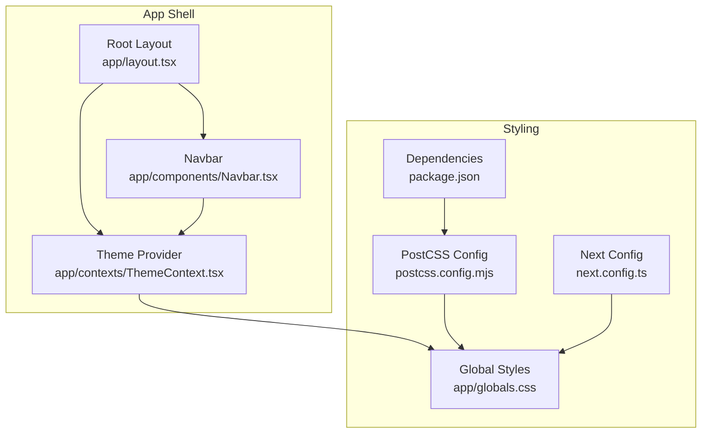
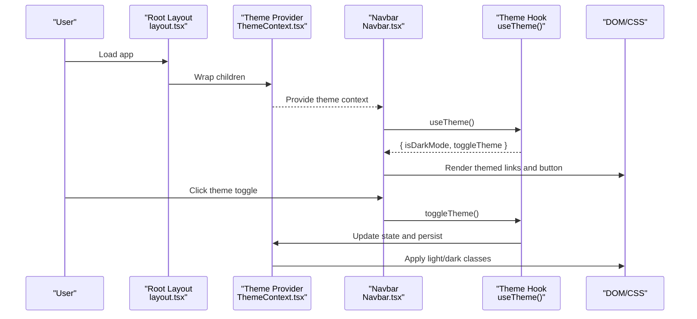
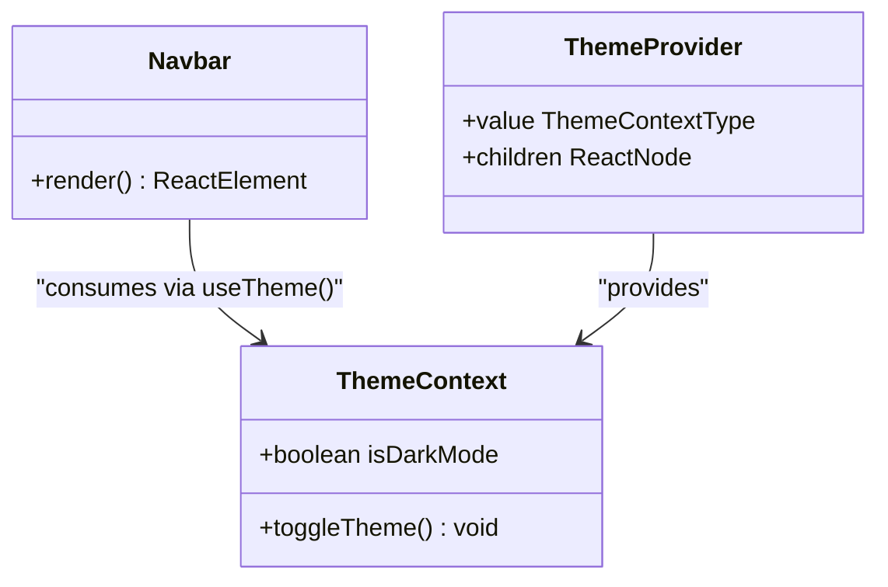
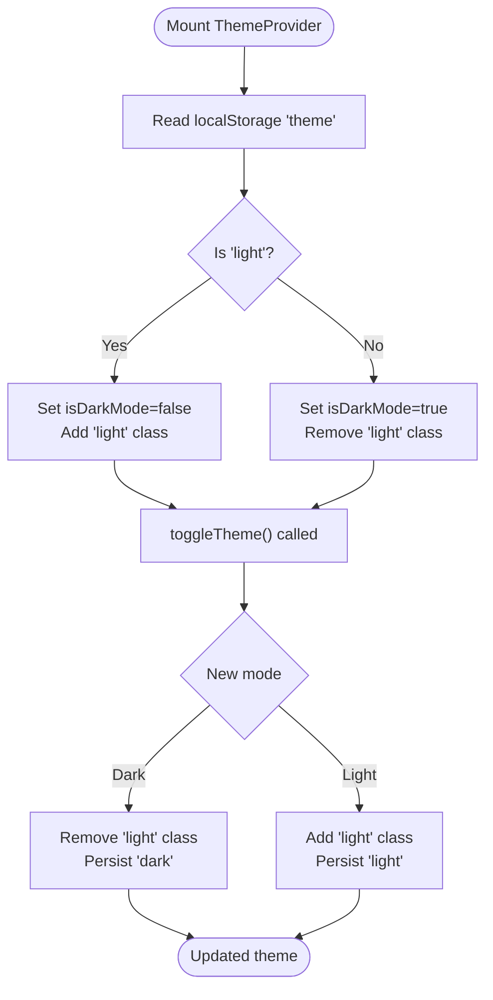
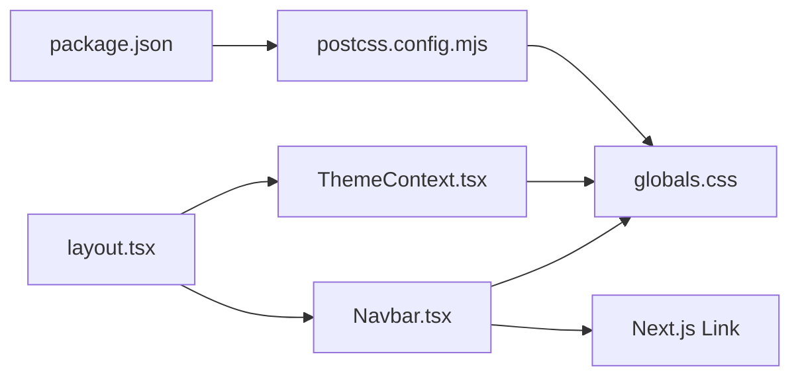

# Navigation Components

<cite>
**Referenced Files in This Document**
- [Navbar.tsx](file://app/components/Navbar.tsx)
- [ThemeContext.tsx](file://app/contexts/ThemeContext.tsx)
- [layout.tsx](file://app/layout.tsx)
- [globals.css](file://app/globals.css)
- [postcss.config.mjs](file://postcss.config.mjs)
- [next.config.ts](file://next.config.ts)
- [package.json](file://package.json)
</cite>

## Table of Contents
1. [Introduction](#introduction)
2. [Project Structure](#project-structure)
3. [Core Components](#core-components)
4. [Architecture Overview](#architecture-overview)
5. [Detailed Component Analysis](#detailed-component-analysis)
6. [Dependency Analysis](#dependency-analysis)
7. [Performance Considerations](#performance-considerations)
8. [Troubleshooting Guide](#troubleshooting-guide)
9. [Conclusion](#conclusion)

## Introduction
This document explains the navigation component system centered around the Navbar component. It covers how the Navbar integrates with ThemeContext for theme-aware styling, uses Next.js Link components for client-side navigation, and maintains responsive design patterns. It also documents the component’s props, styling customization options, accessibility features, active state management, and integration with the overall application layout. Finally, it addresses responsive breakpoints, accessibility compliance, and performance considerations for navigation components.

## Project Structure
The navigation system is implemented at the application level and shared across pages via the root layout. The Navbar is placed at the top of the page and remains fixed during scroll. ThemeContext provides global theme state and persistence, while Tailwind CSS and PostCSS handle responsive utilities and theme tokens.

**Diagram sources**
- [layout.tsx:11-27](file://app/layout.tsx#L11-L27)
- [Navbar.tsx:1-35](file://app/components/Navbar.tsx#L1-L35)
- [ThemeContext.tsx:11-48](file://app/contexts/ThemeContext.tsx#L11-L48)
- [globals.css:1-239](file://app/globals.css#L1-L239)
- [postcss.config.mjs:1-8](file://postcss.config.mjs#L1-L8)
- [next.config.ts:1-8](file://next.config.ts#L1-L8)
- [package.json:1-33](file://package.json#L1-L33)

**Section sources**
- [layout.tsx:11-27](file://app/layout.tsx#L11-L27)
- [Navbar.tsx:1-35](file://app/components/Navbar.tsx#L1-L35)
- [ThemeContext.tsx:11-48](file://app/contexts/ThemeContext.tsx#L11-L48)
- [globals.css:1-239](file://app/globals.css#L1-L239)
- [postcss.config.mjs:1-8](file://postcss.config.mjs#L1-L8)
- [next.config.ts:1-8](file://next.config.ts#L1-L8)
- [package.json:1-33](file://package.json#L1-L33)

## Core Components
- Navbar: Fixed top navigation bar with branding, links, and theme toggle.
- ThemeContext: Provides theme state and persistence, and exposes a toggle function consumed by Navbar.
- Root Layout: Wraps the app with ThemeProvider and renders Navbar and page content.

Key capabilities:
- Client-side navigation via Next.js Link.
- Theme-aware styling using CSS variables and Tailwind utilities.
- Responsive container sizing and spacing.
- Accessibility-friendly focus styles and semantic markup.

**Section sources**
- [Navbar.tsx:5-35](file://app/components/Navbar.tsx#L5-L35)
- [ThemeContext.tsx:4-7](file://app/contexts/ThemeContext.tsx#L4-L7)
- [layout.tsx:11-27](file://app/layout.tsx#L11-L27)

## Architecture Overview
The Navbar consumes theme state from ThemeContext and renders themed content. The layout composes the provider and the navbar, ensuring consistent theming and navigation across pages.

**Diagram sources**
- [layout.tsx:11-27](file://app/layout.tsx#L11-L27)
- [ThemeContext.tsx:11-48](file://app/contexts/ThemeContext.tsx#L11-L48)
- [Navbar.tsx:5-35](file://app/components/Navbar.tsx#L5-L35)

## Detailed Component Analysis

### Navbar Component
Responsibilities:
- Renders branding and primary navigation links.
- Integrates a theme toggle button that switches between light and dark modes.
- Uses Next.js Link for client-side navigation.
- Applies responsive container widths and spacing.

Props and behavior:
- No explicit props are accepted by Navbar; it reads theme state via useTheme().
- Links are Next.js Link components with Tailwind utility classes for typography and hover states.
- The theme toggle button toggles the theme and updates document classes for CSS to react to.

Styling and customization:
- Uses Tailwind utility classes for layout and colors.
- Leverages CSS variables from globals.css for theme-aware tokens (e.g., foreground, accent, card background).
- Container width is constrained via max-w-7xl; horizontal padding via px-6; vertical height via h-16.

Accessibility:
- Uses semantic nav element.
- Focus visibility is handled globally via :focus-visible in globals.css.
- Button has a descriptive title attribute reflecting current mode.

Responsive behavior:
- The navbar container centers content and distributes space evenly.
- The max-w-7xl constraint ensures content does not exceed a readable width on large screens.
- On smaller screens, the inline gap-6 spacing and flex distribution maintain usability without media queries.

Active state management:
- Current implementation does not track active link state. To add active state, integrate Next.js router and compare current path with link hrefs.

Integration with layout:
- Navbar is rendered inside RootLayout, which also wraps children in ThemeProvider and reserves space at the top for the navbar.

**Section sources**
- [Navbar.tsx:5-35](file://app/components/Navbar.tsx#L5-L35)
- [layout.tsx:11-27](file://app/layout.tsx#L11-L27)
- [globals.css:190-239](file://app/globals.css#L190-L239)

#### Navbar Class Model

**Diagram sources**
- [Navbar.tsx:5-35](file://app/components/Navbar.tsx#L5-L35)
- [ThemeContext.tsx:4-7](file://app/contexts/ThemeContext.tsx#L4-L7)
- [ThemeContext.tsx:11-48](file://app/contexts/ThemeContext.tsx#L11-L48)

### ThemeContext
Responsibilities:
- Manages theme state (light/dark) with local persistence.
- Provides a toggle function to switch themes.
- Applies document classes to drive CSS theme variants.

Implementation highlights:
- Initializes theme from localStorage or prefers-color-scheme.
- Updates documentElement classes to switch between light and dark modes.
- Exposes a hook that returns safe defaults outside the provider.

Integration with Navbar:
- Navbar calls toggleTheme to flip modes and reflects current mode in the button label/title.

**Section sources**
- [ThemeContext.tsx:11-48](file://app/contexts/ThemeContext.tsx#L11-L48)
- [ThemeContext.tsx:51-58](file://app/contexts/ThemeContext.tsx#L51-L58)

#### ThemeContext Flow

**Diagram sources**
- [ThemeContext.tsx:15-38](file://app/contexts/ThemeContext.tsx#L15-L38)

### Styling and Theming System
- CSS variables define theme tokens in globals.css, including colors, backgrounds, borders, and typography.
- Two theme variants are supported: default (dark) and light mode controlled by html classes.
- Tailwind utilities consume these variables for consistent theming across components.
- PostCSS and Tailwind are configured via postcss.config.mjs and package.json dependencies.

Responsive design patterns:
- Container widths use max-w-7xl for large screens.
- Flexbox distributes branding and actions evenly.
- No custom media queries are used in Navbar; responsiveness relies on Tailwind utilities and container constraints.

Accessibility features:
- :focus-visible ensures visible focus for keyboard navigation.
- Semantic nav element and descriptive button titles improve screen reader compatibility.

**Section sources**
- [globals.css:1-239](file://app/globals.css#L1-L239)
- [postcss.config.mjs:1-8](file://postcss.config.mjs#L1-L8)
- [package.json:22-31](file://package.json#L22-L31)

## Dependency Analysis
The navigation stack depends on:
- Next.js Link for client-side navigation.
- ThemeContext for theme state and persistence.
- Tailwind CSS utilities for responsive layout and theming.
- PostCSS pipeline for CSS processing.

**Diagram sources**
- [package.json:11-31](file://package.json#L11-L31)
- [postcss.config.mjs:1-8](file://postcss.config.mjs#L1-L8)
- [globals.css:1-239](file://app/globals.css#L1-L239)
- [layout.tsx:11-27](file://app/layout.tsx#L11-L27)
- [ThemeContext.tsx:11-48](file://app/contexts/ThemeContext.tsx#L11-L48)
- [Navbar.tsx:1-35](file://app/components/Navbar.tsx#L1-L35)

**Section sources**
- [package.json:11-31](file://package.json#L11-L31)
- [postcss.config.mjs:1-8](file://postcss.config.mjs#L1-L8)
- [globals.css:1-239](file://app/globals.css#L1-L239)
- [layout.tsx:11-27](file://app/layout.tsx#L11-L27)
- [ThemeContext.tsx:11-48](file://app/contexts/ThemeContext.tsx#L11-L48)
- [Navbar.tsx:1-35](file://app/components/Navbar.tsx#L1-L35)

## Performance Considerations
- Client-side navigation via Next.js Link avoids full page reloads, improving perceived performance.
- ThemeContext persists theme selection to localStorage, reducing re-computation on mount.
- Navbar uses minimal state and pure rendering; keep it lightweight to avoid layout thrashing.
- Prefer CSS-driven animations and transitions (already present in globals.css) for smooth interactions.
- Avoid unnecessary re-renders by keeping Navbar outside heavy component trees when possible.

## Troubleshooting Guide
Common issues and resolutions:
- Theme not applying on first render:
  - Ensure ThemeProvider wraps the app and that mounted state prevents hydration mismatches.
  - Verify documentElement classes reflect the intended theme after toggle.
- Links not styled consistently:
  - Confirm Tailwind utilities are applied and globals.css is included.
- Active link highlighting missing:
  - Integrate Next.js router to detect current path and conditionally apply active classes.
- Accessibility focus issues:
  - Ensure :focus-visible is effective and buttons/links receive visible focus.

**Section sources**
- [ThemeContext.tsx:40-42](file://app/contexts/ThemeContext.tsx#L40-L42)
- [globals.css:234-239](file://app/globals.css#L234-L239)
- [Navbar.tsx:16-30](file://app/components/Navbar.tsx#L16-L30)

## Conclusion
The Navbar component provides a concise, theme-aware navigation layer integrated with ThemeContext and Next.js Link. Its design emphasizes simplicity, responsiveness, and accessibility, leveraging Tailwind utilities and CSS variables for consistent theming. Extending the Navbar to support active state and mobile-specific behaviors can further enhance UX without sacrificing performance or maintainability.