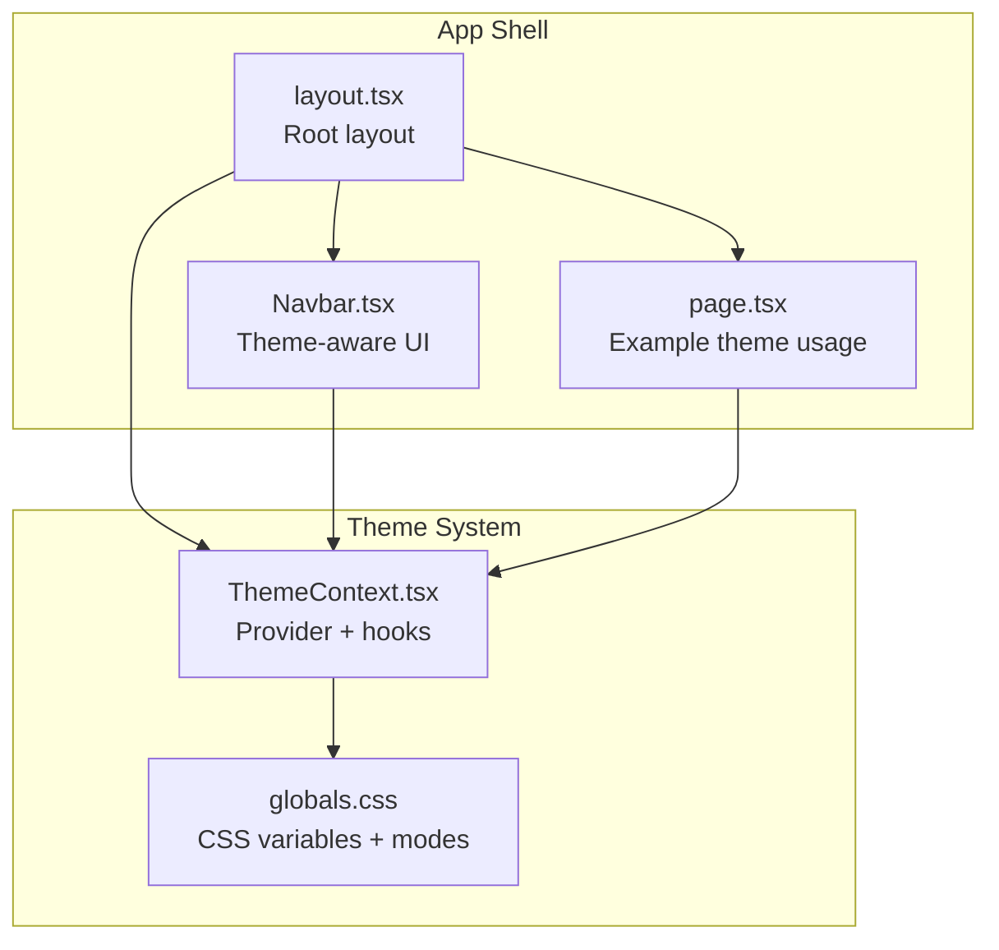
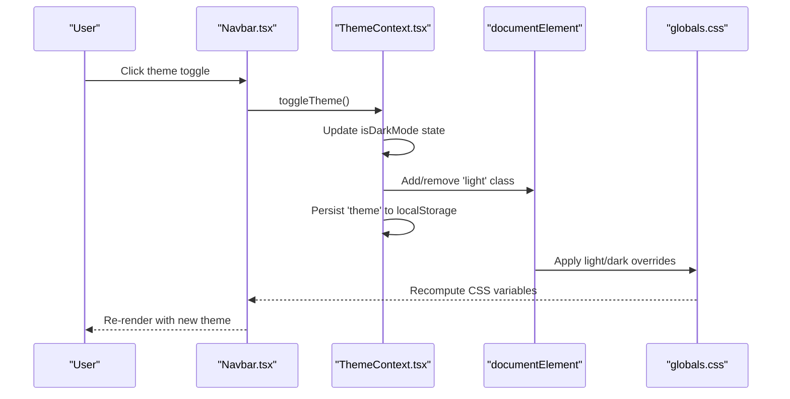
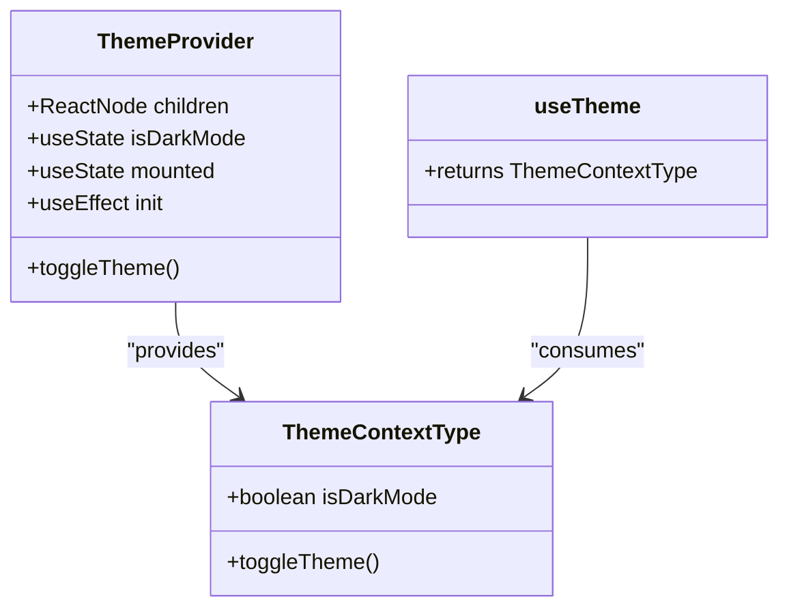
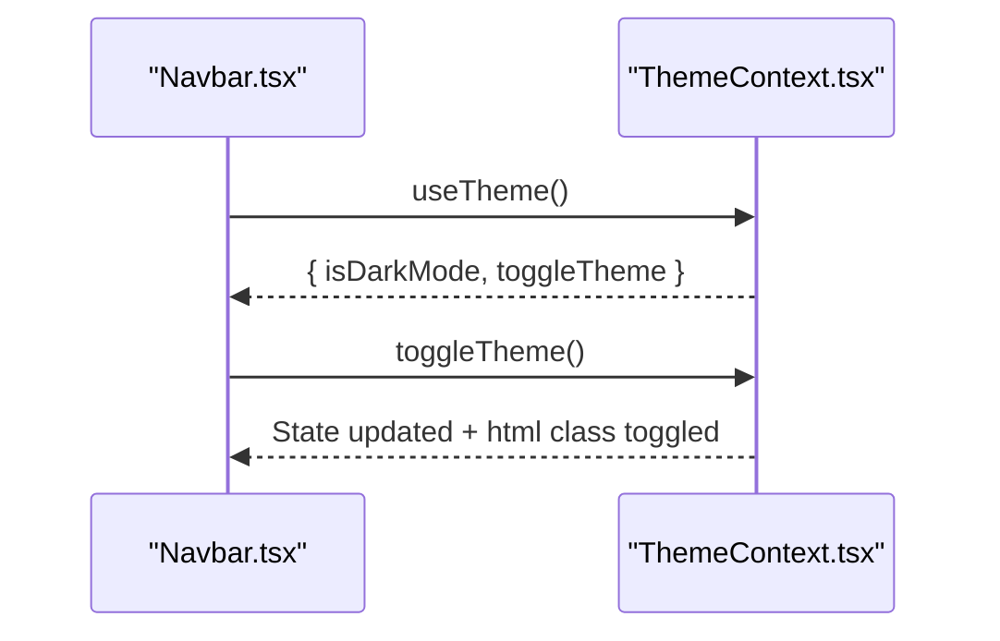
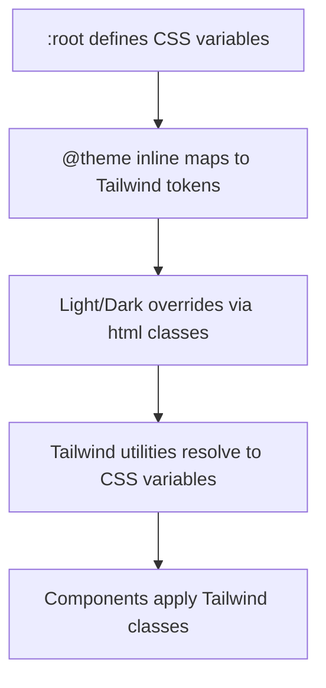
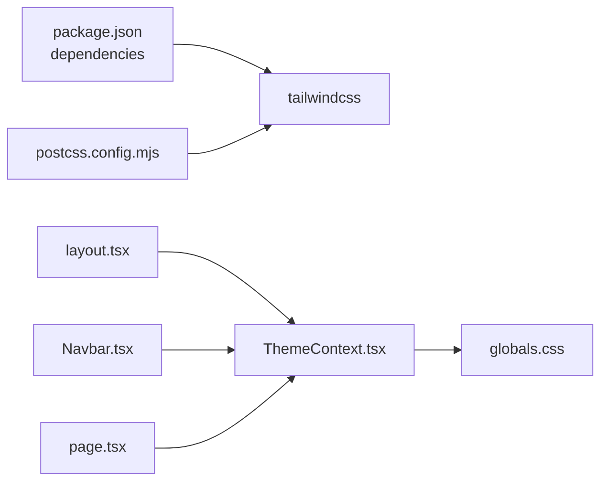

# Theme System

<cite>
**Referenced Files in This Document**
- [ThemeContext.tsx](file://app/contexts/ThemeContext.tsx)
- [layout.tsx](file://app/layout.tsx)
- [globals.css](file://app/globals.css)
- [Navbar.tsx](file://app/components/Navbar.tsx)
- [page.tsx](file://app/page.tsx)
- [package.json](file://package.json)
- [postcss.config.mjs](file://postcss.config.mjs)
- [next.config.ts](file://next.config.ts)
</cite>

## Table of Contents
1. [Introduction](#introduction)
2. [Project Structure](#project-structure)
3. [Core Components](#core-components)
4. [Architecture Overview](#architecture-overview)
5. [Detailed Component Analysis](#detailed-component-analysis)
6. [Dependency Analysis](#dependency-analysis)
7. [Performance Considerations](#performance-considerations)
8. [Troubleshooting Guide](#troubleshooting-guide)
9. [Conclusion](#conclusion)
10. [Appendices](#appendices)

## Introduction
This document explains the theme system implementation for the Next.js application. It covers the ThemeContext provider pattern, dark/light mode state management, theme switching functionality, persistence via localStorage, and CSS variable integration. It also documents how theme-aware components are implemented, how color schemes are defined, and how responsive design and accessibility are addressed. Practical examples demonstrate theme customization, Tailwind CSS usage, and accessibility compliance.

## Project Structure
The theme system spans three primary areas:
- Provider and hooks: ThemeContext.tsx
- Global styles and CSS variables: globals.css
- Application shell and usage sites: layout.tsx, Navbar.tsx, page.tsx

**Diagram sources**
- [layout.tsx:11-27](file://app/layout.tsx#L11-L27)
- [ThemeContext.tsx:11-49](file://app/contexts/ThemeContext.tsx#L11-L49)
- [globals.css:1-239](file://app/globals.css#L1-L239)
- [Navbar.tsx:1-35](file://app/components/Navbar.tsx#L1-L35)
- [page.tsx:1-149](file://app/page.tsx#L1-L149)

**Section sources**
- [layout.tsx:11-27](file://app/layout.tsx#L11-L27)
- [ThemeContext.tsx:11-49](file://app/contexts/ThemeContext.tsx#L11-L49)
- [globals.css:1-239](file://app/globals.css#L1-L239)
- [Navbar.tsx:1-35](file://app/components/Navbar.tsx#L1-L35)
- [page.tsx:1-149](file://app/page.tsx#L1-L149)

## Core Components
- ThemeProvider: Manages theme state, persists selection to localStorage, and applies CSS classes to documentElement for mode switching.
- useTheme: Hook that exposes isDarkMode and toggleTheme, with safe defaults outside the provider.
- globals.css: Defines CSS variables for colors, backgrounds, typography, and shadows; applies light/dark overrides and Tailwind v4 integration.

Key behaviors:
- Initial hydration reads localStorage to restore user preference.
- Toggle updates both state and persistent storage, and toggles a class on html for CSS-driven overrides.
- CSS variables propagate to Tailwind utilities and custom classes.

**Section sources**
- [ThemeContext.tsx:11-49](file://app/contexts/ThemeContext.tsx#L11-L49)
- [ThemeContext.tsx:51-58](file://app/contexts/ThemeContext.tsx#L51-L58)
- [globals.css:1-239](file://app/globals.css#L1-L239)

## Architecture Overview
The theme system follows a classic React Context pattern with a global provider at the root layout and per-component consumption via a custom hook. CSS variables drive theme-aware styling, while Tailwind utilities consume those variables.

**Diagram sources**
- [Navbar.tsx:23-29](file://app/components/Navbar.tsx#L23-L29)
- [ThemeContext.tsx:27-38](file://app/contexts/ThemeContext.tsx#L27-L38)
- [globals.css:39-55](file://app/globals.css#L39-L55)

## Detailed Component Analysis

### ThemeContext Provider and Hooks
- Provider initializes state, checks localStorage on mount, and guards re-rendering until mounted.
- toggleTheme flips the mode, updates the html class, and saves the preference.
- useTheme returns current mode and toggle function, with safe defaults for SSR/error scenarios.

**Diagram sources**
- [ThemeContext.tsx:4-7](file://app/contexts/ThemeContext.tsx#L4-L7)
- [ThemeContext.tsx:11-49](file://app/contexts/ThemeContext.tsx#L11-L49)
- [ThemeContext.tsx:51-58](file://app/contexts/ThemeContext.tsx#L51-L58)

**Section sources**
- [ThemeContext.tsx:11-49](file://app/contexts/ThemeContext.tsx#L11-L49)
- [ThemeContext.tsx:51-58](file://app/contexts/ThemeContext.tsx#L51-L58)

### Theme-Aware Components
- Navbar demonstrates runtime theme switching with a button that calls toggleTheme and displays an emoji based on current mode.
- page.tsx conditionally applies base background classes based on isDarkMode and uses Tailwind utilities that resolve to CSS variables.

**Diagram sources**
- [Navbar.tsx:5-35](file://app/components/Navbar.tsx#L5-L35)
- [ThemeContext.tsx:51-58](file://app/contexts/ThemeContext.tsx#L51-L58)

**Section sources**
- [Navbar.tsx:5-35](file://app/components/Navbar.tsx#L5-L35)
- [page.tsx:7-149](file://app/page.tsx#L7-L149)

### CSS Variable Integration and Color Schemes
- CSS variables define primary/accent colors, backgrounds, foregrounds, borders, and shadows in :root.
- @theme inline maps CSS variables to Tailwind v4 tokens for utility classes.
- Light/dark overrides target html:not(.light) and html.light to switch color schemes.
- Prefers-color-scheme media query provides a baseline for OS preference.
- Tailwind utilities (bg-primary, text-foreground, card, input, btn variants) resolve to CSS variables.

**Diagram sources**
- [globals.css:3-37](file://app/globals.css#L3-L37)
- [globals.css:39-55](file://app/globals.css#L39-L55)
- [globals.css:57-65](file://app/globals.css#L57-L65)

**Section sources**
- [globals.css:1-239](file://app/globals.css#L1-L239)

### Responsive Design and Accessibility
- Responsive typography uses clamp() for fluid headings.
- Focus visibility is defined via :focus-visible to ensure keyboard accessibility.
- Hover states and transitions improve UX without relying on color alone.

**Section sources**
- [globals.css:171-188](file://app/globals.css#L171-L188)
- [globals.css:234-238](file://app/globals.css#L234-L238)

### Persistence and Hydration
- localStorage stores the user’s theme choice under the key "theme".
- On mount, the provider reads this value and sets the initial mode and html class accordingly.
- The provider delays rendering until mounted to prevent hydration mismatches.

**Section sources**
- [ThemeContext.tsx:15-25](file://app/contexts/ThemeContext.tsx#L15-L25)
- [ThemeContext.tsx:40-42](file://app/contexts/ThemeContext.tsx#L40-L42)

### Example: Theme Customization and Tailwind Usage
- page.tsx shows dynamic background classes based on isDarkMode and uses Tailwind utilities that resolve to CSS variables (e.g., text-foreground, bg-primary).
- Navbar applies card, border, and hover utilities that adapt to the current theme.

**Section sources**
- [page.tsx:7-149](file://app/page.tsx#L7-L149)
- [Navbar.tsx:9-35](file://app/components/Navbar.tsx#L9-L35)

## Dependency Analysis
- ThemeContext depends on React Context API and localStorage.
- globals.css depends on Tailwind v4 and PostCSS integration.
- layout.tsx composes ThemeProvider at the root level so all routes inherit the theme.

**Diagram sources**
- [package.json:11-31](file://package.json#L11-L31)
- [postcss.config.mjs:1-8](file://postcss.config.mjs#L1-L8)
- [layout.tsx:11-27](file://app/layout.tsx#L11-L27)
- [ThemeContext.tsx:11-49](file://app/contexts/ThemeContext.tsx#L11-L49)
- [globals.css:1-239](file://app/globals.css#L1-L239)
- [Navbar.tsx:1-35](file://app/components/Navbar.tsx#L1-L35)
- [page.tsx:1-149](file://app/page.tsx#L1-L149)

**Section sources**
- [package.json:11-31](file://package.json#L11-L31)
- [postcss.config.mjs:1-8](file://postcss.config.mjs#L1-L8)
- [layout.tsx:11-27](file://app/layout.tsx#L11-L27)
- [ThemeContext.tsx:11-49](file://app/contexts/ThemeContext.tsx#L11-L49)
- [globals.css:1-239](file://app/globals.css#L1-L239)
- [Navbar.tsx:1-35](file://app/components/Navbar.tsx#L1-L35)
- [page.tsx:1-149](file://app/page.tsx#L1-L149)

## Performance Considerations
- Hydration guard prevents unnecessary renders before mounting.
- CSS variable-based theming avoids expensive re-renders of theme-heavy components.
- Minimal DOM manipulation (only html class toggling) reduces layout thrashing.
- Tailwind utilities resolve to CSS variables, enabling efficient runtime updates.

[No sources needed since this section provides general guidance]

## Troubleshooting Guide
- Theme does not persist across sessions:
  - Verify localStorage key "theme" exists and equals "light" or "dark".
  - Confirm ThemeProvider runs initialization on mount and reads localStorage.
- Theme toggle has no effect:
  - Ensure toggleTheme is called and html class is toggled.
  - Check that CSS overrides target the correct html classes.
- Hydration mismatch warnings:
  - Confirm the provider delays rendering until mounted.
- Tailwind utilities appear unchanged:
  - Ensure @theme inline is present and CSS variables are defined.
  - Confirm Tailwind v4 is configured via PostCSS plugin.

**Section sources**
- [ThemeContext.tsx:15-25](file://app/contexts/ThemeContext.tsx#L15-L25)
- [ThemeContext.tsx:40-42](file://app/contexts/ThemeContext.tsx#L40-L42)
- [globals.css:32-37](file://app/globals.css#L32-L37)
- [postcss.config.mjs:1-8](file://postcss.config.mjs#L1-L8)

## Conclusion
The theme system leverages a lightweight Context provider, CSS variables, and Tailwind v4 to deliver a responsive, accessible, and performant theming solution. It persists user preferences, adapts to OS-level preferences, and enables easy customization through variable overrides and utility classes.

[No sources needed since this section summarizes without analyzing specific files]

## Appendices

### Appendix A: Tailwind v4 Setup
- Tailwind v4 is enabled via the PostCSS plugin configuration.
- @theme inline maps CSS variables to Tailwind tokens for utilities.

**Section sources**
- [postcss.config.mjs:1-8](file://postcss.config.mjs#L1-L8)
- [globals.css:32-37](file://app/globals.css#L32-L37)

### Appendix B: Next.js App Router Integration
- ThemeProvider is rendered at the root layout, ensuring all pages and nested layouts inherit the theme context.
- No special router configuration is required beyond wrapping the app shell.

**Section sources**
- [layout.tsx:11-27](file://app/layout.tsx#L11-L27)