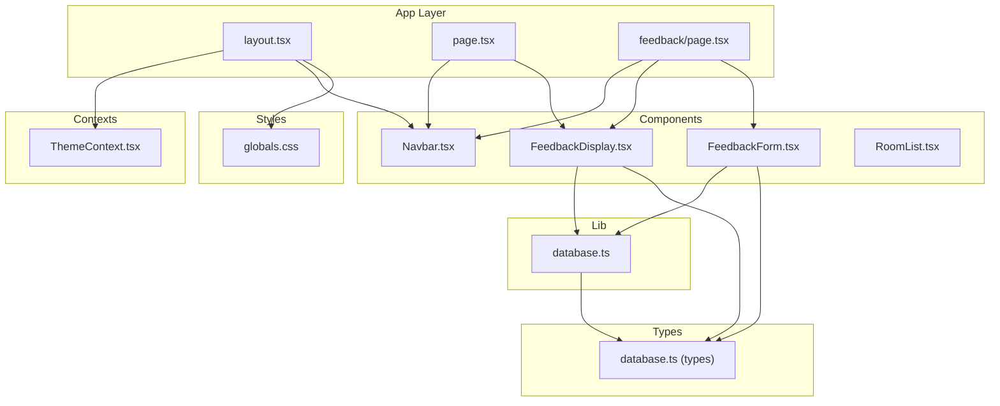
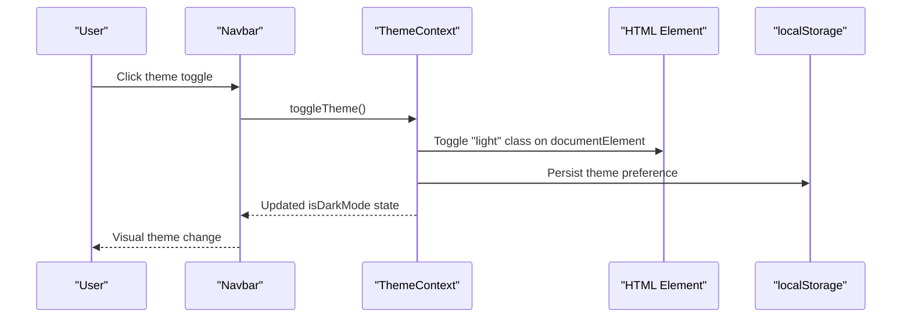
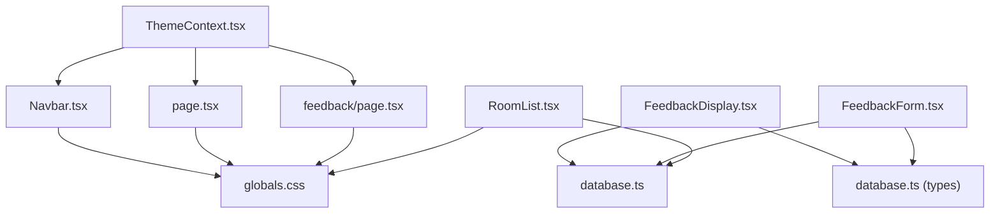

# User Interface Components

<cite>
**Referenced Files in This Document**
- [ThemeContext.tsx](file://app/contexts/ThemeContext.tsx)
- [Navbar.tsx](file://app/components/Navbar.tsx)
- [FeedbackDisplay.tsx](file://app/components/FeedbackDisplay.tsx)
- [FeedbackForm.tsx](file://app/components/FeedbackForm.tsx)
- [layout.tsx](file://app/layout.tsx)
- [globals.css](file://app/globals.css)
- [database.ts](file://app/lib/database.ts)
- [database.ts (types)](file://app/types/database.ts)
- [page.tsx](file://app/page.tsx)
- [feedback/page.tsx](file://app/feedback/page.tsx)
- [RoomList.tsx](file://app/components/RoomList.tsx)
- [next.config.ts](file://next.config.ts)
- [package.json](file://package.json)
</cite>

## Table of Contents
1. [Introduction](#introduction)
2. [Project Structure](#project-structure)
3. [Core Components](#core-components)
4. [Architecture Overview](#architecture-overview)
5. [Detailed Component Analysis](#detailed-component-analysis)
6. [Dependency Analysis](#dependency-analysis)
7. [Performance Considerations](#performance-considerations)
8. [Troubleshooting Guide](#troubleshooting-guide)
9. [Conclusion](#conclusion)
10. [Appendices](#appendices)

## Introduction
This document describes the user interface component library for the application, focusing on:
- Theme system with dark/light mode switching and persistence
- Navigation components with responsive design
- Feedback collection system with display and submission components
- Props, customization options, and integration patterns
- ThemeContext implementation, state management, and responsive design considerations
- Practical usage examples, Tailwind CSS styling, accessibility compliance
- Component composition patterns, reusability strategies, and performance optimization

## Project Structure
The UI components are organized under the app directory with clear separation of concerns:
- app/contexts: Global state providers (ThemeContext)
- app/components: Reusable UI components (Navbar, FeedbackDisplay, FeedbackForm, RoomList)
- app/lib: Data access layer (database operations)
- app/types: TypeScript interfaces for data models
- app/pages: Page-level components (layout, home, feedback)
- app/globals.css: Global styles and theme tokens

**Diagram sources**
- [layout.tsx:11-27](file://app/layout.tsx#L11-L27)
- [page.tsx:1-149](file://app/page.tsx#L1-L149)
- [feedback/page.tsx:1-51](file://app/feedback/page.tsx#L1-L51)
- [ThemeContext.tsx:11-49](file://app/contexts/ThemeContext.tsx#L11-L49)
- [Navbar.tsx:1-35](file://app/components/Navbar.tsx#L1-L35)
- [FeedbackDisplay.tsx:1-155](file://app/components/FeedbackDisplay.tsx#L1-L155)
- [FeedbackForm.tsx:1-138](file://app/components/FeedbackForm.tsx#L1-L138)
- [RoomList.tsx:1-113](file://app/components/RoomList.tsx#L1-L113)
- [database.ts:1-433](file://app/lib/database.ts#L1-L433)
- [database.ts (types):1-146](file://app/types/database.ts#L1-L146)
- [globals.css:1-239](file://app/globals.css#L1-L239)

**Section sources**
- [layout.tsx:11-27](file://app/layout.tsx#L11-L27)
- [globals.css:1-239](file://app/globals.css#L1-L239)

## Core Components
This section covers the primary UI components and their responsibilities.

- ThemeContext: Provides theme state and persistence across sessions
- Navbar: Fixed header with branding, navigation links, and theme toggle
- FeedbackDisplay: Reviews display with summary, optional form trigger, and list rendering
- FeedbackForm: Star rating and comment submission with validation and persistence
- RoomList: Dynamic room listing with availability and booking actions

Key integration points:
- ThemeContext is provided at the root level and consumed by Navbar and pages
- Feedback components depend on Supabase-backed database operations
- Styles leverage CSS custom properties and Tailwind utility classes

**Section sources**
- [ThemeContext.tsx:11-59](file://app/contexts/ThemeContext.tsx#L11-L59)
- [Navbar.tsx:5-35](file://app/components/Navbar.tsx#L5-L35)
- [FeedbackDisplay.tsx:12-155](file://app/components/FeedbackDisplay.tsx#L12-L155)
- [FeedbackForm.tsx:13-138](file://app/components/FeedbackForm.tsx#L13-L138)
- [RoomList.tsx:7-113](file://app/components/RoomList.tsx#L7-L113)

## Architecture Overview
The UI architecture follows a layered approach:
- Provider layer: ThemeContext wraps the application
- Component layer: Presentational components (Navbar, Feedback*) and containers (pages)
- Data layer: Supabase integration via database.ts
- Style layer: CSS custom properties and Tailwind utilities

**Diagram sources**
- [Navbar.tsx:23-29](file://app/components/Navbar.tsx#L23-L29)
- [ThemeContext.tsx:27-38](file://app/contexts/ThemeContext.tsx#L27-L38)

**Section sources**
- [layout.tsx:19-24](file://app/layout.tsx#L19-L24)
- [ThemeContext.tsx:11-49](file://app/contexts/ThemeContext.tsx#L11-L49)

## Detailed Component Analysis

### ThemeContext Implementation
ThemeContext manages theme state with persistence and SSR-safe defaults.

Implementation highlights:
- Client-side only context with "use client" directive
- Initial theme loaded from localStorage with SSR guard
- State toggles between dark and light modes
- Persistence via localStorage and document class manipulation
- Safe fallback when not mounted (SSR scenarios)

Props and behavior:
- isDarkMode: boolean indicating current theme
- toggleTheme(): function to switch themes and persist choice

Integration patterns:
- Wrap the application root with ThemeProvider
- Consume with useTheme() hook in components
- Apply documentElement class for CSS custom property updates

Accessibility and responsiveness:
- Uses aria-ready-safe mounting guard
- No keyboard traps; relies on native button semantics

**Section sources**
- [ThemeContext.tsx:11-59](file://app/contexts/ThemeContext.tsx#L11-L59)

### Navbar Component
Navbar provides fixed-position navigation with theme toggle.

Key features:
- Fixed positioning at top with z-index
- Responsive container with max-width and horizontal padding
- Branding with accent color
- Navigation links with hover states
- Theme toggle button with emoji icons and title attributes
- Uses Tailwind utility classes for spacing and colors

Styling integration:
- Leverages CSS custom properties from globals.css
- Uses text and background color utilities
- Responsive breakpoints via Tailwind grid and spacing utilities

Accessibility considerations:
- Button elements for interactive controls
- Title attributes for icon buttons
- Semantic link elements for navigation

**Section sources**
- [Navbar.tsx:5-35](file://app/components/Navbar.tsx#L5-L35)
- [globals.css:32-55](file://app/globals.css#L32-L55)

### FeedbackDisplay Component
FeedbackDisplay renders reviews with summary, optional form trigger, and list rendering.

Props:
- roomId?: string (optional room filter)
- limit?: number (default 5)
- showForm?: boolean (controls visibility of write review button)

Behavior:
- Loads feedbacks via database.ts getFeedbacks
- Falls back to localStorage when database errors occur
- Sorts by creation date descending
- Renders star ratings and formatted dates
- Conditional rendering of write review button
- Dynamic import of FeedbackForm to avoid circular dependencies

Rendering logic:
- Average rating calculation
- Star rendering with conditional coloring
- Empty state with emoji and message
- Individual feedback cards with comment and rating

**Section sources**
- [FeedbackDisplay.tsx:6-155](file://app/components/FeedbackDisplay.tsx#L6-L155)
- [database.ts:356-381](file://app/lib/database.ts#L356-L381)

### FeedbackForm Component
FeedbackForm handles star rating selection, comment submission, and validation.

Props:
- roomId?: string
- bookingId?: string
- onSubmit?: (feedback) => void
- onCancel?: () => void

State management:
- rating: number (1-5)
- comment: string
- hoveredRating: number (for hover preview)
- submitted: boolean (success state)
- error: string (validation messages)
- loading: boolean (submission state)

Submission flow:
- Validates non-empty comment
- Attempts Supabase insert via createFeedback
- On failure, persists to localStorage with timestamp
- Resets form after successful submission
- Invokes parent callbacks

Validation and UX:
- Real-time hover preview for star ratings
- Disabled submit during loading
- Success message with emoji
- Error display with red styling

**Section sources**
- [FeedbackForm.tsx:6-138](file://app/components/FeedbackForm.tsx#L6-L138)
- [database.ts:356-365](file://app/lib/database.ts#L356-L365)

### RoomList Component
RoomList displays available rooms with booking actions.

Props: None (fetches data internally)

Data fetching:
- Uses getAvailableRooms from database.ts
- Handles loading, error, and empty states
- Maps room data to card layout with images, descriptions, and pricing

Interaction:
- Links to booking page with room ID
- Availability-based button states
- Hover and shadow transitions for cards

**Section sources**
- [RoomList.tsx:7-113](file://app/components/RoomList.tsx#L7-L113)
- [database.ts:26-34](file://app/lib/database.ts#L26-L34)

### Page-Level Integrations
Root layout and page-level components demonstrate integration patterns.

Root layout:
- Wraps children with ThemeProvider
- Renders Navbar at the top
- Adds top padding to account for fixed navbar

Home page:
- Uses theme-aware background
- Integrates FeedbackDisplay with showForm enabled
- Demonstrates card-based content with gradient backgrounds

Feedback page:
- Two-column layout with FeedbackDisplay and quick form
- Sticky form panel for improved UX

**Section sources**
- [layout.tsx:11-27](file://app/layout.tsx#L11-L27)
- [page.tsx:7-149](file://app/page.tsx#L7-L149)
- [feedback/page.tsx:7-51](file://app/feedback/page.tsx#L7-L51)

## Dependency Analysis
Component dependencies and relationships:

**Diagram sources**
- [ThemeContext.tsx:11-59](file://app/contexts/ThemeContext.tsx#L11-L59)
- [Navbar.tsx:1-35](file://app/components/Navbar.tsx#L1-L35)
- [page.tsx:1-149](file://app/page.tsx#L1-L149)
- [feedback/page.tsx:1-51](file://app/feedback/page.tsx#L1-L51)
- [FeedbackDisplay.tsx:1-155](file://app/components/FeedbackDisplay.tsx#L1-L155)
- [FeedbackForm.tsx:1-138](file://app/components/FeedbackForm.tsx#L1-L138)
- [database.ts:1-433](file://app/lib/database.ts#L1-L433)
- [database.ts (types):1-146](file://app/types/database.ts#L1-L146)
- [globals.css:1-239](file://app/globals.css#L1-L239)
- [RoomList.tsx:1-113](file://app/components/RoomList.tsx#L1-L113)

**Section sources**
- [package.json:11-31](file://package.json#L11-L31)
- [next.config.ts:1-8](file://next.config.ts#L1-L8)

## Performance Considerations
- ThemeContext uses client-side state with localStorage persistence to avoid unnecessary server requests
- FeedbackDisplay implements dynamic imports for FeedbackForm to reduce initial bundle size and prevent circular dependencies
- RoomList uses efficient list rendering with memoization-friendly keys
- CSS custom properties minimize style recalculation across theme switches
- Tailwind utilities enable efficient styling without custom CSS bloat
- Database operations are encapsulated in reusable hooks to avoid redundant network calls

## Troubleshooting Guide
Common issues and resolutions:

Theme switching problems:
- Ensure ThemeProvider wraps the entire application
- Verify localStorage availability in browser
- Check documentElement class toggling logic

Feedback submission failures:
- Confirm Supabase connectivity and authentication
- Validate database schema for feedbacks table
- Inspect error handling in FeedbackForm fallback to localStorage

Navigation issues:
- Verify Navbar is rendered inside ThemeProvider
- Check Tailwind CSS compilation and custom properties

Responsive layout problems:
- Confirm Tailwind breakpoints and responsive utilities
- Validate viewport meta tag in Next.js metadata

**Section sources**
- [ThemeContext.tsx:15-38](file://app/contexts/ThemeContext.tsx#L15-L38)
- [FeedbackDisplay.tsx:21-52](file://app/components/FeedbackDisplay.tsx#L21-L52)
- [FeedbackForm.tsx:21-57](file://app/components/FeedbackForm.tsx#L21-L57)

## Conclusion
The UI component library provides a cohesive, accessible, and performant foundation for the application. The ThemeContext enables seamless dark/light mode switching with persistence, while Navbar offers a responsive navigation experience. The feedback system combines robust data access with graceful fallbacks and intuitive user interactions. Components are designed for reusability, composability, and maintainability, leveraging modern React patterns and Tailwind CSS for styling.

## Appendices

### Props Reference

ThemeContext:
- Provider props: children (ReactNode)
- Hook return: { isDarkMode: boolean, toggleTheme: () => void }

Navbar:
- No props (consumes ThemeContext)

FeedbackDisplay:
- roomId?: string
- limit?: number (default 5)
- showForm?: boolean (default false)

FeedbackForm:
- roomId?: string
- bookingId?: string
- onSubmit?: (feedback) => void
- onCancel?: () => void

RoomList:
- No props (fetches data internally)

**Section sources**
- [ThemeContext.tsx:4-7](file://app/contexts/ThemeContext.tsx#L4-L7)
- [FeedbackDisplay.tsx:6-10](file://app/components/FeedbackDisplay.tsx#L6-L10)
- [FeedbackForm.tsx:6-11](file://app/components/FeedbackForm.tsx#L6-L11)
- [RoomList.tsx:7-8](file://app/components/RoomList.tsx#L7-L8)

### Styling and Accessibility Guidelines
- Use Tailwind utilities for consistent spacing and colors
- Leverage CSS custom properties for theme-aware styling
- Provide meaningful title attributes for icon buttons
- Ensure sufficient color contrast in both themes
- Use semantic HTML elements (button, link) appropriately
- Maintain focus-visible styles for keyboard navigation

**Section sources**
- [globals.css:32-55](file://app/globals.css#L32-L55)
- [globals.css:234-239](file://app/globals.css#L234-L239)
- [Navbar.tsx:23-29](file://app/components/Navbar.tsx#L23-L29)